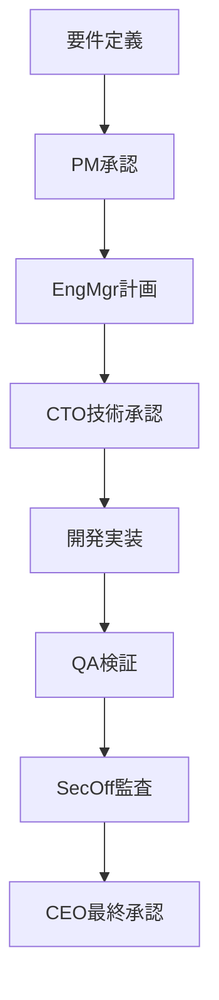

# 🏢 Claude Code Company

CLAUDE.mdで定義された組織構造に基づく、12名のAIエージェントによる並列開発組織です。

## 🚀 起動方法

```bash
# 1. 会社を起動
./start_company.sh

# 2. tmuxセッションに接続
tmux attach -t company

# 3. ウィンドウ間の移動
Ctrl-b + 0-2  # ウィンドウ切り替え
Ctrl-b + Space # レイアウト調整
```

## 📋 組織構成

### 🏛️ 経営陣 (CEOウィンドウ)
- **CEO**: 戦略立案・最終意思決定
- **CTO**: 技術戦略・アーキテクチャ決定  
- **Product Manager**: プロダクト戦略・要件定義
- **HR Manager**: 人材管理・組織文化

### 💻 技術部門 (Technicalウィンドウ)
- **Engineering Manager**: 開発チーム管理・スプリント計画
- **Senior Fullstack Engineer**: 技術設計・実装リード
- **Frontend Specialist**: UI/UX実装・最適化
- **Backend Architect**: API設計・データベース設計
- **DevOps Engineer**: CI/CD・インフラ管理
- **QA Lead**: 品質保証・テスト戦略

### 🛡️ サポート部門 (Supportウィンドウ)  
- **Security Officer**: セキュリティ監査・インシデント対応
- **Technical Writer**: ドキュメント作成・知識管理

## 📊 承認フロー例



## 🎯 プロジェクト開始例

```bash
# 1. CEOビジョン策定
tmux send-keys -t %0 "wadoyunikoプラットフォームの戦略を策定" Enter

# 2. 技術チーム並列タスク
tmux send-keys -t %4 "12週間ロードマップ作成" Enter & \
tmux send-keys -t %6 "Next.js環境構築" Enter & \
tmux send-keys -t %8 "Supabase設計開始" Enter & \
wait

# 3. 報連相確認
tmux capture-pane -t %0 -p | tail -10
```

## 📈 品質管理

- **テストカバレッジ**: 80%以上 (QA Lead監視)
- **セキュリティスキャン**: 全PR必須 (Security Officer実施)
- **コードレビュー**: 2名以上承認 (Engineering Manager管理)
- **ドキュメント**: 80%カバレッジ (Technical Writer担当)

## 🔧 管理コマンド

詳細は `company_commands.md` を参照

- 起動: `./start_company.sh`
- 接続: `tmux attach -t company`  
- 状況確認: `tmux capture-pane -t %0 -p | tail -10`
- 一括クリア: 各paneに `/clear` 送信

## 📞 緊急時対応

P0インシデント発生時:
1. Security Officer → 即座対応
2. CTO → 15分以内エスカレーション  
3. CEO → 重要判断・外部連絡

## ✨ 特徴

- **自律的報連相**: エージェント間の自動報告
- **並列タスク処理**: 複数エージェントによる効率的作業分散
- **階層承認フロー**: CLAUDE.md準拠の意思決定プロセス
- **リアルタイム監視**: tmuxによる全エージェント状況可視化

---

**会社設立日**: 2025-08-11  
**従業員数**: 12名 (全員AI)  
**ミッション**: 高品質なソフトウェア開発の実現