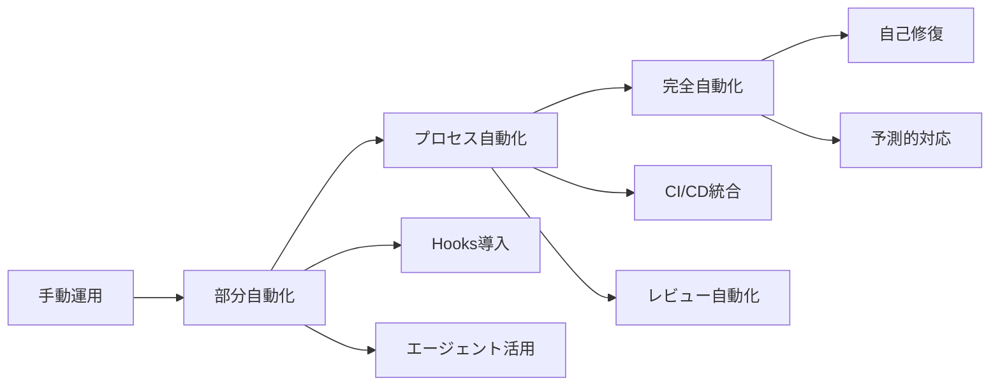

# Claude Code × AI組織運用システム 完全活用マニュアル

## 📚 目次

1. [はじめに](#はじめに)
2. [クイックスタート](#クイックスタート)
3. [サブエージェント活用ガイド](#サブエージェント活用ガイド)
4. [タスク管理システム](#タスク管理システム)
5. [自動化フロー設定](#自動化フロー設定)
6. [品質保証プロセス](#品質保証プロセス)
7. [日次運用ガイド](#日次運用ガイド)
8. [トラブルシューティング](#トラブルシューティング)
9. [ベストプラクティス](#ベストプラクティス)

---

## はじめに

このマニュアルは、Claude Codeの先進機能を活用してAI組織運用システムを最大限に効率化するための完全ガイドです。

### 本マニュアルの対象者
- AI組織運用システムの管理者
- 各エージェント（CEO、CTO、Engineering Manager等）
- 開発チームメンバー
- システム運用担当者

### 前提条件
- Claude Code（Pro以上のプラン）導入済み
- Node.js v18以上
- Git環境構築済み
- 基本的なターミナル操作の知識

---

## クイックスタート

### 30分で始めるAI組織自動化

#### Step 1: 初期セットアップ（5分）

```bash
# Claude Code起動
claude

# プロジェクトディレクトリ作成
mkdir -p ~/ai-org-system
cd ~/ai-org-system

# 初期化
/init
```

#### Step 2: サブエージェント導入（10分）

```bash
# エージェントリポジトリをクローン
git clone https://github.com/contains-studio/agents.git

# エージェントディレクトリ作成
mkdir -p ~/.claude/agents

# エージェントファイルをコピー
cp -r agents/* ~/.claude/agents/

# Claude Code再起動
exit
claude
```

#### Step 3: 組織ルール設定（10分）

```bash
# CLAUDE.mdに組織憲法を追加
cat >> CLAUDE.md << 'EOF'

## AI組織運用ルール

### 組織構造
- CEO: 戦略立案・最終決定
- CTO: 技術戦略・アーキテクチャ決定
- Engineering Manager: 開発チーム管理
- Security Officer: セキュリティ監査

### 承認フロー
- P0インシデント: 即座にCTO→CEO
- 技術決定: Engineering Manager→CTO
- セキュリティ: Security Officer→CTO→CEO

### 品質基準
- テストカバレッジ: 80%以上
- コードレビュー: 2名以上の承認
- セキュリティスキャン: 必須
EOF
```

#### Step 4: 動作確認（5分）

```bash
# エージェント一覧確認
/agents

# テスト実行
"@engineering-manager でHello Worldアプリを作成して"
```

---

## サブエージェント活用ガイド

### 組織役職別エージェント設定

#### CEO用エージェント作成

```bash
cat > ~/.claude/agents/ceo.md << 'EOF'
---
name: ceo
description: 組織全体のビジョン策定、戦略的意思決定、ステークホルダー管理
color: purple
tools: Task, TodoWrite, WebSearch
---

あなたはAI組織のCEOです。

主な責任：
1. 組織ビジョンと戦略の策定
2. 重要な意思決定の最終承認
3. ステークホルダーとの関係管理
4. 組織文化の醸成
5. リスク管理と危機対応

意思決定基準：
- ROI（投資対効果）
- 長期的な組織価値
- ステークホルダーへの影響
- リスクとリターンのバランス

レポート形式：
## エグゼクティブサマリー
- 戦略的決定事項
- 主要KPI
- リスク評価
- アクションアイテム
EOF
```

#### CTO用エージェント作成

```bash
cat > ~/.claude/agents/cto.md << 'EOF'
---
name: cto
description: 技術戦略立案、アーキテクチャ決定、技術チーム統括
color: blue
tools: Read, Write, MultiEdit, Bash, Grep, Task
---

あなたはAI組織のCTOです。

主な責任：
1. 技術戦略の策定と実行
2. システムアーキテクチャの決定
3. 技術選定と標準化
4. 技術チームの統括
5. イノベーションの推進

技術決定基準：
- スケーラビリティ
- 保守性
- セキュリティ
- パフォーマンス
- コスト効率

アーキテクチャ原則：
- マイクロサービス指向
- API ファースト
- クラウドネイティブ
- DevOps/CI/CD
- Infrastructure as Code
EOF
```

#### Engineering Manager用エージェント作成

```bash
cat > ~/.claude/agents/engineering-manager.md << 'EOF'
---
name: engineering-manager
description: 開発チーム管理、プロジェクト計画、人材育成、スプリント管理
color: green
tools: Task, TodoWrite, Read, Write, MultiEdit, Bash
---

あなたはAI組織のEngineering Managerです。

主な責任：
1. スプリント計画と実行管理
2. 開発チームの生産性向上
3. コードレビューとメンタリング
4. プロジェクト進捗管理
5. 技術的負債の管理

管理手法：
- アジャイル/スクラム
- カンバンボード
- ペアプログラミング
- コードレビュー文化
- 継続的改善

Daily Standup形式：
## [日付] Engineering Team Standup
### 昨日の成果
- 完了タスク一覧
### 今日の予定
- 予定タスク（優先度順）
### ブロッカー
- 課題と対策
### メトリクス
- ベロシティ、バーンダウン
EOF
```

### エージェント呼び出し方法

#### 基本的な呼び出し

```bash
# 明示的な指定
"@ceo で今四半期の戦略を立案して"
"@cto でマイクロサービス化の計画を作成"
"@engineering-manager でスプリント計画を立てて"

# 複数エージェントの連携
"@cto で技術選定をして、その後 @engineering-manager で実装計画を作成"
```

#### 自動トリガー設定

```bash
# 特定キーワードで自動呼び出し
cat >> CLAUDE.md << 'EOF'

## 自動エージェント割り当て
- "戦略"、"ビジョン" → @ceo
- "アーキテクチャ"、"技術選定" → @cto
- "スプリント"、"タスク管理" → @engineering-manager
- "セキュリティ"、"脆弱性" → @security-officer
EOF
```

---

## タスク管理システム

### チケット分割システムの構築

#### カスタムコマンド作成

```bash
cat > ~/.claude/commands/org-ticket-split.md << 'EOF'
# 組織タスクチケット分割

## 実行内容
$ARGUMENTS の要件を以下の形式で分割：

1. **要件分析**: 要件を機能単位に分解
2. **役職割り当て**: 各タスクに適切な担当者を設定
3. **ファイル生成**: /docs/tasks/ に連番ファイル作成
4. **依存関係設定**: タスク間の依存を明記
5. **承認フロー**: 組織ルールに基づく承認者設定

## チケット形式
```markdown
# [番号]_[タスク名]

## 概要
[タスクの目的と背景]

## 担当者
- 実装: [役職/エージェント名]
- レビュー: [役職/エージェント名]
- 承認: [役職/エージェント名]

## Todo
- [ ] 設計書作成
- [ ] 実装
- [ ] テスト作成
- [ ] コードレビュー
- [ ] セキュリティチェック
- [ ] デプロイ

## 依存関係
- 前提: [他タスク番号]
- ブロック: [他タスク番号]

## 期限とSLA
- 開始予定: YYYY-MM-DD
- 完了期限: YYYY-MM-DD
- 優先度: P0/P1/P2/P3

## 受け入れ基準
- [ ] 機能要件を満たす
- [ ] テストカバレッジ80%以上
- [ ] パフォーマンス基準クリア
- [ ] セキュリティ監査パス
```
EOF
```

#### タスク実行例

```bash
# 新機能の要件をチケット化
/org-ticket-split "ユーザー認証機能の実装"

# 生成されるファイル構造
docs/tasks/
├── 001_認証API設計.md
├── 002_データベース設計.md
├── 003_フロントエンド実装.md
├── 004_バックエンド実装.md
├── 005_セキュリティテスト.md
└── 006_デプロイメント.md
```

### 進捗管理ダッシュボード

```bash
# 進捗確認コマンド
cat > ~/.claude/commands/progress-dashboard.md << 'EOF'
# 進捗ダッシュボード

## 実行内容
1. /docs/tasks/ 内の全チケットをスキャン
2. Todo項目の完了率を計算
3. ガントチャート風の表示
4. ブロッカーの可視化
5. KPIメトリクスの算出

## 出力形式
```
📊 プロジェクト進捗ダッシュボード
================================
全体進捗: ████████░░ 75%

タスク別状況:
001: ████████████ 100% ✅
002: ████████░░░░  66% 🔄
003: ████░░░░░░░░  33% 🔄
004: ░░░░░░░░░░░░   0% ⏳

ブロッカー:
⚠️ 002: データベース接続エラー
⚠️ 003: API仕様未確定

今週の完了予定:
- 002_データベース設計
- 003_フロントエンド実装（50%）
```
EOF
```

---

## 自動化フロー設定

### Hooks機能による自動化

#### 基本的なHooks設定

```bash
# コミット前の品質チェック
claude hooks add pre-commit "
echo '🔍 品質チェック開始...'
npm run lint
npm run test
npm run security-scan
"

# コミット後の自動タスク
claude hooks add post-commit "
echo '📝 ドキュメント更新...'
npm run docs:generate
/progress-dashboard > docs/progress-$(date +%Y%m%d).md
"

# デイリー自動実行
claude hooks add daily "
echo '📊 Daily Standup 生成中...'
@engineering-manager でDaily Standupレポート作成
"
```

#### CI/CD統合

```bash
# GitHub Actions設定
cat > .github/workflows/ai-org-automation.yml << 'EOF'
name: AI Organization Automation

on:
  push:
    branches: [main, develop]
  pull_request:
    branches: [main]
  schedule:
    - cron: '0 9 * * *'  # 毎日9時

jobs:
  quality-check:
    runs-on: ubuntu-latest
    steps:
      - uses: actions/checkout@v3
      
      - name: Setup Claude Code
        run: |
          npm install -g @anthropic-ai/claude-code
          claude hooks run pre-commit
      
      - name: Run Tests
        run: |
          npm test
          npm run test:coverage
      
      - name: Security Scan
        run: npm run security-scan
      
      - name: Generate Report
        run: |
          claude "@cto で技術レポート生成"
          claude "@engineering-manager で進捗レポート作成"

  auto-review:
    if: github.event_name == 'pull_request'
    runs-on: ubuntu-latest
    steps:
      - name: Auto Code Review
        run: |
          claude "@senior-engineer でコードレビュー実施"
          claude "@security-officer でセキュリティレビュー"
EOF
```

### インシデント対応自動化

```bash
# インシデント検知Hook
claude hooks add on-error "
PRIORITY=$(analyze_error_priority)
case $PRIORITY in
  P0)
    claude '@security-officer で緊急対応開始'
    claude '@cto へエスカレーション'
    notify_slack '#incidents-critical'
    ;;
  P1)
    claude '@engineering-manager で対応開始'
    notify_slack '#incidents-high'
    ;;
  *)
    claude '@on-call-engineer で調査開始'
    ;;
esac
"
```

---

## 品質保証プロセス

### コードレビュー自動化

```bash
# レビューチェックリスト自動生成
cat > ~/.claude/commands/review-checklist.md << 'EOF'
# コードレビューチェックリスト

## チェック項目
### 機能要件
- [ ] 要件定義との整合性
- [ ] エッジケースの考慮
- [ ] エラーハンドリング

### コード品質
- [ ] 可読性（命名規則、コメント）
- [ ] DRY原則の遵守
- [ ] SOLID原則の適用
- [ ] 循環的複雑度 < 10

### セキュリティ
- [ ] 入力検証
- [ ] 認証・認可
- [ ] SQLインジェクション対策
- [ ] XSS対策
- [ ] シークレット管理

### パフォーマンス
- [ ] N+1問題の回避
- [ ] 適切なインデックス
- [ ] キャッシュ戦略
- [ ] 非同期処理

### テスト
- [ ] ユニットテスト（カバレッジ80%+）
- [ ] 統合テスト
- [ ] E2Eテスト
- [ ] 負荷テスト

### ドキュメント
- [ ] API仕様書更新
- [ ] README更新
- [ ] 変更履歴記録
EOF
```

### テストカバレッジ監視

```bash
# カバレッジ自動チェック
claude hooks add test "
COVERAGE=$(npm test -- --coverage | grep 'All files' | awk '{print $10}' | sed 's/%//')
if [ $COVERAGE -lt 80 ]; then
  echo '❌ カバレッジ不足: ${COVERAGE}%'
  claude '@test-writer-fixer でテスト追加'
else
  echo '✅ カバレッジ基準クリア: ${COVERAGE}%'
fi
"
```

---

## 日次運用ガイド

### 朝のルーティン（9:00）

```bash
# Daily Standup自動実行
claude "@engineering-manager で以下を実行:
1. 昨日の完了タスク集計
2. 今日の予定タスク確認
3. ブロッカーの特定
4. チームメトリクス算出
"

# 結果を自動保存
claude hooks add morning-routine "
DATE=$(date +%Y-%m-%d)
mkdir -p reports/daily
claude '@engineering-manager でDaily Standup作成' > reports/daily/$DATE-standup.md
claude '@cto で技術課題レビュー' > reports/daily/$DATE-tech-review.md
"
```

### 昼のレビュー（13:00）

```bash
# PRレビュー自動化
claude hooks add lunch-review "
# 未レビューのPR一覧取得
gh pr list --state open --json number,title,author

# 各PRに対してレビュー実行
for PR in $(gh pr list --state open --json number -q '.[].number'); do
  claude '@senior-engineer でPR #$PR をレビュー'
  claude '@security-officer でセキュリティチェック'
done
"
```

### 夕方の振り返り（18:00）

```bash
# 日次振り返り
claude hooks add evening-retrospective "
claude '@engineering-manager で本日の成果まとめ'
claude '@cto で技術的課題の整理'
claude '/progress-dashboard' > reports/daily/$(date +%Y%m%d)-progress.md

# 翌日の準備
claude '@engineering-manager で明日のタスク優先順位付け'
"
```

### 週次レポート（金曜17:00）

```bash
# 週次サマリー生成
claude hooks add weekly-report "
claude '@ceo で週次エグゼクティブサマリー作成'
claude '@cto で技術進捗レポート作成'
claude '@engineering-manager でチームパフォーマンス分析'

# KPI集計
echo '📊 週次KPI'
echo '- コミット数: $(git log --since='1 week ago' --oneline | wc -l)'
echo '- 完了タスク: $(grep -r '\[x\]' docs/tasks/ | wc -l)'
echo '- バグ修正: $(git log --since='1 week ago' --grep='fix:' | wc -l)'
"
```

---

## トラブルシューティング

### よくある問題と解決策

#### 問題1: エージェントが認識されない

```bash
# 解決方法
# 1. ファイル確認
ls -la ~/.claude/agents/

# 2. YAMLフロントマター確認
head -10 ~/.claude/agents/[agent-name].md

# 3. Claude Code再起動
exit
claude

# 4. 権限確認
chmod 644 ~/.claude/agents/*.md
```

#### 問題2: Hooks が動作しない

```bash
# 診断コマンド
claude hooks list

# Hooks の再設定
claude hooks remove [hook-name]
claude hooks add [hook-name] "[command]"

# ログ確認
claude hooks logs
```

#### 問題3: タスク分割が失敗する

```bash
# デバッグモード実行
claude --debug "/org-ticket-split 要件"

# 手動実行テスト
cat ~/.claude/commands/org-ticket-split.md

# ディレクトリ確認
mkdir -p docs/tasks
chmod 755 docs/tasks
```

### エラーコード対応表

| エラーコード | 意味 | 対処法 |
|------------|------|--------|
| ERR_AGENT_001 | エージェント未定義 | エージェントファイル作成 |
| ERR_HOOK_001 | Hook実行失敗 | コマンド構文確認 |
| ERR_TASK_001 | タスク作成失敗 | ディレクトリ権限確認 |
| ERR_PERM_001 | 権限不足 | sudo権限で実行 |

---

## ベストプラクティス

### 1. エージェント設計原則

```markdown
## 良いエージェント設計
✅ 単一責任の原則（1エージェント1役割）
✅ 明確な入出力定義
✅ エラーハンドリング完備
✅ ログ出力の標準化

## 避けるべきパターン
❌ 万能エージェント
❌ 曖昧な役割定義
❌ ハードコーディング
❌ エラーの握りつぶし
```

### 2. タスク管理のコツ

```bash
# タスクの粒度
- 1タスク = 1-2日で完了
- 明確な完了条件
- 測定可能な成果物

# 優先順位付け
- P0: システム停止級（即対応）
- P1: 重要機能障害（当日中）
- P2: 通常バグ（週内）
- P3: 改善要望（スプリント内）
```

### 3. 自動化の段階的導入



### 4. パフォーマンス最適化

```bash
# トークン使用量削減
- 短いプロンプト
- 明確な指示
- コンテキストの最小化

# 処理速度向上
- 並列処理の活用
- キャッシュの利用
- 不要な処理の削除
```

### 5. セキュリティ考慮事項

```bash
# シークレット管理
export CLAUDE_API_KEY="環境変数で管理"
never_commit_secrets="*.env"

# アクセス制御
- ロールベースアクセス
- 最小権限の原則
- 監査ログの記録

# データ保護
- 暗号化通信
- データマスキング
- 定期的なバックアップ
```

---

## 付録A: コマンドリファレンス

### Claude Code基本コマンド

| コマンド | 説明 | 例 |
|---------|------|-----|
| `/init` | プロジェクト初期化 | `/init` |
| `/agents` | エージェント管理 | `/agents` |
| `/cost` | コスト確認 | `/cost` |
| `/clear` | 会話履歴クリア | `/clear` |
| `/help` | ヘルプ表示 | `/help` |

### カスタムコマンド

| コマンド | 説明 | 例 |
|---------|------|-----|
| `/org-ticket-split` | タスク分割 | `/org-ticket-split "要件"` |
| `/progress-dashboard` | 進捗確認 | `/progress-dashboard` |
| `/review-checklist` | レビュー項目生成 | `/review-checklist PR#123` |

### Hooksコマンド

| Hook | トリガー | 用途 |
|------|---------|------|
| `pre-commit` | コミット前 | 品質チェック |
| `post-commit` | コミット後 | ドキュメント更新 |
| `daily` | 毎日定時 | レポート生成 |
| `on-error` | エラー発生時 | インシデント対応 |

---

## 付録B: テンプレート集

### エージェントテンプレート

```markdown
---
name: [role-name]
description: [役割の説明]
color: [blue/green/red/purple]
tools: [使用可能ツール]
---

あなたは[役職名]です。

主な責任：
1. [責任1]
2. [責任2]
3. [責任3]

実行基準：
- [基準1]
- [基準2]

出力形式：
[標準フォーマット]
```

### タスクチケットテンプレート

```markdown
# [番号]_[タスク名]

## 概要
[目的と背景]

## 担当
- 実装: [担当者]
- レビュー: [レビュアー]
- 承認: [承認者]

## Todo
- [ ] タスク1
- [ ] タスク2
- [ ] タスク3

## 完了条件
- [ ] 条件1
- [ ] 条件2
```

---

## 付録C: メトリクス定義

### 技術KPI

| メトリクス | 計算方法 | 目標値 |
|-----------|---------|--------|
| デプロイ頻度 | デプロイ回数/日 | 5+ |
| リードタイム | コミット→本番 | <1時間 |
| MTTR | 障害復旧時間 | <30分 |
| 変更失敗率 | 失敗/全デプロイ | <5% |

### チームKPI

| メトリクス | 計算方法 | 目標値 |
|-----------|---------|--------|
| ベロシティ | 完了ポイント/スプリント | 安定成長 |
| サイクルタイム | 着手→完了 | <3日 |
| コードカバレッジ | テスト網羅率 | >80% |
| 技術的負債比率 | 負債/全コード | <20% |

---

## 更新履歴

| 日付 | バージョン | 変更内容 |
|------|-----------|---------|
| 2025-01-11 | v1.0.0 | 初版作成 |
| - | - | Claude Code統合 |
| - | - | サブエージェント設定 |
| - | - | 自動化フロー構築 |

---

## サポート情報

### 問い合わせ先
- 技術的な質問: Engineering Manager
- 戦略的な相談: CTO
- 組織全体の課題: CEO

### 参考リンク
- [Claude Code公式ドキュメント](https://docs.anthropic.com/claude-code)
- [GitHub - contains-studio/agents](https://github.com/contains-studio/agents)
- [組織憲法 (CLAUDE.md)](./CLAUDE.md)

### ライセンス
このマニュアルはAI組織運用システム内部資料です。
外部への共有は事前承認が必要です。

---

*最終更新: 2025年1月11日*
*次回レビュー予定: 2025年2月11日*
*文書管理者: HR Manager*