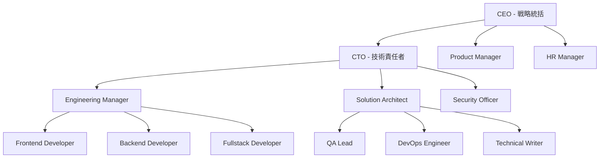

# 🚀 Claude Code完全攻略ガイド

## あなたもClaude Codeマスターに！初心者から上級者まで完全サポート

**Claude Codeの全機能を使いこなし、AI開発の最前線で活躍するための完全マスターガイド**

## 📚 目次

1. [Claude Code基礎知識](#基礎知識)
2. [環境構築・セットアップ](#環境構築)
3. [基本操作マスター](#基本操作)
4. [AI組織システム構築](#ai組織構築)
5. [高度なテクニック](#高度テクニック)
6. [実践プロジェクト](#実践プロジェクト)
7. [トラブルシューティング](#トラブルシューティング)
8. [エキスパートテクニック](#エキスパートテクニック)

---

## 🎯 基礎知識

### Claude Codeとは？

**Claude Code**は、Anthropic社が開発したAI支援開発環境で、従来の開発ツールを革新する次世代システムです。

#### 従来の開発との違い

| 従来の開発 | Claude Code |
|-----------|-------------|
| コードを手動で書く | AIが自動生成・修正 |
| エラーを手動でデバッグ | AIが原因特定・修正提案 |
| ドキュメントを手動作成 | 自動生成・更新 |
| 単独作業 | AIチームとの協働 |

#### 主要機能

```yaml
核心機能:
  - AI支援コード生成
  - リアルタイムコードレビュー
  - 自動テスト生成
  - プロジェクト管理支援
  
高度機能:
  - マルチエージェントシステム
  - 自動リファクタリング
  - 性能最適化提案
  - セキュリティ監査
```

### Claude Codeのメリット

#### 🚀 開発速度
- **10倍高速化**: 従来開発と比較して圧倒的なスピード
- **自動化**: 定型作業の完全自動化
- **並列処理**: 複数タスクの同時進行

#### 🎯 品質向上
- **バグ削減**: AI による事前チェック
- **ベストプラクティス**: 自動的に最適な実装
- **コードレビュー**: 多角的な品質チェック

#### 💡 学習効果
- **リアルタイム学習**: 作業しながら新技術習得
- **ベストプラクティス**: 実践的なコーディング技法
- **多様な視点**: 異なる専門分野からのアドバイス

---

## 🔧 環境構築

### システム要件

#### 推奨スペック
```yaml
OS: macOS 12+, Windows 11, Ubuntu 20.04+
CPU: 8コア以上（Intel i7, M1以上）
RAM: 16GB以上（32GB推奨）
ストレージ: 100GB以上の空き容量
インターネット: 安定した高速回線
```

#### 最小スペック
```yaml
OS: macOS 11+, Windows 10, Ubuntu 18.04+  
CPU: 4コア以上
RAM: 8GB以上
ストレージ: 50GB以上の空き容量
```

### インストール手順

#### Step 1: アカウント作成
```bash
# 1. Claude Code公式サイトにアクセス
open https://claude.ai/code

# 2. アカウント作成
# - メールアドレス登録
# - 電話番号認証
# - プラン選択（Pro推奨）

# 3. 認証完了
# メール認証リンクをクリック
```

#### Step 2: CLIインストール
```bash
# macOS (Homebrew)
brew install claude-code

# Windows (Chocolatey)
choco install claude-code

# Linux (apt)
sudo apt update
sudo apt install claude-code

# 直接ダウンロード
curl -fsSL https://install.claude.ai/code | sh
```

#### Step 3: 初期設定
```bash
# ログイン
claude auth login

# プロジェクト初期化
mkdir my-ai-project
cd my-ai-project
claude init

# 設定確認
claude config list
```

### 環境変数設定

```bash
# ~/.bashrc または ~/.zshrc に追加
export CLAUDE_API_KEY="your-api-key"
export CLAUDE_PROJECT_ROOT="$HOME/claude-projects"
export CLAUDE_DEFAULT_MODEL="claude-3-opus"
export CLAUDE_MAX_TOKENS="4096"

# 設定の反映
source ~/.bashrc
```

---

## ⚙️ 基本操作

### プロジェクト管理

#### 新規プロジェクト作成
```bash
# 基本的なプロジェクト
claude create my-app --template=nextjs

# AI組織プロジェクト
claude create ai-org --template=multi-agent

# カスタムテンプレート
claude create custom-app --template=./my-template
```

#### プロジェクト構造
```
my-project/
├── .claude/
│   ├── config.json         # プロジェクト設定
│   ├── agents/            # AIエージェント定義
│   ├── memory/            # AI記憶領域
│   └── logs/              # 実行ログ
├── src/                   # ソースコード
├── docs/                  # ドキュメント
├── tests/                 # テストファイル
└── CLAUDE.md             # プロジェクト指示書
```

### 基本コマンド

#### ファイル操作
```bash
# ファイル作成
claude create-file src/components/Button.tsx

# ファイル編集
claude edit src/components/Button.tsx "レスポンシブデザインに対応して"

# ファイル読み込み
claude read src/components/Button.tsx

# ディレクトリ操作
claude list src/
claude tree .
```

#### コード生成
```bash
# コンポーネント生成
claude generate component Button --props="text,onClick,variant"

# API生成
claude generate api users --crud

# テスト生成
claude generate test src/components/Button.tsx

# ドキュメント生成
claude generate docs --format=markdown
```

#### プロジェクト実行
```bash
# 開発サーバー起動
claude dev

# ビルド
claude build

# テスト実行
claude test

# デプロイ
claude deploy
```

### AIとの対話

#### 基本的な対話
```bash
# 質問
claude ask "Reactでのstate管理のベストプラクティスは？"

# コードレビュー依頼
claude review src/components/

# 最適化提案
claude optimize --target=performance

# バグ修正
claude fix "ボタンが反応しない問題"
```

#### 高度な対話
```bash
# 複数エージェントとの相談
claude discuss "新機能のアーキテクチャ設計" --agents=cto,architect,security

# 設計会議
claude meeting "来週のリリース計画" --duration=30min

# コードペアプログラミング
claude pair --mode=collaborative --duration=1hour
```

---

## 🏢 AI組織構築

### 基本的な組織設定

#### 3人チーム（最小構成）
```yaml
# .claude/config.json
{
  "organization": {
    "name": "Startup Team",
    "agents": [
      {
        "role": "ceo",
        "name": "Alex",
        "personality": "visionary",
        "responsibilities": ["strategy", "decisions"]
      },
      {
        "role": "developer", 
        "name": "Sam",
        "personality": "analytical",
        "responsibilities": ["coding", "testing"]
      },
      {
        "role": "designer",
        "name": "Jordan",
        "personality": "creative", 
        "responsibilities": ["ui", "ux"]
      }
    ]
  }
}
```

#### 使用例
```bash
# チーム会議
claude team-meeting "新機能について相談しましょう"

# 個別相談
claude chat ceo "プロジェクトの方向性について相談があります"

# 全員での作業
claude collaborate "ランディングページを作成しよう"
```

### 大規模組織（12人体制）

#### 組織構成図


#### エージェント設定例

**CEO設定**
```yaml
ceo:
  name: "神谷美智子"
  age: 45
  background: "McKinsey → 楽天執行役員"
  personality:
    type: "ENTJ"
    traits: ["戦略的", "決断力", "リーダーシップ"]
  catchphrases:
    - "大局観を持って考えましょう"
    - "本質的な価値は何ですか？"
  decision_authority: 
    level: 5
    areas: ["strategy", "budget", "hiring"]
  kpis:
    - "売上成長率"
    - "顧客満足度" 
    - "チーム生産性"
```

**CTO設定**  
```yaml
cto:
  name: "佐藤健一"
  age: 42
  background: "Google → メルカリCTO"
  personality:
    type: "INTJ"
    traits: ["技術志向", "システム思考", "品質重視"]
  catchphrases:
    - "アーキテクチャ的には..."
    - "技術的負債を考慮すると..."
  decision_authority:
    level: 4
    areas: ["architecture", "technology", "security"]
  kpis:
    - "システム稼働率"
    - "コード品質"
    - "技術的負債削減"
```

### エージェント間コミュニケーション

#### 階層型コミュニケーション
```bash
# 報告ライン
claude report --from=developer --to=engineering-manager "タスク完了報告"

# エスカレーション  
claude escalate --issue="セキュリティ脆弱性発見" --to=cto

# 承認依頼
claude approve --request="新技術導入提案" --from=architect --to=cto
```

#### 横断型コミュニケーション
```bash
# 部門横断ミーティング
claude cross-meeting --topic="API設計" --participants=backend,frontend,qa

# 専門家相談
claude consult security --about="認証システム設計"

# 知識共有
claude share-knowledge --topic="React新機能" --audience=frontend-team
```

---

## 💡 高度なテクニック

### カスタムエージェント作成

#### 独自エージェントの定義
```yaml
# .claude/agents/ai-specialist.yaml
name: "AI Specialist"
role: "ai_specialist" 
description: "機械学習・AI開発の専門家"

personality:
  expertise: ["machine-learning", "deep-learning", "mlops"]
  experience_years: 8
  background: "Stanford PhD → OpenAI → 現職"
  
communication_style:
  formality: "professional"
  detail_level: "high"
  explanation_style: "academic-practical"
  
responsibilities:
  - "AI/MLモデルの設計・実装"
  - "データパイプラインの構築"
  - "モデルの性能評価・最適化"
  - "MLOpsの導入・運用"

tools_and_permissions:
  - "Python/TensorFlow/PyTorch"
  - "データベースアクセス"
  - "GPU/TPUリソース管理"
  - "実験管理プラットフォーム"

decision_authority:
  level: 3
  scope: ["model-architecture", "training-strategy", "deployment"]
```

#### エージェントの起動と活用
```bash
# カスタムエージェント起動
claude load-agent .claude/agents/ai-specialist.yaml

# 専門相談
claude chat ai-specialist "推薦システムの最適なアルゴリズムは？"

# 複合タスク実行
claude task "画像認識システム構築" --assign-to=ai-specialist --collaborate-with=backend-developer
```

### ワークフロー自動化

#### 開発ワークフロー
```yaml
# .claude/workflows/development.yaml
name: "Development Workflow"
trigger: "code_commit"

steps:
  - name: "Code Review"
    agent: "senior_developer"
    action: "review_code"
    criteria: ["quality", "security", "performance"]
    
  - name: "Test Generation"
    agent: "qa_engineer"
    action: "generate_tests"
    coverage_target: 80
    
  - name: "Documentation Update"
    agent: "technical_writer" 
    action: "update_docs"
    sections: ["api", "components", "deployment"]
    
  - name: "Security Scan"
    agent: "security_officer"
    action: "security_audit"
    scan_types: ["dependencies", "code", "config"]

approval_flow:
  - reviewer: "engineering_manager"
    required: true
  - reviewer: "architect"
    condition: "major_change"
  - reviewer: "cto"
    condition: "architecture_change"
```

#### CI/CDパイプライン統合
```bash
# GitHub Actions連携
claude setup-ci --platform=github-actions --workflow=development

# 自動デプロイ
claude setup-deployment --environment=staging --auto-deploy=true

# 監視・アラート
claude setup-monitoring --metrics=["performance", "errors", "usage"]
```

### メモリ・学習システム

#### 組織記憶の管理
```bash
# 重要な決定事項を記録
claude remember "React 18のConcurrent機能を採用決定。理由：パフォーマンス向上、将来性"

# 失敗経験の記録
claude learn-from-failure "APIレスポンス遅延問題" --cause="N+1クエリ" --solution="クエリ最適化"

# 成功パターンの記録
claude record-success "A/Bテスト実装" --pattern="Feature Flagsによる段階展開"

# 記憶の検索
claude recall --topic="API設計" --timeframe="last_month"
```

#### 継続的学習
```yaml
# .claude/learning.yaml
learning_config:
  sources:
    - "project_history"
    - "external_knowledge"
    - "team_feedback"
    
  update_frequency: "daily"
  
  improvement_areas:
    - "code_quality"
    - "architecture_decisions"
    - "team_collaboration"
    
  feedback_integration:
    - "user_feedback"
    - "performance_metrics" 
    - "error_patterns"
```

---

## 🛠️ 実践プロジェクト

### プロジェクト1: Todoアプリ（基礎）

#### 要件定義
```bash
# プロダクトマネージャーと要件定義
claude discuss "シンプルなTodoアプリの要件" --with=product-manager

# 期待される出力例:
# "以下の機能を持つTodoアプリを作成しましょう：
# - タスクの追加・削除・完了
# - カテゴリ別分類
# - 締切設定・通知
# - 進捗の可視化"
```

#### 設計・実装
```bash
# アーキテクトと技術設計
claude collaborate "Todoアプリの技術スタック選定" --with=architect

# フロントエンド開発
claude develop frontend --framework=react --features=["task-list", "task-form", "filters"]

# バックエンド開発  
claude develop backend --framework=nodejs --features=["api", "database", "auth"]

# テスト実装
claude generate-tests --coverage=80 --types=["unit", "integration", "e2e"]
```

#### レビュー・改善
```bash
# コードレビュー
claude review --reviewers=["senior-dev", "architect", "security"]

# パフォーマンス最適化
claude optimize --targets=["bundle-size", "loading-speed", "memory-usage"]

# セキュリティ監査
claude security-audit --scope=["auth", "api", "data-storage"]
```

### プロジェクト2: ECサイト（中級）

#### フェーズ1: 基盤構築
```bash
# ビジネス要件の整理
claude analyze-requirements "ECサイト構築" --stakeholders=["ceo", "product-manager", "ux-designer"]

# システム設計
claude design-system "ECサイト" --patterns=["microservices", "event-driven", "cqrs"]

# セキュリティ設計
claude design-security --compliance=["PCI-DSS", "GDPR"] --threats=["injection", "auth-bypass", "data-breach"]
```

#### フェーズ2: 開発・統合
```bash
# マイクロサービス開発
claude develop-service "user-service" --features=["registration", "profile", "preferences"]
claude develop-service "product-service" --features=["catalog", "inventory", "search"]
claude develop-service "order-service" --features=["cart", "checkout", "payment"]

# 統合テスト
claude integration-test --services=["user", "product", "order"] --scenarios=["purchase-flow"]
```

#### フェーズ3: 運用・監視
```bash
# デプロイメント
claude deploy --environment=production --strategy=blue-green

# 監視設定
claude setup-monitoring --metrics=["business", "technical"] --alerts=["high-severity"]

# 運用開始
claude go-live --checklist=["security", "performance", "backup", "monitoring"]
```

### プロジェクト3: AI SaaS（上級）

#### 高度な機能実装
```bash
# AI機能設計
claude design-ai-features --capabilities=["nlp", "recommendation", "prediction"]

# スケーラビリティ設計
claude design-scalability --load=["10k-users", "1m-requests/day"] --regions=["asia", "us", "eu"]

# データパイプライン構築
claude build-data-pipeline --sources=["api", "files", "streams"] --destinations=["warehouse", "lake"]
```

---

## 🔧 トラブルシューティング

### よくある問題と解決法

#### 接続エラー
```bash
# 問題: Claude Codeに接続できない
# 解決法:
claude auth refresh
claude config check-connection

# 問題: APIレート制限
# 解決法:
claude config set rate-limit-buffer 5000
claude upgrade-plan --to=pro
```

#### パフォーマンス問題
```bash
# 問題: 動作が遅い
# 解決法:
claude optimize-cache --size=1GB
claude config set parallel-requests 4
claude cleanup --temp-files --logs --cache

# 問題: メモリ不足
# 解決法:
claude config set memory-limit 8GB
claude restart --clean-memory
```

#### エージェント関連
```bash
# 問題: エージェントが応答しない
# 解決法:
claude agent restart cto
claude agent reset-memory cto
claude agent reload-config

# 問題: エージェント間の連携不良
# 解決法:
claude team sync
claude communication-check
claude workflow restart
```

### ログ分析

#### ログレベル設定
```bash
# デバッグモード有効
claude config set log-level debug

# 特定コンポーネントのログ
claude logs --component=agents --level=error --tail=100

# ログ分析
claude analyze-logs --timeframe=24h --keywords=["error", "timeout", "failed"]
```

#### パフォーマンス分析
```bash
# リクエスト分析
claude perf-analysis --metric=response-time --period=1week

# リソース使用状況
claude resource-monitor --components=["cpu", "memory", "network"]

# ボトルネック特定
claude bottleneck-analysis --target=slow-requests
```

---

## 🎯 エキスパートテクニック

### 高度なカスタマイズ

#### プラグイン開発
```javascript
// custom-plugin.js
class CustomAnalyzer {
  constructor(config) {
    this.config = config;
  }
  
  async analyze(code) {
    // カスタム分析ロジック
    return {
      score: this.calculateScore(code),
      suggestions: this.generateSuggestions(code),
      metrics: this.collectMetrics(code)
    };
  }
  
  calculateScore(code) {
    // 独自の評価アルゴリズム
    return score;
  }
}

module.exports = CustomAnalyzer;
```

```bash
# プラグイン登録
claude plugin install ./custom-plugin.js

# プラグイン使用
claude analyze --plugin=custom-analyzer src/
```

#### APIエクステンション
```python
# claude_extension.py
import claude_api

class ProjectAnalyzer:
    def __init__(self, api_key):
        self.client = claude_api.Client(api_key)
    
    def deep_analysis(self, project_path):
        # 深層分析ロジック
        results = {
            'architecture_quality': self.analyze_architecture(project_path),
            'code_quality': self.analyze_code_quality(project_path),
            'security_assessment': self.security_scan(project_path)
        }
        return results
    
    def generate_insights(self, analysis_results):
        # インサイト生成
        return insights

# 使用例
analyzer = ProjectAnalyzer(api_key)
results = analyzer.deep_analysis('./my-project')
insights = analyzer.generate_insights(results)
```

### 組織最適化

#### 動的な役割調整
```yaml
# dynamic_roles.yaml
role_optimization:
  triggers:
    - "workload_imbalance"
    - "skill_gap_detected"
    - "project_phase_change"
  
  adjustments:
    - type: "add_specialist"
      condition: "complex_technical_challenge"
      roles: ["ml_engineer", "security_expert"]
    
    - type: "merge_roles"
      condition: "low_workload"
      combinations: ["frontend+ux", "backend+devops"]
    
    - type: "skill_upgrade"
      condition: "technology_shift"
      target_agents: ["developers"]
      new_skills: ["new_framework", "new_language"]
```

#### パフォーマンス最適化
```bash
# 組織メトリクス分析
claude org-analytics --metrics=["productivity", "collaboration", "satisfaction"]

# 最適化提案
claude org-optimize --targets=["efficiency", "quality", "speed"]

# A/Bテスト実行
claude org-experiment --test="new_workflow" --duration=2weeks --metrics=["completion_time"]
```

### 未来の機能

#### 実験的機能の活用
```bash
# ベータ機能有効化
claude feature enable --beta=["voice-interaction", "visual-programming"]

# 実験的AIモデル
claude model switch --to=experimental --features=["reasoning", "planning"]

# 先行機能テスト
claude preview --feature=multi-modal --duration=30days
```

---

## 📈 継続的スキルアップ

### 学習リソース

#### 公式リソース
- [Claude Code Documentation](https://docs.claude.ai/code)
- [Best Practices Guide](https://guides.claude.ai/code)
- [API Reference](https://api.claude.ai/code/reference)

#### コミュニティ
- Discord: Claude Code Community
- GitHub: claude-code/examples
- YouTube: Claude Code Channel

#### 認定プログラム
```bash
# 基礎認定
claude certification start --level=foundation

# プロフェッショナル認定
claude certification start --level=professional

# エキスパート認定  
claude certification start --level=expert
```

### 継続的改善

#### 定期レビュー
```bash
# 月次スキルアセスメント
claude skill-assessment --comprehensive

# プロジェクトレビュー
claude project-review --timeframe=quarter

# 組織効率性分析
claude org-efficiency --benchmark=industry-standard
```

---

## 🎊 まとめ

Claude Codeは単なるツールではなく、**AI時代の新しい働き方**を実現するプラットフォームです。

### 習得ステップ
1. **基礎**: 基本操作とAI対話
2. **応用**: 小規模AI組織構築  
3. **発展**: 大規模組織運営
4. **マスター**: カスタマイズと最適化
5. **エキスパート**: 新機能開発と貢献

### 成功の秘訣
- **継続的学習**: 新機能を積極的に試す
- **コミュニティ参加**: 他のユーザーとの情報交換
- **実践重視**: 実際のプロジェクトで経験を積む
- **フィードバック**: 改善提案を積極的に行う

**Claude Codeマスターへの道は、一歩ずつ着実に進むことから始まります。**

**今日から始めて、AI開発の未来を創造しましょう！** 🚀

---

*Created with ❤️ by Claude Code Complete Guide Team*  
*Version 1.0.0 - 最終更新: 2024年8月11日*