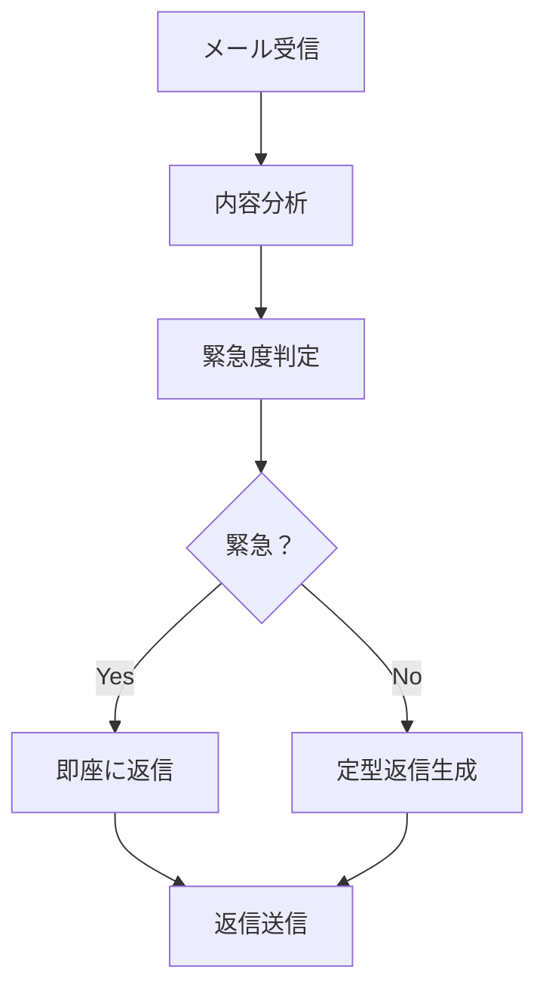
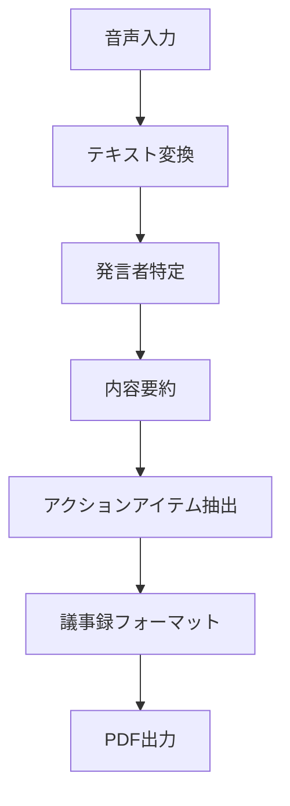
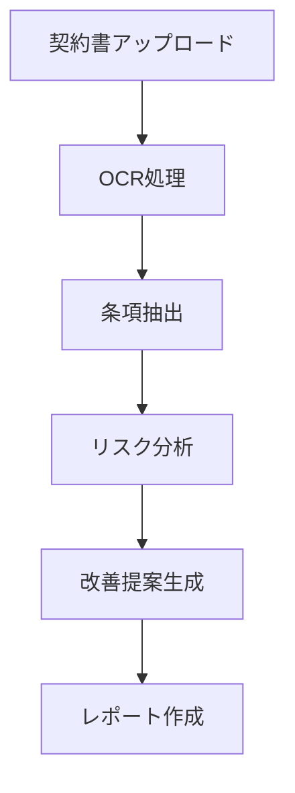
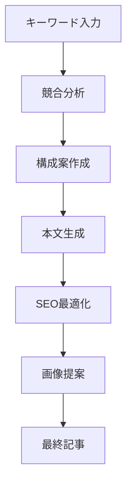

# Dify実践ワークフロー集 ⚡
## 即使える20の実用ワークフロー

**バイブコーディング特別特典**

---

## 📋 ワークフロー一覧

### 💼 ビジネス自動化
1. [メール自動返信システム](#1-メール自動返信システム)
2. [会議議事録自動作成](#2-会議議事録自動作成)
3. [契約書チェックAI](#3-契約書チェックai)
4. [営業提案書生成](#4-営業提案書生成)

### 📝 コンテンツ制作
5. [ブログ記事自動生成](#5-ブログ記事自動生成)
6. [SNS投稿最適化](#6-sns投稿最適化)
7. [動画スクリプト作成](#7-動画スクリプト作成)
8. [SEOタイトル生成器](#8-seoタイトル生成器)

### 🎓 教育・学習
9. [学習プラン作成AI](#9-学習プラン作成ai)
10. [問題集自動生成](#10-問題集自動生成)
11. [論文要約システム](#11-論文要約システム)
12. [語学学習アシスタント](#12-語学学習アシスタント)

### 🛒 eコマース
13. [商品説明文生成](#13-商品説明文生成)
14. [レビュー分析AI](#14-レビュー分析ai)
15. [価格最適化提案](#15-価格最適化提案)
16. [在庫管理アラート](#16-在庫管理アラート)

### 🏥 専門業務
17. [医療記録要約](#17-医療記録要約)
18. [法律相談チャット](#18-法律相談チャット)
19. [技術文書翻訳](#19-技術文書翻訳)
20. [財務レポート分析](#20-財務レポート分析)

---

## 1. メール自動返信システム 📧

### 概要
受信メールの内容を分析し、適切な返信を自動生成

### ワークフロー構成


### 設定パラメータ
- **入力**: メール本文、送信者情報
- **処理**: Claude による内容分析＋分類
- **出力**: 返信文、緊急度フラグ

### 実装のコツ
```yaml
システムプロンプト: |
  あなたはプロの秘書です。
  受信メールを分析し、適切な返信を生成してください。
  
  【分析項目】
  - 緊急度（高/中/低）
  - カテゴリ（問い合わせ/依頼/報告）
  - 必要なアクション
  
  【返信ルール】
  - 丁寧で簡潔な表現
  - 24時間以内の返信目安を明記
  - 必要に応じて次のアクションを提案
```

---

## 2. 会議議事録自動作成 📝

### 概要
会議の音声/テキストから構造化された議事録を生成

### ワークフロー構成


### 出力フォーマット例
```markdown
# 会議議事録

**日時**: 2024年8月11日 14:00-15:00
**参加者**: 中井、わど、ゆき
**場所**: オンライン会議室

## 議題
1. ローンチ準備状況確認
2. 特典制作スケジュール調整

## 主な決定事項
- [ ] 無料特典10個のタイトル決定（担当：中井、期限：8/14）
- [ ] Difyスライド作成開始（担当：開発チーム、期限：8/15）

## ネクストアクション
1. 各担当者は進捗を明日朝9時までに報告
2. 次回会議：8/12 10:00
```

---

## 3. 契約書チェックAI 📋

### 概要
契約書をアップロードして、リスクポイントと改善提案を自動分析

### ワークフロー構成


### チェック項目
- **支払い条件**: 支払期限、遅延損害金
- **責任範囲**: 損害賠償の上限設定
- **契約期間**: 自動更新条項の確認
- **知的財産**: 権利の帰属明確化

---

## 4. 営業提案書生成 💼

### 概要
顧客情報と要求に基づいて、カスタマイズされた提案書を自動生成

### 入力情報
```yaml
顧客情報:
  - 会社名: "○○商事株式会社"
  - 業界: "製造業"
  - 規模: "従業員500名"
  - 課題: "業務効率化"

要求事項:
  - 予算: "500万円以内"
  - 導入期限: "6ヶ月"
  - 対象部門: "営業部"
```

### 出力構成
1. **エグゼクティブサマリー**
2. **課題分析**
3. **提案ソリューション**
4. **導入スケジュール**
5. **投資対効果**
6. **次のステップ**

---

## 5. ブログ記事自動生成 ✍️

### 概要
キーワードから SEO を考慮したブログ記事を自動生成

### ワークフロー構成


### SEO最適化ポイント
- **タイトル**: 32文字以内、キーワード含有
- **メタディスクリプション**: 160文字以内
- **見出し構造**: H1-H3の適切な階層
- **内部リンク**: 関連記事への誘導
- **画像**: alt属性の最適化

---

## 6. SNS投稿最適化 📱

### 概要
各SNSプラットフォームに最適化された投稿文を自動生成

### プラットフォーム別最適化

| Platform | 文字数 | 特徴 | ハッシュタグ |
|----------|--------|------|--------------|
| Twitter | 280字 | 簡潔性重視 | 3-5個推奨 |
| Instagram | 2,200字 | ビジュアル重視 | 20-30個 |
| LinkedIn | 700字 | プロフェッショナル | 5-10個 |
| Facebook | 480字 | エンゲージメント重視 | 1-3個 |

### 投稿時間最適化
```yaml
Twitter: 
  平日: 12:00-13:00, 19:00-20:00
  休日: 14:00-16:00

Instagram:
  平日: 11:00-13:00, 17:00-19:00
  休日: 10:00-11:00, 14:00-16:00
```

---

## 7. 動画スクリプト作成 🎬

### 概要
YouTube動画の構成からセリフまで完全なスクリプトを生成

### スクリプト構造
1. **フック** (0-10秒): 視聴者の注意を引く
2. **問題提起** (10-30秒): 解決すべき課題
3. **解決策提示** (30秒-): メイン コンテンツ
4. **まとめ** (最後30秒): 要点の整理
5. **CTA** (最後10秒): チャンネル登録呼びかけ

### 動画長別テンプレート
```yaml
ショート動画 (60秒):
  - フック: 5秒
  - 本題: 50秒
  - CTA: 5秒

標準動画 (10分):
  - イントロ: 1分
  - メインコンテンツ: 7分
  - まとめ: 1.5分
  - CTA: 0.5分
```

---

## 8. SEOタイトル生成器 🎯

### 概要
キーワードから検索エンジン最適化されたタイトル候補を複数生成

### 生成パターン
1. **疑問型**: "○○とは？初心者にも分かりやすく解説"
2. **数字型**: "○○の方法 7選【2024年最新版】"
3. **比較型**: "○○ vs △△ 徹底比較！どちらがおすすめ？"
4. **解決型**: "○○の悩みを解決する3つのステップ"
5. **網羅型**: "○○について知っておくべき全てのこと"

### 検証項目
- **文字数**: 28-35文字（最適範囲）
- **キーワード密度**: メインキーワード含有率
- **クリック率予測**: 過去データ基準の予測

---

## 実装手順 🚀

### Step 1: Difyでワークフロー作成
1. **新規ワークフロー作成**
2. **必要なノードを配置**
3. **ノード間の接続**
4. **各ノードの設定調整**

### Step 2: テスト＆調整
1. **サンプルデータでテスト実行**
2. **出力品質の確認**
3. **プロンプトの微調整**
4. **エラーハンドリング追加**

### Step 3: デプロイ＆運用
1. **本番環境へデプロイ**
2. **API エンドポイント取得**
3. **監視体制の構築**
4. **継続的改善**

---

## 🎁 さらなる特典

この20のワークフローは **バイブコーディングスクール** 受講生限定で、
さらに詳細な実装ガイドと動画解説をご提供します。

### 追加コンテンツ
- 📹 各ワークフローの実装動画
- 🔧 トラブルシューティングガイド
- 💡 カスタマイズのヒント集
- 🤝 コミュニティでの質疑応答

**wadoyuniko.com で今すぐスタート** 🚀

---

**Created for wadoyuniko Vibe Coding Launch Project**  
*Dify Workflow Collection v1.0*