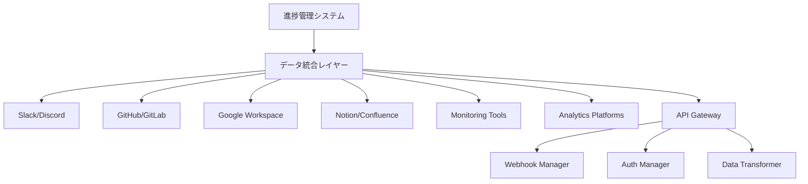

# 外部ツール連携設定 - 日次進捗管理システム

**目的**: 既存ツールとの seamless な統合による作業効率の最大化  
**対象**: 開発・運用に使用する全ツール・プラットフォーム  
**責任者**: DevOps Engineer（技術統合）、Engineering Manager（プロセス統合）  
**セキュリティ責任**: Security Officer（認証・権限管理）  

---

## 🎯 ツール統合戦略

### 💎 統合の基本原則
1. **Single Source of Truth**: データの一元管理・同期
2. **Workflow Automation**: 手作業の削減・自動化推進  
3. **Real-time Sync**: リアルタイムでの情報連携
4. **Security First**: セキュアな認証・データ転送

### 🔄 統合アーキテクチャ


---

## 💬 コミュニケーションツール統合

### 🚀 Slack統合

#### 基本セットアップ
```bash
# Slack App作成・設定
# 1. https://api.slack.com/apps で新規App作成
# 2. OAuth & Permissions で必要なスコープを設定

REQUIRED_SCOPES=(
  "channels:read"
  "channels:write" 
  "chat:write"
  "users:read"
  "files:write"
  "incoming-webhook"
)

# 3. Event Subscriptions で Webhook URL設定
WEBHOOK_URL="https://your-domain.com/api/slack/events"
```

#### Slack Bot設定
```javascript
// slack-bot.js
const { WebClient } = require('@slack/web-api');
const { createEventAdapter } = require('@slack/events-api');

class ProgressManagementSlackBot {
  constructor(token, signingSecret) {
    this.web = new WebClient(token);
    this.events = createEventAdapter(signingSecret);
    this.setupEventHandlers();
  }
  
  setupEventHandlers() {
    // 朝会リマインダー
    this.scheduleRecurringMessage({
      channel: '#daily-standups',
      time: '09:00',
      message: this.createStandupReminder(),
      timezone: 'Asia/Tokyo'
    });
    
    // 進捗更新リマインダー
    this.scheduleRecurringMessage({
      channel: '#progress-updates',
      time: '18:00', 
      message: this.createProgressUpdateReminder(),
      timezone: 'Asia/Tokyo'
    });
  }
  
  createStandupReminder() {
    return {
      blocks: [
        {
          type: "section",
          text: {
            type: "mrkdwn",
            text: "🌅 おはようございます！朝会の時間です"
          }
        },
        {
          type: "section", 
          text: {
            type: "mrkdwn",
            text: "本日の報告フォーマット:\n✅ 昨日完了したこと\n📋 今日実行予定のこと\n🚫 ブロッカー・課題"
          }
        },
        {
          type: "actions",
          elements: [
            {
              type: "button",
              text: { type: "plain_text", text: "進捗を報告する" },
              action_id: "report_progress",
              style: "primary"
            },
            {
              type: "button", 
              text: { type: "plain_text", text: "ブロッカーを報告" },
              action_id: "report_blocker",
              style: "danger"
            }
          ]
        }
      ]
    };
  }
  
  // プロジェクト進捗の自動投稿
  async postProjectUpdate(projectData) {
    const progressBar = this.createProgressBar(projectData.completion);
    const message = {
      channel: '#project-updates',
      blocks: [
        {
          type: "header",
          text: {
            type: "plain_text", 
            text: `📊 ${projectData.name} 進捗更新`
          }
        },
        {
          type: "section",
          fields: [
            {
              type: "mrkdwn",
              text: `*進捗率:* ${projectData.completion}%`
            },
            {
              type: "mrkdwn", 
              text: `*期限まで:* ${projectData.daysLeft}日`
            },
            {
              type: "mrkdwn",
              text: `*完了タスク:* ${projectData.completedTasks}/${projectData.totalTasks}`
            },
            {
              type: "mrkdwn",
              text: `*品質スコア:* ${projectData.qualityScore}/5`
            }
          ]
        },
        {
          type: "section",
          text: {
            type: "mrkdwn",
            text: `進捗: ${progressBar}`
          }
        }
      ]
    };
    
    return await this.web.chat.postMessage(message);
  }
}

// 使用例
const bot = new ProgressManagementSlackBot(
  process.env.SLACK_BOT_TOKEN,
  process.env.SLACK_SIGNING_SECRET
);
```

#### インタラクティブコマンド
```javascript
// Slackコマンド処理
app.command('/progress', async ({ command, ack, respond }) => {
  await ack();
  
  const userId = command.user_id;
  const args = command.text.split(' ');
  const action = args[0];
  
  switch(action) {
    case 'update':
      await respond(await generateProgressUpdateForm(userId));
      break;
      
    case 'report':
      await respond(await generateProgressReport(userId));
      break;
      
    case 'blocker':
      await respond(await generateBlockerReportForm(userId));
      break;
      
    default:
      await respond(generateHelpMessage());
  }
});

// モーダルダイアログでの詳細入力
async function generateProgressUpdateForm(userId) {
  return {
    response_type: 'ephemeral',
    trigger_id: triggerInfo.trigger_id,
    view: {
      type: 'modal',
      title: { type: 'plain_text', text: '進捗更新' },
      submit: { type: 'plain_text', text: '送信' },
      blocks: [
        {
          type: 'input',
          element: {
            type: 'multi_line_text_input',
            placeholder: { type: 'plain_text', text: '今日完了したタスクを入力...' }
          },
          label: { type: 'plain_text', text: '完了事項' }
        },
        {
          type: 'input',
          element: {
            type: 'multi_line_text_input', 
            placeholder: { type: 'plain_text', text: '明日予定しているタスクを入力...' }
          },
          label: { type: 'plain_text', text: '明日の予定' }
        }
      ]
    }
  };
}
```

### 📝 Discord統合

#### Discord Bot設定
```javascript
// discord-bot.js  
const { Client, GatewayIntentBits, EmbedBuilder } = require('discord.js');

class ProgressManagementDiscordBot {
  constructor() {
    this.client = new Client({
      intents: [
        GatewayIntentBits.Guilds,
        GatewayIntentBits.GuildMessages,
        GatewayIntentBits.MessageContent
      ]
    });
    
    this.setupCommands();
    this.setupScheduledTasks();
  }
  
  setupCommands() {
    // スラッシュコマンド: /progress
    this.client.on('interactionCreate', async interaction => {
      if (!interaction.isChatInputCommand()) return;
      
      if (interaction.commandName === 'progress') {
        await this.handleProgressCommand(interaction);
      }
    });
  }
  
  async handleProgressCommand(interaction) {
    const subcommand = interaction.options.getSubcommand();
    
    switch(subcommand) {
      case 'update':
        await this.showProgressUpdate(interaction);
        break;
        
      case 'kpi':
        await this.showKPIDashboard(interaction);
        break;
        
      case 'team':
        await this.showTeamStatus(interaction);
        break;
    }
  }
  
  async showKPIDashboard(interaction) {
    const kpiData = await fetchCurrentKPIData();
    
    const embed = new EmbedBuilder()
      .setTitle('📊 KPIダッシュボード')
      .setColor(0x00AE86)
      .setTimestamp()
      .addFields(
        {
          name: '📈 全体進捗',
          value: `${kpiData.overall_progress}% (目標: ${kpiData.target_progress}%)`,
          inline: true
        },
        {
          name: '⚡ 生産性スコア',
          value: `${kpiData.productivity_score}/5`,
          inline: true  
        },
        {
          name: '🛡️ 品質スコア',
          value: `${kpiData.quality_score}/5`,
          inline: true
        },
        {
          name: '😊 チーム満足度',
          value: `${kpiData.team_satisfaction}/5`,
          inline: true
        }
      )
      .setFooter({ text: 'AI組織進捗管理システム' });
      
    await interaction.reply({ embeds: [embed] });
  }
  
  // 定期的な自動更新投稿
  setupScheduledTasks() {
    // 毎日18:30に日次サマリー投稿
    schedule.scheduleJob('30 18 * * *', async () => {
      const dailySummary = await generateDailySummary();
      const channel = this.client.channels.cache.get(DAILY_SUMMARY_CHANNEL_ID);
      
      if (channel) {
        await channel.send({ embeds: [dailySummary] });
      }
    });
  }
}
```

---

## 📊 Google Workspace統合

### 📈 Google Sheets連携

#### 自動データ同期
```javascript
// google-sheets-integration.js
const { GoogleSpreadsheet } = require('google-spreadsheet');
const { JWT } = require('google-auth-library');

class ProgressSheetsIntegration {
  constructor() {
    this.serviceAccountAuth = new JWT({
      email: process.env.GOOGLE_SERVICE_ACCOUNT_EMAIL,
      key: process.env.GOOGLE_PRIVATE_KEY,
      scopes: ['https://www.googleapis.com/auth/spreadsheets']
    });
  }
  
  async initializeProgressSheet() {
    const doc = new GoogleSpreadsheet(PROGRESS_SHEET_ID, this.serviceAccountAuth);
    await doc.loadInfo();
    
    // KPIトラッキングシート設定
    const kpiSheet = doc.sheetsByTitle['KPI Tracking'] || await doc.addSheet({
      title: 'KPI Tracking',
      headerValues: [
        'Date', 'Overall Progress', 'Task Completion Rate', 
        'Quality Score', 'Team Satisfaction', 'Blockers Count',
        'Code Review Time', 'Deploy Success Rate'
      ]
    });
    
    return kpiSheet;
  }
  
  async updateDailyKPIs(kpiData) {
    const sheet = await this.initializeProgressSheet();
    
    await sheet.addRow({
      Date: new Date().toISOString().split('T')[0],
      'Overall Progress': kpiData.overall_progress,
      'Task Completion Rate': kpiData.task_completion_rate,
      'Quality Score': kpiData.quality_score,
      'Team Satisfaction': kpiData.team_satisfaction,
      'Blockers Count': kpiData.blockers_count,
      'Code Review Time': kpiData.avg_review_time,
      'Deploy Success Rate': kpiData.deploy_success_rate
    });
    
    // 自動計算式の更新
    await this.updateCalculatedFields(sheet);
  }
  
  async updateCalculatedFields(sheet) {
    // トレンド計算式
    await sheet.getCell('J2').formula = '=SLOPE(B2:B8,A2:A8)'; // 進捗トレンド
    await sheet.getCell('K2').formula = '=AVERAGE(E2:E8)';     // 平均満足度
    
    // 条件付き書式適用
    await this.applyConditionalFormatting(sheet);
  }
  
  async generateWeeklyReport() {
    const sheet = await this.initializeProgressSheet();
    const rows = await sheet.getRows();
    
    // 過去7日分のデータ取得
    const weekData = rows.slice(-7);
    
    const report = {
      period: `${weekData[0].Date} - ${weekData[6].Date}`,
      avg_progress: this.calculateAverage(weekData, 'Overall Progress'),
      avg_quality: this.calculateAverage(weekData, 'Quality Score'),
      total_blockers: this.calculateSum(weekData, 'Blockers Count'),
      trend_analysis: this.analyzeTrends(weekData)
    };
    
    return report;
  }
}
```

#### リアルタイム計算式
```javascript
// Google Apps Script (スプレッドシート内で実行)
function setupAutomaticCalculations() {
  const sheet = SpreadsheetApp.getActiveSheet();
  
  // 自動計算式の設定
  const formulas = {
    // 週間平均進捗率
    'L2': '=AVERAGEIFS(B:B,A:A,">="&TODAY()-7,A:A,"<="&TODAY())',
    
    // 目標達成度 
    'M2': '=IF(B2>=C2,"✅","⚠️")',
    
    // 前日比
    'N2': '=IF(ROW()>2,B2-B3,"")',
    
    // トレンド判定
    'O2': '=IF(N2>0,"📈",IF(N2<0,"📉","➡️"))',
    
    // アラート条件
    'P2': '=IF(B2<0.8,"🚨 目標未達",IF(F2>3,"⚠️ ブロッカー多",IF(D2<4,"😟 満足度低","✅ 良好")))'
  };
  
  // 計算式を一括設定
  Object.entries(formulas).forEach(([cell, formula]) => {
    sheet.getRange(cell).setFormula(formula);
  });
}

// Webhook受信処理
function doPost(e) {
  try {
    const data = JSON.parse(e.postData.contents);
    updateProgressData(data);
    
    // 条件に応じてアラート送信
    if (shouldSendAlert(data)) {
      sendSlackAlert(data);
    }
    
    return ContentService.createTextOutput('Success');
  } catch (error) {
    Logger.log('Error: ' + error.toString());
    return ContentService.createTextOutput('Error');
  }
}

function updateProgressData(data) {
  const sheet = SpreadsheetApp.getActiveSheet();
  const lastRow = sheet.getLastRow() + 1;
  
  // 新しい行にデータを追加
  const range = sheet.getRange(lastRow, 1, 1, 8);
  range.setValues([[
    new Date(),
    data.overall_progress,
    data.task_completion_rate,
    data.quality_score,
    data.team_satisfaction,
    data.blockers_count,
    data.avg_review_time,
    data.deploy_success_rate
  ]]);
  
  // グラフを自動更新
  updateCharts(sheet);
}
```

### 📧 Gmail統合

#### 自動メール送信
```javascript
// gmail-integration.js
const { google } = require('googleapis');

class ProgressEmailIntegration {
  constructor() {
    this.gmail = google.gmail('v1');
    this.auth = new google.auth.GoogleAuth({
      keyFile: 'path/to/service-account-key.json',
      scopes: ['https://www.googleapis.com/auth/gmail.send']
    });
  }
  
  async sendWeeklyReport(recipients, reportData) {
    const authClient = await this.auth.getClient();
    this.gmail.context._options.auth = authClient;
    
    const htmlContent = this.generateReportHTML(reportData);
    
    const message = {
      to: recipients.join(','),
      subject: `AI組織 週次レポート - Week ${reportData.week_number}`,
      html: htmlContent,
      attachments: reportData.attachments
    };
    
    const encodedMessage = Buffer.from(
      `To: ${message.to}\r\n` +
      `Subject: ${message.subject}\r\n` +
      `Content-Type: text/html; charset=utf-8\r\n\r\n` +
      message.html
    ).toString('base64').replace(/\+/g, '-').replace(/\//g, '_');
    
    await this.gmail.users.messages.send({
      userId: 'me',
      requestBody: { raw: encodedMessage }
    });
  }
  
  generateReportHTML(data) {
    return `
      <!DOCTYPE html>
      <html>
      <head>
        <meta charset="utf-8">
        <style>
          body { font-family: 'Segoe UI', Arial, sans-serif; }
          .header { background-color: #2563eb; color: white; padding: 20px; }
          .kpi-grid { display: grid; grid-template-columns: repeat(4, 1fr); gap: 16px; }
          .kpi-card { border: 1px solid #e5e7eb; padding: 16px; border-radius: 8px; }
          .trend-up { color: #10b981; }
          .trend-down { color: #ef4444; }
        </style>
      </head>
      <body>
        <div class="header">
          <h1>📊 AI組織 週次レポート</h1>
          <p>期間: ${data.period}</p>
        </div>
        
        <div class="content">
          <h2>🎯 主要KPI</h2>
          <div class="kpi-grid">
            ${this.generateKPICards(data.kpis)}
          </div>
          
          <h2>🏆 今週の成果</h2>
          <ul>
            ${data.achievements.map(achievement => `<li>${achievement}</li>`).join('')}
          </ul>
          
          <h2>⚠️ 注意事項</h2>
          <ul>
            ${data.risks.map(risk => `<li>${risk}</li>`).join('')}
          </ul>
        </div>
      </body>
      </html>
    `;
  }
}
```

---

## 🐙 GitHub/GitLab統合

### 📝 リポジトリ連携

#### GitHub API統合
```javascript
// github-integration.js
const { Octokit } = require('@octokit/rest');

class GitHubProgressIntegration {
  constructor() {
    this.octokit = new Octokit({
      auth: process.env.GITHUB_TOKEN
    });
    
    this.repos = process.env.GITHUB_REPOS.split(',');
  }
  
  async collectDevelopmentMetrics() {
    const metrics = {
      commits: 0,
      pull_requests: 0,
      code_reviews: 0,
      merged_prs: 0,
      lines_changed: 0
    };
    
    for (const repo of this.repos) {
      const [owner, repoName] = repo.split('/');
      
      // 今週のコミット数
      const commits = await this.octokit.repos.listCommits({
        owner,
        repo: repoName,
        since: this.getWeekStart().toISOString(),
        until: new Date().toISOString()
      });
      metrics.commits += commits.data.length;
      
      // プルリクエスト統計
      const prs = await this.octokit.pulls.list({
        owner,
        repo: repoName,
        state: 'all',
        sort: 'created',
        direction: 'desc'
      });
      
      const weekPRs = prs.data.filter(pr => 
        new Date(pr.created_at) >= this.getWeekStart()
      );
      
      metrics.pull_requests += weekPRs.length;
      metrics.merged_prs += weekPRs.filter(pr => pr.merged_at).length;
      
      // コードレビューメトリクス
      for (const pr of weekPRs) {
        const reviews = await this.octokit.pulls.listReviews({
          owner,
          repo: repoName, 
          pull_number: pr.number
        });
        metrics.code_reviews += reviews.data.length;
      }
    }
    
    return metrics;
  }
  
  async setupWebhooks() {
    // プルリクエスト作成・更新時のWebhook
    for (const repo of this.repos) {
      const [owner, repoName] = repo.split('/');
      
      await this.octokit.repos.createWebhook({
        owner,
        repo: repoName,
        config: {
          url: `${process.env.WEBHOOK_BASE_URL}/github/pull-request`,
          content_type: 'json',
          secret: process.env.GITHUB_WEBHOOK_SECRET
        },
        events: ['pull_request', 'pull_request_review', 'push']
      });
    }
  }
  
  async handlePullRequestEvent(payload) {
    const action = payload.action;
    const pr = payload.pull_request;
    
    switch(action) {
      case 'opened':
        await this.notifyPRCreated(pr);
        await this.updateTaskProgress(pr);
        break;
        
      case 'closed':
        if (pr.merged) {
          await this.notifyPRMerged(pr);
          await this.updateProjectProgress(pr);
        }
        break;
        
      case 'review_requested':
        await this.notifyReviewRequested(pr, payload.requested_reviewer);
        break;
    }
  }
  
  async notifyPRCreated(pr) {
    const slackMessage = {
      channel: '#code-reviews',
      blocks: [
        {
          type: 'section',
          text: {
            type: 'mrkdwn',
            text: `🔄 新しいPR作成: <${pr.html_url}|${pr.title}>`
          }
        },
        {
          type: 'context',
          elements: [
            {
              type: 'mrkdwn',
              text: `作成者: ${pr.user.login} | 変更行数: +${pr.additions}/-${pr.deletions}`
            }
          ]
        }
      ]
    };
    
    await sendSlackMessage(slackMessage);
  }
}
```

#### 自動進捗更新
```javascript
// GitHub Actionsワークフロー連携
// .github/workflows/progress-update.yml
/*
name: Progress Update
on:
  push:
    branches: [main]
  pull_request:
    types: [opened, closed, merged]

jobs:
  update-progress:
    runs-on: ubuntu-latest
    steps:
      - name: Update Progress Tracking
        uses: actions/github-script@v6
        with:
          script: |
            const payload = {
              event: context.eventName,
              repository: context.repo,
              sha: context.sha,
              ref: context.ref
            };
            
            await fetch('${{ secrets.PROGRESS_WEBHOOK_URL }}', {
              method: 'POST',
              headers: {'Content-Type': 'application/json'},
              body: JSON.stringify(payload)
            });
*/

// Webhook受信処理
app.post('/api/github/webhook', (req, res) => {
  const event = req.headers['x-github-event'];
  const payload = req.body;
  
  switch(event) {
    case 'push':
      handlePushEvent(payload);
      break;
    case 'pull_request':
      handlePullRequestEvent(payload);
      break;
    case 'issues':
      handleIssueEvent(payload);
      break;
  }
  
  res.status(200).send('OK');
});

async function handlePushEvent(payload) {
  const commits = payload.commits;
  const author = payload.pusher.name;
  
  // コミット数をKPIに反映
  await updateDeveloperMetrics(author, {
    commits_today: commits.length,
    last_commit_time: new Date()
  });
  
  // 大きな変更の場合はアラート
  const totalChanges = commits.reduce((sum, commit) => 
    sum + (commit.added || 0) + (commit.removed || 0), 0
  );
  
  if (totalChanges > 1000) {
    await sendAlert({
      type: 'large_code_change',
      author: author,
      changes: totalChanges,
      repository: payload.repository.full_name
    });
  }
}
```

---

## 📊 分析・監視ツール統合

### 📈 Google Analytics連携

#### ユーザー行動データ収集
```javascript
// google-analytics-integration.js
const { BetaAnalyticsDataClient } = require('@google-analytics/data');

class AnalyticsIntegration {
  constructor() {
    this.analyticsDataClient = new BetaAnalyticsDataClient({
      keyFilename: 'path/to/service-account-key.json'
    });
    
    this.propertyId = process.env.GA4_PROPERTY_ID;
  }
  
  async getUserEngagementMetrics() {
    const [response] = await this.analyticsDataClient.runReport({
      property: `properties/${this.propertyId}`,
      dateRanges: [
        {
          startDate: '7daysAgo',
          endDate: 'today'
        }
      ],
      dimensions: [
        { name: 'date' },
        { name: 'userType' }
      ],
      metrics: [
        { name: 'activeUsers' },
        { name: 'engagementRate' },
        { name: 'averageSessionDuration' },
        { name: 'bounceRate' }
      ]
    });
    
    return this.transformAnalyticsData(response);
  }
  
  async getConversionMetrics() {
    // カスタムイベント（コース完了、購入等）の追跡
    const [response] = await this.analyticsDataClient.runReport({
      property: `properties/${this.propertyId}`,
      dateRanges: [{ startDate: '30daysAgo', endDate: 'today' }],
      dimensions: [{ name: 'eventName' }],
      metrics: [
        { name: 'eventCount' },
        { name: 'conversions' }
      ],
      dimensionFilter: {
        filter: {
          fieldName: 'eventName',
          inListFilter: {
            values: ['course_completion', 'purchase', 'sign_up']
          }
        }
      }
    });
    
    return this.processConversionData(response);
  }
}
```

### 🔍 APM・監視ツール統合

#### New Relic / DataDog統合
```javascript
// monitoring-integration.js
const newrelic = require('newrelic');

class MonitoringIntegration {
  constructor() {
    this.newrelic = newrelic;
    this.metrics = [];
  }
  
  trackProgressMetrics(metrics) {
    // カスタムメトリクスの送信
    this.newrelic.recordMetric('Custom/Progress/TaskCompletionRate', metrics.task_completion_rate);
    this.newrelic.recordMetric('Custom/Progress/TeamSatisfaction', metrics.team_satisfaction);
    this.newrelic.recordMetric('Custom/Progress/BlockerCount', metrics.blocker_count);
    
    // イベントの記録
    this.newrelic.recordCustomEvent('ProgressUpdate', {
      timestamp: Date.now(),
      overall_progress: metrics.overall_progress,
      quality_score: metrics.quality_score,
      team_size: metrics.team_size
    });
  }
  
  async getPerformanceMetrics() {
    // New Relic APIから過去24時間のメトリクスを取得
    const query = `
      SELECT average(apm.service.cpu.utilization.cpu) as cpu_usage,
             average(apm.service.memory.physical) as memory_usage,
             average(apm.service.response.time) as response_time,
             count(apm.service.error.count) as error_count
      FROM Metric 
      WHERE entityGuid = '${process.env.NEW_RELIC_ENTITY_GUID}'
      SINCE 24 hours ago
    `;
    
    const results = await this.queryNewRelicNRQL(query);
    return this.formatMetrics(results);
  }
  
  setupAlerting() {
    // アラート条件の設定
    const alertConditions = [
      {
        name: 'High Error Rate',
        condition: 'error_rate > 5%',
        notification: ['slack', 'email']
      },
      {
        name: 'Low Progress Rate', 
        condition: 'task_completion_rate < 80%',
        notification: ['slack']
      },
      {
        name: 'Team Satisfaction Drop',
        condition: 'team_satisfaction < 4.0',
        notification: ['management_email']
      }
    ];
    
    return this.configureAlerts(alertConditions);
  }
}
```

---

## 🔐 セキュリティ・認証管理

### 🛡️ OAuth・API認証

#### 統合認証システム
```javascript
// auth-manager.js
const jwt = require('jsonwebtoken');
const crypto = require('crypto');

class IntegrationAuthManager {
  constructor() {
    this.tokens = new Map();
    this.refreshTokens = new Map();
  }
  
  // OAuth2フローの実装
  async authenticateWithProvider(provider, authCode) {
    const tokenResponse = await this.exchangeCodeForToken(provider, authCode);
    
    const integration = {
      provider: provider,
      access_token: tokenResponse.access_token,
      refresh_token: tokenResponse.refresh_token,
      expires_at: Date.now() + (tokenResponse.expires_in * 1000),
      scope: tokenResponse.scope
    };
    
    // 暗号化して保存
    const encrypted = this.encryptSensitiveData(integration);
    await this.storeIntegrationConfig(provider, encrypted);
    
    return integration;
  }
  
  async getValidToken(provider) {
    let integration = await this.getIntegrationConfig(provider);
    
    // トークンの期限切れチェック
    if (integration.expires_at <= Date.now()) {
      integration = await this.refreshToken(provider, integration);
    }
    
    return integration.access_token;
  }
  
  async refreshToken(provider, integration) {
    const refreshResponse = await fetch(`https://api.${provider}.com/oauth/token`, {
      method: 'POST',
      headers: { 'Content-Type': 'application/json' },
      body: JSON.stringify({
        grant_type: 'refresh_token',
        refresh_token: integration.refresh_token,
        client_id: process.env[`${provider.toUpperCase()}_CLIENT_ID`],
        client_secret: process.env[`${provider.toUpperCase()}_CLIENT_SECRET`]
      })
    });
    
    const newTokens = await refreshResponse.json();
    
    integration.access_token = newTokens.access_token;
    integration.expires_at = Date.now() + (newTokens.expires_in * 1000);
    
    // 更新されたトークンを暗号化して保存
    const encrypted = this.encryptSensitiveData(integration);
    await this.storeIntegrationConfig(provider, encrypted);
    
    return integration;
  }
  
  encryptSensitiveData(data) {
    const algorithm = 'aes-256-gcm';
    const key = crypto.scryptSync(process.env.ENCRYPTION_KEY, 'salt', 32);
    const iv = crypto.randomBytes(12);
    
    const cipher = crypto.createCipher(algorithm, key, { iv });
    
    let encrypted = cipher.update(JSON.stringify(data), 'utf8', 'hex');
    encrypted += cipher.final('hex');
    
    const authTag = cipher.getAuthTag();
    
    return {
      encrypted,
      iv: iv.toString('hex'),
      authTag: authTag.toString('hex')
    };
  }
}
```

### 🔒 Webhook検証

#### セキュアなWebhook処理
```javascript
// webhook-security.js
const crypto = require('crypto');

class WebhookSecurityManager {
  verifySlackSignature(body, timestamp, signature) {
    const signingSecret = process.env.SLACK_SIGNING_SECRET;
    
    // 時刻の検証（リプレイ攻撃防止）
    const currentTime = Math.floor(Date.now() / 1000);
    if (Math.abs(currentTime - timestamp) > 300) {
      throw new Error('Request timestamp too old');
    }
    
    // 署名の検証
    const sigBasestring = `v0:${timestamp}:${body}`;
    const expectedSignature = 'v0=' + crypto
      .createHmac('sha256', signingSecret)
      .update(sigBasestring)
      .digest('hex');
      
    if (!crypto.timingSafeEqual(
      Buffer.from(signature),
      Buffer.from(expectedSignature)
    )) {
      throw new Error('Invalid signature');
    }
    
    return true;
  }
  
  verifyGitHubSignature(body, signature) {
    const secret = process.env.GITHUB_WEBHOOK_SECRET;
    const expectedSignature = 'sha256=' + crypto
      .createHmac('sha256', secret)
      .update(body)
      .digest('hex');
      
    if (!crypto.timingSafeEqual(
      Buffer.from(signature),
      Buffer.from(expectedSignature)
    )) {
      throw new Error('Invalid GitHub signature');
    }
    
    return true;
  }
  
  // レート制限の実装
  async checkRateLimit(source, identifier) {
    const key = `rate_limit:${source}:${identifier}`;
    const current = await redis.get(key) || 0;
    
    if (current > this.getRateLimit(source)) {
      throw new Error('Rate limit exceeded');
    }
    
    await redis.incr(key);
    await redis.expire(key, 3600); // 1時間でリセット
    
    return true;
  }
}
```

---

## 🚀 デプロイ・運用管理

### 📦 Docker化統合

#### 統合システムのコンテナ化
```dockerfile
# Dockerfile
FROM node:18-alpine

WORKDIR /app

# 依存関係のインストール
COPY package*.json ./
RUN npm ci --only=production

# アプリケーションコード
COPY src/ ./src/
COPY config/ ./config/

# ヘルスチェック
HEALTHCHECK --interval=30s --timeout=3s --start-period=5s --retries=3 \
  CMD curl -f http://localhost:3000/health || exit 1

# セキュリティ設定
RUN addgroup -g 1001 -S nodejs
RUN adduser -S nextjs -u 1001
USER nextjs

EXPOSE 3000

CMD ["node", "src/index.js"]
```

#### Docker Compose設定
```yaml
# docker-compose.yml
version: '3.8'

services:
  progress-management:
    build: .
    ports:
      - "3000:3000"
    environment:
      - NODE_ENV=production
      - DATABASE_URL=${DATABASE_URL}
      - REDIS_URL=${REDIS_URL}
    depends_on:
      - redis
      - postgres
    restart: unless-stopped
    
  redis:
    image: redis:7-alpine
    ports:
      - "6379:6379"
    volumes:
      - redis_data:/data
    restart: unless-stopped
    
  postgres:
    image: postgres:15-alpine
    ports:
      - "5432:5432"
    environment:
      - POSTGRES_DB=progress_management
      - POSTGRES_USER=${DB_USER}
      - POSTGRES_PASSWORD=${DB_PASSWORD}
    volumes:
      - postgres_data:/var/lib/postgresql/data
    restart: unless-stopped
    
volumes:
  redis_data:
  postgres_data:
```

### 🔧 CI/CD統合

#### GitHub Actions ワークフロー
```yaml
# .github/workflows/deploy.yml
name: Deploy Progress Management System

on:
  push:
    branches: [main]
  pull_request:
    branches: [main]

jobs:
  test:
    runs-on: ubuntu-latest
    steps:
      - uses: actions/checkout@v3
      - uses: actions/setup-node@v3
        with:
          node-version: '18'
          cache: 'npm'
      
      - run: npm ci
      - run: npm run test
      - run: npm run test:integration
      
  deploy:
    needs: test
    runs-on: ubuntu-latest
    if: github.ref == 'refs/heads/main'
    
    steps:
      - uses: actions/checkout@v3
      
      - name: Build and push Docker image
        uses: docker/build-push-action@v4
        with:
          context: .
          push: true
          tags: ${{ secrets.REGISTRY }}/progress-management:${{ github.sha }}
          
      - name: Deploy to production
        run: |
          echo "${{ secrets.DEPLOY_KEY }}" | base64 -d > deploy_key.pem
          chmod 600 deploy_key.pem
          
          ssh -i deploy_key.pem ${{ secrets.DEPLOY_USER }}@${{ secrets.DEPLOY_HOST }} '
            docker pull ${{ secrets.REGISTRY }}/progress-management:${{ github.sha }}
            docker-compose down
            docker-compose up -d
          '
          
      - name: Health check
        run: |
          sleep 30
          curl -f ${{ secrets.PRODUCTION_URL }}/health || exit 1
          
      - name: Notify deployment
        uses: 8398a7/action-slack@v3
        with:
          status: ${{ job.status }}
          channel: '#deployments'
          webhook_url: ${{ secrets.SLACK_WEBHOOK }}
```

---

**この統合設定により、AI組織の進捗管理システムは既存のツールエコシステムと seamless に連携し、効率的で自動化された運用を実現できます。**

---

**作成日**: 2025年8月11日  
**管理者**: DevOps Engineer  
**承認者**: Engineering Manager  
**次回見直し予定**: 2025年9月11日（1ヶ月後）  
**バージョン**: v1.0