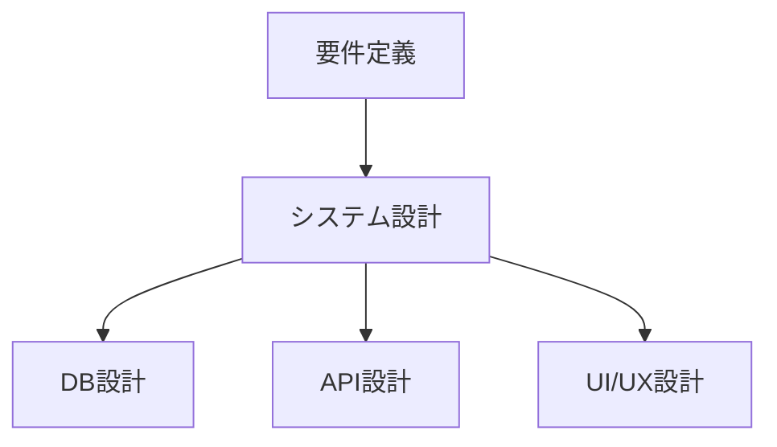

# 各配信回の詳細台本・進行表

## 📺 配信1：Google AI Studio Build入門（8/13 20:00-21:30）

### 🎯 目標
初心者でも30分でAIチャットボットを作成・公開できる

### ⏰ タイムスケジュール

#### 19:55-20:00 待機画面
- BGM：Suno AIで生成したローファイ
- 画面：本日のアジェンダスライド
- アクション：コメント欄で参加者と雑談

#### 20:00-20:05 オープニング
```
「こんばんは！AIマーケターわどです。
今日から始まるAI駆動開発シリーズ、
第1回はGoogle AI Studio Buildを使って、
プログラミング未経験でもAIアプリを作っちゃいます！」
```

#### 20:05-20:15 環境準備
```bash
# 必要なもの
1. Googleアカウント
2. Chrome ブラウザ
3. メモ帳（VSCode推奨）

# アクセス手順
1. https://aistudio.google.com にアクセス
2. Googleアカウントでログイン
3. "Build"タブを選択
```

#### 20:15-20:30 基礎解説
- プロンプトエンジニアリングとは
- システムプロンプトの書き方
- 温度パラメータの調整
- トークン制限の理解

#### 20:30-21:00 ハンズオン実装
```javascript
// Step 1: 基本的なチャットボット
const chatbot = {
  name: "YUNICOアシスタント",
  personality: "フレンドリーで親切",
  knowledge: "プログラミング、AI、ビジネス"
};

// Step 2: システムプロンプト設定
`あなたはYUNICOアシスタントです。
ユーザーの質問に対して、
分かりやすく丁寧に回答してください。
専門用語は避け、初心者にも理解できるよう説明してください。`

// Step 3: 実際の会話テスト
// - プログラミングの質問
// - 日常会話
// - ビジネス相談
```

#### 21:00-21:10 応用編
- APIキーの取得方法
- JavaScriptでの実装例
- Webhookとの連携

#### 21:10-21:20 トラブルシューティング
- よくあるエラーと対処法
- API制限の回避方法
- デバッグのコツ

#### 21:20-21:25 Q&A
- リアルタイムで質問に回答
- 追加デモンストレーション

#### 21:25-21:30 クロージング
```
「今日の内容はGitHubにアップしています。
次回はGemini CLIを使って、
もっと高度な自動化に挑戦します！
チャンネル登録と通知ONお願いします！」
```

### 📝 配布資料
- スライド（PDF）
- サンプルコード
- プロンプト集
- トラブルシューティングガイド

---

## 📺 配信2：Gemini CLI徹底活用（8/14 20:00-21:30）

### 🎯 目標
CLIを使ってファイル操作を完全自動化する

### ⏰ タイムスケジュール

#### 20:00-20:05 オープニング
- 前回の振り返り
- 本日の目標説明

#### 20:05-20:15 環境構築
```bash
# インストール手順
npm install -g @google/generative-ai-cli

# 初期設定
gemini-cli init
gemini-cli auth

# 動作確認
gemini-cli --version
```

#### 20:15-20:30 基本コマンド解説
```bash
# テキスト生成
gemini-cli generate "ブログ記事のタイトルを10個"

# ファイル読み込み
gemini-cli analyze file.txt

# コード生成
gemini-cli code "Pythonで素数判定関数"
```

#### 20:30-21:00 実践演習
```bash
# プロジェクト1：ブログ記事自動生成
#!/bin/bash
TOPICS=("AI" "プログラミング" "ビジネス")
for topic in "${TOPICS[@]}"; do
  gemini-cli generate "
    ${topic}に関する1000文字のブログ記事を書いて。
    SEOを意識したタイトルと見出しを含めて。
  " > blog_${topic}.md
done

# プロジェクト2：コードレビュー自動化
gemini-cli review *.js --output review_report.md

# プロジェクト3：ドキュメント生成
gemini-cli docs src/ --format markdown
```

#### 21:00-21:10 高度な活用法
- パイプライン処理
- バッチ処理
- CI/CD統合

#### 21:10-21:30 Q&A・まとめ

---

## 📺 配信3：Difyで作るノーコードAIアプリ（8/15 20:00-21:30）

### 🎯 目標
ドラッグ&ドロップで高度なAIワークフローを構築

### ⏰ タイムスケジュール

#### 20:00-20:15 Difyセットアップ
```yaml
# Docker Compose設定
version: '3'
services:
  dify:
    image: langgenius/dify
    ports:
      - "3000:3000"
    environment:
      - INIT_PASSWORD=admin
```

#### 20:15-20:30 インターフェース解説
- ワークフロービルダー
- ノードの種類と機能
- 変数とデータフロー

#### 20:30-21:00 実装プロジェクト
```
📊 カスタマーサポートボット
├── 入力ノード（問い合わせ受付）
├── 分類ノード（カテゴリ判定）
├── 条件分岐
│   ├── 技術的質問 → 技術DB検索
│   ├── 料金質問 → 料金表参照
│   └── その他 → 人間にエスカレーション
├── 回答生成ノード
└── 出力ノード（メール/チャット送信）
```

#### 21:00-21:30 応用とQ&A

---

## 📺 配信4：n8nでAI自動化ワークフロー（8/16 20:00-21:30）

### 🎯 目標
業務プロセスを完全自動化するAIワークフロー構築

### 実装内容
```json
{
  "workflow": "営業リード自動処理",
  "nodes": [
    {
      "type": "webhook",
      "trigger": "フォーム送信"
    },
    {
      "type": "ai_analysis",
      "action": "リードスコアリング"
    },
    {
      "type": "crm_update",
      "action": "Salesforce登録"
    },
    {
      "type": "email",
      "action": "自動返信"
    }
  ]
}
```

---

## 📺 配信5：Claude Code実践開発（8/18 20:00-21:30）

### 🎯 目標
AIペアプログラミングで本格的なWebアプリ開発

### 実装プロジェクト
```typescript
// Todo管理アプリ with AI
interface TodoApp {
  // AI機能
  autoCategrize: (task: string) => Category;
  suggestDeadline: (task: string) => Date;
  priorityScore: (task: string) => number;
  
  // 基本機能
  crud: CRUDOperations;
  sync: CloudSync;
  notification: PushNotification;
}
```

---

## 📺 配信6：Codex CLI上級テクニック（8/19 20:00-21:30）

### 🎯 目標
プロジェクト全体を一括生成する高度なプロンプト技術

### デモンストレーション
```
プロンプト：
"ECサイトを作成してください。
要件：
- Next.js 14 + TypeScript
- 商品管理、カート、決済
- 管理画面付き
- テスト込み
- Docker対応"

→ 15分で完全動作するECサイト生成
```

---

## 📺 配信7-9：フルスタックアプリ開発（8/20, 8/21, 8/22）

### 統合プロジェクト：AIパーソナルアシスタント

#### Episode 7：設計編


#### Episode 8：実装編
```typescript
// フロントエンド実装
const Frontend = {
  framework: "Next.js 14",
  ui: "shadcn/ui",
  state: "Zustand",
  api: "tRPC"
};

// バックエンド実装
const Backend = {
  runtime: "Node.js",
  framework: "NestJS",
  db: "PostgreSQL",
  cache: "Redis"
};
```

#### Episode 9：デプロイ編
```yaml
# CI/CD Pipeline
name: Deploy
on:
  push:
    branches: [main]
jobs:
  deploy:
    steps:
      - test
      - build
      - deploy to Vercel
```

---

## 📺 配信10：AIアプリの収益化戦略（8/23 20:00-21:30）

### 実装内容
```javascript
// 課金システム実装
const Monetization = {
  payment: "Stripe",
  plans: ["Free", "Pro", "Enterprise"],
  features: {
    free: ["基本機能", "月100回まで"],
    pro: ["全機能", "無制限", "優先サポート"],
    enterprise: ["カスタマイズ", "SLA保証"]
  }
};
```

---

## 📺 配信11-13：実案件開発ライブ（8/25, 8/26, 8/27）

### プロジェクト：実際のクライアント案件
- 要件ヒアリング
- 設計・見積もり
- 実装
- テスト・納品

---

## 📺 グランドフィナーレ：Demo Day＆打ち上げLIVE（8/31 19:00-22:00）

### 内容
1. **全13回の総復習**
2. **ベストプラクティス集**
3. **セミナー内容予告**
4. **参加者作品発表会**
5. **ネットワーキングタイム**

## 🎬 配信テクニック集

### 画面構成
```
┌─────────────────────────────┐
│  顔出し  │     VSCode        │
│         │                   │
├─────────┼───────────────────┤
│         │                   │
│ スライド │    ブラウザ        │
│         │                   │
└─────────────────────────────┘
```

### コメント対応
- 定期的にコメントをピックアップ
- 質問はメモして後でまとめて回答
- 良いコメントは画面に表示

### トラブル対応
- 予備PC準備
- モバイル回線バックアップ
- 録画同時進行

## 📊 成功指標

### 各回の目標
- 同時視聴者：30名以上
- コメント数：50件以上
- 完走率：70%以上
- 課題提出率：50%以上

### シリーズ全体
- 総視聴者数：延べ1000名
- チャンネル登録：500名増
- コミュニティ参加：200名
- セミナー申込：50名