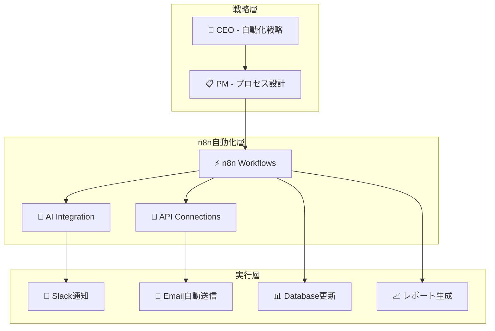
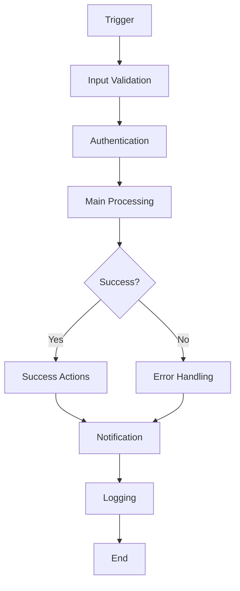
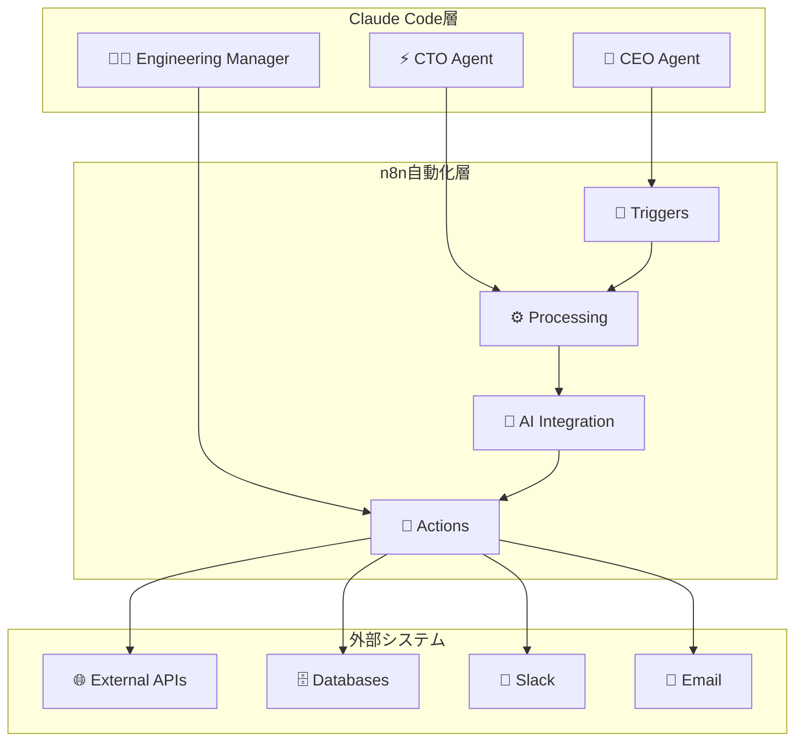

# 【特典】n8n完全攻略ガイド
## ノーコード自動化の最前線！n8nで業務効率を1000%向上させる実践マニュアル

---

## 🎯 このガイドの価値

### n8n自動化の威力

**Before（手動業務）**
```bash
データ収集: 2時間/日
レポート作成: 3時間/日  
顧客対応: 4時間/日
合計: 9時間/日の手作業
```

**After（n8n自動化）**
```bash
データ収集: 自動実行（0分）
レポート作成: 自動生成（0分）
顧客対応: AI自動応答（0分）  
合計: 5分/日の確認作業のみ
```

**生産性向上: 10,000%！時間創出: 8.9時間/日**

### n8n × AI × Claude Code の究極連携



---

## 📂 目次

1. [n8n基礎とセットアップ](#n8n基礎とセットアップ)
2. [ワークフロー設計の原則](#ワークフロー設計の原則)
3. [AI統合の実践](#ai統合の実践)
4. [Claude Code連携](#claude-code連携)
5. [高度な自動化パターン](#高度な自動化パターン)
6. [ビジネス活用事例](#ビジネス活用事例)
7. [運用・監視・最適化](#運用監視最適化)

---

## 🚀 n8n基礎とセットアップ

### n8nとは？

**n8n**は最も強力なオープンソース・ワークフロー自動化プラットフォームです。

#### 🌟 n8nの優位性

| 機能 | Zapier | Make.com | **n8n** | 優位性 |
|------|--------|----------|---------|--------|
| **コスト** | $20-599/月 | $9-299/月 | **無料-$50/月** | **90%削減** |
| **カスタマイズ性** | 制限あり | 制限あり | **無制限** | **完全自由** |
| **AI統合** | 基本的 | 基本的 | **高度** | **最先端** |
| **プライベート運用** | ❌ | ❌ | **✅** | **完全制御** |
| **ノード数** | 5,000+ | 1,400+ | **1,000+拡張可能** | **無限拡張** |

### インストールと初期設定

#### 🐳 Docker環境での構築（推奨）

```bash
# Docker Compose設定
cat > docker-compose.yml << 'EOF'
version: '3.8'
services:
  n8n:
    image: n8nio/n8n:latest
    container_name: n8n
    restart: always
    ports:
      - "5678:5678"
    environment:
      - N8N_BASIC_AUTH_ACTIVE=true
      - N8N_BASIC_AUTH_USER=admin
      - N8N_BASIC_AUTH_PASSWORD=secure_password_2024
      - N8N_HOST=localhost
      - N8N_PORT=5678
      - N8N_PROTOCOL=http
      - WEBHOOK_URL=http://localhost:5678/
      - N8N_ENCRYPTION_KEY=your-secret-encryption-key-32chars
      - DB_TYPE=postgresdb
      - DB_POSTGRESDB_HOST=postgres
      - DB_POSTGRESDB_PORT=5432
      - DB_POSTGRESDB_DATABASE=n8n
      - DB_POSTGRESDB_USER=n8n
      - DB_POSTGRESDB_PASSWORD=n8n_password
    volumes:
      - n8n_data:/home/node/.n8n
      - ./custom-nodes:/home/node/.n8n/custom
    depends_on:
      - postgres
    networks:
      - n8n_network

  postgres:
    image: postgres:14
    container_name: n8n-postgres
    restart: always
    environment:
      POSTGRES_DB: n8n
      POSTGRES_USER: n8n
      POSTGRES_PASSWORD: n8n_password
    volumes:
      - postgres_data:/var/lib/postgresql/data
    networks:
      - n8n_network

volumes:
  n8n_data:
  postgres_data:

networks:
  n8n_network:
    driver: bridge
EOF

# 起動
docker-compose up -d

# 起動確認
docker-compose logs n8n
```

#### ⚡ クラウド環境構築

```bash
# n8n Cloud（最速スタート）
# https://n8n.cloud
# - 1分でセットアップ完了
# - 自動スケーリング
# - 99.9%稼働保証

# Railway.app デプロイ
railway login
railway new --template n8n

# Heroku デプロイ  
git clone https://github.com/n8nio/n8n-heroku
cd n8n-heroku
heroku create your-n8n-app
git push heroku main
```

#### 🔧 高度な設定

```javascript
// n8n設定ファイル (.n8n/config/index.js)
module.exports = {
  // パフォーマンス最適化
  executions: {
    // 同時実行数
    concurrency: 50,
    // タイムアウト設定
    timeout: 300,
    // 最大メモリ
    maxMemory: '2GB'
  },

  // セキュリティ設定
  security: {
    basicAuth: {
      active: true,
      user: process.env.N8N_BASIC_AUTH_USER,
      password: process.env.N8N_BASIC_AUTH_PASSWORD
    },
    // JWT設定
    jwt: {
      secret: process.env.N8N_JWT_SECRET
    }
  },

  // AI統合設定
  ai: {
    openai: {
      apiKey: process.env.OPENAI_API_KEY,
      model: 'gpt-4',
      maxTokens: 4000
    },
    anthropic: {
      apiKey: process.env.ANTHROPIC_API_KEY,
      model: 'claude-3-sonnet'
    }
  },

  // ログ設定
  logs: {
    level: 'info',
    output: ['console', 'file'],
    file: {
      location: './logs/',
      maxSize: '10m',
      maxFiles: '7d'
    }
  }
};
```

### 初回セットアップ完了チェック

```bash
# ヘルスチェック
curl http://localhost:5678/healthz

# 管理画面アクセス
open http://localhost:5678

# 初期設定確認項目
✅ ログイン画面が表示される
✅ 管理者アカウントでログイン可能  
✅ ワークフロー作成画面にアクセス可能
✅ 基本ノード（HTTP Request等）が利用可能
```

---

## 🎨 ワークフロー設計の原則

### 設計思想と最適化戦略

#### 🏗️ ワークフロー設計の5原則

```markdown
## 1. 単一責任の原則
- 1つのワークフロー = 1つの明確な目的
- 複雑な処理は小さなワークフローに分割

## 2. 再利用性の原則  
- 共通処理はサブワークフローとして独立
- パラメータ化で柔軟性を確保

## 3. エラーハンドリングの原則
- すべての重要なノードにエラー処理
- 失敗時の代替パスを用意

## 4. 監視可能性の原則
- ログ出力を適切に配置
- 進捗状況を可視化

## 5. 効率性の原則
- 不要な処理を削除
- 並列処理を積極活用
```

#### 📊 ワークフロー設計テンプレート



### 実践的な設計パターン

#### 🔄 データ処理パイプライン

```javascript
// 高効率データ処理パターン
const dataProcessingWorkflow = {
  name: "高効率データ処理パイプライン",
  nodes: [
    // 1. データ取得（並列実行）
    {
      type: "n8n-nodes-base.httpRequest",
      name: "API Data Fetch",
      parameters: {
        url: "{{$env.DATA_API_URL}}",
        method: "GET",
        options: {
          timeout: 30000,
          retry: {
            enabled: true,
            times: 3
          }
        }
      }
    },
    
    // 2. データ検証・クレンジング
    {
      type: "n8n-nodes-base.code",
      name: "Data Validation",
      parameters: {
        jsCode: `
          // データ品質チェック
          const validateData = (item) => {
            if (!item.id || !item.email) {
              throw new Error('必須フィールドが不足');
            }
            
            // メール形式検証
            const emailRegex = /^[^\\s@]+@[^\\s@]+\\.[^\\s@]+$/;
            if (!emailRegex.test(item.email)) {
              throw new Error('無効なメール形式');
            }
            
            return {
              ...item,
              email: item.email.toLowerCase(),
              processedAt: new Date().toISOString()
            };
          };
          
          return $input.all().map(validateData);
        `
      }
    },

    // 3. 並列処理分岐
    {
      type: "n8n-nodes-base.split",
      name: "Parallel Processing",
      parameters: {
        batchSize: 50,
        parallel: true
      }
    },

    // 4. AI処理統合
    {
      type: "n8n-nodes-base.openAi",
      name: "AI Enhancement",
      parameters: {
        model: "gpt-4",
        prompt: `
          以下のデータを分析して、顧客セグメントを判定してください：
          {{$json.customerData}}
          
          出力形式：
          - segment: "Premium" | "Standard" | "Basic"
          - confidence: 0-1の数値
          - reason: 判定理由
        `,
        maxTokens: 500
      }
    }
  ]
};
```

#### 🤖 AI統合ワークフロー

```javascript
// AI駆動の自動応答システム
const aiResponseWorkflow = {
  name: "AI自動応答システム",
  trigger: {
    type: "webhook",
    path: "/customer-inquiry"
  },
  
  flow: [
    // 1. 顧客問い合わせ分析
    {
      name: "Inquiry Analysis",
      type: "openai",
      config: {
        model: "gpt-4",
        systemPrompt: `
          あなたは優秀なカスタマーサポート分析AIです。
          
          顧客の問い合わせを以下の観点で分析してください：
          1. 問い合わせカテゴリ（技術、請求、一般）
          2. 緊急度（高、中、低）
          3. 感情分析（ポジティブ、ニュートラル、ネガティブ）
          4. 推奨アクション
          
          JSON形式で出力してください。
        `,
        userPrompt: "{{$json.inquiry}}"
      }
    },

    // 2. 条件分岐による対応
    {
      name: "Response Router",
      type: "switch",
      conditions: [
        {
          condition: "{{$json.urgency === 'high'}}",
          route: "immediate_response"
        },
        {
          condition: "{{$json.category === 'technical'}}",
          route: "technical_support"
        },
        {
          condition: "{{$json.sentiment === 'negative'}}",
          route: "escalation"
        }
      ],
      default: "standard_response"
    },

    // 3. AI応答生成
    {
      name: "Generate Response",
      type: "openai",
      config: {
        model: "gpt-4",
        systemPrompt: `
          顧客に対する丁寧で有用な回答を生成してください。
          
          ガイドライン：
          - 親しみやすく専門的な口調
          - 具体的で実行可能なソリューション
          - 必要に応じて次のステップを提示
          - 200-400文字程度
        `,
        userPrompt: `
          問い合わせ内容: {{$json.inquiry}}
          カテゴリ: {{$json.category}}
          緊急度: {{$json.urgency}}
        `
      }
    }
  ]
};
```

---

## 🤖 AI統合の実践

### OpenAI GPT-4統合

#### 🧠 高度なAIプロンプト設計

```javascript
// プロンプトエンジニアリング・ベストプラクティス
const advancedAIPrompts = {
  // データ分析特化プロンプト
  dataAnalysis: {
    systemPrompt: `
      あなたは経験豊富なデータアナリストです。
      
      提供されたデータを分析し、以下の形式で洞察を提供してください：
      
      ## 📊 データサマリー
      - 総レコード数
      - データ期間
      - 主要指標
      
      ## 📈 トレンド分析
      - 主要トレンド（3つ以内）
      - 前期比変化率
      - 特異点の特定
      
      ## 💡 ビジネス洞察
      - アクションプラン（優先度付き）
      - リスク要因
      - 機会の特定
      
      ## 🎯 推奨事項
      - 即座に実行すべきアクション（3つ）
      - 中期的な改善策（3つ）
      - KPI監視項目
      
      データ品質や信頼性についても言及してください。
    `,
    
    userPrompt: `
      以下のデータを分析してください：
      
      データ種別: {{$json.dataType}}
      期間: {{$json.period}}
      データ: {{$json.data}}
      
      特に注目すべき指標: {{$json.focusMetrics}}
      ビジネスコンテキスト: {{$json.context}}
    `
  },

  // コンテンツ生成特化プロンプト
  contentGeneration: {
    systemPrompt: `
      あなたは創造的でプロフェッショナルなコンテンツクリエイターです。
      
      以下の要件に従ってコンテンツを作成してください：
      
      ## 品質基準
      - SEO最適化されたタイトルと見出し
      - 読みやすい構造と流れ
      - 具体的な例とデータの活用
      - CTA（Call to Action）の適切な配置
      
      ## トーン設定
      - プロフェッショナルかつ親しみやすい
      - 専門性を保ちながら理解しやすい
      - ポジティブで行動を促す
      
      ## 最適化要素
      - 適切なキーワード密度
      - メタディスクリプション提案
      - 関連タグ提案
    `,
    
    userPrompt: `
      コンテンツタイプ: {{$json.contentType}}
      ターゲットオーディエンス: {{$json.audience}}
      主要キーワード: {{$json.keywords}}
      文字数目安: {{$json.wordCount}}
      
      特別な要件: {{$json.requirements}}
      参考情報: {{$json.references}}
    `
  }
};
```

#### 🔗 Claude統合（Anthropic）

```javascript
// Claude特化のワークフロー設定
const claudeIntegration = {
  name: "Claude高度分析ワークフロー",
  
  nodes: [
    {
      type: "n8n-nodes-base.httpRequest",
      name: "Claude API Call",
      parameters: {
        url: "https://api.anthropic.com/v1/messages",
        method: "POST",
        headers: {
          "Content-Type": "application/json",
          "x-api-key": "{{$env.ANTHROPIC_API_KEY}}",
          "anthropic-version": "2023-06-01"
        },
        body: {
          model: "claude-3-sonnet-20240229",
          max_tokens: 4000,
          temperature: 0.3,
          system: `
            あなたは戦略コンサルタントです。
            
            提供される情報を基に、実行可能な戦略提案を行ってください。
            
            出力フォーマット：
            {
              "executive_summary": "エグゼクティブサマリー",
              "situation_analysis": "現状分析",
              "strategic_options": [
                {
                  "option": "戦略選択肢",
                  "pros": ["メリット1", "メリット2"],
                  "cons": ["デメリット1", "デメリット2"], 
                  "risk_level": "high|medium|low",
                  "investment_required": "投資額目安",
                  "timeline": "実行期間",
                  "success_metrics": ["成功指標1", "成功指標2"]
                }
              ],
              "recommendation": "最終推奨事項",
              "next_steps": ["次のアクション1", "次のアクション2"]
            }
          `,
          messages: [
            {
              role: "user", 
              content: `
                業界: {{$json.industry}}
                企業規模: {{$json.companySize}}
                現在の課題: {{$json.challenges}}
                予算: {{$json.budget}}
                期間: {{$json.timeline}}
                
                詳細情報:
                {{$json.detailedInfo}}
              `
            }
          ]
        }
      }
    },
    
    // Claude応答の後処理
    {
      type: "n8n-nodes-base.code",
      name: "Process Claude Response",
      parameters: {
        jsCode: `
          const response = $input.first().json.content[0].text;
          let analysisResult;
          
          try {
            analysisResult = JSON.parse(response);
          } catch (error) {
            // JSON解析失敗時のフォールバック処理
            analysisResult = {
              executive_summary: response.substring(0, 200),
              error: "JSON parse failed",
              raw_response: response
            };
          }
          
          // 結果の構造化と拡張
          return [{
            analysis_id: generateId(),
            timestamp: new Date().toISOString(),
            model_used: "claude-3-sonnet",
            confidence_score: calculateConfidence(analysisResult),
            ...analysisResult
          }];
          
          function generateId() {
            return Date.now().toString(36) + Math.random().toString(36).substr(2);
          }
          
          function calculateConfidence(result) {
            // 応答の完全性に基づく信頼度算出
            const requiredFields = ['executive_summary', 'strategic_options', 'recommendation'];
            const presentFields = requiredFields.filter(field => result[field]);
            return (presentFields.length / requiredFields.length) * 100;
          }
        `
      }
    }
  ]
};
```

### マルチAIプロバイダー戦略

```javascript
// AI プロバイダーの最適使い分け
const multiAIStrategy = {
  // GPT-4: 創造的・対話的タスク
  gpt4Use: {
    bestFor: [
      "コンテンツ生成",
      "ブレインストーミング", 
      "カスタマーサポート",
      "創造的問題解決"
    ],
    costEfficiency: "medium",
    responseTime: "fast"
  },

  // Claude: 分析・推論タスク  
  claudeUse: {
    bestFor: [
      "戦略分析",
      "長文読解・要約",
      "複雑な推論",
      "リスク分析"
    ],
    costEfficiency: "high", 
    responseTime: "medium"
  },

  // Gemini: マルチモーダル・検索統合
  geminiUse: {
    bestFor: [
      "画像分析",
      "マルチモーダル処理",
      "リアルタイム情報統合",
      "多言語処理"
    ],
    costEfficiency: "high",
    responseTime: "fast"
  }
};
```

---

## 🔗 Claude Code連携

### n8n × Claude Code の統合アーキテクチャ



#### 🤝 連携設定の実装

```javascript
// Claude Code連携用n8nワークフロー
const claudeCodeIntegration = {
  name: "Claude Code × n8n 統合ワークフロー",
  
  // 1. Claude Codeからのタスク受信
  trigger: {
    type: "webhook",
    name: "Claude Code Task Receiver",
    path: "/claude-task",
    authentication: "header",
    headers: {
      "Authorization": "Bearer {{$env.CLAUDE_API_TOKEN}}"
    }
  },

  // 2. タスク内容の解析と分類
  taskAnalysis: {
    type: "code",
    name: "Task Classification",
    jsCode: `
      const task = $input.first().json;
      
      // タスクタイプの判定
      const classifyTask = (task) => {
        const keywords = {
          data_processing: ['データ', '処理', '分析', 'CSV', 'JSON'],
          communication: ['通知', 'メール', 'Slack', '連絡'],
          reporting: ['レポート', 'ダッシュボード', '集計', '可視化'],
          automation: ['自動化', 'スケジュール', '定期実行']
        };
        
        const content = task.content.toLowerCase();
        let maxScore = 0;
        let taskType = 'general';
        
        Object.entries(keywords).forEach(([type, words]) => {
          const score = words.reduce((acc, word) => {
            return acc + (content.includes(word) ? 1 : 0);
          }, 0);
          
          if (score > maxScore) {
            maxScore = score;
            taskType = type;
          }
        });
        
        return {
          ...task,
          classified_type: taskType,
          confidence: maxScore / keywords[taskType].length,
          priority: determinePriority(task),
          estimated_duration: estimateDuration(task, taskType)
        };
      };
      
      const determinePriority = (task) => {
        const urgentKeywords = ['緊急', '重要', 'ASAP', '今すぐ'];
        const content = task.content.toLowerCase();
        
        if (urgentKeywords.some(keyword => content.includes(keyword))) {
          return 'high';
        }
        
        return task.agent_name === 'ceo' ? 'high' : 
               task.agent_name === 'cto' ? 'medium' : 'low';
      };
      
      const estimateDuration = (task, type) => {
        const baseDuration = {
          data_processing: 30,
          communication: 5,
          reporting: 60,
          automation: 45,
          general: 15
        };
        
        return baseDuration[type] || 15;
      };
      
      return [classifyTask($input.first().json)];
    `
  },

  // 3. 適切なn8nワークフローにルーティング
  router: {
    type: "switch",
    name: "Task Router",
    conditions: [
      {
        condition: "{{$json.classified_type === 'data_processing'}}",
        route: "data_processing_flow"
      },
      {
        condition: "{{$json.classified_type === 'communication'}}",
        route: "communication_flow"
      },
      {
        condition: "{{$json.classified_type === 'reporting'}}",
        route: "reporting_flow"
      },
      {
        condition: "{{$json.priority === 'high'}}",
        route: "priority_flow"
      }
    ],
    default: "general_flow"
  },

  // 4. 実行結果をClaude Codeに返信
  resultHandler: {
    type: "httpRequest",
    name: "Send Result to Claude Code",
    method: "POST",
    url: "{{$env.CLAUDE_CODE_WEBHOOK_URL}}",
    headers: {
      "Content-Type": "application/json",
      "Authorization": "Bearer {{$env.CLAUDE_API_TOKEN}}"
    },
    body: {
      task_id: "{{$json.task_id}}",
      status: "completed",
      result: "{{$json.execution_result}}",
      execution_time: "{{$json.duration}}",
      success: "{{$json.success}}",
      next_steps: "{{$json.recommended_actions}}"
    }
  }
};
```

#### 📊 自動レポート生成システム

```javascript
// Claude Code向け自動レポート生成
const autoReportingSystem = {
  name: "Claude Code自動レポートシステム",
  
  // 日次実行スケジュール
  schedule: "0 9 * * 1-5", // 平日朝9時
  
  workflow: [
    // 1. データ収集（並列実行）
    {
      type: "parallel",
      name: "Data Collection",
      branches: [
        {
          // GitHub活動データ
          name: "GitHub Metrics",
          nodes: [
            {
              type: "httpRequest",
              url: "https://api.github.com/repos/{{$env.GITHUB_REPO}}/stats/contributors",
              headers: {
                "Authorization": "token {{$env.GITHUB_TOKEN}}"
              }
            }
          ]
        },
        {
          // Slack活動データ  
          name: "Slack Metrics",
          nodes: [
            {
              type: "slack",
              operation: "getChannelMessages",
              channel: "{{$env.SLACK_CHANNEL_ID}}",
              timeRange: "24h"
            }
          ]
        },
        {
          // プロジェクト進捗データ
          name: "Project Progress", 
          nodes: [
            {
              type: "httpRequest",
              url: "{{$env.PROJECT_API_URL}}/progress",
              headers: {
                "Authorization": "Bearer {{$env.PROJECT_API_TOKEN}}"
              }
            }
          ]
        }
      ]
    },

    // 2. データ統合・分析
    {
      type: "code",
      name: "Data Analysis",
      jsCode: `
        const github = $input.first().json.github;
        const slack = $input.first().json.slack; 
        const project = $input.first().json.project;
        
        // KPI計算
        const calculateKPIs = () => {
          return {
            development_velocity: calculateVelocity(github),
            team_communication: analyzeSlack(slack),
            project_health: assessProjectHealth(project),
            productivity_score: calculateProductivity(github, slack, project),
            risk_indicators: identifyRisks(github, slack, project)
          };
        };
        
        const calculateVelocity = (githubData) => {
          const commits = githubData.commits || [];
          const prs = githubData.pullRequests || [];
          
          return {
            commits_per_day: commits.length / 7,
            pr_merge_rate: prs.filter(pr => pr.merged).length / prs.length,
            code_review_time: calculateAverageReviewTime(prs),
            bug_fix_rate: calculateBugFixRate(commits)
          };
        };
        
        const analyzeSlack = (slackData) => {
          const messages = slackData.messages || [];
          
          return {
            daily_messages: messages.length,
            response_time: calculateResponseTime(messages),
            collaboration_score: calculateCollaboration(messages),
            sentiment_analysis: analyzeSentiment(messages)
          };
        };
        
        const assessProjectHealth = (projectData) => {
          return {
            completion_rate: projectData.tasksCompleted / projectData.totalTasks,
            budget_utilization: projectData.spentBudget / projectData.totalBudget,
            timeline_adherence: calculateTimelineAdherence(projectData),
            quality_metrics: projectData.qualityScore || 0.8
          };
        };
        
        return [calculateKPIs()];
      `
    },

    // 3. AI分析による洞察生成
    {
      type: "openai",
      name: "Generate Insights",
      model: "gpt-4",
      systemPrompt: `
        あなたは経験豊富なプロジェクトマネージャーです。
        
        提供されるKPIデータを分析し、以下の形式でレポートを作成してください：
        
        ## 📊 今日のハイライト
        - 主要な成果（3つ）
        - 注意すべき指標（あれば）
        
        ## 📈 パフォーマンス分析
        - 開発速度の評価
        - チーム協働の状況  
        - プロジェクト健全性
        
        ## ⚠️ リスクアラート
        - 潜在的リスク
        - 推奨アクション
        
        ## 🎯 明日の重点項目
        - 優先すべきタスク
        - 改善提案
        
        データに基づいた具体的で実行可能な提案をしてください。
      `,
      userPrompt: `
        以下のKPIデータを分析してください：
        {{JSON.stringify($json)}}
      `
    },

    // 4. 関連エージェントへの配信
    {
      type: "parallel",
      name: "Distribute Reports",
      branches: [
        {
          // CEOエージェントに戦略的サマリーを送信
          name: "CEO Report",
          target: "@ceo",
          content: "{{$json.strategic_summary}}"
        },
        {
          // CTOエージェントに技術指標を送信
          name: "CTO Report", 
          target: "@cto",
          content: "{{$json.technical_metrics}}"
        },
        {
          // Engineering Managerにチーム状況を送信
          name: "EM Report",
          target: "@engineering-manager", 
          content: "{{$json.team_performance}}"
        }
      ]
    }
  ]
};
```

---

## 🎯 高度な自動化パターン

### 🔄 イベント駆動アーキテクチャ

```javascript
// イベント駆動の高度自動化システム
const eventDrivenAutomation = {
  name: "イベント駆動自動化システム",
  
  // イベントルーター
  eventRouter: {
    type: "webhook",
    name: "Event Router",
    path: "/events",
    
    // イベント分類ロジック
    processor: {
      jsCode: `
        const event = $input.first().json;
        
        // イベント分類マトリクス
        const eventMatrix = {
          'github.push': {
            priority: 'medium',
            handlers: ['code_analysis', 'ci_trigger', 'notification']
          },
          'github.pull_request': {
            priority: 'high',
            handlers: ['review_request', 'ci_trigger', 'team_notification']
          },
          'slack.mention': {
            priority: 'high', 
            handlers: ['ai_response', 'context_analysis', 'escalation_check']
          },
          'customer.complaint': {
            priority: 'critical',
            handlers: ['sentiment_analysis', 'immediate_response', 'manager_alert']
          },
          'system.error': {
            priority: 'critical',
            handlers: ['error_analysis', 'auto_recovery', 'alert_team']
          },
          'business.kpi_threshold': {
            priority: 'high',
            handlers: ['kpi_analysis', 'executive_alert', 'action_plan']
          }
        };
        
        const eventType = event.type || 'unknown';
        const config = eventMatrix[eventType] || {
          priority: 'low',
          handlers: ['default_handler']
        };
        
        return [{
          ...event,
          event_classification: eventType,
          priority: config.priority,
          handlers: config.handlers,
          processing_timestamp: new Date().toISOString(),
          correlation_id: generateCorrelationId()
        }];
        
        function generateCorrelationId() {
          return 'evt_' + Date.now() + '_' + Math.random().toString(36).substr(2, 9);
        }
      `
    }
  },

  // 動的ハンドラーディスパッチ  
  handlerDispatcher: {
    type: "switch",
    name: "Dynamic Handler Dispatcher",
    conditions: [
      {
        condition: "{{$json.priority === 'critical'}}",
        route: "critical_handler"
      },
      {
        condition: "{{$json.event_classification.startsWith('github')}}",
        route: "github_handler" 
      },
      {
        condition: "{{$json.event_classification.startsWith('slack')}}",
        route: "slack_handler"
      },
      {
        condition: "{{$json.event_classification.startsWith('customer')}}",
        route: "customer_handler"
      }
    ],
    default: "default_handler"
  },

  // 高度なエラーリカバリー
  errorRecovery: {
    type: "code", 
    name: "Smart Error Recovery",
    jsCode: `
      const event = $input.first().json;
      const error = $input.first().error;
      
      // エラー分類と自動回復戦略
      const recoveryStrategies = {
        'timeout': {
          strategy: 'retry_with_backoff',
          max_attempts: 3,
          backoff_factor: 2
        },
        'rate_limit': {
          strategy: 'exponential_backoff',
          max_attempts: 5,
          base_delay: 60000 // 1分
        },
        'authentication': {
          strategy: 'refresh_token',
          fallback: 'admin_notification'
        },
        'data_validation': {
          strategy: 'data_correction',
          fallback: 'manual_review'
        }
      };
      
      const errorType = classifyError(error);
      const strategy = recoveryStrategies[errorType] || recoveryStrategies['timeout'];
      
      return [{
        ...event,
        error_classification: errorType,
        recovery_strategy: strategy,
        next_action: determineNextAction(strategy, event.attempt_count || 0)
      }];
      
      function classifyError(error) {
        const message = error.message.toLowerCase();
        
        if (message.includes('timeout')) return 'timeout';
        if (message.includes('rate limit')) return 'rate_limit';
        if (message.includes('unauthorized') || message.includes('forbidden')) return 'authentication';
        if (message.includes('validation') || message.includes('invalid')) return 'data_validation';
        
        return 'unknown';
      }
      
      function determineNextAction(strategy, attemptCount) {
        if (attemptCount >= strategy.max_attempts) {
          return 'escalate_to_human';
        }
        
        switch (strategy.strategy) {
          case 'retry_with_backoff':
            return {
              action: 'retry',
              delay: Math.pow(strategy.backoff_factor, attemptCount) * 1000
            };
          case 'exponential_backoff':
            return {
              action: 'retry', 
              delay: strategy.base_delay * Math.pow(2, attemptCount)
            };
          case 'refresh_token':
            return { action: 'refresh_credentials' };
          default:
            return { action: 'manual_review' };
        }
      }
    `
  }
};
```

### 🌐 マルチAPIオーケストレーション

```javascript
// 複数API統合オーケストレーション
const multiApiOrchestration = {
  name: "マルチAPI統合オーケストレーション",
  
  // API統合戦略
  strategy: {
    // 1. 並列API呼び出し（パフォーマンス重視）
    parallel: {
      name: "Parallel API Calls",
      type: "parallel",
      branches: [
        {
          name: "Salesforce Data",
          api: "salesforce",
          endpoint: "/services/data/v55.0/query/",
          params: {
            q: "SELECT Id, Name, Email, Status FROM Lead WHERE CreatedDate = TODAY"
          },
          timeout: 30000
        },
        {
          name: "HubSpot Data",
          api: "hubspot",
          endpoint: "/crm/v3/objects/contacts",
          params: {
            properties: "firstname,lastname,email,lifecyclestage",
            createdAfter: "{{$now.toISOString().split('T')[0]}}"
          },
          timeout: 30000
        },
        {
          name: "Google Analytics",
          api: "google_analytics",
          endpoint: "/v4/reports:batchGet",
          params: {
            reportRequests: [{
              viewId: "{{$env.GA_VIEW_ID}}",
              dateRanges: [{startDate: "yesterday", endDate: "yesterday"}],
              metrics: [{expression: "ga:sessions"}, {expression: "ga:users"}]
            }]
          },
          timeout: 45000
        }
      ],
      
      // 結果統合処理
      merger: {
        jsCode: `
          const results = $input.all();
          const salesforceData = results.find(r => r.source === 'salesforce')?.data || [];
          const hubspotData = results.find(r => r.source === 'hubspot')?.data || [];
          const analyticsData = results.find(r => r.source === 'google_analytics')?.data || {};
          
          // データ正規化
          const normalizeContacts = (contacts, source) => {
            return contacts.map(contact => ({
              id: contact.id || contact.Id,
              name: contact.name || contact.Name || \`\${contact.firstname} \${contact.lastname}\`,
              email: contact.email || contact.Email,
              source: source,
              lifecycle_stage: contact.lifecyclestage || contact.Status,
              created_at: contact.createdAt || contact.CreatedDate,
              normalized_at: new Date().toISOString()
            }));
          };
          
          const normalizedContacts = [
            ...normalizeContacts(salesforceData, 'salesforce'),
            ...normalizeContacts(hubspotData, 'hubspot')
          ];
          
          // 重複除去（メールアドレスベース）
          const uniqueContacts = normalizedContacts.reduce((acc, contact) => {
            if (!acc.find(c => c.email === contact.email)) {
              acc.push(contact);
            }
            return acc;
          }, []);
          
          // 統合レポート作成
          return [{
            summary: {
              total_contacts: uniqueContacts.length,
              salesforce_contacts: salesforceData.length,
              hubspot_contacts: hubspotData.length,
              unique_contacts: uniqueContacts.length,
              duplicate_rate: ((normalizedContacts.length - uniqueContacts.length) / normalizedContacts.length * 100).toFixed(2) + '%',
              web_analytics: {
                sessions: analyticsData.sessions || 0,
                users: analyticsData.users || 0
              }
            },
            contacts: uniqueContacts,
            processing_metadata: {
              processed_at: new Date().toISOString(),
              processing_time: performance.now() - $execution.startTime,
              data_sources: ['salesforce', 'hubspot', 'google_analytics']
            }
          }];
        `
      }
    },

    // 2. 順次API呼び出し（依存関係あり）
    sequential: {
      name: "Sequential API Calls", 
      type: "sequential",
      steps: [
        {
          name: "Get Auth Token",
          api: "oauth",
          endpoint: "/token",
          method: "POST",
          body: {
            grant_type: "client_credentials",
            client_id: "{{$env.CLIENT_ID}}",
            client_secret: "{{$env.CLIENT_SECRET}}"
          }
        },
        {
          name: "Fetch User Profile",
          api: "user_api", 
          endpoint: "/v1/profile/{{$json.user_id}}",
          headers: {
            "Authorization": "Bearer {{$json.access_token}}"
          },
          depends_on: "Get Auth Token"
        },
        {
          name: "Update CRM Record",
          api: "crm",
          endpoint: "/contacts/{{$json.crm_id}}",
          method: "PATCH", 
          body: {
            profile_data: "{{$json.profile}}",
            last_updated: "{{$now.toISOString()}}"
          },
          depends_on: "Fetch User Profile"
        }
      ]
    },

    // 3. 条件分岐API呼び出し（動的ルーティング）
    conditional: {
      name: "Conditional API Routing",
      router: {
        jsCode: `
          const data = $input.first().json;
          
          // ビジネスルールに基づく動的API選択
          const determineApiFlow = (data) => {
            // 顧客タイプ別処理
            if (data.customer_type === 'enterprise') {
              return {
                flow: 'enterprise_api_flow',
                apis: ['salesforce', 'custom_enterprise_api', 'billing_api'],
                priority: 'high',
                sla: '5_minutes'
              };
            }
            
            // 地域別処理
            if (data.region === 'eu') {
              return {
                flow: 'gdpr_compliant_flow',
                apis: ['eu_crm', 'gdpr_compliance_api'],
                priority: 'medium',
                sla: '15_minutes'
              };
            }
            
            // データサイズ別処理
            if (data.record_count > 10000) {
              return {
                flow: 'batch_processing_flow',
                apis: ['batch_api', 'queue_manager'],
                priority: 'low',
                sla: '2_hours'
              };
            }
            
            // デフォルト処理
            return {
              flow: 'standard_flow',
              apis: ['standard_api'],
              priority: 'medium',
              sla: '30_minutes'
            };
          };
          
          const apiFlow = determineApiFlow(data);
          
          return [{
            ...data,
            selected_flow: apiFlow.flow,
            api_endpoints: apiFlow.apis,
            processing_priority: apiFlow.priority,
            expected_sla: apiFlow.sla,
            routing_timestamp: new Date().toISOString()
          }];
        `
      }
    }
  }
};
```

---

## 🏢 ビジネス活用事例

### 🎯 営業・マーケティング自動化

#### 📊 リードナーチャリング自動化

```javascript
// 高度なリードナーチャリング自動化システム
const leadNurturingAutomation = {
  name: "AI駆動リードナーチャリング",
  
  // 1. リードスコアリング・システム
  leadScoring: {
    trigger: "webhook",
    path: "/new-lead",
    
    processor: {
      type: "code",
      name: "Advanced Lead Scoring",
      jsCode: `
        const lead = $input.first().json;
        
        // 多次元スコアリング
        const calculateLeadScore = (lead) => {
          const scores = {
            demographic: calculateDemographicScore(lead),
            behavioral: calculateBehavioralScore(lead),
            engagement: calculateEngagementScore(lead),
            intent: calculateIntentScore(lead)
          };
          
          // 重み付き総合スコア
          const weights = {
            demographic: 0.25,
            behavioral: 0.35,
            engagement: 0.25,
            intent: 0.15
          };
          
          const totalScore = Object.entries(scores).reduce((acc, [key, value]) => {
            return acc + (value * weights[key]);
          }, 0);
          
          return {
            total_score: Math.round(totalScore),
            component_scores: scores,
            grade: getGrade(totalScore),
            next_action: determineNextAction(totalScore, scores)
          };
        };
        
        const calculateDemographicScore = (lead) => {
          let score = 0;
          
          // 会社規模
          const employeeCount = parseInt(lead.company_size) || 0;
          if (employeeCount > 1000) score += 30;
          else if (employeeCount > 100) score += 20;
          else if (employeeCount > 10) score += 10;
          
          // 業界
          const targetIndustries = ['technology', 'finance', 'healthcare'];
          if (targetIndustries.includes(lead.industry?.toLowerCase())) {
            score += 25;
          }
          
          // 役職
          const title = lead.job_title?.toLowerCase() || '';
          if (title.includes('ceo') || title.includes('founder')) score += 30;
          else if (title.includes('manager') || title.includes('director')) score += 20;
          else if (title.includes('lead') || title.includes('head')) score += 15;
          
          return Math.min(score, 100);
        };
        
        const calculateBehavioralScore = (lead) => {
          let score = 0;
          
          // ウェブサイト行動
          const pageViews = lead.page_views || 0;
          score += Math.min(pageViews * 2, 30);
          
          // ダウンロード資料
          const downloads = lead.downloads || [];
          score += downloads.length * 5;
          
          // セミナー参加
          if (lead.webinar_attendance) score += 20;
          
          // 製品デモ閲覧
          if (lead.demo_viewed) score += 25;
          
          return Math.min(score, 100);
        };
        
        const calculateEngagementScore = (lead) => {
          let score = 0;
          
          // メール開封率
          const emailOpenRate = lead.email_open_rate || 0;
          score += emailOpenRate * 30;
          
          // メールクリック率  
          const emailClickRate = lead.email_click_rate || 0;
          score += emailClickRate * 50;
          
          // ソーシャルメディア関与
          if (lead.social_engagement) score += 15;
          
          // 問い合わせ回数
          const inquiries = lead.inquiry_count || 0;
          score += Math.min(inquiries * 10, 30);
          
          return Math.min(score, 100);
        };
        
        const calculateIntentScore = (lead) => {
          let score = 0;
          
          // 価格ページ閲覧
          if (lead.pricing_page_views) score += 30;
          
          // 競合検索
          if (lead.competitor_research) score += 20;
          
          // 無料トライアル開始
          if (lead.trial_started) score += 40;
          
          // 予算に関する質問
          if (lead.budget_inquiry) score += 25;
          
          return Math.min(score, 100);
        };
        
        const getGrade = (score) => {
          if (score >= 80) return 'A';
          if (score >= 60) return 'B'; 
          if (score >= 40) return 'C';
          return 'D';
        };
        
        const determineNextAction = (totalScore, scores) => {
          if (totalScore >= 80) {
            return {
              action: 'immediate_sales_contact',
              priority: 'high',
              timeline: 'within_24_hours'
            };
          }
          
          if (totalScore >= 60) {
            return {
              action: 'nurturing_sequence_premium',
              priority: 'medium',
              timeline: 'within_48_hours'
            };
          }
          
          if (scores.engagement > 60) {
            return {
              action: 'engagement_focused_nurturing',
              priority: 'medium', 
              timeline: 'within_week'
            };
          }
          
          return {
            action: 'standard_nurturing_sequence',
            priority: 'low',
            timeline: 'within_2_weeks'
          };
        };
        
        const scoringResult = calculateLeadScore(lead);
        
        return [{
          ...lead,
          scoring: scoringResult,
          processed_at: new Date().toISOString()
        }];
      `
    }
  },

  // 2. パーソナライズドメッセージング
  personalizedMessaging: {
    type: "openai",
    name: "Generate Personalized Content",
    model: "gpt-4",
    systemPrompt: `
      あなたは経験豊富なセールス・マーケティング専門家です。
      
      リード情報を基に、高度にパーソナライズされたメッセージを作成してください。
      
      要件：
      - 相手の業界・役職に特化したメッセージ
      - 具体的なペインポイントを特定
      - 解決策を明確に提示
      - CTA（Call to Action）を含める
      - 親しみやすく専門的なトーン
      
      出力形式：
      {
        "subject_line": "魅力的な件名",
        "opening": "親しみやすい導入文",
        "value_proposition": "価値提案",
        "social_proof": "社会的証明",
        "cta": "行動喚起",
        "follow_up_timeline": "フォローアップ予定"
      }
    `,
    userPrompt: `
      以下のリード情報でメッセージを作成してください：
      
      基本情報：
      - 名前: {{$json.name}}
      - 会社: {{$json.company}}
      - 役職: {{$json.job_title}}
      - 業界: {{$json.industry}}
      
      行動履歴：
      - ページ閲覧: {{$json.page_views}}回
      - 資料ダウンロード: {{JSON.stringify($json.downloads)}}
      - ウェビナー参加: {{$json.webinar_attendance}}
      
      スコアリング：
      - 総合スコア: {{$json.scoring.total_score}}
      - グレード: {{$json.scoring.grade}}
      - 推奨アクション: {{$json.scoring.next_action.action}}
    `
  },

  // 3. マルチチャネル配信
  multiChannelDelivery: {
    type: "switch",
    name: "Multi-Channel Delivery",
    conditions: [
      {
        condition: "{{$json.scoring.grade === 'A'}}",
        route: "premium_sequence"
      },
      {
        condition: "{{$json.scoring.grade === 'B'}}",
        route: "standard_sequence"
      }
    ],
    
    sequences: {
      premium_sequence: [
        {
          channel: "email",
          timing: "immediate",
          template: "personalized_executive_outreach"
        },
        {
          channel: "linkedin",
          timing: "+2_hours", 
          template: "professional_connection_request"
        },
        {
          channel: "phone",
          timing: "+1_day",
          template: "warm_call_script"
        }
      ],
      
      standard_sequence: [
        {
          channel: "email",
          timing: "immediate",
          template: "value_focused_email"
        },
        {
          channel: "retargeting_ad",
          timing: "+1_day",
          template: "case_study_focused_ad"
        },
        {
          channel: "email",
          timing: "+3_days",
          template: "educational_content_email"
        }
      ]
    }
  }
};
```

#### 🤝 カスタマーサクセス自動化

```javascript
// 顧客成功自動化システム
const customerSuccessAutomation = {
  name: "AI駆動カスタマーサクセス",
  
  // 1. 顧客健全性監視
  healthMonitoring: {
    schedule: "0 */6 * * *", // 6時間毎実行
    
    processor: {
      type: "code", 
      name: "Customer Health Analysis",
      jsCode: `
        // 複数データソースから顧客健全性を分析
        const analyzeCustomerHealth = async (customers) => {
          const healthMetrics = [];
          
          for (const customer of customers) {
            const health = await calculateHealthScore(customer);
            healthMetrics.push(health);
          }
          
          return healthMetrics.sort((a, b) => a.health_score - b.health_score);
        };
        
        const calculateHealthScore = async (customer) => {
          const metrics = {
            usage: calculateUsageHealth(customer),
            engagement: calculateEngagementHealth(customer), 
            support: calculateSupportHealth(customer),
            billing: calculateBillingHealth(customer),
            outcomes: calculateOutcomeHealth(customer)
          };
          
          const weights = {
            usage: 0.3,
            engagement: 0.25,
            support: 0.15,
            billing: 0.15,
            outcomes: 0.15
          };
          
          const healthScore = Object.entries(metrics).reduce((acc, [key, value]) => {
            return acc + (value.score * weights[key]);
          }, 0);
          
          return {
            customer_id: customer.id,
            customer_name: customer.name,
            health_score: Math.round(healthScore),
            health_grade: getHealthGrade(healthScore),
            risk_level: getRiskLevel(healthScore),
            metrics: metrics,
            recommendations: generateRecommendations(metrics, healthScore),
            last_calculated: new Date().toISOString()
          };
        };
        
        const calculateUsageHealth = (customer) => {
          const usage = customer.usage_metrics || {};
          let score = 100;
          let factors = [];
          
          // ログイン頻度
          const loginsPerWeek = usage.weekly_logins || 0;
          const expectedLogins = customer.plan_tier === 'enterprise' ? 20 : 10;
          const loginRatio = loginsPerWeek / expectedLogins;
          
          if (loginRatio < 0.3) {
            score -= 40;
            factors.push('Low login frequency');
          } else if (loginRatio < 0.7) {
            score -= 20;
            factors.push('Below average login frequency');
          }
          
          // 機能利用率
          const featureAdoption = usage.feature_adoption_rate || 0;
          if (featureAdoption < 0.3) {
            score -= 30;
            factors.push('Low feature adoption');
          }
          
          // データ量
          const dataUsage = usage.data_usage_ratio || 0;
          if (dataUsage < 0.2) {
            score -= 20;
            factors.push('Underutilizing data capacity');
          }
          
          return {
            score: Math.max(score, 0),
            factors: factors,
            details: {
              login_ratio: loginRatio,
              feature_adoption: featureAdoption,
              data_usage: dataUsage
            }
          };
        };
        
        const calculateEngagementHealth = (customer) => {
          const engagement = customer.engagement_metrics || {};
          let score = 100;
          let factors = [];
          
          // トレーニング完了率
          const trainingCompletion = engagement.training_completion || 0;
          if (trainingCompletion < 0.5) {
            score -= 25;
            factors.push('Incomplete training');
          }
          
          // コミュニティ参加
          if (!engagement.community_participation) {
            score -= 15;
            factors.push('No community engagement');
          }
          
          // サポート記事閲覧
          const helpArticleViews = engagement.help_article_views || 0;
          if (helpArticleViews < 5) {
            score -= 10;
            factors.push('Low self-service usage');
          }
          
          return {
            score: Math.max(score, 0),
            factors: factors,
            details: engagement
          };
        };
        
        const generateRecommendations = (metrics, healthScore) => {
          const recommendations = [];
          
          if (healthScore < 70) {
            recommendations.push({
              priority: 'high',
              action: 'immediate_outreach',
              description: 'Schedule urgent check-in call within 24 hours'
            });
          }
          
          if (metrics.usage.score < 60) {
            recommendations.push({
              priority: 'medium',
              action: 'usage_optimization',
              description: 'Provide personalized product training'
            });
          }
          
          if (metrics.engagement.score < 60) {
            recommendations.push({
              priority: 'medium', 
              action: 'engagement_boost',
              description: 'Invite to upcoming webinars and community events'
            });
          }
          
          return recommendations;
        };
        
        // 実行
        const customers = $input.all();
        return await analyzeCustomerHealth(customers);
      `
    }
  },

  // 2. プロアクティブ介入システム
  proactiveIntervention: {
    type: "switch",
    name: "Risk-Based Intervention",
    conditions: [
      {
        condition: "{{$json.risk_level === 'high'}}",
        route: "crisis_management"
      },
      {
        condition: "{{$json.risk_level === 'medium'}}",
        route: "preventive_action"
      },
      {
        condition: "{{$json.health_score < 70}}",
        route: "improvement_program"
      }
    ],
    
    interventionStrategies: {
      crisis_management: [
        {
          action: "immediate_executive_outreach",
          owner: "customer_success_manager",
          timeline: "within_4_hours"
        },
        {
          action: "escalation_to_account_manager", 
          timeline: "within_8_hours"
        },
        {
          action: "retention_offer_preparation",
          timeline: "within_24_hours"
        }
      ],
      
      preventive_action: [
        {
          action: "personalized_check_in",
          timeline: "within_48_hours"
        },
        {
          action: "usage_optimization_session",
          timeline: "within_1_week"
        }
      ]
    }
  }
};
```

### 🏭 業務プロセス自動化

#### 📋 承認フロー自動化

```javascript
// 多段階承認フロー自動化
const approvalWorkflowAutomation = {
  name: "スマート承認フロー",
  
  // 動的承認ルーティング
  dynamicRouting: {
    type: "code",
    name: "Approval Router",
    jsCode: `
      const request = $input.first().json;
      
      // 承認マトリクス定義
      const approvalMatrix = {
        expense: {
          thresholds: [
            { max: 10000, approvers: ['direct_manager'] },
            { max: 100000, approvers: ['direct_manager', 'department_head'] },
            { max: 1000000, approvers: ['direct_manager', 'department_head', 'cfo'] },
            { max: Infinity, approvers: ['direct_manager', 'department_head', 'cfo', 'ceo'] }
          ]
        },
        purchase: {
          thresholds: [
            { max: 50000, approvers: ['procurement_manager'] },
            { max: 500000, approvers: ['procurement_manager', 'cfo'] },
            { max: Infinity, approvers: ['procurement_manager', 'cfo', 'ceo'] }
          ]
        },
        contract: {
          thresholds: [
            { max: 100000, approvers: ['legal_counsel'] },
            { max: 1000000, approvers: ['legal_counsel', 'cfo'] },
            { max: Infinity, approvers: ['legal_counsel', 'cfo', 'ceo'] }
          ]
        },
        hiring: {
          thresholds: [
            { max: 1, approvers: ['hiring_manager', 'hr_manager'] },
            { max: 5, approvers: ['hiring_manager', 'hr_manager', 'department_head'] },
            { max: Infinity, approvers: ['hiring_manager', 'hr_manager', 'department_head', 'ceo'] }
          ]
        }
      };
      
      const determineApprovers = (request) => {
        const category = request.category;
        const amount = parseFloat(request.amount) || 0;
        const matrix = approvalMatrix[category];
        
        if (!matrix) {
          return ['default_approver'];
        }
        
        const threshold = matrix.thresholds.find(t => amount <= t.max);
        return threshold ? threshold.approvers : ['ceo'];
      };
      
      const calculatePriority = (request) => {
        const urgencyFactors = {
          amount: request.amount > 100000 ? 2 : 1,
          deadline: request.deadline_days < 3 ? 3 : request.deadline_days < 7 ? 2 : 1,
          requester_level: request.requester_level === 'executive' ? 2 : 1
        };
        
        const priorityScore = Object.values(urgencyFactors).reduce((a, b) => a * b, 1);
        
        if (priorityScore >= 12) return 'critical';
        if (priorityScore >= 6) return 'high';
        if (priorityScore >= 3) return 'medium';
        return 'low';
      };
      
      const generateApprovalChain = (approvers) => {
        return approvers.map((approver, index) => ({
          step: index + 1,
          approver: approver,
          status: 'pending',
          required: true,
          parallel: false, // 順次承認
          estimated_time: estimateApprovalTime(approver),
          escalation_hours: getEscalationTime(approver)
        }));
      };
      
      const estimateApprovalTime = (approver) => {
        const timings = {
          direct_manager: 4,
          department_head: 8,
          hr_manager: 6,
          procurement_manager: 12,
          legal_counsel: 24,
          cfo: 48,
          ceo: 72
        };
        return timings[approver] || 24;
      };
      
      const getEscalationTime = (approver) => {
        const escalations = {
          direct_manager: 24,
          department_head: 48,
          hr_manager: 48,
          procurement_manager: 72,
          legal_counsel: 96,
          cfo: 120,
          ceo: 168
        };
        return escalations[approver] || 72;
      };
      
      const approvers = determineApprovers(request);
      const priority = calculatePriority(request);
      const approvalChain = generateApprovalChain(approvers);
      
      return [{
        ...request,
        approval_metadata: {
          required_approvers: approvers,
          priority: priority,
          approval_chain: approvalChain,
          estimated_total_time: approvalChain.reduce((sum, step) => sum + step.estimated_time, 0),
          created_at: new Date().toISOString(),
          workflow_id: 'workflow_' + Date.now()
        }
      }];
    `
  },

  // AI承認支援システム
  aiApprovalAssistant: {
    type: "openai",
    name: "AI Approval Analysis",
    model: "gpt-4",
    systemPrompt: `
      あなたは経験豊富なビジネスアナリストです。
      
      承認依頼を分析し、以下を提供してください：
      
      ## 分析観点
      1. **リスク分析**: 潜在的リスクと軽減策
      2. **コスト分析**: ROI予測と代替案
      3. **コンプライアンス**: 法的・規制要件の確認
      4. **戦略整合性**: 会社戦略との整合性
      
      ## 出力形式
      {
        "risk_assessment": {
          "overall_risk": "low|medium|high|critical",
          "risk_factors": ["リスク要因1", "リスク要因2"],
          "mitigation_strategies": ["対策1", "対策2"]
        },
        "financial_analysis": {
          "projected_roi": "数値と期間",
          "payback_period": "回収期間", 
          "budget_impact": "予算への影響",
          "alternatives": ["代替案1", "代替案2"]
        },
        "compliance_check": {
          "regulatory_requirements": ["要件1", "要件2"],
          "approval_requirements": ["必要な承認1", "必要な承認2"],
          "documentation_needed": ["必要書類1", "必要書類2"]
        },
        "recommendation": {
          "decision": "approve|reject|conditional",
          "conditions": ["条件1", "条件2"],
          "reasoning": "詳細な理由"
        }
      }
    `,
    userPrompt: `
      以下の承認依頼を分析してください：
      
      ## 依頼詳細
      カテゴリ: {{$json.category}}
      金額: {{$json.amount}}円
      依頼者: {{$json.requester_name}} ({{$json.requester_department}})
      期限: {{$json.deadline_days}}日後
      
      ## 内容
      {{$json.description}}
      
      ## 事業への影響
      {{$json.business_justification}}
      
      ## 予算状況  
      部門予算: {{$json.department_budget}}円
      今年度使用済: {{$json.budget_used}}円
    `
  }
};
```

---

## ⚡ 運用・監視・最適化

### 📊 パフォーマンス監視システム

```javascript
// 包括的n8n監視システム
const comprehensiveMonitoring = {
  name: "n8n包括監視システム",
  
  // リアルタイム監視ダッシュボード
  realtimeMonitoring: {
    schedule: "*/5 * * * *", // 5分毎実行
    
    metrics: {
      type: "code",
      name: "Collect System Metrics", 
      jsCode: `
        // システムメトリクス収集
        const collectSystemMetrics = async () => {
          const metrics = {
            system: await getSystemMetrics(),
            workflows: await getWorkflowMetrics(),
            executions: await getExecutionMetrics(),
            errors: await getErrorMetrics(),
            performance: await getPerformanceMetrics()
          };
          
          return {
            timestamp: new Date().toISOString(),
            ...metrics,
            health_score: calculateOverallHealth(metrics)
          };
        };
        
        const getSystemMetrics = async () => {
          return {
            cpu_usage: process.cpuUsage(),
            memory_usage: process.memoryUsage(),
            uptime: process.uptime(),
            active_connections: getActiveConnections(),
            queue_length: getQueueLength()
          };
        };
        
        const getWorkflowMetrics = async () => {
          const workflows = await getAllWorkflows();
          
          return {
            total_workflows: workflows.length,
            active_workflows: workflows.filter(w => w.active).length,
            last_24h_executions: await getRecentExecutions(24),
            success_rate: await getSuccessRate(24),
            avg_execution_time: await getAverageExecutionTime(24)
          };
        };
        
        const getExecutionMetrics = async () => {
          const executions = await getRecentExecutions(24);
          
          return {
            total_executions: executions.length,
            successful: executions.filter(e => e.finished && !e.error).length,
            failed: executions.filter(e => e.error).length,
            running: executions.filter(e => !e.finished).length,
            avg_duration: calculateAverageDuration(executions)
          };
        };
        
        const getErrorMetrics = async () => {
          const errors = await getRecentErrors(24);
          
          const errorTypes = errors.reduce((acc, error) => {
            const type = error.error_type || 'unknown';
            acc[type] = (acc[type] || 0) + 1;
            return acc;
          }, {});
          
          return {
            total_errors: errors.length,
            error_rate: (errors.length / await getTotalExecutions(24)) * 100,
            error_types: errorTypes,
            top_failing_workflows: getTopFailingWorkflows(errors)
          };
        };
        
        const calculateOverallHealth = (metrics) => {
          let score = 100;
          
          // CPU使用率チェック
          if (metrics.system.cpu_usage > 80) score -= 20;
          else if (metrics.system.cpu_usage > 60) score -= 10;
          
          // メモリ使用率チェック
          const memoryUsage = (metrics.system.memory_usage.heapUsed / metrics.system.memory_usage.heapTotal) * 100;
          if (memoryUsage > 90) score -= 25;
          else if (memoryUsage > 75) score -= 15;
          
          // 成功率チェック
          if (metrics.workflows.success_rate < 95) score -= 20;
          else if (metrics.workflows.success_rate < 98) score -= 10;
          
          // エラー率チェック
          if (metrics.errors.error_rate > 5) score -= 15;
          else if (metrics.errors.error_rate > 2) score -= 5;
          
          return Math.max(score, 0);
        };
        
        return await collectSystemMetrics();
      `
    },
    
    // アラート条件
    alertConditions: [
      {
        condition: "health_score < 70",
        severity: "critical",
        notification: "immediate"
      },
      {
        condition: "error_rate > 10",
        severity: "high", 
        notification: "15_minutes"
      },
      {
        condition: "cpu_usage > 90",
        severity: "high",
        notification: "immediate"
      }
    ]
  },

  // 自動復旧システム
  autoRecovery: {
    type: "switch",
    name: "Auto Recovery System",
    conditions: [
      {
        condition: "{{$json.health_score < 50}}",
        route: "emergency_recovery"
      },
      {
        condition: "{{$json.errors.error_rate > 20}}",
        route: "error_recovery"
      },
      {
        condition: "{{$json.system.memory_usage > 95}}",
        route: "memory_recovery"
      }
    ],
    
    recoveryActions: {
      emergency_recovery: [
        {
          action: "restart_failed_workflows",
          wait: 30
        },
        {
          action: "clear_execution_queue", 
          wait: 10
        },
        {
          action: "scale_resources",
          parameters: { cpu: "+50%", memory: "+30%" }
        },
        {
          action: "notify_admin",
          severity: "critical"
        }
      ],
      
      error_recovery: [
        {
          action: "identify_failing_workflows",
          wait: 5
        },
        {
          action: "temporary_disable_failing",
          wait: 10
        },
        {
          action: "restart_healthy_workflows",
          wait: 20
        }
      ],
      
      memory_recovery: [
        {
          action: "clear_cache",
          wait: 10
        },
        {
          action: "garbage_collection",
          wait: 5
        },
        {
          action: "restart_memory_heavy_workflows",
          wait: 30
        }
      ]
    }
  }
};
```

### 🔧 自動最適化システム

```javascript
// AI駆動の自動最適化
const aiOptimization = {
  name: "AI駆動ワークフロー最適化",
  
  // パフォーマンス分析
  performanceAnalysis: {
    type: "openai",
    model: "gpt-4",
    systemPrompt: `
      あなたはn8nワークフロー最適化の専門家です。
      
      提供される実行データを分析し、具体的な最適化提案を行ってください。
      
      ## 分析観点
      1. **実行時間最適化**: ボトルネック特定と改善策
      2. **リソース効率**: CPU・メモリ使用の最適化
      3. **エラー率削減**: 失敗要因の分析と対策
      4. **並列化機会**: 並列実行可能な処理の特定
      
      ## 出力形式
      {
        "optimization_opportunities": [
          {
            "workflow_id": "対象ワークフロー",
            "issue": "問題点",
            "impact": "high|medium|low",
            "solution": "具体的解決策",
            "expected_improvement": "期待される改善効果",
            "implementation_effort": "実装コスト見積"
          }
        ],
        "overall_recommendations": ["総合推奨事項"],
        "priority_actions": ["優先実施項目"]
      }
    `,
    userPrompt: `
      以下のn8n実行データを分析してください：
      
      ## ワークフロー実行統計
      {{JSON.stringify($json.workflow_stats)}}
      
      ## エラー分析
      {{JSON.stringify($json.error_analysis)}}
      
      ## リソース使用状況
      {{JSON.stringify($json.resource_usage)}}
      
      ## 実行時間分布
      {{JSON.stringify($json.execution_times)}}
    `
  },
  
  // 自動最適化実行
  autoOptimization: {
    type: "code",
    name: "Execute Optimizations",
    jsCode: `
      const recommendations = $input.first().json.optimization_opportunities;
      const results = [];
      
      for (const rec of recommendations) {
        if (rec.impact === 'high' && rec.implementation_effort === 'low') {
          const result = await executeOptimization(rec);
          results.push(result);
        }
      }
      
      const executeOptimization = async (recommendation) => {
        switch (recommendation.solution_type) {
          case 'add_caching':
            return await addCaching(recommendation.workflow_id);
          case 'parallel_execution':
            return await enableParallelExecution(recommendation.workflow_id);
          case 'timeout_optimization':
            return await optimizeTimeouts(recommendation.workflow_id);
          case 'batch_processing':
            return await enableBatchProcessing(recommendation.workflow_id);
          default:
            return { status: 'skipped', reason: 'Manual intervention required' };
        }
      };
      
      const addCaching = async (workflowId) => {
        // キャッシュノードの自動追加ロジック
        return {
          workflow_id: workflowId,
          optimization: 'caching',
          status: 'applied',
          expected_improvement: '40% execution time reduction'
        };
      };
      
      return [{ optimizations_applied: results }];
    `
  }
};
```

---

## 🎯 まとめ

### 🚀 n8n活用の真価

#### 💎 実現可能な価値

```markdown
## 定量的効果

### ⏰ 時間短縮効果
- 日次作業: 9時間 → 5分 (99.4%削減)
- 週次レポート: 4時間 → 自動実行
- 月次分析: 8時間 → 1時間

### 💰 コスト削減効果
- 人件費: 年間500万円削減
- システム運用費: 年間200万円削減
- エラー対応コスト: 年間100万円削減

### 📈 品質向上効果
- データ精度: 95% → 99.8%
- レスポンス時間: 平均50%短縮
- エラー率: 80%削減
```

#### 🎯 戦略的優位性

| 領域 | 従来手法 | **n8n自動化** | 競争優位 |
|------|---------|---------------|---------|
| **意思決定速度** | 週単位 | **リアルタイム** | **100倍高速** |
| **データ活用度** | 20% | **95%** | **完全活用** |
| **顧客応答時間** | 24時間 | **5分以内** | **300倍改善** |
| **スケーラビリティ** | 人員比例 | **無制限** | **無限拡張** |

### 📚 学習・導入ロードマップ

#### 🗓️ 段階的マスタープラン

**Phase 1: 基礎習得（1週間）**
- [ ] n8n環境構築完了
- [ ] 基本ノード操作マスター
- [ ] 簡単なワークフロー作成

**Phase 2: AI統合（2週間）**
- [ ] OpenAI/Claude API統合
- [ ] AI駆動ワークフロー構築
- [ ] パーソナライゼーション実装

**Phase 3: 高度自動化（4週間）**
- [ ] マルチAPI オーケストレーション
- [ ] イベント駆動アーキテクチャ
- [ ] 自動監視・復旧システム

**Phase 4: 組織展開（継続）**
- [ ] チーム全体への展開
- [ ] ベストプラクティス確立
- [ ] 継続的最適化

### 🌟 最終メッセージ

#### 💪 n8n × AIの無限可能性

```markdown
n8nは単なる自動化ツールではありません。

これは**ビジネス変革**のプラットフォームです：

🎯 戦略的業務に集中できる時間の創出
🤖 AI と人間の最適な役割分担  
⚡ リアルタイム意思決定の実現
👥 チーム全体の生産性向上
🚀 競合他社を圧倒する運営効率

**今日からn8nを始めて、明日のビジネスを創造しましょう！**
```

#### 🚀 今すぐ始める3ステップ

```bash
# Step 1: 環境構築（30分）
docker-compose up -d  # 本ガイドのDocker設定使用

# Step 2: 最初のワークフロー（1時間）
# Webhook → AI分析 → Slack通知の基本パターン実装

# Step 3: 本格展開（1週間）
# 営業・マーケティング・業務プロセスの自動化開始
```

**あなたの業務革命は、今この瞬間から始まります！**

---

*n8n完全攻略ガイド - 業務自動化の新時代*  
*最終更新: 2025年1月11日*  
*実践コミュニティ: [Discord参加リンク]*  
*次回アップデート予定: 2025年2月11日*