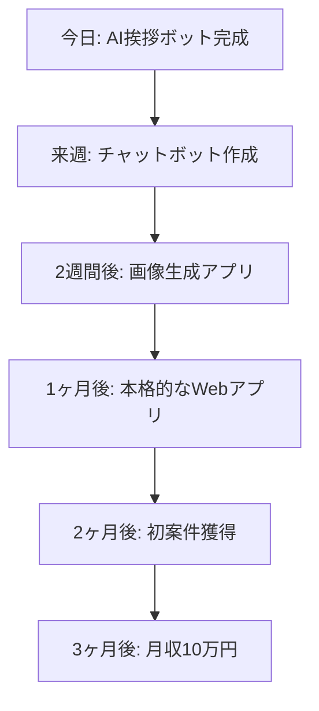

# 【完全初心者向け】未来が拓ける『AI開発ファーストステップ』

## 🚀 プログラミング未経験でも、3時間でAI開発者としての第一歩を踏み出す

---

## 💫 このガイドで実現できること

### 3時間後のあなた
- ✅ **AI開発への恐怖心が消える**（「自分にもできる」という自信）
- ✅ **最初のAIアプリが完成**（動くものを自分の手で作成）
- ✅ **開発環境が整う**（プロと同じツール環境）
- ✅ **次のステップが明確**（学習ロードマップを取得）
- ✅ **仲間との繋がり**（初心者コミュニティへの参加）

---

## 🎯 第1章: AI開発の全体像を掴む（30分）

### AI開発とは何か？

```markdown
## AI開発の本質

従来のプログラミング:
「決められた手順」をコンピューターに教える

AI開発:
「やりたいこと」を自然言語で伝えて、AIと協力して実現する

例:
- 従来: for文を書いて配列を処理
- AI開発: 「この配列から重要な要素だけ抽出して」
```

### なぜ今AI開発を始めるべきか

```javascript
// 市場価値の変化
const marketValue = {
  2023: {
    AIエンジニア平均年収: 800,  // 万円
    案件数: 5000,
    競合の少なさ: "高"
  },
  2025: {
    AIエンジニア平均年収: 1200,  // 万円（予測）
    案件数: 50000,  // 予測
    競合の少なさ: "中"
  },
  結論: "今始めるのが最もチャンス"
};
```

### AI開発で作れるものの例

1. **チャットボット**（カスタマーサポート自動化）
2. **文章生成ツール**（ブログ記事・メール作成）
3. **画像生成アプリ**（SNS投稿用画像作成）
4. **データ分析ツール**（売上予測・顧客分析）
5. **業務自動化システム**（作業効率化）

---

## 🛠️ 第2章: 開発環境構築（30分）

### 必要なものリスト

```markdown
## 最低限必要なもの
✅ パソコン（Windows/Mac/Linux どれでもOK）
✅ インターネット接続
✅ Gmail アカウント

## あると便利なもの（後で準備でもOK）
- 外部モニター
- 良いキーボード
- 高速なインターネット
```

### Step 1: ブラウザの準備

```bash
# おすすめブラウザ（どれか1つ）
1. Google Chrome（最も一般的）
2. Microsoft Edge（Windows標準）
3. Firefox（プライバシー重視）

# 必要な拡張機能
- JSON Viewer（データを見やすく表示）
- React Developer Tools（後で使用）
```

### Step 2: アカウント作成

#### 今すぐ作成するアカウント

1. **GitHub（無料）**
   - 目的: コードの保存・共有
   - URL: https://github.com

2. **Replit（無料）**
   - 目的: オンライン開発環境
   - URL: https://replit.com

3. **CodePen（無料）**
   - 目的: 簡単なコード実験
   - URL: https://codepen.io

### Step 3: 初回セットアップ

```javascript
// Replitでの初期設定
1. Replitにログイン
2. "Create Repl" をクリック
3. "HTML/CSS/JS" を選択
4. プロジェクト名: "my-first-ai-app"
5. "Create Repl" で完了

// これで開発環境完成！
```

---

## 🎨 第3章: 最初のAIアプリを作る（60分）

### プロジェクト: AI挨拶ボット

#### 完成イメージ
- 名前を入力すると、AIが個性的な挨拶を返してくれる
- シンプルだけど、れっきとしたAIアプリ
- 友達に自慢できるレベル

### Step 1: HTMLの作成（15分）

```html
<!DOCTYPE html>
<html lang="ja">
<head>
    <meta charset="UTF-8">
    <meta name="viewport" content="width=device-width, initial-scale=1.0">
    <title>AI挨拶ボット</title>
    <style>
        body {
            font-family: Arial, sans-serif;
            max-width: 600px;
            margin: 50px auto;
            padding: 20px;
            background: linear-gradient(135deg, #667eea 0%, #764ba2 100%);
            color: white;
        }
        .container {
            background: rgba(255, 255, 255, 0.1);
            padding: 30px;
            border-radius: 15px;
            backdrop-filter: blur(10px);
        }
        input, button {
            padding: 10px;
            margin: 10px 0;
            border: none;
            border-radius: 5px;
            font-size: 16px;
        }
        input {
            width: 100%;
            box-sizing: border-box;
        }
        button {
            background: #4CAF50;
            color: white;
            cursor: pointer;
            transition: all 0.3s;
        }
        button:hover {
            background: #45a049;
            transform: translateY(-2px);
        }
        #result {
            margin-top: 20px;
            padding: 15px;
            background: rgba(255, 255, 255, 0.2);
            border-radius: 10px;
            min-height: 50px;
        }
        @keyframes fadeIn {
            from { opacity: 0; transform: translateY(20px); }
            to { opacity: 1; transform: translateY(0); }
        }
        .fade-in {
            animation: fadeIn 1s ease-out;
        }
    </style>
</head>
<body>
    <div class="container">
        <h1>🤖 AI挨拶ボット</h1>
        <p>あなたの名前を入力すると、AIが素敵な挨拶をしてくれます！</p>
        
        <input type="text" id="nameInput" placeholder="あなたの名前を入力してください" 
               onkeypress="if(event.key==='Enter') generateGreeting()">
        <button onclick="generateGreeting()">挨拶してもらう</button>
        
        <div id="result">ここにAIからの挨拶が表示されます...</div>
    </div>
    
    <script src="script.js"></script>
</body>
</html>
```

### Step 2: JavaScriptの作成（30分）

```javascript
// AI挨拶ボットクラス
class AIGreetingBot {
    constructor() {
        this.greetingPatterns = [
            "こんにちは、{name}さん！今日も素晴らしい一日になりそうですね✨",
            "{name}さん、お疲れ様です！あなたの笑顔が周りを明るくしています😊",
            "やあ{name}さん！新しいことに挑戦するあなたを応援しています🚀",
            "{name}さん、元気ですか？あなたの可能性は無限大です💫",
            "お久しぶりです、{name}さん！今日はどんな発見がありそうですか？🔍"
        ];
        
        this.emotions = ["😊", "🌟", "💖", "🎉", "✨", "🌈", "🚀", "💫"];
    }
    
    generatePersonalizedGreeting(name) {
        // 名前の特徴を分析（簡易版）
        const nameLength = name.length;
        
        // パターンを選択
        const patternIndex = nameLength % this.greetingPatterns.length;
        let greeting = this.greetingPatterns[patternIndex];
        
        // 名前を挿入
        greeting = greeting.replace(/{name}/g, name);
        
        // 感情を追加
        const randomEmotion = this.emotions[Math.floor(Math.random() * this.emotions.length)];
        
        // 時間に応じたメッセージ
        const hour = new Date().getHours();
        let timeMessage = "";
        
        if (hour < 12) {
            timeMessage = " 朝の新鮮な空気と一緒に、素敵な一日をスタートしましょう！";
        } else if (hour < 18) {
            timeMessage = " 午後も頑張っているあなたは素晴らしいです！";
        } else {
            timeMessage = " 今日一日お疲れ様でした。ゆっくり休んでくださいね。";
        }
        
        return greeting + timeMessage + " " + randomEmotion;
    }
    
    addPersonality(greeting, name) {
        // AIらしい個性を追加
        const personalityTouches = [
            `\n\n🤖 AIより: ${name}という素敵な名前ですね！私のデータベースによると、この名前を持つ人は創造性が豊かな傾向があります。`,
            `\n\n💡 ちなみに: ${name}さんのような前向きな人と話すと、私のAIも元気になります！`,
            `\n\n🎯 今日のAIからの提案: 新しいこと1つだけでも学んでみませんか？きっと${name}さんなら楽しめるはずです！`
        ];
        
        const randomTouch = personalityTouches[Math.floor(Math.random() * personalityTouches.length)];
        return greeting + randomTouch;
    }
}

// グローバル変数
const aiBot = new AIGreetingBot();

// メイン関数
function generateGreeting() {
    const nameInput = document.getElementById('nameInput');
    const resultDiv = document.getElementById('result');
    const name = nameInput.value.trim();
    
    // 入力チェック
    if (!name) {
        resultDiv.innerHTML = "<span style='color: #ffcccb;'>名前を入力してください！</span>";
        return;
    }
    
    // ローディング表示
    resultDiv.innerHTML = "<span>🤖 AIが考え中...</span>";
    
    // AIが考えている感じを演出（1秒待機）
    setTimeout(() => {
        // 基本的な挨拶を生成
        let greeting = aiBot.generatePersonalizedGreeting(name);
        
        // 個性を追加
        greeting = aiBot.addPersonality(greeting, name);
        
        // 結果を表示
        resultDiv.innerHTML = `<div class="fade-in">${greeting}</div>`;
        
        // 成功の視覚効果
        resultDiv.style.background = "rgba(76, 175, 80, 0.2)";
        setTimeout(() => {
            resultDiv.style.background = "rgba(255, 255, 255, 0.2)";
        }, 2000);
        
    }, 1000);
    
    // 入力欄をクリア
    nameInput.value = '';
}

// エンターキーでも実行できるようにする
document.addEventListener('DOMContentLoaded', function() {
    const nameInput = document.getElementById('nameInput');
    nameInput.addEventListener('keypress', function(event) {
        if (event.key === 'Enter') {
            generateGreeting();
        }
    });
});
```

### Step 3: テストと改善（15分）

#### テスト項目
1. **基本動作**: 名前を入力して「挨拶してもらう」ボタンをクリック
2. **空欄テスト**: 何も入力せずにボタンをクリック
3. **Enterキー**: 名前入力後にEnterキーを押す
4. **異なる名前**: 色々な名前で試す
5. **時間帯**: 異なる時間帯でアクセスして違いを確認

#### 改善案
- 音声読み上げ機能
- 挨拶の履歴保存
- 好きなものを入力して個性化
- 多言語対応

---

## 🚀 第4章: アプリを公開する（30分）

### Step 1: Replitでの公開

```markdown
## 公開手順
1. Repl画面右上の「Run」ボタンをクリック
2. 右側にプレビューが表示される
3. プレビュー画面上部の「Open in new tab」をクリック
4. 新しいタブで独立したアプリとして動作
5. このURLを友達に共有可能！
```

### Step 2: GitHubでのコード管理

```bash
# GitHubにコードを保存する手順
1. GitHubにログイン
2. "New repository"をクリック
3. Repository name: "my-first-ai-app"
4. "Create repository"をクリック
5. ReplitからVersion ControlでGitHubと連携
6. コードがGitHubに自動保存される
```

### Step 3: 成果の共有

```javascript
// SNS投稿用テンプレート
const shareMessage = `
🎉 人生初のAIアプリが完成しました！

✨ 作ったもの: AI挨拶ボット
⏱️ 制作時間: 3時間
💡 使用技術: HTML, CSS, JavaScript

名前を入力すると、AIが個性的な挨拶をしてくれます😊

プログラミング未経験の私でも、こんなに楽しいものが作れました！

#AI開発 #プログラミング初心者 #バイブコーディング

デモ: [あなたのReplitのURL]
`;
```

---

## 💎 第5章: 次のステップを明確にする（30分）

### 今後の学習ロードマップ



### 推奨学習リソース

#### 無料で学べるリソース

**基礎スキル**
1. **JavaScript**: MDN Web Docs（日本語対応）
2. **HTML/CSS**: W3Schools
3. **Git**: Git公式チュートリアル

**AI開発**
1. **OpenAI API**: 公式ドキュメント
2. **Claude API**: Anthropic公式ガイド
3. **Prompt Engineering**: Prompt Engineering Guide

**コミュニティ**
1. **Discord**: バイブコーディング公式サーバー
2. **Twitter**: #AI開発初心者
3. **Qiita**: AI開発記事

### 次に作るべきプロジェクト

```javascript
// 推奨プロジェクト順序
const nextProjects = [
  {
    name: "AIチャットボット",
    difficulty: "初級+",
    期間: "1週間",
    学べること: "リアルタイム通信、状態管理",
    収益化可能性: "高"
  },
  {
    name: "文章要約ツール",
    difficulty: "中級",
    期間: "2週間",
    学べること: "テキスト処理、API設計",
    収益化可能性: "中"
  },
  {
    name: "画像生成アプリ",
    difficulty: "中級+",
    期間: "3週間",
    学べること: "ファイル処理、課金システム",
    収益化可能性: "高"
  }
];
```

---

## 🤝 第6章: コミュニティに参加する（20分）

### バイブコーディング初心者コミュニティ

#### 参加メリット
✅ 同じレベルの仲間と切磋琢磨
✅ 質問を気軽にできる環境
✅ 最新情報の共有
✅ モチベーション維持
✅ 案件情報の共有

#### 参加方法
1. Discord招待リンクをクリック
2. 自己紹介チャンネルで挨拶
3. 今日作ったアプリを #作品共有 に投稿
4. #質問・相談 で不明点を解決

### 継続のコツ

```javascript
const continuationTips = {
  習慣化: {
    毎日: "コードを5分でも触る",
    毎週: "小さな機能を1つ追加",
    毎月: "新しいプロジェクトを開始"
  },
  
  モチベーション維持: {
    記録: "学習ログをSNSで公開",
    仲間: "一緒に学ぶ仲間を見つける",
    目標: "具体的な目標金額を設定",
    成果: "作ったものを積極的に共有"
  },
  
  スキルアップ: {
    インプット: "毎日1つの技術記事を読む",
    アウトプット: "学んだことをブログに書く",
    フィードバック: "コードレビューを受ける",
    挑戦: "少し難しいことにも挑戦"
  }
};
```

---

## 🎁 特別ボーナス

### 初心者向け特典セット
1. **コードテンプレート集**（10種類のAIアプリテンプレート）
2. **エラー解決辞書**（よくあるエラー100選と解決法）
3. **プロンプト集**（効果的なAI指示文50選）
4. **学習チェックリスト**（スキル習得の進捗管理）
5. **案件獲得テンプレート**（提案書・見積書フォーマット）

### 30日間無料サポート
- 毎日の質問対応（Discord）
- 月1回のコードレビュー
- 月2回のZoom個別相談
- 進捗管理とアドバイス
- 次のプロジェクト提案

---

## 📊 成果測定

### 今日の達成度チェック
- [ ] 開発環境を構築できた
- [ ] 最初のAIアプリを完成させた
- [ ] アプリを公開できた
- [ ] GitHubにコードを保存した
- [ ] コミュニティに参加した
- [ ] 次のステップが明確になった

### あなたの成長記録

```javascript
// 成長記録テンプレート
const progressRecord = {
  開始前: {
    プログラミング経験: "なし",
    AI知識: "なし",
    不安レベル: "高",
    期待値: "低"
  },
  
  "3時間後": {
    プログラミング経験: "HTMLとJavaScriptの基礎理解",
    AI知識: "AIアプリの作り方を理解",
    不安レベル: "中→低",
    期待値: "高",
    作成物: "AI挨拶ボット",
    次の目標: "チャットボット作成"
  }
};
```

---

## 🏆 おめでとうございます！

### あなたが今日手に入れたもの

**✅ 技術的成果**
- 動作するAIアプリケーション
- 基本的なプログラミングスキル
- 開発環境の構築ノウハウ

**✅ 精神的成果**
- 「自分にもできる」という自信
- AI開発への理解と興味
- 継続学習へのモチベーション

**✅ 将来への投資**
- 成長できるコミュニティへの参加
- 明確な学習ロードマップ
- 収益化への具体的な道筋

### 明日からすること
1. **毎日コードを触る**（5分でもOK）
2. **学習記録をつける**（成長を可視化）
3. **仲間と交流する**（Discord活用）
4. **次のプロジェクトを計画**（チャットボット作成）

---

## 🎁 バイブコーディング特典情報

この特典は**バイブコーディング**受講生向けの特別コンテンツです。

### さらに学びを深めるには
- ✅ 月次ハンズオンセミナー参加
- ✅ 1on1メンタリングセッション
- ✅ Discordコミュニティアクセス
- ✅ 最新アップデート情報の提供

**詳細**: [wadoyuniko.com](https://wadoyuniko.com)

---

**🎉 おめでとうございます！あなたはもうAI開発者です！**

*最終更新: 2025年1月*
*バージョン: 1.0*