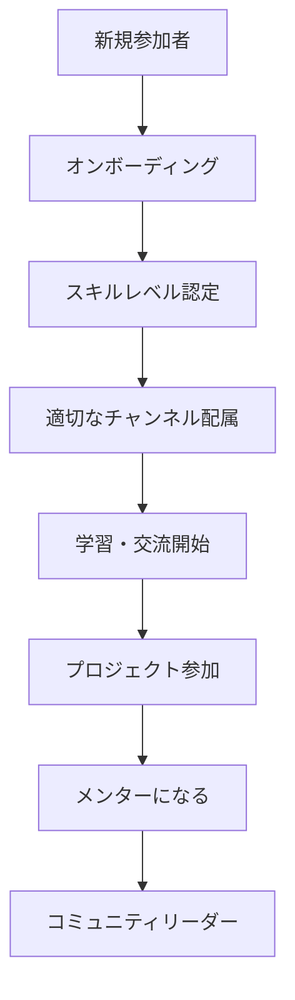
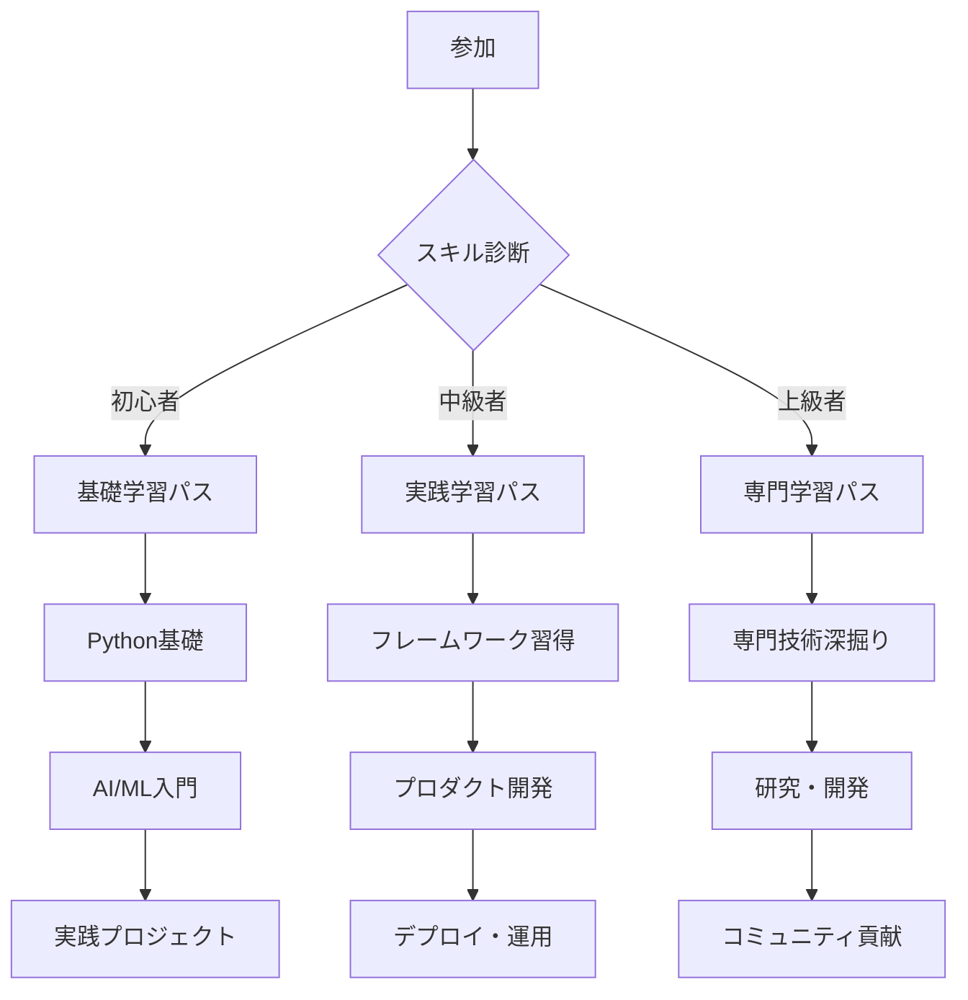

# Discord AI開発者コミュニティ完全攻略ガイド 💬
## 最強の学習・交流・成長環境の作り方
**コミュニティ・サポート特典**

---

## 🌟 なぜDiscordコミュニティなのか？

### 従来の学習環境の限界
- **孤独な学習**: 一人で悩み続ける
- **情報格差**: 最新情報にアクセスできない
- **モチベーション低下**: 継続困難
- **実践機会不足**: 学んだことを活かせない

### Discordコミュニティの力
```javascript
個人学習 → コミュニティ学習
- 孤独 → 仲間と共に成長
- 遅れた情報 → リアルタイム最新情報
- モチベーション低下 → 相互刺激
- 理論のみ → 実践・フィードバック
```

---

## 🚀 AI開発者コミュニティの全体設計

### コミュニティアーキテクチャ


### チャンネル構成設計
<table header-row="true">
<tr>
<td>カテゴリ</td>
<td>チャンネル名</td>
<td>目的</td>
<td>対象者</td>
</tr>
<tr>
<td>🎯 ウェルカム</td>
<td>自己紹介・ルール</td>
<td>初回案内・交流開始</td>
<td>全員</td>
</tr>
<tr>
<td>📚 学習支援</td>
<td>質問・相談</td>
<td>技術的な疑問解決</td>
<td>初心者〜中級者</td>
</tr>
<tr>
<td>💻 技術討論</td>
<td>AI技術・ツール</td>
<td>最新技術情報共有</td>
<td>中級者〜上級者</td>
</tr>
<tr>
<td>🛠️ プロジェクト</td>
<td>共同開発・レビュー</td>
<td>実践的開発経験</td>
<td>全レベル</td>
</tr>
<tr>
<td>💼 ビジネス</td>
<td>案件・転職情報</td>
<td>キャリア支援</td>
<td>中級者以上</td>
</tr>
<tr>
<td>🎉 コミュニティ</td>
<td>雑談・イベント</td>
<td>関係構築・息抜き</td>
<td>全員</td>
</tr>
</table>

---

## 💡 コミュニティ運営戦略

### エンゲージメント促進システム
```python
class CommunityEngagement:
    def __init__(self):
        self.point_system = PointSystem()
        self.event_scheduler = EventScheduler()
        self.content_curator = ContentCurator()
        self.mentor_matcher = MentorMatcher()
    
    def boost_engagement(self, member_id):
        member_data = self.get_member_data(member_id)
        engagement_level = self.calculate_engagement(member_data)
        
        if engagement_level < 3:
            # 低エンゲージメント
            return self.execute_activation_campaign(member_id)
        elif engagement_level < 7:
            # 中エンゲージメント
            return self.execute_growth_campaign(member_id)
        else:
            # 高エンゲージメント
            return self.execute_leadership_campaign(member_id)
    
    def execute_activation_campaign(self, member_id):
        actions = [
            self.send_welcome_dm(member_id),
            self.suggest_relevant_channels(member_id),
            self.introduce_to_similar_members(member_id),
            self.invite_to_beginner_events(member_id)
        ]
        return self.execute_action_sequence(actions)
    
    def calculate_engagement_score(self, member_data):
        metrics = {
            'message_count': member_data['messages'] * 1,
            'reaction_given': member_data['reactions_given'] * 0.5,
            'reaction_received': member_data['reactions_received'] * 2,
            'voice_minutes': member_data['voice_time'] * 0.1,
            'event_attendance': member_data['events_attended'] * 5,
            'project_participation': member_data['projects'] * 10
        }
        return sum(metrics.values())
```

### ゲーミフィケーション要素
```yaml
レベルシステム:
  レベル1 - 見習い開発者:
    条件: 参加後7日、メッセージ10回
    特典: 初心者専用チャンネルアクセス
    バッジ: 🌱 新芽
  
  レベル2 - 駆け出し開発者:
    条件: 参加30日、メッセージ50回、質問5回
    特典: 技術相談チャンネルアクセス
    バッジ: 💻 コーダー
  
  レベル3 - 実践開発者:
    条件: プロジェクト1個完成、コードレビュー参加
    特典: プロジェクトリーダー権限
    バッジ: 🚀 実践者
  
  レベル4 - 熟練開発者:
    条件: 他者サポート10回、イベント登壇
    特典: メンター権限、専用チャンネル
    バッジ: 🎓 メンター
  
  レベル5 - エキスパート開発者:
    条件: コミュニティ貢献、技術記事投稿
    特典: 運営チーム参加権
    バッジ: 👑 エキスパート

ポイントシステム:
  獲得方法:
    - 毎日ログイン: +10pt
    - メッセージ投稿: +5pt
    - 質問回答: +20pt
    - プロジェクト参加: +100pt
    - イベント参加: +50pt
    - 記事投稿: +200pt
  
  使用方法:
    - 専用チャンネル入場: 500pt
    - 1on1相談セッション: 1000pt
    - プライベートコードレビュー: 1500pt
    - 個別メンタリング: 3000pt
```

---

## 📚 学習コンテンツ体系

### レベル別学習パス


### 週次学習イベント
```yaml
月曜日 - スキルアップデー:
  時間: 20:00-21:30
  内容: 新技術紹介・チュートリアル
  形式: ライブ配信 + ハンズオン
  対象: 全レベル

火曜日 - コードレビューデー:
  時間: 19:00-20:30
  内容: メンバーのコード相互レビュー
  形式: 画面共有セッション
  対象: 中級者以上

水曜日 - プロジェクトデー:
  時間: 18:00-22:00 (自由参加)
  内容: 共同プロジェクト作業
  形式: 複数のボイスチャンネル
  対象: プロジェクト参加者

木曜日 - 質問解決デー:
  時間: 20:00-21:00
  内容: 質問・相談対応
  形式: Q&A セッション
  対象: 全レベル

金曜日 - ゲストスピーカーデー:
  時間: 20:00-21:30
  内容: 業界専門家の講演
  形式: オンライン講演会
  対象: 全レベル

土曜日 - ハッカソンデー:
  時間: 10:00-18:00 (月1回)
  内容: 1日でアプリ・ツール開発
  形式: チーム対抗戦
  対象: 中級者以上

日曜日 - リラックスデー:
  時間: 自由
  内容: 雑談・ゲーム・読書会
  形式: 自由参加
  対象: 全員
```

---

## 🛠️ 実践プロジェクト体系

### プロジェクトレベル分類
```yaml
レベル1 - 学習プロジェクト:
  期間: 1-2週間
  規模: 個人または2-3人チーム
  例:
    - チャットボット作成
    - 画像分類アプリ
    - データ可視化ダッシュボード
    - 簡単なWebスクレイパー
  
  成果物:
    - GitHubリポジトリ
    - README文書
    - デモ動画(3分以内)
    - 学習メモ

レベル2 - 実用プロジェクト:
  期間: 3-4週間
  規模: 3-5人チーム
  例:
    - ECサイト用推薦システム
    - 在庫管理自動化ツール
    - コンテンツ自動生成システム
    - 顧客サポートボット
  
  成果物:
    - 完全なアプリケーション
    - 技術文書
    - プレゼンテーション
    - ユーザーテスト結果

レベル3 - 社会課題解決プロジェクト:
  期間: 6-8週間
  規模: 5-8人チーム
  例:
    - 医療診断支援システム
    - 環境データ分析プラットフォーム
    - 教育格差解消アプリ
    - 災害対策情報システム
  
  成果物:
    - 本格的なプロダクト
    - ビジネスプラン
    - 社会的インパクト評価
    - 継続運用計画
```

### プロジェクト管理システム
```python
class ProjectManagement:
    def __init__(self):
        self.project_tracker = ProjectTracker()
        self.team_matcher = TeamMatcher()
        self.milestone_manager = MilestoneManager()
        self.review_system = ReviewSystem()
    
    def create_project(self, project_idea):
        # プロジェクト提案評価
        evaluation = self.evaluate_project_idea(project_idea)
        
        if evaluation['feasibility'] > 7:
            # プロジェクト承認
            project = self.initialize_project(project_idea)
            
            # チームメンバー募集
            team = self.recruit_team_members(project)
            
            # マイルストーン設定
            milestones = self.create_milestones(project)
            
            # キックオフミーティング設定
            kickoff = self.schedule_kickoff(team)
            
            return {
                'project_id': project.id,
                'team': team,
                'milestones': milestones,
                'kickoff_date': kickoff
            }
        else:
            return self.provide_improvement_suggestions(project_idea)
    
    def monitor_project_progress(self, project_id):
        project = self.get_project(project_id)
        
        # 進捗状況確認
        progress = self.calculate_progress(project)
        
        # チーム健康度チェック
        team_health = self.assess_team_health(project.team)
        
        # 必要に応じてサポート提供
        if progress['behind_schedule']:
            self.provide_project_support(project)
        
        if team_health['conflicts_detected']:
            self.facilitate_conflict_resolution(project.team)
        
        return {
            'progress_percentage': progress['completion'],
            'next_milestone': progress['next_milestone'],
            'team_health_score': team_health['score'],
            'recommended_actions': progress['recommendations']
        }
```

---

## 🎯 メンタリングシステム

### メンター・メンティーマッチング
```javascript
const MentorMatcher = {
  // メンター適性評価
  evaluateMentorFitness: function(member) {
    const criteria = {
      technicalSkill: member.skill_level >= 7,
      communicationAbility: member.communication_score >= 8,
      timeAvailability: member.available_hours >= 5,
      mentorExperience: member.mentor_count >= 0,
      communityContribution: member.contribution_score >= 15
    };
    
    const score = Object.values(criteria)
      .reduce((sum, criterion) => sum + (criterion ? 1 : 0), 0);
    
    return {
      eligible: score >= 4,
      score: score,
      areas_for_improvement: this.getImprovementAreas(criteria)
    };
  },
  
  // 最適なメンター選択
  findBestMentor: function(mentee) {
    const availableMentors = this.getAvailableMentors();
    
    return availableMentors
      .map(mentor => ({
        mentor: mentor,
        compatibility: this.calculateCompatibility(mentee, mentor),
        availability: this.checkAvailability(mentor),
        specialization: this.checkSpecializationMatch(mentee, mentor)
      }))
      .sort((a, b) => {
        // 総合スコアで並び替え
        const scoreA = a.compatibility * 0.4 + 
                      a.availability * 0.3 + 
                      a.specialization * 0.3;
        const scoreB = b.compatibility * 0.4 + 
                      b.availability * 0.3 + 
                      b.specialization * 0.3;
        return scoreB - scoreA;
      })[0];
  },
  
  calculateCompatibility: function(mentee, mentor) {
    const factors = {
      learningStyle: this.compareLearningStyles(mentee, mentor),
      personalityMatch: this.comparePersonalities(mentee, mentor),
      goalAlignment: this.compareGoals(mentee, mentor),
      timezoneCompatibility: this.compareTimezones(mentee, mentor)
    };
    
    return Object.values(factors).reduce((sum, factor) => sum + factor, 0) / 4;
  }
};
```

### メンタリング プログラム構成
```yaml
1on1メンタリング:
  頻度: 週1回、30-60分
  形式: ビデオ通話
  内容:
    - 学習進捗確認
    - 技術的課題解決
    - キャリア相談
    - 目標設定・見直し
  
  進行フロー:
    Week 1: 目標設定・計画作成
    Week 2-3: 学習進捗確認
    Week 4: 中間評価・調整
    Week 5-7: 実践プロジェクト
    Week 8: 総合評価・次ステップ

グループメンタリング:
  頻度: 月2回、90分
  形式: オンライン勉強会
  参加者: メンター1名 + メンティー4-6名
  内容:
    - 共通課題ディスカッション
    - ピアラーニング
    - 成功・失敗事例共有
    - ネットワーキング

専門メンタリング:
  分野:
    - 機械学習エンジニア向け
    - データサイエンティスト向け
    - AI研究者向け
    - AIスタートアップ起業家向け
  
  特徴:
    - 分野特化の深い指導
    - 業界専門家によるメンタリング
    - 実際の案件・プロジェクトベース
    - キャリア転換支援
```

---

## 📈 コミュニティ成長戦略

### 新規メンバー獲得
```yaml
オーガニック成長:
  既存メンバーからの紹介:
    - 紹介者・被紹介者両方に特典付与
    - 月間紹介ランキング
    - 特別な紹介イベント開催
  
  コンテンツマーケティング:
    - メンバーによる技術ブログ執筆
    - YouTubeチャンネル運営
    - Qiita・Zenn記事投稿
    - SNSでの成果物シェア

パートナーシップ成長:
  教育機関連携:
    - 大学・専門学校との提携
    - 学生向け特別プログラム
    - インターンシップ機会提供
    - 研究プロジェクト協力
  
  企業連携:
    - AI導入企業との協力
    - 人材紹介パートナーシップ
    - 技術コンサルティング
    - 共同プロジェクト開発

イベントマーケティング:
  オンラインイベント:
    - 無料AI開発セミナー
    - ハンズオンワークショップ
    - 業界専門家講演会
    - コミュニティメンバー成果発表会
  
  オフラインイベント:
    - 地域別ミートアップ
    - ハッカソン大会
    - AI技術カンファレンス
    - 交流パーティー
```

### 継続率向上施策
```python
class RetentionStrategy:
    def __init__(self):
        self.engagement_tracker = EngagementTracker()
        self.churn_predictor = ChurnPredictor()
        self.intervention_system = InterventionSystem()
    
    def predict_and_prevent_churn(self, member_id):
        # エンゲージメント履歴分析
        engagement_history = self.engagement_tracker.get_history(member_id)
        
        # チャーン確率予測
        churn_probability = self.churn_predictor.predict(engagement_history)
        
        if churn_probability > 0.7:
            # 高リスク: 即座に介入
            return self.intervention_system.high_risk_intervention(member_id)
        elif churn_probability > 0.4:
            # 中リスク: 予防的介入
            return self.intervention_system.medium_risk_intervention(member_id)
        else:
            # 低リスク: 継続エンゲージメント向上
            return self.intervention_system.engagement_boost(member_id)
    
    def high_risk_intervention(self, member_id):
        actions = [
            self.send_personal_message_from_admin(member_id),
            self.offer_1on1_support_session(member_id),
            self.invite_to_special_event(member_id),
            self.assign_buddy_member(member_id)
        ]
        
        return self.execute_intervention_sequence(actions)
    
    def analyze_churn_reasons(self, churned_members):
        common_patterns = {
            'lack_of_progress': 0.35,      # 35%
            'time_constraints': 0.28,      # 28%
            'difficulty_level': 0.15,      # 15%
            'social_isolation': 0.12,      # 12%
            'goal_mismatch': 0.10          # 10%
        }
        
        # 各パターンに対する対策を実装
        return self.create_targeted_retention_programs(common_patterns)
```

---

## 🏆 コミュニティイベント企画

### 月次イベントカレンダー
```yaml
第1週 - スキルアップウィーク:
  月曜: 新技術紹介セミナー
  火曜: 実践ワークショップ
  水曜: 質問解決セッション
  木曜: ゲストスピーカー講演
  金曜: 週間振り返り会

第2週 - プロジェクトウィーク:
  月曜: 新プロジェクト提案会
  火曜: チーム編成・計画会議
  水曜: 開発作業日
  木曜: 中間進捗確認
  金曜: ピアレビューセッション

第3週 - コミュニティウィーク:
  月曜: 新メンバー歓迎会
  火曜: メンター・メンティー懇談会
  水曜: 業界トレンド討論会
  木曜: キャリア相談会
  金曜: 交流ゲーム大会

第4週 - 成果発表ウィーク:
  月曜: プロジェクト成果発表
  火曜: 学習成果シェア
  水曜: 失敗・学び共有会
  木曜: 今月のMVP表彰
  金曜: 来月の計画会議
```

### 特別イベント企画
```yaml
季節イベント:
  春 (3-5月):
    - 新学期応援キャンペーン
    - AI新技術トレンド展望会
    - 転職・就職支援フェア
  
  夏 (6-8月):
    - サマーハッカソン大会
    - オンライン合宿
    - インターンシップマッチング
  
  秋 (9-11月):
    - AI技術カンファレンス
    - プロジェクト成果展示会
    - 資格試験対策講座
  
  冬 (12-2月):
    - 年末振り返り大会
    - 新年目標設定ワークショップ
    - 新技術学習チャレンジ

記念イベント:
  コミュニティ設立記念日:
    - 特別講演会
    - 創設メンバー体験談
    - 功労者表彰式
    - 未来ビジョン討論会
  
  メンバー数マイルストーン:
    - 100名: 記念パーティー
    - 500名: 特別セミナー
    - 1000名: カンファレンス開催
    - 5000名: 国際交流イベント
```

---

## 💼 キャリア支援システム

### 就職・転職支援
```yaml
キャリア支援プログラム:
  履歴書・職務経歴書作成:
    - AI分野特化のテンプレート提供
    - 個別レビューセッション
    - 成功事例の共有
    - ATS対応最適化
  
  面接対策:
    - 技術面接模擬練習
    - ポートフォリオレビュー
    - 業界別面接対策
    - メンタル面サポート
  
  企業マッチング:
    - AI関連企業データベース
    - 文化適合性診断
    - 社員紹介プログラム
    - 非公開求人情報

技術スキル証明:
  ポートフォリオ構築支援:
    - GitHubプロフィール最適化
    - プロジェクト選定アドバイス
    - デモサイト作成支援
    - 技術ブログ執筆指導
  
  認定システム:
    - コミュニティ内技術認定
    - プロジェクト完了証明書
    - メンタリング参加証明
    - リーダーシップ経験証明
```

### フリーランス・起業支援
```python
class FreelanceSupport:
    def __init__(self):
        self.project_matcher = ProjectMatcher()
        self.skill_assessor = SkillAssessor()
        self.pricing_advisor = PricingAdvisor()
        self.legal_advisor = LegalAdvisor()
    
    def support_freelancer_journey(self, member_id):
        member_profile = self.get_member_profile(member_id)
        
        # スキルレベル評価
        skills = self.skill_assessor.evaluate_skills(member_profile)
        
        # 適正案件マッチング
        suitable_projects = self.project_matcher.find_matches(skills)
        
        # 価格設定アドバイス
        pricing_guidance = self.pricing_advisor.suggest_rates(skills)
        
        # 法的・契約面サポート
        legal_guidance = self.legal_advisor.provide_templates()
        
        return {
            'skill_assessment': skills,
            'recommended_projects': suitable_projects,
            'pricing_guidance': pricing_guidance,
            'legal_resources': legal_guidance,
            'next_steps': self.create_action_plan(member_profile)
        }
    
    def startup_incubation_program(self, startup_idea):
        # アイデア評価
        idea_evaluation = self.evaluate_startup_idea(startup_idea)
        
        if idea_evaluation['viability_score'] > 7:
            return self.launch_incubation_program(startup_idea)
        else:
            return self.provide_improvement_suggestions(startup_idea)
    
    def launch_incubation_program(self, startup_idea):
        program = {
            'duration': '3ヶ月',
            'mentorship': self.assign_startup_mentors(),
            'funding_support': self.connect_with_investors(),
            'technical_support': self.provide_technical_team(),
            'legal_support': self.provide_legal_assistance(),
            'milestone_tracking': self.create_milestone_plan()
        }
        return program
```

---

## 🛡️ コミュニティガバナンス

### ルール・ガイドライン
```yaml
基本ルール:
  行動規範:
    - 相互尊重と建設的コミュニケーション
    - 知識・経験の積極的共有
    - 初心者に対する親切なサポート
    - 多様性の尊重と包括的な環境作り
  
  コンテンツガイドライン:
    - 技術的内容の正確性確保
    - 商用宣伝の適切な範囲
    - 著作権・プライバシーの尊重
    - 建設的批判とフィードバック
  
  参加ガイドライン:
    - 積極的な参加と貢献
    - 定期的なコミュニケーション
    - 約束事項の遵守
    - コミュニティイベントへの参加

違反対応:
  警告システム:
    - 初回: 口頭注意
    - 2回目: 書面警告
    - 3回目: 一時的制限措置
    - 4回目: 永久退会措置
  
  調停システム:
    - メンバー間紛争の調停
    - 公正な判断プロセス
    - 復帰プログラムの提供
    - 継続的な改善支援
```

### モデレーション体制
```python
class ModerationSystem:
    def __init__(self):
        self.auto_moderator = AutoModerator()
        self.human_moderators = HumanModerators()
        self.escalation_system = EscalationSystem()
        self.appeal_system = AppealSystem()
    
    def moderate_content(self, message):
        # 自動モデレーション
        auto_result = self.auto_moderator.analyze(message)
        
        if auto_result['confidence'] > 0.9:
            # 高確信度: 自動処理
            return self.execute_automatic_action(auto_result)
        elif auto_result['confidence'] > 0.6:
            # 中確信度: 人間モデレーターにエスカレーション
            return self.escalate_to_human(message, auto_result)
        else:
            # 問題なし: 承認
            return {'action': 'approve', 'reason': 'no_issues_detected'}
    
    def train_moderators(self):
        training_program = {
            'conflict_resolution': '紛争解決技術',
            'communication_skills': 'コミュニケーション能力',
            'technical_knowledge': '技術的知識',
            'cultural_sensitivity': '文化的配慮',
            'decision_making': '公正な判断力'
        }
        
        return self.implement_training_program(training_program)
```

---

## 📊 コミュニティ分析・改善

### データ分析ダッシュボード
```javascript
const CommunityAnalytics = {
  membershipMetrics: {
    totalMembers: () => this.getTotalMemberCount(),
    activeMembers: () => this.getActiveMemberCount('last_30_days'),
    newMembersThisMonth: () => this.getNewMemberCount('this_month'),
    churnRate: () => this.calculateChurnRate(),
    retentionRate: () => this.calculateRetentionRate()
  },
  
  engagementMetrics: {
    messagesPerDay: () => this.getAverageMessages('daily'),
    voiceChannelUsage: () => this.getVoiceUsageHours(),
    eventAttendance: () => this.getEventAttendanceRate(),
    projectParticipation: () => this.getProjectParticipationRate()
  },
  
  learningMetrics: {
    skillProgression: () => this.trackSkillProgression(),
    projectCompletionRate: () => this.getProjectCompletionRate(),
    mentorshipEffectiveness: () => this.evaluateMentorshipPrograms(),
    careerOutcomes: () => this.trackCareerProgression()
  },
  
  generateInsights: function() {
    const data = {
      membership: this.membershipMetrics,
      engagement: this.engagementMetrics,
      learning: this.learningMetrics
    };
    
    return {
      keyFindings: this.identifyKeyTrends(data),
      recommendations: this.generateRecommendations(data),
      actionItems: this.createActionPlan(data),
      forecast: this.predictFutureTrends(data)
    };
  }
};
```

### 継続的改善プロセス
```yaml
月次レビュー:
  データ分析:
    - メンバー動向分析
    - エンゲージメント評価
    - イベント効果測定
    - プロジェクト成果評価
  
  フィードバック収集:
    - メンバーアンケート
    - フォーカスグループ
    - 1on1フィードバック
    - 退会者インタビュー
  
  改善計画:
    - 課題の優先順位付け
    - 解決策の検討・設計
    - 実装計画の策定
    - 効果測定方法決定

四半期戦略レビュー:
  戦略評価:
    - 目標達成度評価
    - 戦略の有効性分析
    - 市場環境変化対応
    - 競合コミュニティ分析
  
  戦略調整:
    - 長期ビジョンの見直し
    - 短期目標の修正
    - リソース配分最適化
    - 新施策の計画
```

---

## 🎁 特典・限定コンテンツ

### メンバー限定特典
```yaml
技術コンテンツ:
  - 専門家による限定ウェビナー
  - 企業の技術チームとの座談会
  - 最新研究論文の解説セッション
  - 実際のプロダクト開発ケーススタディ

キャリア支援:
  - 業界専門家によるキャリア相談
  - 非公開求人情報の先行公開
  - 転職成功者の体験談セッション
  - スタートアップピッチ練習会

ネットワーキング:
  - VIP交流イベント
  - 業界リーダーとの懇談会
  - 海外コミュニティとの交流
  - アルムナイネットワークアクセス

学習リソース:
  - プレミアム教材の無料アクセス
  - 1on1コーチングセッション
  - カスタマイズ学習パス
  - 優先的な質問回答
```

### レベル別特典システム
<table header-row="true">
<tr>
<td>レベル</td>
<td>特典内容</td>
<td>アクセス権限</td>
<td>限定イベント</td>
</tr>
<tr>
<td>見習い</td>
<td>基本サポート</td>
<td>一般チャンネル</td>
<td>新人歓迎会</td>
</tr>
<tr>
<td>駆け出し</td>
<td>学習リソース</td>
<td>技術相談チャンネル</td>
<td>スキルアップ会</td>
</tr>
<tr>
<td>実践</td>
<td>プロジェクト参加</td>
<td>プロジェクトチャンネル</td>
<td>ハッカソン</td>
</tr>
<tr>
<td>熟練</td>
<td>メンター権限</td>
<td>メンター専用チャンネル</td>
<td>リーダーシップ研修</td>
</tr>
<tr>
<td>エキスパート</td>
<td>運営参加</td>
<td>運営チャンネル</td>
<td>戦略会議</td>
</tr>
</table>

---

## 🚀 コミュニティ立ち上げガイド

### Phase 1: 設計・準備 (2週間)
```yaml
Week 1: コンセプト設計
  - ターゲット層定義
  - 価値提案明確化
  - コミュニティルール策定
  - チャンネル構成設計

Week 2: 技術準備
  - Discordサーバー設定
  - Bot機能実装
  - 分析ツール導入
  - セキュリティ設定
```

### Phase 2: 初期メンバー獲得 (4週間)
```yaml
Week 3-4: コアメンバー招待
  - 信頼できる仲間を招待
  - メンター候補者リクルート
  - 初期コンテンツ作成
  - 運営体制構築

Week 5-6: オーガニック成長
  - SNSでの告知開始
  - 無料価値提供
  - 紹介プログラム開始
  - 初回イベント開催
```

### Phase 3: 成長・最適化 (継続)
```yaml
継続的改善:
  - メンバーフィードバック収集
  - エンゲージメント分析
  - コンテンツ最適化
  - 新機能追加

スケールアップ:
  - モデレーター増員
  - 専門チャンネル追加
  - パートナーシップ構築
  - 国際展開検討
```

---

## 🎁 バイブコーディング限定特典

この完全攻略ガイドは**バイブコーディング**受講生向けの特別コンテンツです。

### さらなる特典
- 🤝 **実際のコミュニティ運営権**: バイブコーディング専用Discordの運営参加
- 📞 **個別相談セッション**: コミュニティ戦略の1on1相談
- 🛠️ **技術サポート**: Bot開発・カスタマイズ支援
- 📊 **分析ダッシュボード**: 専用の分析ツールアクセス
- 🌐 **他コミュニティとの連携**: 業界トップコミュニティとのパートナーシップ

[**wadoyuniko.com**](https://wadoyuniko.com) **で今すぐコミュニティを始める** 🚀

---

**🔥 最強のAI開発者コミュニティで、一緒に未来を創造しよう！**

*バイブコーディング コミュニティ・サポート特典*
*Discord AI Community Mastery v1.0*