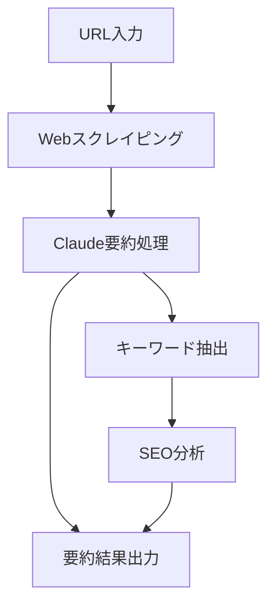

# Dify完全マスターガイド 🤖
## ノーコードでAI開発の世界へ
**バイブコーディング特別特典**

---

# 📋 アジェンダ
1. **Difyとは何か？**
2. **環境セットアップ**
3. **基本機能の使い方**
4. **実践ワークフロー作成**
5. **Claude API連携**
6. **デプロイ＆運用**

---

# 1. Difyとは何か？ 🎯

## Difyの特徴
- **ノーコード** AI開発プラットフォーム
- **LLM統合** ChatGPT、Claude、Gemini対応
- **ワークフロー** 視覚的にAI処理を設計
- **API化** 作ったアプリを簡単にAPI化

---

# 従来の開発 vs Dify開発

| 従来の開発 | Dify開発 |
|-----------|----------|
| 🔧 コーディング必須 | 🎨 ドラッグ&ドロップ |
| ⏰ 開発期間：数週間 | ⚡ 開発期間：数時間 |
| 💰 高コスト | 💡 低コスト |
| 🔨 複雑な保守 | 🎯 簡単メンテナンス |

---

# 2. 環境セットアップ 🚀

## 必要なもの
1. **Webブラウザ**（Chrome推奨）
2. **API キー**
	- OpenAI API Key
	- Claude API Key（推奨）
3. **Difyアカウント**

---

# セットアップ手順

## Step 1: Difyアカウント作成
```javascript
1. https://cloud.dify.ai にアクセス
2. Googleアカウントで簡単登録
3. ワークスペース作成
```

## Step 2: API キー設定
```javascript
1. Settings → Model Provider
2. Claude API キーを入力
3. テスト接続を実行
```

---

# 3. 基本機能の使い方 📚

## Difyの3つのモード
1. **Chatbot** - 会話型AI
2. **Text Generator** - テキスト生成
3. **Agent** - 自動実行エージェント

---

# Chatbot作成実践

## 基本設定
```yaml
名前: カスタマーサポートBot
説明: 商品問い合わせに回答するAI
モデル: Claude-3.5-Sonnet
温度: 0.7
最大トークン: 2000
```

---

# プロンプト設計のコツ

## 効果的なプロンプト構造
```javascript
あなたは{役割}です。

【制約条件】
- {制約1}
- {制約2}
- {制約3}

【出力形式】
{具体的な出力形式を指定}

【例】
入力: {例の入力}
出力: {例の出力}
```

---

# 4. 実践ワークフロー作成 ⚡

## ワークフローの基本要素
- **入力ノード**: ユーザー入力
- **LLMノード**: AI処理
- **条件分岐**: if/else処理
- **出力ノード**: 結果表示

---

# 実例：記事要約ワークフロー



---

# ワークフロー作成手順

## Step 1: 新しいワークフロー作成
1. "Create Workflow" をクリック
2. テンプレートまたは空白から選択
3. ワークフロー名を設定

## Step 2: ノード配置
- 左パネルからノードをドラッグ
- ノード間を線で接続
- 各ノードの設定を調整

---

# 5. Claude API連携 🔗

## Claude API の特徴
- **高精度な理解力**
- **長いコンテキスト対応**
- **安全性重視**
- **日本語処理性能**

---

# Claude設定のベストプラクティス

## 推奨設定値
```yaml
Model: claude-3-5-sonnet-20241022
Temperature: 0.3  # 一貫性重視
Max Tokens: 4000  # 十分な出力長
Top P: 0.9        # バランス型
```

---

# システムプロンプトの最適化

## 効果的なシステムプロンプト例
```javascript
あなたは日本語を母国語とする優秀なAIアシスタントです。

【あなたの特徴】
- 正確で簡潔な回答を提供
- ユーザーの意図を的確に理解
- 建設的で実用的なアドバイス

【出力ルール】
1. 明確で分かりやすい表現を使用
2. 必要に応じて具体例を提示
3. 不明な点は質問で返答
```

---

# 6. デプロイ＆運用 🚀

## デプロイオプション
1. **Webアプリ**: 即座に公開URL取得
2. **API**: REST API経由でアクセス
3. **埋め込み**: iframeでサイト統合
4. **Slack/Discord**: ボット連携

---

# 運用監視のポイント

## 重要なメトリクス
- **レスポンス時間**
- **エラー率**
- **API使用量**
- **ユーザー満足度**

---

# トラブルシューティング 🔧

## よくある問題と解決法

| 問題 | 原因 | 解決法 |
|------|------|--------|
| レスポンス遅延 | 複雑なワークフロー | ノード数を最適化 |
| API制限エラー | 使用量超過 | レート制限を設定 |
| 精度低下 | プロンプト不適切 | プロンプトを見直し |

---

# 実践課題 📝

## チャレンジ1: FAQ Bot
顧客からの質問に自動回答するボットを作成

## チャレンジ2: コンテンツ生成器
ブログ記事のアイデアから本文まで生成

## チャレンジ3: データ分析アシスタント
CSVデータを分析してレポート生成

---

# まとめ ✨

## Difyで実現できること
- **ノーコードAI開発**
- **複雑なワークフロー自動化**
- **企業レベルのAIアプリ**
- **継続的な改善と運用**

## 次のステップ
1. 実際にDifyでアプリを作成
2. Claude APIキーを取得
3. 実務で活用可能な用途を検討

---

# 🎁 特典情報

この特典は **バイブコーディングスクール** の
受講生限定コンテンツです。

**さらに詳しく学びたい方は**
- Discord コミュニティ参加
- 個別コンサルティング
- 実践ハンズオンセミナー

[**wadoyuniko.com**](http://wadoyuniko.com) **で詳細確認** 🚀

---

# Q&A タイム 💬

ご質問をお気軽にどうぞ！

**連絡先**
- Discord: wadoyuniko開発ch
- Twitter: @nakaikento
- Email: support@wadoyuniko.com

**Thank you!** 🙏