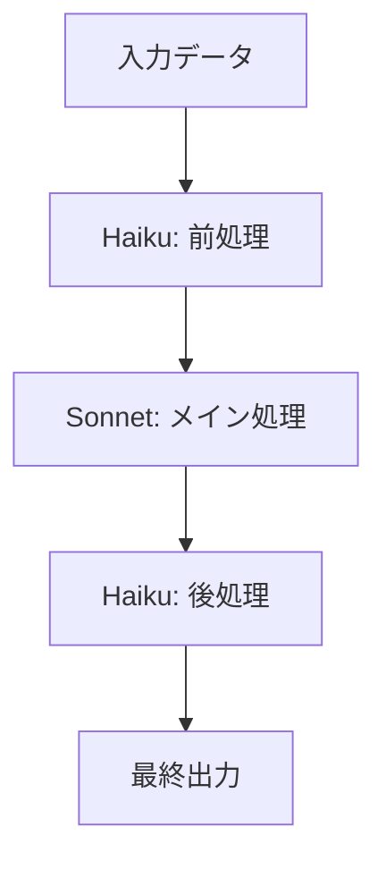
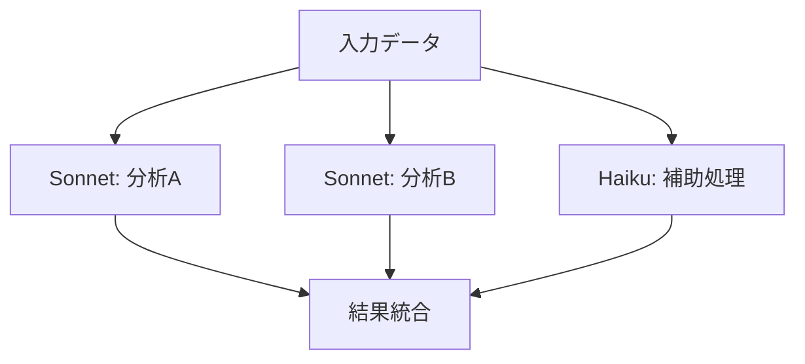
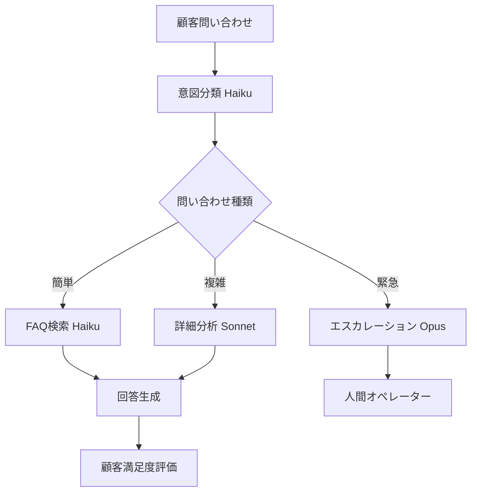
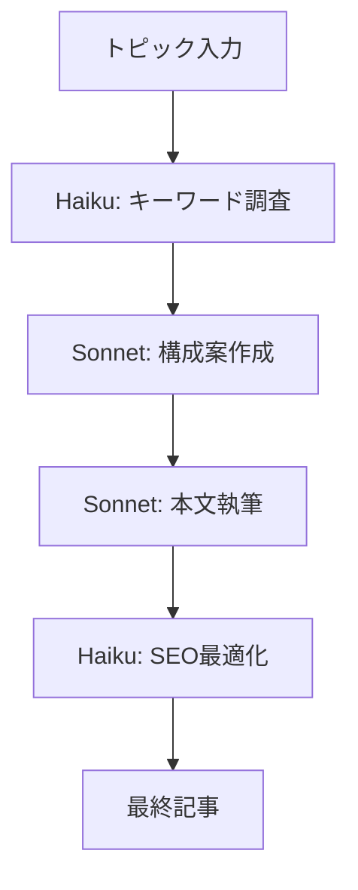

# Claude × Dify連携術 🔗
## 最強AIコンビの活用法
**バイブコーディング特別特典**

---

## 🎯 なぜ Claude × Dify なのか？

### Claudeの強み
- **高精度な理解力**: 複雑な文脈も正確に把握
- **長文対応**: 大量のテキスト処理が可能
- **安全性**: ハルシネーションが少ない
- **日本語性能**: ネイティブレベルの日本語処理

### Difyの強み
- **視覚的開発**: ノーコードでワークフロー構築
- **柔軟な連携**: 複数のLLMやAPIを組み合わせ
- **スケーラブル**: 企業レベルの運用に対応
- **コスト効率**: 使用量ベースの最適化

---

## 🚀 基本連携セットアップ

### Step 1: Claude API キー取得

1. [Anthropic Console](https://console.anthropic.com) にアクセス
2. アカウント作成とAPI キー生成
3. 使用量制限と課金設定の確認

```bash
# API キーの形式例
CLAUDE_API_KEY="sk-ant-api03-xxxxx..."
```

### Step 2: Difyでの設定

1. **Settings** → **Model Provider** に移動
2. **Anthropic** を選択
3. API キーを入力して接続テスト
4. 利用可能モデルの確認

---

## 📊 Claude モデル比較

| モデル | 用途 | コンテキスト | コスト | 推奨場面 |
|--------|------|--------------|--------|----------|
| Claude-3.5-Sonnet | 汎用・高品質 | 200K tokens | 高 | 重要なタスク |
| Claude-3.5-Haiku | 高速処理 | 200K tokens | 低 | 大量処理 |
| Claude-3-Opus | 最高品質 | 200K tokens | 最高 | 最重要タスク |

---

## 💡 実践連携パターン

### パターン1: 段階的処理



**適用例**: 大量文書の要約 → 詳細分析 → レポート整理

### パターン2: 並列処理



**適用例**: 多角的な市場分析レポート生成

---

## 🎨 高度な連携テクニック

### 1. コンテキスト継承設計

```python
# ワークフロー設計例
workflow = {
    "step1": {
        "model": "claude-3.5-haiku",
        "task": "文書分類",
        "context": "{{input}}",
        "output": "{{classification}}"
    },
    "step2": {
        "model": "claude-3.5-sonnet", 
        "task": "詳細分析",
        "context": "{{input}} + {{classification}}",
        "output": "{{analysis}}"
    }
}
```

### 2. 動的モデル選択

```yaml
条件分岐設定:
  文字数 < 1000: claude-3.5-haiku
  文字数 < 5000: claude-3.5-sonnet  
  文字数 >= 5000: claude-3-opus
  
緊急度による選択:
  低: haiku (コスト重視)
  中: sonnet (バランス)
  高: opus (品質最優先)
```

---

## 🛠️ 実践プロジェクト：智能客服系统

### プロジェクト概要
Claude + Difyで構築する次世代カスタマーサポート

### アーキテクチャ



### 実装ステップ

#### Step 1: 意図分類システム

```yaml
Model: claude-3.5-haiku
System Prompt: |
  あなたは顧客問い合わせの分類専門AIです。
  
  【分類カテゴリー】
  1. FAQ (よくある質問)
  2. TECHNICAL (技術的問題) 
  3. BILLING (請求関連)
  4. COMPLAINT (苦情)
  5. OTHER (その他)
  
  【緊急度】
  - LOW: 一般的な問い合わせ
  - MEDIUM: 具体的な問題解決が必要
  - HIGH: 緊急対応が必要
  
  出力形式: {"category": "FAQ", "urgency": "LOW", "confidence": 0.95}
```

#### Step 2: FAQ自動回答

```yaml
Model: claude-3.5-haiku
System Prompt: |
  FAQナレッジベースから最適な回答を生成してください。
  
  【回答ルール】
  - 簡潔で分かりやすい表現
  - 具体的な手順を含む
  - 関連情報へのリンク提供
  - 解決しない場合の次のステップ明示
```

#### Step 3: 複雑問題解決

```yaml
Model: claude-3.5-sonnet
System Prompt: |
  あなたは経験豊富なカスタマーサポートです。
  
  【対応方針】
  1. 問題の詳細な分析
  2. 複数の解決案提示
  3. 手順の詳細説明
  4. 予想される結果の説明
  5. フォローアップの提案
```

---

## 📊 パフォーマンス最適化

### 1. トークン数最適化

```python
# 入力テキストの前処理
def optimize_input(text):
    # 不要な空白・改行削除
    cleaned = re.sub(r'\s+', ' ', text.strip())
    
    # 重要部分の抽出
    if len(cleaned) > 4000:
        # 要約処理でコンテキスト圧縮
        cleaned = summarize_text(cleaned)
    
    return cleaned
```

### 2. レスポンス時間改善

```yaml
高速化テクニック:
  - 並列処理: 独立タスクの同時実行
  - キャッシュ: 類似クエリの結果保存
  - ストリーミング: リアルタイム出力
  - 先読み: 予想される次のステップを準備
```

### 3. コスト最適化

```yaml
コスト削減戦略:
  - モデル選択: タスクに応じた適切なモデル使用
  - バッチ処理: 複数リクエストの一括処理
  - フィルタリング: 不要なAPIコール削減
  - 監視: 使用量の継続的モニタリング
```

---

## 🔍 実用事例集

### 1. コンテンツ制作パイプライン



**実装ポイント**:
- 各段階で専門特化したプロンプト設計
- 前段階の出力を次段階の入力として効率的に連携
- 品質確保とコスト最適化のバランス

### 2. 多言語翻訳システム

```yaml
翻訳ワークフロー:
  Step1: 言語検出 (Haiku)
  Step2: 文脈理解 (Sonnet) 
  Step3: 翻訳実行 (Sonnet)
  Step4: 品質チェック (Haiku)
  Step5: 最終調整 (Sonnet)
```

### 3. データ分析レポーター

```python
分析パイプライン = {
    "データ前処理": "haiku",  # 高速処理
    "統計分析": "sonnet",     # 正確性重視
    "可視化提案": "haiku",    # 効率重視
    "レポート作成": "sonnet", # 品質重視
    "要約生成": "haiku"       # コスト効率
}
```

---

## 🚨 トラブルシューティング

### よくある問題と解決法

| 問題 | 原因 | 解決法 |
|------|------|--------|
| レスポンス遅延 | 大量コンテキスト | 前処理で要約・分割 |
| コスト超過 | 不適切なモデル選択 | 使用量監視＋モデル最適化 |
| 品質低下 | プロンプト設計不良 | A/Bテストでプロンプト改善 |
| API制限エラー | レート制限超過 | バッチ処理＋リトライ機能 |

### デバッグのコツ

```python
# ログ出力例
def debug_workflow(step_name, input_data, output_data):
    log_entry = {
        "timestamp": datetime.now(),
        "step": step_name,
        "input_size": len(str(input_data)),
        "output_size": len(str(output_data)),
        "model_used": get_current_model(),
        "tokens_consumed": calculate_tokens(),
        "execution_time": measure_time()
    }
    logger.info(json.dumps(log_entry))
```

---

## 📊 運用監視ダッシュボード

### 重要指標

```yaml
技術指標:
  - レスポンス時間 (目標: <3秒)
  - エラー率 (目標: <1%)
  - 可用性 (目標: >99.9%)

ビジネス指標:
  - 顧客満足度 (目標: >4.5/5)
  - 自動解決率 (目標: >80%)
  - コスト効率 (目標: 月額予算内)

品質指標:
  - 回答精度 (目標: >95%)
  - 一貫性スコア (目標: >90%)
  - ハルシネーション率 (目標: <2%)
```

### アラート設定

```python
# 監視アラート例
alerts = {
    "high_error_rate": {
        "condition": "error_rate > 5%",
        "action": "scale_down_and_notify"
    },
    "cost_overrun": {
        "condition": "daily_cost > budget * 1.2", 
        "action": "pause_non_critical_flows"
    },
    "low_satisfaction": {
        "condition": "satisfaction < 4.0",
        "action": "trigger_quality_review"
    }
}
```

---

## 🎓 学習ロードマップ

### 初級レベル (1-2週間)
- [ ] Claude API基本操作
- [ ] Dify基本ワークフロー作成
- [ ] シンプルな連携実装

### 中級レベル (3-4週間)
- [ ] 複雑なワークフロー設計
- [ ] パフォーマンス最適化
- [ ] エラーハンドリング実装

### 上級レベル (5-8週間)
- [ ] 大規模システム設計
- [ ] 高度な最適化技法
- [ ] 独自カスタマイズ開発

---

## 🎁 特典コンテンツ

### バイブコーディング受講生限定

1. **実装済みワークフローテンプレート**: 20種類
2. **詳細設定ガイド**: 各モデルの最適設定集
3. **トラブルシューティング動画**: 実際の問題解決過程
4. **コミュニティアクセス**: 他の受講生との情報共有
5. **個別コンサルティング**: 月1回の質疑応答セッション

### さらなる学習リソース

- 📚 Claude公式ドキュメント完全ガイド
- 🎬 Dify実践動画シリーズ
- 💻 サンプルコード集 (Python/JavaScript)
- 📊 性能ベンチマーク データベース

[**wadoyuniko.com**](https://wadoyuniko.com) **で今すぐ始める** 🚀

---

**Created for wadoyuniko Vibe Coding Launch Project**
*Claude × Dify Integration Guide v1.0*