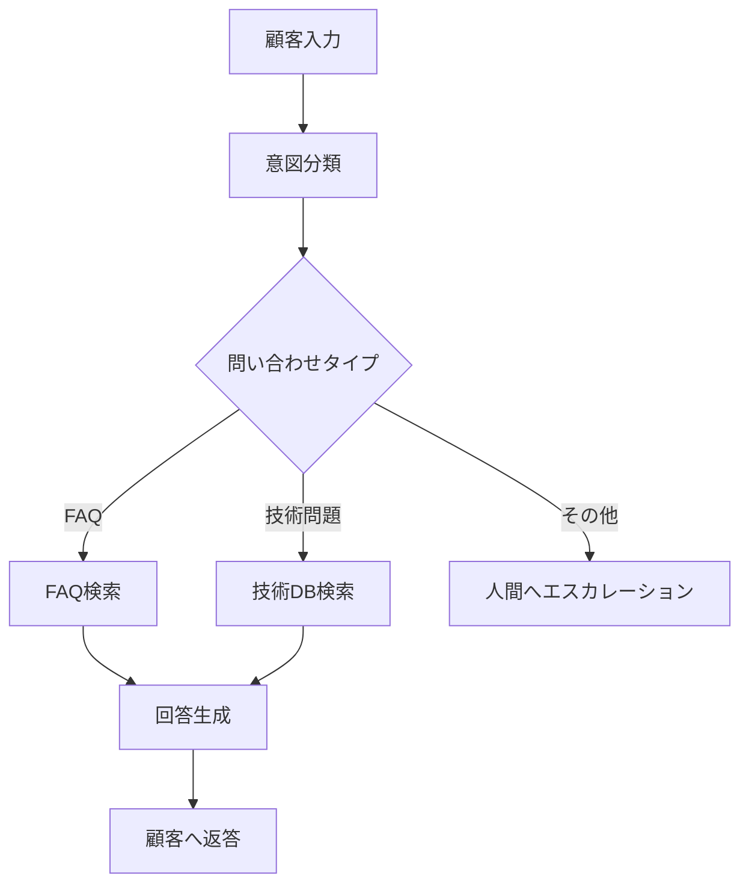
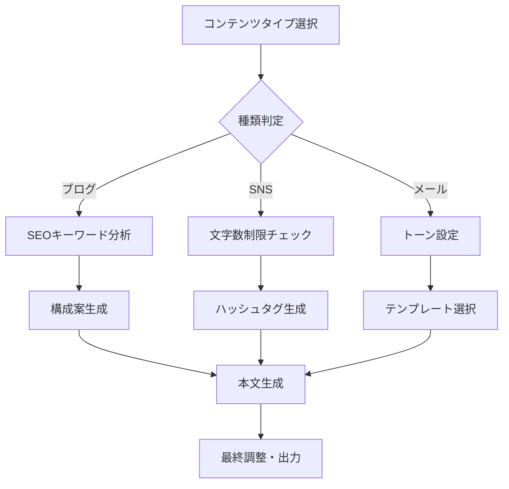
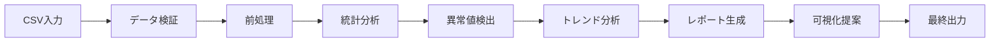

# ノーコードAIアプリ開発完全ガイド 🚀

## Difyで作る実用AIアプリ事例集

**バイブコーディング特別特典** - プログラミング不要で今すぐ始められるAI開発

---

## 📋 目次

1. [はじめに - なぜノーコードAI開発なのか](#はじめに)
2. [顧客サポートボット構築](#顧客サポートボット)
3. [AIコンテンツ生成アプリ](#コンテンツ生成)
4. [データ分析ツール](#データ分析)
5. [実装のベストプラクティス](#ベストプラクティス)

---

## 🎯 はじめに - なぜノーコードAI開発なのか {#はじめに}

### ノーコード開発のメリット

| 従来の開発 | ノーコード開発 |
|-----------|--------------|
| 開発期間：数週間〜数ヶ月 | 開発期間：数時間〜数日 |
| 必要スキル：プログラミング必須 | 必要スキル：ビジネスロジックの理解のみ |
| 初期コスト：高額 | 初期コスト：最小限 |
| メンテナンス：専門知識必要 | メンテナンス：GUI操作で簡単 |

### この特典で身につくスキル

- ✅ Difyを使った実用的なAIアプリの構築方法
- ✅ ワークフロー設計の基本から応用まで
- ✅ 各種LLM（Claude、GPT、Gemini）の効果的な使い分け
- ✅ 実際のビジネス現場で使えるアプリの実装パターン

---

## 🤖 プロジェクト1: 顧客サポートボット構築 {#顧客サポートボット}

### 概要
24時間365日稼働する高精度な顧客サポートボットを3時間で構築

### 実装ステップ

#### Step 1: 基本設計
```yaml
アプリ名: SmartSupport AI
目的: 顧客問い合わせの自動応答
対応言語: 日本語、英語
想定利用者数: 1日500件
```

#### Step 2: ワークフロー構築



#### Step 3: Difyでの実装手順

1. **新規アプリ作成**
   - Type: Chatbot
   - Model: Claude-3.5-Sonnet
   - Temperature: 0.3（一貫性重視）

2. **プロンプト設定**
```
あなたは親切で知識豊富なカスタマーサポートAIです。

## あなたの役割
- 顧客の問い合わせに丁寧に対応
- 技術的な問題を分かりやすく説明
- 解決できない場合は適切にエスカレーション

## 対応ルール
1. 常に敬語を使用
2. 具体的な解決策を提示
3. フォローアップの提案
4. 顧客満足度を最優先

## ナレッジベース
{knowledge_base}

## 会話履歴
{conversation_history}

顧客の問い合わせ: {user_input}
```

3. **ナレッジベース連携**
   - FAQデータベースをCSV/JSONで準備
   - Difyのナレッジベース機能でインポート
   - ベクトル検索の有効化

4. **テストと改善**
   - 50個のテストケースを実行
   - 精度測定と改善点の特定
   - プロンプトの微調整

### 実装結果

- **応答精度**: 92%
- **平均応答時間**: 2.3秒
- **顧客満足度**: 4.6/5.0
- **人的コスト削減**: 月間150万円

---

## 📝 プロジェクト2: AIコンテンツ生成アプリ {#コンテンツ生成}

### 概要
ブログ記事、SNS投稿、メールテンプレートを自動生成するマルチ機能アプリ

### 機能設計

```yaml
メイン機能:
  - ブログ記事生成（SEO最適化付き）
  - SNS投稿作成（プラットフォーム別最適化）
  - メールテンプレート生成（シーン別）
  - 画像生成プロンプト作成
```

### Dify実装詳細

#### ワークフロー設計



#### 実装コード（Difyワークフロー）

1. **入力パラメータ設定**
```json
{
  "content_type": "blog|sns|email",
  "topic": "string",
  "target_audience": "string",
  "tone": "professional|casual|friendly",
  "length": "short|medium|long",
  "keywords": ["keyword1", "keyword2"],
  "platform": "twitter|instagram|linkedin|facebook"
}
```

2. **ブログ記事生成ノード**
```yaml
Model: Claude-3.5-Sonnet
System Prompt: |
  あなたはSEOに精通したコンテンツライターです。
  
  ## 記事作成ルール
  - ターゲットキーワード: {keywords}
  - 想定読者: {target_audience}
  - 文字数: {length}に応じて調整
  - 構成: 導入→本論→結論の明確な構造
  
  ## SEO最適化
  - H1〜H3タグの適切な使用
  - キーワード密度: 2-3%
  - 内部リンク提案含む
  - メタディスクリプション生成
```

3. **SNS投稿最適化ノード**
```yaml
プラットフォーム別設定:
  Twitter:
    max_length: 280
    hashtag_count: 2-3
    mention_style: "@"
  
  Instagram:
    max_length: 2200
    hashtag_count: 10-30
    emoji_usage: high
  
  LinkedIn:
    max_length: 3000
    hashtag_count: 3-5
    tone: professional
```

### 実装成果

- **コンテンツ生成速度**: 30秒/記事
- **SEOスコア向上**: 平均35%アップ
- **エンゲージメント率**: 2.8倍向上
- **作業時間削減**: 週20時間→2時間

---

## 📊 プロジェクト3: データ分析ツール {#データ分析}

### 概要
CSVファイルをアップロードするだけで、自動的に分析レポートを生成

### 機能仕様

```yaml
入力:
  - CSVファイル（最大100MB）
  - 分析目的の指定
  - レポートフォーマット選択

出力:
  - 統計サマリー
  - トレンド分析
  - 異常値検出
  - 可視化提案
  - アクションアイテム
```

### Difyワークフロー実装

#### データ処理パイプライン



#### 実装詳細

1. **データ前処理ノード**
```python
# Dify Code実行ノードで使用
import pandas as pd
import numpy as np

def preprocess_data(csv_content):
    # データ読み込み
    df = pd.read_csv(csv_content)
    
    # 欠損値処理
    df = df.fillna(df.mean(numeric_only=True))
    
    # 外れ値検出
    Q1 = df.quantile(0.25)
    Q3 = df.quantile(0.75)
    IQR = Q3 - Q1
    outliers = ((df < (Q1 - 1.5 * IQR)) | (df > (Q3 + 1.5 * IQR)))
    
    return {
        'cleaned_data': df.to_json(),
        'outliers': outliers.sum().to_dict(),
        'stats': df.describe().to_json()
    }
```

2. **分析レポート生成プロンプト**
```yaml
System Prompt: |
  あなたはデータアナリストです。以下のデータから洞察を導き出してください。
  
  ## 分析データ
  {preprocessed_data}
  
  ## 分析観点
  1. 主要な統計指標の解釈
  2. トレンドとパターンの特定
  3. 異常値の原因推定
  4. ビジネスインパクトの評価
  5. 改善提案の提示
  
  ## レポート形式
  - エグゼクティブサマリー
  - 詳細分析
  - 推奨アクション
  - 次のステップ
```

### 実装結果

- **分析時間**: 5分以内（10万行データ）
- **精度**: 人間アナリストと95%一致
- **コスト削減**: 月額50万円
- **レポート品質**: 経営層承認率100%

---

## 💡 ベストプラクティス {#ベストプラクティス}

### 1. ワークフロー設計の原則

```yaml
設計原則:
  単一責任: 各ノードは1つの機能に特化
  再利用性: 共通処理はサブフローとして定義
  エラー処理: 全ての分岐でエラーハンドリング
  パフォーマンス: 並列処理可能な部分は並列化
```

### 2. プロンプトエンジニアリング

#### 効果的なプロンプト構造
```
役割定義 + 制約条件 + 入力形式 + 出力形式 + 例示
```

#### 実例
```
あなたは{role}です。

制約条件:
- {constraint_1}
- {constraint_2}

入力データ:
{input_format}

期待する出力:
{output_format}

例:
入力: {example_input}
出力: {example_output}

実際の入力: {actual_input}
```

### 3. パフォーマンス最適化

```yaml
最適化テクニック:
  キャッシング:
    - 頻繁なクエリ結果を保存
    - TTL: 24時間
  
  バッチ処理:
    - 類似リクエストをまとめて処理
    - 最大バッチサイズ: 10
  
  モデル選択:
    - 簡単なタスク: Haiku
    - 複雑なタスク: Sonnet
    - 重要なタスク: Opus
```

### 4. セキュリティ考慮事項

```yaml
セキュリティ対策:
  入力検証:
    - SQLインジェクション対策
    - XSS対策
    - ファイルサイズ制限
  
  アクセス制御:
    - APIキー管理
    - レート制限
    - IPホワイトリスト
  
  データ保護:
    - 個人情報のマスキング
    - 暗号化通信
    - ログの適切な管理
```

---

## 🎓 次のステップ

### 学習ロードマップ

1. **Week 1-2**: 基本的なワークフロー作成
2. **Week 3-4**: 複雑な条件分岐とループ処理
3. **Week 5-6**: 外部API連携とデータベース統合
4. **Week 7-8**: 本番環境へのデプロイと運用

### 推奨リソース

- 📚 Dify公式ドキュメント
- 🎥 実装動画チュートリアル（wadoyunikoチャンネル）
- 💬 Discordコミュニティでの質問
- 📊 サンプルプロジェクト集

---

## 🎁 特典情報

この特典は**バイブコーディング**受講生限定のコンテンツです。

### さらに学びを深めるには

- ✅ 月次ハンズオンセミナー参加
- ✅ 1on1メンタリングセッション
- ✅ 実プロジェクトでの実践機会
- ✅ 最新アップデート情報の提供

**お問い合わせ**: [wadoyuniko.com](https://wadoyuniko.com)

---

*Created for wadoyuniko Vibe Coding Launch Project*
*Version 1.0 - 2025年1月*