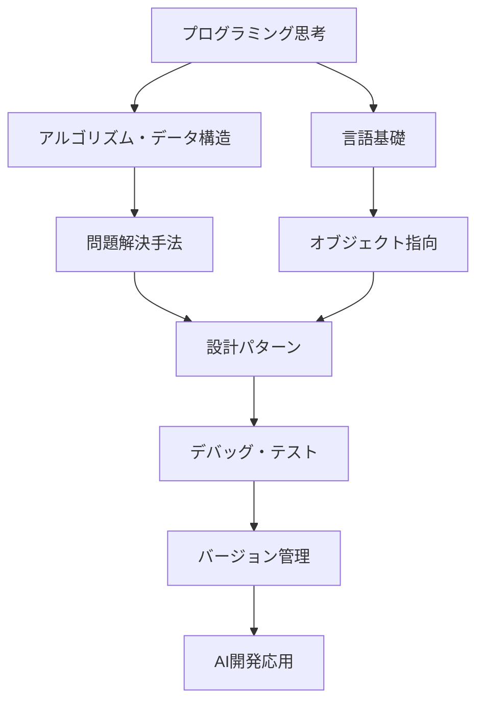

# AI時代のプログラミング基礎完全マスターガイド 💻
## バイブコーディングの土台となる必須スキル
**専門講座・教材特典**

---

## 🎯 なぜプログラミング基礎が重要なのか？

### AI開発における基礎の重要性
- **効率的なAI活用**: 基礎があることで10倍速い開発
- **デバッグ能力**: 問題の根本原因を特定できる
- **コードの品質**: 保守性・拡張性の高いシステム構築
- **チームでの協働**: 他の開発者との円滑なコミュニケーション

### バイブコーディングとプログラミング基礎
```javascript
従来の学習 → バイブコーディング
- 暗記中心 → 理解・応用重視  
- 一方向学習 → インタラクティブ学習
- 理論偏重 → 実践・体感重視
- 孤独な学習 → コミュニティ学習
```

---

## 📚 プログラミング基礎スキルマップ

### 必須スキル体系


### レベル別習得目標
<table header-row="true">
<tr>
<td>レベル</td>
<td>期間</td>
<td>習得スキル</td>
<td>実践プロジェクト</td>
</tr>
<tr>
<td>初級</td>
<td>1-2ヶ月</td>
<td>変数・制御構文・関数</td>
<td>計算機・タスク管理アプリ</td>
</tr>
<tr>
<td>中級</td>
<td>2-3ヶ月</td>
<td>OOP・データ構造・API</td>
<td>Webアプリ・データ分析ツール</td>
</tr>
<tr>
<td>上級</td>
<td>3-4ヶ月</td>
<td>設計パターン・アーキテクチャ</td>
<td>AIアプリ・マイクロサービス</td>
</tr>
<tr>
<td>エキスパート</td>
<td>継続</td>
<td>パフォーマンス・スケーラビリティ</td>
<td>プロダクションシステム</td>
</tr>
</table>

---

## 🧠 プログラミング思考力養成

### 論理的思考の基礎
```python
class LogicalThinking:
    def __init__(self):
        self.problem_solving_steps = [
            "問題の理解と定義",
            "要求の整理と優先順位付け", 
            "解決策の分解と構造化",
            "アルゴリズムの設計",
            "実装と検証",
            "最適化と改善"
        ]
    
    def analyze_problem(self, problem_description):
        """
        問題分析のフレームワーク
        """
        analysis = {
            'inputs': self.identify_inputs(problem_description),
            'outputs': self.identify_outputs(problem_description),
            'constraints': self.identify_constraints(problem_description),
            'edge_cases': self.identify_edge_cases(problem_description),
            'complexity': self.estimate_complexity(problem_description)
        }
        return analysis
    
    def design_solution(self, problem_analysis):
        """
        解決策設計の体系的アプローチ
        """
        solution_design = {
            'approach': self.select_approach(problem_analysis),
            'algorithm': self.design_algorithm(problem_analysis),
            'data_structures': self.select_data_structures(problem_analysis),
            'optimization': self.identify_optimization_opportunities(problem_analysis)
        }
        return solution_design
```

### 抽象化思考の訓練
```yaml
抽象化レベル:
  Level 1 - 具体的実装:
    例: "ユーザーAの年齢を表示する"
    focus: 個別のケース処理
  
  Level 2 - 一般化:
    例: "任意のユーザーの年齢を表示する"
    focus: パラメータ化・汎用化
  
  Level 3 - パターン化:
    例: "任意の属性を表示するシステム"
    focus: 共通パターンの抽出
  
  Level 4 - フレームワーク化:
    例: "柔軟なデータ表示フレームワーク"
    focus: 拡張可能な設計

思考訓練演習:
  日常の問題を段階的に抽象化:
    1. 具体的な問題を特定
    2. 類似問題を複数見つける
    3. 共通パターンを抽出
    4. 一般的な解決フレームワークを設計
    5. 実装・検証・改善
```

---

## 🐍 Python基礎完全マスター

### Python基礎文法
```python
# 1. 変数とデータ型
def demonstrate_basics():
    """Python基礎の実践例"""
    
    # 基本データ型
    age = 25                    # int
    name = "Alice"              # str
    height = 165.5              # float
    is_student = True           # bool
    grades = [85, 90, 78]       # list
    profile = {"name": "Alice", "age": 25}  # dict
    
    # 型変換とチェック
    age_str = str(age)
    print(f"型: {type(age_str)}, 値: {age_str}")
    
    # f-string (推奨される文字列フォーマット)
    message = f"{name}さんは{age}歳で、身長は{height}cmです"
    print(message)

# 2. 制御構文
def control_structures_demo():
    """制御構文の実践例"""
    
    numbers = [1, 2, 3, 4, 5, 6, 7, 8, 9, 10]
    
    # 条件分岐
    for num in numbers:
        if num % 2 == 0:
            print(f"{num}は偶数")
        elif num % 3 == 0:
            print(f"{num}は奇数で3の倍数")
        else:
            print(f"{num}は奇数")
    
    # リスト内包表記 (Pythonic!)
    even_numbers = [n for n in numbers if n % 2 == 0]
    squared_evens = [n**2 for n in numbers if n % 2 == 0]
    
    print(f"偶数: {even_numbers}")
    print(f"偶数の2乗: {squared_evens}")

# 3. 関数設計
def function_design_examples():
    """関数設計のベストプラクティス"""
    
    # シンプルな関数
    def calculate_bmi(weight: float, height: float) -> float:
        """BMI計算関数 - 型ヒント付き"""
        return weight / (height ** 2)
    
    # デフォルト引数
    def greet(name: str, greeting: str = "こんにちは") -> str:
        return f"{greeting}、{name}さん！"
    
    # 可変引数
    def calculate_average(*numbers: float) -> float:
        """任意の数の引数の平均を計算"""
        if not numbers:
            return 0.0
        return sum(numbers) / len(numbers)
    
    # キーワード引数
    def create_user_profile(**kwargs) -> dict:
        """ユーザープロフィール作成"""
        default_profile = {
            "name": "Unknown",
            "age": 0,
            "occupation": "Not specified"
        }
        default_profile.update(kwargs)
        return default_profile
    
    # 実行例
    bmi = calculate_bmi(70, 1.75)
    greeting1 = greet("太郎")
    greeting2 = greet("花子", "おはよう")
    avg = calculate_average(85, 90, 78, 92)
    profile = create_user_profile(name="佐藤", age=28, city="東京")
    
    print(f"BMI: {bmi:.2f}")
    print(greeting1)
    print(greeting2)
    print(f"平均点: {avg}")
    print(f"プロフィール: {profile}")
```

### エラーハンドリングとデバッグ
```python
import logging
from typing import Optional, Union

# ログ設定
logging.basicConfig(level=logging.INFO, format='%(asctime)s - %(levelname)s - %(message)s')
logger = logging.getLogger(__name__)

class DataProcessor:
    """データ処理クラス - エラーハンドリングの例"""
    
    def __init__(self):
        self.data = []
    
    def load_data(self, file_path: str) -> bool:
        """データ読み込み - 安全な実装"""
        try:
            with open(file_path, 'r', encoding='utf-8') as file:
                self.data = [line.strip() for line in file.readlines()]
            logger.info(f"データ読み込み成功: {len(self.data)}行")
            return True
            
        except FileNotFoundError:
            logger.error(f"ファイルが見つかりません: {file_path}")
            return False
        except PermissionError:
            logger.error(f"ファイルの読み込み権限がありません: {file_path}")
            return False
        except UnicodeDecodeError:
            logger.error(f"文字エンコーディングエラー: {file_path}")
            return False
        except Exception as e:
            logger.error(f"予期しないエラー: {e}")
            return False
    
    def process_number(self, value: str) -> Optional[float]:
        """数値変換 - 安全な型変換"""
        try:
            # 数値変換を試行
            if '.' in value:
                return float(value)
            else:
                return int(value)
        except ValueError:
            logger.warning(f"数値変換できません: {value}")
            return None
    
    def calculate_statistics(self) -> dict:
        """統計計算 - 堅牢な実装"""
        if not self.data:
            raise ValueError("データが空です")
        
        numbers = []
        for item in self.data:
            num = self.process_number(item)
            if num is not None:
                numbers.append(num)
        
        if not numbers:
            raise ValueError("有効な数値データがありません")
        
        return {
            'count': len(numbers),
            'sum': sum(numbers),
            'average': sum(numbers) / len(numbers),
            'min': min(numbers),
            'max': max(numbers)
        }

# デバッグ技法の例
def debug_example():
    """デバッグ技法のデモンストレーション"""
    
    # 1. print文デバッグ (基本)
    def problematic_function(x, y):
        print(f"Debug: x={x}, y={y}")  # デバッグ出力
        result = x / y
        print(f"Debug: result={result}")  # 計算結果確認
        return result
    
    # 2. assert文によるテスト
    def safe_divide(x, y):
        assert y != 0, "ゼロ除算エラー"
        assert isinstance(x, (int, float)), "xは数値である必要があります"
        assert isinstance(y, (int, float)), "yは数値である必要があります"
        return x / y
    
    # 3. ログによるデバッグ
    def logged_function(data):
        logger.debug(f"関数開始: data={data}")
        
        processed_data = []
        for i, item in enumerate(data):
            logger.debug(f"処理中: index={i}, item={item}")
            processed_data.append(item * 2)
        
        logger.debug(f"関数終了: result={processed_data}")
        return processed_data
    
    # 実行例
    try:
        result1 = problematic_function(10, 2)
        result2 = safe_divide(10, 2)
        result3 = logged_function([1, 2, 3, 4, 5])
        
        print(f"結果1: {result1}")
        print(f"結果2: {result2}")
        print(f"結果3: {result3}")
        
    except Exception as e:
        logger.error(f"エラーが発生しました: {e}")
```

---

## 📊 アルゴリズムとデータ構造

### 基本データ構造の実装
```python
from typing import List, Optional, Any
from collections import deque

class DataStructures:
    """基本データ構造の実装例"""
    
    # 1. スタック (LIFO: Last In, First Out)
    class Stack:
        def __init__(self):
            self._items = []
        
        def push(self, item: Any) -> None:
            """要素をスタックに追加"""
            self._items.append(item)
        
        def pop(self) -> Any:
            """スタックから要素を取り出し"""
            if self.is_empty():
                raise IndexError("スタックが空です")
            return self._items.pop()
        
        def peek(self) -> Any:
            """先頭要素を確認（取り出さない）"""
            if self.is_empty():
                raise IndexError("スタックが空です")
            return self._items[-1]
        
        def is_empty(self) -> bool:
            return len(self._items) == 0
        
        def size(self) -> int:
            return len(self._items)
    
    # 2. キュー (FIFO: First In, First Out)
    class Queue:
        def __init__(self):
            self._items = deque()
        
        def enqueue(self, item: Any) -> None:
            """要素をキューに追加"""
            self._items.append(item)
        
        def dequeue(self) -> Any:
            """キューから要素を取り出し"""
            if self.is_empty():
                raise IndexError("キューが空です")
            return self._items.popleft()
        
        def front(self) -> Any:
            """先頭要素を確認"""
            if self.is_empty():
                raise IndexError("キューが空です")
            return self._items[0]
        
        def is_empty(self) -> bool:
            return len(self._items) == 0
        
        def size(self) -> int:
            return len(self._items)
    
    # 3. 連結リスト
    class ListNode:
        def __init__(self, val: Any = 0, next_node: Optional['ListNode'] = None):
            self.val = val
            self.next = next_node
    
    class LinkedList:
        def __init__(self):
            self.head: Optional[DataStructures.ListNode] = None
            self._size = 0
        
        def append(self, val: Any) -> None:
            """末尾に要素を追加"""
            new_node = DataStructures.ListNode(val)
            if not self.head:
                self.head = new_node
            else:
                current = self.head
                while current.next:
                    current = current.next
                current.next = new_node
            self._size += 1
        
        def prepend(self, val: Any) -> None:
            """先頭に要素を追加"""
            new_node = DataStructures.ListNode(val, self.head)
            self.head = new_node
            self._size += 1
        
        def delete(self, val: Any) -> bool:
            """指定された値の要素を削除"""
            if not self.head:
                return False
            
            if self.head.val == val:
                self.head = self.head.next
                self._size -= 1
                return True
            
            current = self.head
            while current.next:
                if current.next.val == val:
                    current.next = current.next.next
                    self._size -= 1
                    return True
                current = current.next
            return False
        
        def find(self, val: Any) -> bool:
            """要素の存在確認"""
            current = self.head
            while current:
                if current.val == val:
                    return True
                current = current.next
            return False
        
        def to_list(self) -> List[Any]:
            """リストに変換"""
            result = []
            current = self.head
            while current:
                result.append(current.val)
                current = current.next
            return result
        
        def size(self) -> int:
            return self._size

# 実用例
def data_structure_demo():
    """データ構造の使用例"""
    
    # スタックの使用例（括弧の対応チェック）
    def check_balanced_parentheses(expression: str) -> bool:
        stack = DataStructures.Stack()
        pairs = {'(': ')', '[': ']', '{': '}'}
        
        for char in expression:
            if char in pairs:  # 開き括弧
                stack.push(char)
            elif char in pairs.values():  # 閉じ括弧
                if stack.is_empty():
                    return False
                if pairs[stack.pop()] != char:
                    return False
        
        return stack.is_empty()
    
    # キューの使用例（幅優先探索）
    def bfs_example(graph: dict, start: str) -> List[str]:
        """グラフの幅優先探索"""
        visited = set()
        queue = DataStructures.Queue()
        result = []
        
        queue.enqueue(start)
        visited.add(start)
        
        while not queue.is_empty():
            node = queue.dequeue()
            result.append(node)
            
            for neighbor in graph.get(node, []):
                if neighbor not in visited:
                    visited.add(neighbor)
                    queue.enqueue(neighbor)
        
        return result
    
    # 連結リストの使用例
    def linked_list_demo():
        ll = DataStructures.LinkedList()
        
        # 要素追加
        for i in range(1, 6):
            ll.append(i)
        
        print(f"連結リスト: {ll.to_list()}")
        
        # 要素削除
        ll.delete(3)
        print(f"3削除後: {ll.to_list()}")
        
        # 要素検索
        print(f"4は存在する? {ll.find(4)}")
        print(f"10は存在する? {ll.find(10)}")
    
    # 実行例
    print("括弧チェック:")
    print(f"'(())' -> {check_balanced_parentheses('(())')}")
    print(f"'([)]' -> {check_balanced_parentheses('([)]')}")
    
    print("\n幅優先探索:")
    graph = {
        'A': ['B', 'C'],
        'B': ['D', 'E'],
        'C': ['F'],
        'D': [],
        'E': ['F'],
        'F': []
    }
    bfs_result = bfs_example(graph, 'A')
    print(f"BFS結果: {bfs_result}")
    
    print("\n連結リスト:")
    linked_list_demo()
```

### 重要アルゴリズム実装
```python
from typing import List, Tuple
import time
import random

class Algorithms:
    """重要アルゴリズムの実装"""
    
    # 1. ソートアルゴリズム
    @staticmethod
    def bubble_sort(arr: List[int]) -> List[int]:
        """バブルソート - O(n²)"""
        arr = arr.copy()  # 元の配列を変更しない
        n = len(arr)
        
        for i in range(n):
            for j in range(0, n - i - 1):
                if arr[j] > arr[j + 1]:
                    arr[j], arr[j + 1] = arr[j + 1], arr[j]
        return arr
    
    @staticmethod
    def quick_sort(arr: List[int]) -> List[int]:
        """クイックソート - 平均O(n log n)"""
        if len(arr) <= 1:
            return arr
        
        pivot = arr[len(arr) // 2]
        left = [x for x in arr if x < pivot]
        middle = [x for x in arr if x == pivot]
        right = [x for x in arr if x > pivot]
        
        return Algorithms.quick_sort(left) + middle + Algorithms.quick_sort(right)
    
    @staticmethod
    def merge_sort(arr: List[int]) -> List[int]:
        """マージソート - O(n log n)"""
        if len(arr) <= 1:
            return arr
        
        mid = len(arr) // 2
        left = Algorithms.merge_sort(arr[:mid])
        right = Algorithms.merge_sort(arr[mid:])
        
        return Algorithms._merge(left, right)
    
    @staticmethod
    def _merge(left: List[int], right: List[int]) -> List[int]:
        """マージソートのマージ処理"""
        result = []
        i = j = 0
        
        while i < len(left) and j < len(right):
            if left[i] <= right[j]:
                result.append(left[i])
                i += 1
            else:
                result.append(right[j])
                j += 1
        
        result.extend(left[i:])
        result.extend(right[j:])
        return result
    
    # 2. 探索アルゴリズム
    @staticmethod
    def linear_search(arr: List[int], target: int) -> int:
        """線形探索 - O(n)"""
        for i, value in enumerate(arr):
            if value == target:
                return i
        return -1
    
    @staticmethod
    def binary_search(arr: List[int], target: int) -> int:
        """二分探索 - O(log n) ※ソート済み配列が前提"""
        left, right = 0, len(arr) - 1
        
        while left <= right:
            mid = (left + right) // 2
            
            if arr[mid] == target:
                return mid
            elif arr[mid] < target:
                left = mid + 1
            else:
                right = mid - 1
        
        return -1
    
    # 3. グラフアルゴリズム
    @staticmethod
    def dijkstra(graph: dict, start: str) -> dict:
        """ダイクストラ法 - 最短経路探索"""
        import heapq
        
        distances = {node: float('infinity') for node in graph}
        distances[start] = 0
        pq = [(0, start)]
        visited = set()
        
        while pq:
            current_distance, current_node = heapq.heappop(pq)
            
            if current_node in visited:
                continue
            
            visited.add(current_node)
            
            for neighbor, weight in graph[current_node].items():
                distance = current_distance + weight
                
                if distance < distances[neighbor]:
                    distances[neighbor] = distance
                    heapq.heappush(pq, (distance, neighbor))
        
        return distances

# パフォーマンス比較
def algorithm_performance_comparison():
    """アルゴリズムのパフォーマンス比較"""
    
    def measure_time(func, *args):
        start = time.time()
        result = func(*args)
        end = time.time()
        return result, end - start
    
    # テストデータ生成
    sizes = [100, 1000, 5000]
    
    print("ソートアルゴリズムの性能比較:")
    print("-" * 50)
    
    for size in sizes:
        # ランダムデータ生成
        data = [random.randint(1, 1000) for _ in range(size)]
        
        print(f"\nデータサイズ: {size}")
        
        # バブルソート
        _, bubble_time = measure_time(Algorithms.bubble_sort, data)
        print(f"バブルソート: {bubble_time:.4f}秒")
        
        # クイックソート
        _, quick_time = measure_time(Algorithms.quick_sort, data)
        print(f"クイックソート: {quick_time:.4f}秒")
        
        # マージソート
        _, merge_time = measure_time(Algorithms.merge_sort, data)
        print(f"マージソート: {merge_time:.4f}秒")
        
        # Pythonの内蔵ソート
        _, builtin_time = measure_time(sorted, data)
        print(f"内蔵ソート: {builtin_time:.4f}秒")
    
    print("\n探索アルゴリズムの比較:")
    print("-" * 30)
    
    # ソート済みデータで探索比較
    sorted_data = list(range(10000))
    target = 7500
    
    # 線形探索
    _, linear_time = measure_time(Algorithms.linear_search, sorted_data, target)
    print(f"線形探索: {linear_time:.6f}秒")
    
    # 二分探索
    _, binary_time = measure_time(Algorithms.binary_search, sorted_data, target)
    print(f"二分探索: {binary_time:.6f}秒")
    
    print(f"二分探索は線形探索の{linear_time/binary_time:.1f}倍高速")
```

---

## 🏗️ オブジェクト指向プログラミング

### クラス設計の基本
```python
from abc import ABC, abstractmethod
from datetime import datetime
from typing import List, Optional

# 1. 基本的なクラス設計
class BankAccount:
    """銀行口座クラス - カプセル化の例"""
    
    def __init__(self, account_number: str, owner: str, initial_balance: float = 0):
        self._account_number = account_number  # プライベート属性
        self._owner = owner
        self._balance = initial_balance
        self._transaction_history: List[dict] = []
    
    # プロパティ（getter/setter）
    @property
    def balance(self) -> float:
        """残高の取得"""
        return self._balance
    
    @property
    def account_number(self) -> str:
        """口座番号の取得"""
        return self._account_number
    
    @property
    def owner(self) -> str:
        """口座名義の取得"""
        return self._owner
    
    # メソッド
    def deposit(self, amount: float) -> bool:
        """預金"""
        if amount <= 0:
            raise ValueError("預金額は正の数である必要があります")
        
        self._balance += amount
        self._add_transaction("deposit", amount)
        return True
    
    def withdraw(self, amount: float) -> bool:
        """出金"""
        if amount <= 0:
            raise ValueError("出金額は正の数である必要があります")
        
        if amount > self._balance:
            raise ValueError("残高不足です")
        
        self._balance -= amount
        self._add_transaction("withdraw", amount)
        return True
    
    def transfer(self, target_account: 'BankAccount', amount: float) -> bool:
        """振込"""
        self.withdraw(amount)  # 自分の口座から出金
        target_account.deposit(amount)  # 相手の口座に入金
        return True
    
    def _add_transaction(self, transaction_type: str, amount: float) -> None:
        """取引履歴の追加 - プライベートメソッド"""
        transaction = {
            'type': transaction_type,
            'amount': amount,
            'timestamp': datetime.now(),
            'balance_after': self._balance
        }
        self._transaction_history.append(transaction)
    
    def get_transaction_history(self) -> List[dict]:
        """取引履歴の取得"""
        return self._transaction_history.copy()
    
    def __str__(self) -> str:
        """文字列表現"""
        return f"口座番号: {self._account_number}, 名義: {self._owner}, 残高: ¥{self._balance:,.0f}"
    
    def __repr__(self) -> str:
        """開発者向け文字列表現"""
        return f"BankAccount('{self._account_number}', '{self._owner}', {self._balance})"

# 2. 継承とポリモーフィズム
class Vehicle(ABC):
    """乗り物の抽象基底クラス"""
    
    def __init__(self, brand: str, model: str, year: int):
        self.brand = brand
        self.model = model
        self.year = year
    
    @abstractmethod
    def start_engine(self) -> str:
        """エンジン始動 - 抽象メソッド"""
        pass
    
    @abstractmethod
    def stop_engine(self) -> str:
        """エンジン停止 - 抽象メソッド"""
        pass
    
    def get_info(self) -> str:
        """車両情報取得 - 共通メソッド"""
        return f"{self.year} {self.brand} {self.model}"

class Car(Vehicle):
    """自動車クラス"""
    
    def __init__(self, brand: str, model: str, year: int, fuel_type: str):
        super().__init__(brand, model, year)
        self.fuel_type = fuel_type
        self.is_running = False
    
    def start_engine(self) -> str:
        """エンジン始動"""
        if not self.is_running:
            self.is_running = True
            return f"{self.get_info()}のエンジンを始動しました"
        return "エンジンは既に動いています"
    
    def stop_engine(self) -> str:
        """エンジン停止"""
        if self.is_running:
            self.is_running = False
            return f"{self.get_info()}のエンジンを停止しました"
        return "エンジンは既に停止しています"
    
    def refuel(self) -> str:
        """給油"""
        return f"{self.fuel_type}で給油しました"

class ElectricCar(Vehicle):
    """電気自動車クラス"""
    
    def __init__(self, brand: str, model: str, year: int, battery_capacity: int):
        super().__init__(brand, model, year)
        self.battery_capacity = battery_capacity
        self.is_running = False
        self.charge_level = 100
    
    def start_engine(self) -> str:
        """モーター始動"""
        if self.charge_level > 0:
            self.is_running = True
            return f"{self.get_info()}のモーターを始動しました"
        return "バッテリーが空です"
    
    def stop_engine(self) -> str:
        """モーター停止"""
        if self.is_running:
            self.is_running = False
            return f"{self.get_info()}のモーターを停止しました"
        return "モーターは既に停止しています"
    
    def charge_battery(self, amount: int) -> str:
        """充電"""
        self.charge_level = min(100, self.charge_level + amount)
        return f"充電完了。現在の充電レベル: {self.charge_level}%"

# 3. コンポジション
class Engine:
    """エンジンクラス"""
    
    def __init__(self, horsepower: int, cylinders: int):
        self.horsepower = horsepower
        self.cylinders = cylinders
        self.is_running = False
    
    def start(self) -> str:
        self.is_running = True
        return f"{self.horsepower}馬力エンジン始動"
    
    def stop(self) -> str:
        self.is_running = False
        return f"エンジン停止"

class GPS:
    """GPSクラス"""
    
    def __init__(self):
        self.is_active = False
    
    def turn_on(self) -> str:
        self.is_active = True
        return "GPS起動"
    
    def turn_off(self) -> str:
        self.is_active = False
        return "GPS停止"
    
    def get_location(self) -> str:
        if self.is_active:
            return "現在地: 東京都渋谷区"
        return "GPSが無効です"

class AdvancedCar:
    """コンポジションを使用した高機能車クラス"""
    
    def __init__(self, brand: str, model: str, horsepower: int, cylinders: int):
        self.brand = brand
        self.model = model
        self.engine = Engine(horsepower, cylinders)  # コンポジション
        self.gps = GPS()  # コンポジション
    
    def start_car(self) -> List[str]:
        """車の始動"""
        results = []
        results.append(self.engine.start())
        results.append(self.gps.turn_on())
        return results
    
    def stop_car(self) -> List[str]:
        """車の停止"""
        results = []
        results.append(self.engine.stop())
        results.append(self.gps.turn_off())
        return results

# 使用例
def oop_demo():
    """オブジェクト指向プログラミングのデモ"""
    
    print("=== 銀行口座システム ===")
    # 口座作成
    account1 = BankAccount("001-123456", "田中太郎", 100000)
    account2 = BankAccount("001-789012", "佐藤花子", 50000)
    
    print(account1)
    print(account2)
    
    # 取引実行
    account1.deposit(20000)
    account1.withdraw(15000)
    account1.transfer(account2, 30000)
    
    print(f"\n取引後:")
    print(account1)
    print(account2)
    
    print("\n=== 車両システム ===")
    # ポリモーフィズムの例
    vehicles = [
        Car("Toyota", "Prius", 2023, "ハイブリッド"),
        ElectricCar("Tesla", "Model 3", 2023, 75),
        AdvancedCar("BMW", "X5", 300, 6)
    ]
    
    for vehicle in vehicles:
        if hasattr(vehicle, 'start_engine'):
            print(vehicle.start_engine())
        elif hasattr(vehicle, 'start_car'):
            results = vehicle.start_car()
            for result in results:
                print(result)
```

---

## 🧪 テスト駆動開発（TDD）

### テストの基本
```python
import unittest
from unittest.mock import Mock, patch
import pytest
from typing import List

# テスト対象のクラス
class Calculator:
    """計算機クラス - テスト対象"""
    
    def add(self, a: float, b: float) -> float:
        return a + b
    
    def subtract(self, a: float, b: float) -> float:
        return a - b
    
    def multiply(self, a: float, b: float) -> float:
        return a * b
    
    def divide(self, a: float, b: float) -> float:
        if b == 0:
            raise ZeroDivisionError("ゼロで割ることはできません")
        return a / b
    
    def power(self, base: float, exponent: float) -> float:
        return base ** exponent

class ShoppingCart:
    """ショッピングカート - より複雑なテスト対象"""
    
    def __init__(self):
        self.items: List[dict] = []
        self.discount_rate = 0.0
    
    def add_item(self, name: str, price: float, quantity: int = 1) -> None:
        if price < 0:
            raise ValueError("価格は正の数である必要があります")
        if quantity <= 0:
            raise ValueError("数量は正の整数である必要があります")
        
        item = {
            'name': name,
            'price': price,
            'quantity': quantity
        }
        self.items.append(item)
    
    def remove_item(self, name: str) -> bool:
        for i, item in enumerate(self.items):
            if item['name'] == name:
                del self.items[i]
                return True
        return False
    
    def get_total(self) -> float:
        total = sum(item['price'] * item['quantity'] for item in self.items)
        return total * (1 - self.discount_rate)
    
    def apply_discount(self, rate: float) -> None:
        if 0 <= rate <= 1:
            self.discount_rate = rate
        else:
            raise ValueError("割引率は0から1の間である必要があります")
    
    def get_item_count(self) -> int:
        return sum(item['quantity'] for item in self.items)

# 1. unittest を使用したテスト
class TestCalculator(unittest.TestCase):
    """Calculator クラスのユニットテスト"""
    
    def setUp(self):
        """各テストメソッドの前に実行される"""
        self.calc = Calculator()
    
    def test_add_positive_numbers(self):
        """正の数の加算テスト"""
        result = self.calc.add(2, 3)
        self.assertEqual(result, 5)
    
    def test_add_negative_numbers(self):
        """負の数の加算テスト"""
        result = self.calc.add(-2, -3)
        self.assertEqual(result, -5)
    
    def test_add_mixed_numbers(self):
        """正負混在の加算テスト"""
        result = self.calc.add(5, -3)
        self.assertEqual(result, 2)
    
    def test_subtract(self):
        """減算テスト"""
        result = self.calc.subtract(10, 3)
        self.assertEqual(result, 7)
    
    def test_multiply(self):
        """乗算テスト"""
        result = self.calc.multiply(4, 5)
        self.assertEqual(result, 20)
    
    def test_divide(self):
        """除算テスト"""
        result = self.calc.divide(10, 2)
        self.assertEqual(result, 5)
    
    def test_divide_by_zero(self):
        """ゼロ除算エラーテスト"""
        with self.assertRaises(ZeroDivisionError):
            self.calc.divide(10, 0)
    
    def test_power(self):
        """累乗テスト"""
        result = self.calc.power(2, 3)
        self.assertEqual(result, 8)

class TestShoppingCart(unittest.TestCase):
    """ShoppingCart クラスのユニットテスト"""
    
    def setUp(self):
        """テスト用のカート準備"""
        self.cart = ShoppingCart()
    
    def test_add_item(self):
        """商品追加テスト"""
        self.cart.add_item("Apple", 100, 3)
        self.assertEqual(len(self.cart.items), 1)
        self.assertEqual(self.cart.items[0]['name'], "Apple")
        self.assertEqual(self.cart.items[0]['price'], 100)
        self.assertEqual(self.cart.items[0]['quantity'], 3)
    
    def test_add_item_invalid_price(self):
        """無効な価格での商品追加テスト"""
        with self.assertRaises(ValueError):
            self.cart.add_item("Apple", -100, 1)
    
    def test_add_item_invalid_quantity(self):
        """無効な数量での商品追加テスト"""
        with self.assertRaises(ValueError):
            self.cart.add_item("Apple", 100, 0)
    
    def test_remove_item(self):
        """商品削除テスト"""
        self.cart.add_item("Apple", 100, 1)
        self.cart.add_item("Banana", 200, 2)
        
        result = self.cart.remove_item("Apple")
        self.assertTrue(result)
        self.assertEqual(len(self.cart.items), 1)
        self.assertEqual(self.cart.items[0]['name'], "Banana")
    
    def test_remove_nonexistent_item(self):
        """存在しない商品の削除テスト"""
        result = self.cart.remove_item("Orange")
        self.assertFalse(result)
    
    def test_get_total(self):
        """合計金額計算テスト"""
        self.cart.add_item("Apple", 100, 2)    # 200円
        self.cart.add_item("Banana", 150, 3)   # 450円
        
        total = self.cart.get_total()
        self.assertEqual(total, 650)
    
    def test_apply_discount(self):
        """割引適用テスト"""
        self.cart.add_item("Apple", 1000, 1)
        self.cart.apply_discount(0.1)  # 10%割引
        
        total = self.cart.get_total()
        self.assertEqual(total, 900)
    
    def test_apply_invalid_discount(self):
        """無効な割引率テスト"""
        with self.assertRaises(ValueError):
            self.cart.apply_discount(1.5)  # 150%は無効

# 2. pytest を使用したテスト
class TestCalculatorPytest:
    """pytest を使用したテスト例"""
    
    def setup_method(self):
        """各テストメソッドの前に実行"""
        self.calc = Calculator()
    
    def test_add(self):
        assert self.calc.add(2, 3) == 5
    
    def test_divide_by_zero(self):
        with pytest.raises(ZeroDivisionError):
            self.calc.divide(10, 0)
    
    # パラメータ化テスト
    @pytest.mark.parametrize("a, b, expected", [
        (2, 3, 5),
        (-1, 1, 0),
        (0, 0, 0),
        (1.5, 2.5, 4.0)
    ])
    def test_add_parametrized(self, a, b, expected):
        assert self.calc.add(a, b) == expected
    
    # フィクスチャの使用
    @pytest.fixture
    def sample_cart(self):
        cart = ShoppingCart()
        cart.add_item("Apple", 100, 2)
        cart.add_item("Banana", 150, 1)
        return cart
    
    def test_cart_total(self, sample_cart):
        assert sample_cart.get_total() == 350

# 3. モッキングを使用したテスト
class EmailService:
    """メール送信サービス"""
    
    def send_email(self, to: str, subject: str, body: str) -> bool:
        # 実際の実装では外部APIを呼び出す
        # ここではダミー実装
        return True

class OrderProcessor:
    """注文処理クラス"""
    
    def __init__(self, email_service: EmailService):
        self.email_service = email_service
    
    def process_order(self, order_id: str, customer_email: str) -> dict:
        # 注文処理のロジック
        order_status = "processed"
        
        # メール送信
        email_sent = self.email_service.send_email(
            to=customer_email,
            subject=f"注文確認 - {order_id}",
            body="ご注文ありがとうございました。"
        )
        
        return {
            "order_id": order_id,
            "status": order_status,
            "email_sent": email_sent
        }

class TestOrderProcessor(unittest.TestCase):
    """モッキングを使用したテスト"""
    
    def test_process_order_with_mock(self):
        """モックを使用した注文処理テスト"""
        # モックオブジェクトの作成
        mock_email_service = Mock()
        mock_email_service.send_email.return_value = True
        
        # テスト対象のインスタンス化
        processor = OrderProcessor(mock_email_service)
        
        # テスト実行
        result = processor.process_order("ORDER-001", "test@example.com")
        
        # アサーション
        self.assertEqual(result["order_id"], "ORDER-001")
        self.assertEqual(result["status"], "processed")
        self.assertTrue(result["email_sent"])
        
        # モックの呼び出し確認
        mock_email_service.send_email.assert_called_once_with(
            to="test@example.com",
            subject="注文確認 - ORDER-001",
            body="ご注文ありがとうございました。"
        )
    
    @patch('__main__.EmailService')
    def test_process_order_with_patch(self, mock_email_class):
        """@patch デコレータを使用したテスト"""
        # モックインスタンスの設定
        mock_email_instance = mock_email_class.return_value
        mock_email_instance.send_email.return_value = True
        
        # テスト実行
        processor = OrderProcessor(mock_email_instance)
        result = processor.process_order("ORDER-002", "test2@example.com")
        
        # アサーション
        self.assertTrue(result["email_sent"])
        mock_email_instance.send_email.assert_called_once()

# テスト実行とカバレッジ
def run_tests_demo():
    """テスト実行の例"""
    
    print("=== ユニットテスト実行 ===")
    
    # unittest の実行
    suite = unittest.TestLoader().loadTestsFromTestCase(TestCalculator)
    runner = unittest.TextTestRunner(verbosity=2)
    result = runner.run(suite)
    
    print(f"\n実行したテスト数: {result.testsRun}")
    print(f"失敗: {len(result.failures)}")
    print(f"エラー: {len(result.errors)}")
    
    if result.wasSuccessful():
        print("✅ すべてのテストが成功しました！")
    else:
        print("❌ 一部のテストが失敗しました")

# TDD の実践例
def tdd_example():
    """テスト駆動開発の実践例"""
    
    print("=== TDD の手順 ===")
    print("1. Red: 失敗するテストを書く")
    print("2. Green: テストを通す最小限のコードを書く")
    print("3. Refactor: コードを改善する")
    print("4. 繰り返し")
    
    # 実際のTDDサイクルのデモンストレーション
    # (詳細な実装は省略)
```

---

## 🔄 バージョン管理とGit

### Git基本操作
```bash
# Gitの基本設定
git config --global user.name "Your Name"
git config --global user.email "your.email@example.com"
git config --global init.defaultBranch main

# リポジトリの初期化
git init
git remote add origin https://github.com/username/repo.git

# 基本的なワークフロー
git status                    # 状態確認
git add .                     # ステージング
git add specific_file.py      # 特定ファイルのステージング
git commit -m "実装: 新機能追加"  # コミット
git push origin main          # プッシュ

# ブランチ操作
git branch                    # ブランチ一覧
git branch feature/new-func   # 新ブランチ作成
git checkout feature/new-func # ブランチ切り替え
git checkout -b hotfix/bug    # ブランチ作成と切り替え
git merge feature/new-func    # マージ
git branch -d feature/new-func # ブランチ削除

# 履歴確認
git log --oneline             # コミット履歴（簡潔）
git log --graph --oneline     # グラフ表示
git show commit_hash          # 特定コミットの詳細
git diff                      # 変更差分
git diff --staged             # ステージングエリアの差分

# 変更の取り消し
git checkout -- file.py      # ファイルの変更を取り消し
git reset HEAD file.py       # ステージングを取り消し
git reset --soft HEAD~1      # 直前のコミットを取り消し（変更は保持）
git reset --hard HEAD~1      # 直前のコミットを完全に取り消し

# リモートとの同期
git fetch                     # リモートの情報取得
git pull                      # プル（フェッチ＋マージ）
git pull --rebase            # リベースでプル
```

### Gitワークフロー戦略
```yaml
Git Flow:
  main: 本番環境の安定版
  develop: 開発中の統合ブランチ
  feature/*: 新機能開発ブランチ
  release/*: リリース準備ブランチ
  hotfix/*: 緊急修正ブランチ

GitHub Flow:
  main: 常にデプロイ可能な状態
  feature: 機能開発ブランチ
  プルリクエスト: コードレビューとマージ

GitLab Flow:
  main: 開発ブランチ
  pre-production: ステージング環境
  production: 本番環境

推奨ワークフロー（小〜中規模チーム）:
  main: 本番ブランチ
  develop: 開発統合ブランチ
  feature/{issue-number}-{description}: 機能開発
  bugfix/{issue-number}-{description}: バグ修正
  hotfix/{issue-number}-{description}: 緊急修正

コミットメッセージ規約:
  feat: 新機能
  fix: バグ修正
  docs: ドキュメント
  style: コードフォーマット
  refactor: リファクタリング
  test: テスト
  chore: その他

例:
  feat: ユーザー認証機能を追加
  fix: ログイン時のバリデーションエラーを修正
  docs: API仕様書を更新
  refactor: データベース接続処理を改善
```

### プロジェクト管理実践
```python
# .gitignore の例（Python プロジェクト）
"""
# Byte-compiled / optimized / DLL files
__pycache__/
*.py[cod]
*$py.class

# Distribution / packaging
.Python
build/
develop-eggs/
dist/
downloads/
eggs/
.eggs/
lib/
lib64/
parts/
sdist/
var/
wheels/
*.egg-info/
.installed.cfg
*.egg

# PyInstaller
*.manifest
*.spec

# Unit test / coverage reports
htmlcov/
.tox/
.coverage
.coverage.*
.cache
nosetests.xml
coverage.xml
*.cover
.hypothesis/
.pytest_cache/

# Virtual environments
.env
.venv
env/
venv/
ENV/
env.bak/
venv.bak/

# IDE
.vscode/
.idea/
*.swp
*.swo
*~

# OS
.DS_Store
.DS_Store?
._*
.Spotlight-V100
.Trashes
ehthumbs.db
Thumbs.db

# Project specific
config/local.py
*.log
temp/
"""

# README.md テンプレート
README_TEMPLATE = """
# プロジェクト名

プロジェクトの簡潔な説明

## 🚀 特徴

- 特徴1
- 特徴2
- 特徴3

## 📋 必要な環境

- Python 3.8+
- pip
- Git

## 🔧 インストール

```bash
# リポジトリのクローン
git clone https://github.com/username/project.git
cd project

# 仮想環境の作成
python -m venv venv
source venv/bin/activate  # Windows: venv\\Scripts\\activate

# 依存関係のインストール
pip install -r requirements.txt
```

## 💻 使い方

```python
from project import main

# 基本的な使用例
result = main.process_data("input.txt")
print(result)
```

## 🧪 テスト

```bash
# テストの実行
python -m pytest

# カバレッジ付きテスト
python -m pytest --cov=project
```

## 📚 ドキュメント

詳細なドキュメントは [docs/](docs/) フォルダを参照してください。

## 🤝 コントリビューション

1. フォークしてください
2. 機能ブランチを作成してください (`git checkout -b feature/AmazingFeature`)
3. 変更をコミットしてください (`git commit -m 'feat: Add some AmazingFeature'`)
4. ブランチにプッシュしてください (`git push origin feature/AmazingFeature`)
5. プルリクエストを開いてください

## 📄 ライセンス

このプロジェクトは MIT ライセンスの下で公開されています。詳細は [LICENSE](LICENSE) ファイルを参照してください。

## ✨ 貢献者

- [@contributor1](https://github.com/contributor1)
- [@contributor2](https://github.com/contributor2)
"""

# プロジェクト構造の例
PROJECT_STRUCTURE = """
project/
├── README.md
├── requirements.txt
├── setup.py
├── .gitignore
├── .github/
│   └── workflows/
│       └── ci.yml
├── docs/
│   ├── api.md
│   └── usage.md
├── src/
│   └── project/
│       ├── __init__.py
│       ├── main.py
│       ├── models/
│       ├── utils/
│       └── config/
├── tests/
│   ├── __init__.py
│   ├── test_main.py
│   └── test_utils.py
├── scripts/
│   ├── setup.sh
│   └── deploy.sh
└── data/
    ├── raw/
    ├── processed/
    └── external/
"""
```

---

## 🎁 特典コンテンツ

### バイブコーディング限定リソース
1. **実践プロジェクトテンプレート**
   - 段階別学習プロジェクト
   - コード品質チェックリスト
   - レビュー観点ガイド

2. **学習進捗管理システム**
   - スキル習得トラッカー
   - 弱点分析レポート
   - 個別学習プラン

3. **コミュニティ学習支援**
   - ペアプログラミング機会
   - コードレビューセッション
   - 質問・相談チャンネル

4. **キャリア支援**
   - ポートフォリオ作成支援
   - 技術面接対策
   - 実務スキル証明書

---

## 🚀 学習ロードマップ

### Phase 1: 基礎固め (1-2ヶ月)
```yaml
Week 1-2: プログラミング思考
  - 論理的思考力訓練
  - 問題分解手法
  - アルゴリズム的思考

Week 3-4: Python基礎
  - 基本文法完全習得
  - データ型と操作
  - 制御構文マスター

Week 5-6: 関数とモジュール
  - 関数設計パターン
  - モジュール化手法
  - パッケージ管理

Week 7-8: エラーハンドリング
  - 例外処理パターン
  - デバッグ技法
  - ログ設計
```

### Phase 2: 実践力向上 (2-3ヶ月)
```yaml
Week 9-12: データ構造・アルゴリズム
  - 基本データ構造実装
  - ソート・探索アルゴリズム
  - 計算量理解

Week 13-16: オブジェクト指向
  - クラス設計原則
  - 継承・ポリモーフィズム
  - 設計パターン

Week 17-20: テスト駆動開発
  - ユニットテスト作成
  - テストカバレッジ
  - TDD実践
```

### Phase 3: AI開発準備 (1-2ヶ月)
```yaml
Week 21-24: 高度なプログラミング
  - パフォーマンス最適化
  - 並行・並列処理
  - メモリ管理

Week 25-28: 実践プロジェクト
  - 本格的アプリケーション開発
  - チーム開発体験
  - デプロイまで経験
```

---

**💻 プログラミング基礎をマスターして、AI開発の土台を築こう！**

*バイブコーディング 専門講座・教材特典*
*Programming Fundamentals Mastery v1.0*