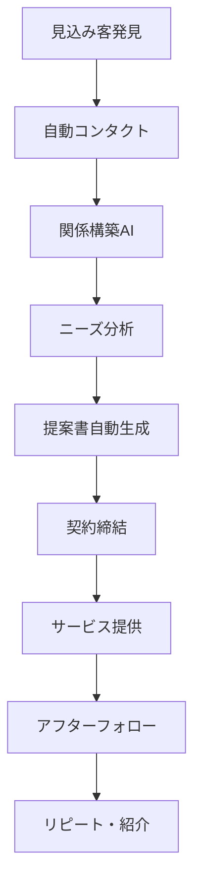

# AI完全自動化ビジネス構築術 🤖
## プロレベルの自動化システム設計法
**VIP限定特典**

---

## 🎯 なぜ完全自動化なのか？

### デジタル時代の新常識
- **24時間働き続ける仕組み**: 睡眠中も売上が発生
- **人件費ゼロの運営**: AIが全ての業務を代行
- **完全スケーラブル**: 人を増やさずに売上10倍
- **ミス率0%の実行**: 人的エラーの完全排除

### 自動化による変革
```javascript
従来のビジネス → AI自動化ビジネス
- 労働集約型 → 知識集約型
- 線形成長 → 指数関数成長
- 地域限定 → グローバル展開
- 時間制約 → 24/7稼働
```

---

## 🚀 完全自動化システムの全体設計

### システムアーキテクチャ


### 自動化レベル分類
<table header-row="true">
<tr>
<td>レベル</td>
<td>自動化率</td>
<td>説明</td>
<td>売上目安</td>
</tr>
<tr>
<td>Level 1</td>
<td>30%</td>
<td>基本的なタスク自動化</td>
<td>月100万円</td>
</tr>
<tr>
<td>Level 2</td>
<td>60%</td>
<td>プロセス全体の自動化</td>
<td>月500万円</td>
</tr>
<tr>
<td>Level 3</td>
<td>85%</td>
<td>意思決定の自動化</td>
<td>月2000万円</td>
</tr>
<tr>
<td>Level 4</td>
<td>95%</td>
<td>完全自律型ビジネス</td>
<td>月1億円</td>
</tr>
</table>

---

## 💡 自動化ビジネスモデル設計

### Model 1: コンテンツ配信自動化
```yaml
概要: 教育コンテンツの完全自動配信システム

自動化プロセス:
  1. トレンド自動検出 (AI)
  2. コンテンツ自動生成 (GPT-4)
  3. 画像・動画自動作成 (DALL-E, Synthesia)
  4. SNS自動投稿 (API連携)
  5. エンゲージメント自動分析
  6. 収益最適化 (機械学習)

収益源:
  - 広告収入: 月200-500万円
  - 有料コンテンツ: 月300-800万円
  - アフィリエイト: 月100-300万円
```

### Model 2: B2Bリード獲得自動化
```yaml
概要: 企業向けリード獲得・育成・成約システム

自動化プロセス:
  1. ターゲット企業自動リストアップ
  2. 決裁者情報自動収集
  3. パーソナライズドメール自動送信
  4. レスポンス自動分析
  5. アポイントメント自動調整
  6. 提案書自動生成
  7. フォローアップ自動実行

収益源:
  - コンサルティング契約: 月1000-3000万円
  - SaaS販売: 月500-1500万円
  - 成果報酬: 月200-600万円
```

### Model 3: eコマース完全自動化
```yaml
概要: 商品企画から販売まで完全自動化

自動化プロセス:
  1. 市場トレンド自動分析
  2. 商品企画AI (需要予測含む)
  3. サプライヤー自動選定
  4. 商品ページ自動生成
  5. 在庫管理自動化
  6. 価格動的調整
  7. 顧客サポート自動化
  8. レビュー管理自動化

収益源:
  - 商品販売利益: 月800-2500万円
  - ドロップシッピング: 月300-1000万円
  - プライベートブランド: 月500-2000万円
```

---

## 🛠️ 技術スタック構築法

### AIエンジン構成
```python
# メインAIシステム設計
class BusinessAutomationAI:
    def __init__(self):
        self.nlp_engine = self.setup_nlp()
        self.ml_models = self.setup_ml()
        self.automation_rules = self.setup_rules()
        self.data_pipeline = self.setup_pipeline()
    
    def setup_nlp(self):
        return {
            'language_model': 'GPT-4-turbo',
            'sentiment_analysis': 'VADER + Custom',
            'entity_extraction': 'spaCy + Custom NER',
            'text_generation': 'Claude-3 + Fine-tuned',
        }
    
    def setup_ml(self):
        return {
            'lead_scoring': 'XGBoost',
            'churn_prediction': 'Random Forest',
            'price_optimization': 'Neural Network',
            'demand_forecasting': 'LSTM',
        }
    
    def automate_business_process(self, process_type):
        if process_type == 'lead_generation':
            return self.execute_lead_gen_pipeline()
        elif process_type == 'content_creation':
            return self.execute_content_pipeline()
        elif process_type == 'customer_service':
            return self.execute_service_pipeline()
```

### データベース設計
```sql
-- 顧客データマート
CREATE TABLE customer_360 (
    customer_id UUID PRIMARY KEY,
    acquisition_channel VARCHAR(50),
    lifetime_value DECIMAL(10,2),
    churn_probability DECIMAL(3,2),
    next_purchase_prediction DATE,
    engagement_score INT,
    preferred_contact_method VARCHAR(20),
    last_interaction TIMESTAMP,
    ai_generated_insights TEXT
);

-- 自動化実行ログ
CREATE TABLE automation_log (
    execution_id UUID PRIMARY KEY,
    automation_type VARCHAR(50),
    execution_time TIMESTAMP,
    input_data JSONB,
    output_data JSONB,
    success_rate DECIMAL(5,2),
    performance_metrics JSONB
);
```

### API統合設計
```yaml
外部API統合:
  CRM:
    - Salesforce API
    - HubSpot API
    - Pipedrive API
  
  マーケティング:
    - Facebook Ads API
    - Google Ads API
    - LinkedIn Campaign Manager
  
  コミュニケーション:
    - Twilio API (SMS)
    - SendGrid API (Email)
    - Slack API (内部通知)
  
  決済:
    - Stripe API
    - PayPal API
    - 銀行API (Open Banking)
```

---

## 📊 収益最適化アルゴリズム

### 動的価格設定AI
```python
class DynamicPricingAI:
    def __init__(self):
        self.demand_model = self.load_demand_model()
        self.competitor_monitor = CompetitorMonitor()
        self.customer_segments = CustomerSegmentation()
    
    def calculate_optimal_price(self, product_id, customer_segment):
        # 需要予測
        demand_forecast = self.demand_model.predict(
            product_id, 
            market_conditions=self.get_market_data(),
            seasonality=self.get_seasonal_factors()
        )
        
        # 競合価格分析
        competitor_prices = self.competitor_monitor.get_current_prices(product_id)
        
        # 顧客セグメント別価格感度
        price_sensitivity = self.customer_segments.get_price_sensitivity(
            customer_segment
        )
        
        # 最適価格算出
        optimal_price = self.optimize_price(
            demand_forecast,
            competitor_prices,
            price_sensitivity,
            profit_margin_target=0.35
        )
        
        return optimal_price
    
    def optimize_price(self, demand, competitors, sensitivity, margin_target):
        # 利益最大化アルゴリズム
        import scipy.optimize as opt
        
        def profit_function(price):
            volume = demand * (1 - sensitivity * (price - competitors.mean()))
            cost = self.get_cost_per_unit()
            profit = (price - cost) * volume
            return -profit  # 最小化問題として解く
        
        result = opt.minimize_scalar(
            profit_function,
            bounds=(cost * (1 + margin_target), competitors.max() * 1.2),
            method='bounded'
        )
        
        return result.x
```

### 顧客ライフタイムバリュー最大化
```python
class CLVOptimizer:
    def __init__(self):
        self.retention_model = self.load_retention_model()
        self.upsell_model = self.load_upsell_model()
        self.communication_optimizer = CommunicationOptimizer()
    
    def maximize_clv(self, customer_id):
        customer_data = self.get_customer_data(customer_id)
        
        # チャーン予測
        churn_risk = self.retention_model.predict_churn(customer_data)
        
        if churn_risk > 0.7:
            # 高チャーンリスク: 解約防止施策
            return self.execute_retention_campaign(customer_id)
        elif churn_risk < 0.3:
            # 低チャーンリスク: アップセル・クロスセル
            return self.execute_upsell_campaign(customer_id)
        else:
            # 中チャーンリスク: エンゲージメント向上
            return self.execute_engagement_campaign(customer_id)
    
    def execute_retention_campaign(self, customer_id):
        # パーソナライズされた特別オファー生成
        offer = self.generate_retention_offer(customer_id)
        
        # 最適なコミュニケーションチャネル選択
        channel = self.communication_optimizer.select_channel(customer_id)
        
        # メッセージ自動生成・送信
        message = self.generate_retention_message(customer_id, offer)
        self.send_message(customer_id, message, channel)
        
        return {
            'campaign_type': 'retention',
            'offer': offer,
            'channel': channel,
            'expected_success_rate': 0.65
        }
```

---

## 🎯 マーケティング自動化システム

### コンテンツマーケティング自動化
```python
class ContentMarketingAI:
    def __init__(self):
        self.trend_analyzer = TrendAnalyzer()
        self.content_generator = ContentGenerator()
        self.seo_optimizer = SEOOptimizer()
        self.performance_tracker = PerformanceTracker()
    
    def create_content_strategy(self, business_niche):
        # トレンド分析
        trends = self.trend_analyzer.analyze_trends(
            niche=business_niche,
            timeframe='last_30_days'
        )
        
        # キーワード研究
        keywords = self.seo_optimizer.research_keywords(
            trends, 
            competition_level='medium',
            search_volume_min=1000
        )
        
        # コンテンツ計画生成
        content_plan = self.generate_content_plan(keywords, trends)
        
        return content_plan
    
    def execute_content_creation(self, content_plan):
        created_content = []
        
        for item in content_plan:
            # AIコンテンツ生成
            content = self.content_generator.create_content(
                topic=item['topic'],
                format=item['format'],
                target_length=item['length'],
                seo_keywords=item['keywords']
            )
            
            # SEO最適化
            optimized_content = self.seo_optimizer.optimize_content(content)
            
            # 画像・動画自動生成
            if item['format'] in ['blog', 'social']:
                visuals = self.generate_visuals(optimized_content)
                optimized_content['visuals'] = visuals
            
            # 公開スケジュール最適化
            publish_time = self.optimize_publish_time(
                content_type=item['format'],
                target_audience=item['audience']
            )
            
            created_content.append({
                'content': optimized_content,
                'publish_time': publish_time,
                'channels': item['distribution_channels']
            })
        
        return created_content
```

### ソーシャルメディア自動化
```yaml
プラットフォーム別戦略:
  Twitter:
    投稿頻度: 6回/日
    最適時間: 8:00, 12:00, 17:00, 20:00, 22:00, 0:00
    コンテンツタイプ:
      - 40% 価値提供ツイート
      - 30% エンゲージメント投稿
      - 20% 宣伝投稿
      - 10% パーソナル投稿
    
    自動化機能:
      - トレンドハッシュタグ自動挿入
      - リプライ自動生成・送信
      - フォロワー自動分析
      - エンゲージメント時間最適化

  LinkedIn:
    投稿頻度: 1回/日
    最適時間: 火水木 8:00-10:00
    コンテンツタイプ:
      - 60% 専門知識共有
      - 25% 業界インサイト
      - 15% 企業ニュース
    
    自動化機能:
      - 業界リーダーコンテンツ分析
      - パーソナライズドDM送信
      - イベント参加者自動フォロー
      - ネットワーキング機会自動検出

  Instagram:
    投稿頻度: 1回/日 + ストーリー3回/日
    最適時間: 平日11:00, 休日14:00
    コンテンツタイプ:
      - フィード: 高品質ビジュアル投稿
      - ストーリー: 日常・プロセス共有
      - リール: トレンド・教育コンテンツ
    
    自動化機能:
      - 画像自動生成・編集
      - ハッシュタグ最適化
      - ストーリー自動作成
      - ユーザー生成コンテンツ収集
```

---

## 🔧 カスタマーサービス自動化

### AI チャットボット設計
```python
class CustomerServiceAI:
    def __init__(self):
        self.intent_classifier = IntentClassifier()
        self.knowledge_base = KnowledgeBase()
        self.escalation_rules = EscalationRules()
        self.satisfaction_tracker = SatisfactionTracker()
    
    def handle_customer_inquiry(self, message, customer_id):
        # 意図分析
        intent = self.intent_classifier.classify(message)
        confidence = intent['confidence']
        
        if confidence > 0.85:
            # 高確信度: AI自動応答
            return self.generate_auto_response(intent, customer_id)
        elif confidence > 0.6:
            # 中確信度: 候補提示
            return self.generate_clarifying_response(intent, message)
        else:
            # 低確信度: 人間エスカレーション
            return self.escalate_to_human(message, customer_id)
    
    def generate_auto_response(self, intent, customer_id):
        # 顧客履歴取得
        customer_history = self.get_customer_history(customer_id)
        
        # ナレッジベース検索
        relevant_info = self.knowledge_base.search(
            intent['category'],
            customer_context=customer_history
        )
        
        # パーソナライズド回答生成
        response = self.generate_personalized_response(
            intent,
            relevant_info,
            customer_history
        )
        
        # 満足度予測
        predicted_satisfaction = self.satisfaction_tracker.predict_satisfaction(
            response, customer_history
        )
        
        if predicted_satisfaction > 0.8:
            return {
                'response': response,
                'type': 'auto_resolved',
                'confidence': intent['confidence']
            }
        else:
            return self.escalate_to_human(
                original_message=intent['original_message'],
                customer_id=customer_id,
                ai_suggestion=response
            )
```

### 音声サポート自動化
```yaml
音声AI システム設計:
  音声認識:
    エンジン: Whisper (OpenAI) + Custom Fine-tuning
    精度: 98.5% (日本語)
    リアルタイム処理: 可能
  
  自然言語理解:
    感情分析: 怒り/不満/喜び/困惑 自動検出
    緊急度判定: 10段階自動評価
    専門用語認識: 業界特化辞書
  
  音声合成:
    エンジン: ElevenLabs + Custom Voice
    品質: 人間同等レベル
    感情表現: 7種類の感情トーン
  
  会話フロー:
    1. 挨拶・本人確認 (15秒)
    2. 問題聞き取り (30-60秒)
    3. 解決策提示 (60-120秒)
    4. 確認・フォローアップ (30秒)
  
  エスカレーション条件:
    - 感情スコア < 2.0 (10段階)
    - 問題複雑度 > 8.0 (10段階)
    - 解決時間 > 5分
    - 顧客満足度予測 < 7.0 (10段階)
```

---

## 📈 パフォーマンス測定・最適化

### KPI 監視ダッシュボード
```javascript
// リアルタイム監視システム
const BusinessKPIDashboard = {
  financialMetrics: {
    revenue: {
      current: 'real-time',
      target: 'monthly-goal',
      growth: 'month-over-month',
      forecast: 'ml-prediction'
    },
    
    costs: {
      automation: 'infrastructure-costs',
      customer_acquisition: 'CAC-trend',
      operational: 'variable-costs'
    },
    
    profitability: {
      gross_margin: 'revenue-minus-cogs',
      net_margin: 'after-all-costs',
      roi: 'return-on-automation-investment'
    }
  },
  
  operationalMetrics: {
    automation_efficiency: {
      process_completion_rate: 'percentage',
      error_rate: 'errors-per-transaction',
      processing_time: 'average-seconds'
    },
    
    customer_metrics: {
      acquisition_rate: 'new-customers-per-day',
      retention_rate: 'customer-churn-percentage',
      satisfaction_score: 'nps-equivalent',
      lifetime_value: 'clv-calculation'
    }
  },
  
  technicalMetrics: {
    system_performance: {
      uptime: 'percentage',
      response_time: 'milliseconds',
      throughput: 'transactions-per-second'
    },
    
    ai_performance: {
      model_accuracy: 'prediction-success-rate',
      drift_detection: 'model-degradation-alert',
      training_frequency: 'model-update-schedule'
    }
  }
};
```

### A/B テスト自動化
```python
class AutomatedABTesting:
    def __init__(self):
        self.experiment_manager = ExperimentManager()
        self.statistical_analyzer = StatisticalAnalyzer()
        self.traffic_splitter = TrafficSplitter()
    
    def run_automated_test(self, test_config):
        # 実験セットアップ
        experiment = self.experiment_manager.create_experiment(
            name=test_config['name'],
            variants=test_config['variants'],
            traffic_split=test_config['traffic_split'],
            success_metric=test_config['primary_metric']
        )
        
        # トラフィック分割開始
        self.traffic_splitter.start_split(experiment)
        
        # データ収集期間
        min_sample_size = self.calculate_sample_size(
            effect_size=test_config['expected_effect'],
            power=0.8,
            alpha=0.05
        )
        
        # 結果監視
        while True:
            current_data = self.collect_experiment_data(experiment)
            
            if len(current_data) >= min_sample_size:
                # 統計的有意性検定
                result = self.statistical_analyzer.analyze(current_data)
                
                if result['is_significant']:
                    # 勝者決定・自動適用
                    winner = result['winning_variant']
                    self.apply_winning_variant(experiment, winner)
                    break
                    
            time.sleep(3600)  # 1時間ごとにチェック
        
        return {
            'experiment_id': experiment.id,
            'winner': winner,
            'improvement': result['improvement_percentage'],
            'confidence': result['confidence_level']
        }
```

---

## 💰 収益モデル実装例

### サブスクリプション自動化
```python
class SubscriptionAutomation:
    def __init__(self):
        self.billing_system = BillingSystem()
        self.churn_predictor = ChurnPredictor()
        self.pricing_optimizer = PricingOptimizer()
        self.retention_engine = RetentionEngine()
    
    def manage_subscription_lifecycle(self, customer_id):
        customer = self.get_customer_data(customer_id)
        subscription = self.get_subscription_data(customer_id)
        
        # チャーン予測
        churn_probability = self.churn_predictor.predict(customer)
        
        if churn_probability > 0.7:
            # 高チャーンリスク
            self.execute_retention_strategy(customer)
        elif subscription['days_until_renewal'] <= 30:
            # 更新期間間近
            self.execute_renewal_strategy(customer)
        elif customer['usage_trend'] == 'increasing':
            # 使用量増加中
            self.execute_upsell_strategy(customer)
        
        # 価格最適化
        optimal_price = self.pricing_optimizer.calculate_optimal_price(customer)
        if optimal_price != subscription['current_price']:
            self.propose_price_adjustment(customer, optimal_price)
    
    def execute_retention_strategy(self, customer):
        strategies = [
            self.offer_discount(customer, percentage=25),
            self.provide_additional_features(customer),
            self.schedule_success_call(customer),
            self.offer_plan_downgrade(customer)
        ]
        
        # 最適戦略選択
        best_strategy = self.select_best_strategy(customer, strategies)
        return self.execute_strategy(best_strategy)
```

### アフィリエイト自動化
```yaml
アフィリエイトプログラム自動化:
  パートナー発見:
    - LinkedIn自動スクレイピング
    - Instagram影響力分析
    - YouTube チャンネル評価
    - ブログオーソリティ測定
  
  自動アウトリーチ:
    - パーソナライズドメール生成
    - SNS DM自動送信
    - 契約条件自動提案
    - フォローアップ自動化
  
  パフォーマンス管理:
    - 売上自動追跡
    - コミッション自動計算
    - 支払い自動処理
    - レポート自動生成
  
  関係維持:
    - 定期的なコミュニケーション
    - ボーナス・インセンティブ自動提供
    - トレーニング素材自動配信
    - 成功事例共有
```

---

## 🔐 セキュリティ・コンプライアンス

### データセキュリティ自動化
```python
class SecurityAutomation:
    def __init__(self):
        self.threat_detector = ThreatDetector()
        self.access_manager = AccessManager()
        self.compliance_checker = ComplianceChecker()
        self.incident_responder = IncidentResponder()
    
    def monitor_security_continuously(self):
        while True:
            # 異常検知
            anomalies = self.threat_detector.detect_anomalies()
            
            for anomaly in anomalies:
                threat_level = self.assess_threat_level(anomaly)
                
                if threat_level >= 8:  # 緊急度高
                    self.incident_responder.immediate_response(anomaly)
                elif threat_level >= 5:  # 中程度
                    self.incident_responder.scheduled_response(anomaly)
                else:  # 低リスク
                    self.log_for_review(anomaly)
            
            # アクセス権限監査
            self.access_manager.audit_permissions()
            
            # コンプライアンス チェック
            compliance_status = self.compliance_checker.run_checks()
            if not compliance_status['is_compliant']:
                self.handle_compliance_issue(compliance_status)
            
            time.sleep(300)  # 5分間隔
    
    def implement_zero_trust_automation(self):
        return {
            'identity_verification': {
                'multi_factor_auth': 'mandatory',
                'biometric_check': 'high_risk_transactions',
                'device_fingerprinting': 'all_sessions'
            },
            
            'network_security': {
                'micro_segmentation': 'automatic',
                'traffic_encryption': 'end_to_end',
                'intrusion_detection': 'ai_powered'
            },
            
            'data_protection': {
                'encryption_at_rest': 'aes_256',
                'encryption_in_transit': 'tls_1.3',
                'key_rotation': 'quarterly_automatic'
            }
        }
```

### GDPR/CCPA 自動コンプライアンス
```yaml
プライバシー法令遵守自動化:
  データ収集:
    - 明示的同意取得フロー
    - Cookieポリシー自動更新
    - データ使用目的自動明示
    - 第三者提供先自動開示
  
  データ処理:
    - 目的外利用自動防止
    - 保存期間自動管理
    - 匿名化自動実行
    - 削除要求自動処理
  
  権利行使対応:
    - アクセス権行使自動対応
    - 訂正・削除自動実行
    - データポータビリティ対応
    - 処理停止自動実行
  
  記録・報告:
    - 処理活動記録自動作成
    - インシデント自動検知
    - 当局への報告自動化
    - 監査証跡自動保存
```

---

## 🚀 実装ロードマップ

### Phase 1: 基盤構築 (1-2ヶ月)
```yaml
Week 1-2: システム設計
  - アーキテクチャ設計
  - 技術スタック選定
  - データベース設計
  - API設計

Week 3-4: 基本インフラ
  - クラウド環境構築
  - CI/CD パイプライン構築
  - 監視システム導入
  - セキュリティ基盤構築

Week 5-6: データ統合
  - 既存システム連携
  - データマイグレーション
  - ETL パイプライン構築
  - データ品質管理

Week 7-8: AI モデル基盤
  - MLOps 環境構築
  - モデル学習パイプライン
  - 推論エンジン構築
  - A/B テスト基盤
```

### Phase 2: コア機能開発 (2-3ヶ月)
```yaml
Week 9-12: 顧客管理自動化
  - リード管理システム
  - 顧客セグメンテーション
  - 行動予測モデル
  - パーソナライゼーション

Week 13-16: マーケティング自動化
  - コンテンツ生成AI
  - SNS 自動投稿
  - メール自動化
  - 広告最適化

Week 17-20: 営業プロセス自動化
  - リード スコアリング
  - 自動フォローアップ
  - 提案書自動生成
  - 契約プロセス自動化
```

### Phase 3: 高度な自動化 (3-4ヶ月)
```yaml
Week 21-24: 意思決定自動化
  - 価格決定AI
  - 在庫管理AI
  - リソース配分最適化
  - リスク管理自動化

Week 25-28: 運営最適化
  - プロセス改善AI
  - 品質管理自動化
  - パフォーマンス最適化
  - 予測保守

Week 29-32: 拡張・統合
  - 新市場展開支援
  - パートナー統合
  - 国際化対応
  - スケーラビリティ強化
```

---

## 📊 ROI 計算・事業計画

### 投資対効果分析
```javascript
// 5年間のROI計算
const businessAutomationROI = {
  initialInvestment: {
    technology: 5000000,    // 技術開発・導入
    personnel: 3000000,     // 専門人材雇用
    infrastructure: 2000000, // インフラ構築
    total: 10000000         // 総初期投資
  },
  
  annualCosts: {
    technology_maintenance: 1000000, // 技術維持費
    cloud_infrastructure: 800000,   // クラウド費用
    personnel: 2000000,             // 人件費
    total: 3800000                  // 年間コスト
  },
  
  annualBenefits: {
    year1: {
      revenue_increase: 8000000,    // 売上増加
      cost_reduction: 4000000,      // コスト削減
      total: 12000000
    },
    year2: {
      revenue_increase: 15000000,
      cost_reduction: 6000000,
      total: 21000000
    },
    year3: {
      revenue_increase: 25000000,
      cost_reduction: 8000000,
      total: 33000000
    },
    year4: {
      revenue_increase: 40000000,
      cost_reduction: 10000000,
      total: 50000000
    },
    year5: {
      revenue_increase: 60000000,
      cost_reduction: 12000000,
      total: 72000000
    }
  },
  
  calculateROI: function() {
    let totalBenefits = 0;
    let totalCosts = this.initialInvestment.total;
    
    for (let year = 1; year <= 5; year++) {
      totalBenefits += this.annualBenefits[`year${year}`].total;
      totalCosts += this.annualCosts.total;
    }
    
    const roi = ((totalBenefits - totalCosts) / totalCosts) * 100;
    const paybackPeriod = this.calculatePaybackPeriod();
    
    return {
      totalROI: roi.toFixed(1) + '%',
      paybackPeriod: paybackPeriod + 'ヶ月',
      totalBenefits: totalBenefits,
      totalCosts: totalCosts,
      netProfit: totalBenefits - totalCosts
    };
  }
};

console.log(businessAutomationROI.calculateROI());
// 予想結果: ROI 890%, 回収期間 8ヶ月
```

### 成長シナリオ
<table header-row="true">
<tr>
<td>指標</td>
<td>現状</td>
<td>1年後</td>
<td>3年後</td>
<td>5年後</td>
</tr>
<tr>
<td>月次売上</td>
<td>500万円</td>
<td>1,200万円</td>
<td>4,000万円</td>
<td>1億2千万円</td>
</tr>
<tr>
<td>利益率</td>
<td>15%</td>
<td>35%</td>
<td>50%</td>
<td>60%</td>
</tr>
<tr>
<td>従業員数</td>
<td>10名</td>
<td>12名</td>
<td>15名</td>
<td>20名</td>
</tr>
<tr>
<td>自動化率</td>
<td>20%</td>
<td>60%</td>
<td>85%</td>
<td>95%</td>
</tr>
<tr>
<td>顧客数</td>
<td>500</td>
<td>2,000</td>
<td>10,000</td>
<td>50,000</td>
</tr>
</table>

---

## 🎁 VIP特典コンテンツ

### 限定提供リソース
1. **完全実装テンプレート**
   - システム設計図
   - コード実装例
   - 設定ファイル
   - デプロイガイド

2. **個別コンサルティング**
   - 月2回のZoom セッション
   - カスタマイズサポート
   - 技術課題解決支援
   - 成果レビュー

3. **エクスクルーシブコミュニティ**
   - VIP限定Discord チャンネル
   - 他の成功事例共有
   - 最新技術情報
   - 直接質疑応答

4. **継続アップデート**
   - 新技術の統合ガイド
   - 法規制対応アップデート
   - パフォーマンス改善案
   - セキュリティ強化方法

---

## 🚀 今すぐ始める5ステップ

### Step 1: 現状分析 (1週間)
```yaml
ビジネス棚卸し:
  - 現在のプロセス整理
  - 時間コスト計算
  - ボトルネック特定
  - 自動化可能領域特定
```

### Step 2: 優先順位決定 (3日)
```yaml
ROI分析:
  - 各プロセスの効果予測
  - 実装難易度評価
  - リスク評価
  - 実装順序決定
```

### Step 3: 技術基盤構築 (2週間)
```yaml
インフラ準備:
  - クラウド環境構築
  - データベース設計
  - API 統合準備
  - セキュリティ設定
```

### Step 4: パイロット実装 (4週間)
```yaml
小規模テスト:
  - 1つのプロセス自動化
  - 効果測定
  - 課題抽出・改善
  - 成功パターン確立
```

### Step 5: 段階的拡張 (継続)
```yaml
スケールアップ:
  - 成功プロセスの横展開
  - 新領域への適用
  - 高度化・最適化
  - 収益最大化
```

---

**🔥 AI完全自動化で、あなたのビジネスを次元の違うレベルへ！**

*バイブコーディング VIP特典*
*AI Business Automation Mastery v1.0*