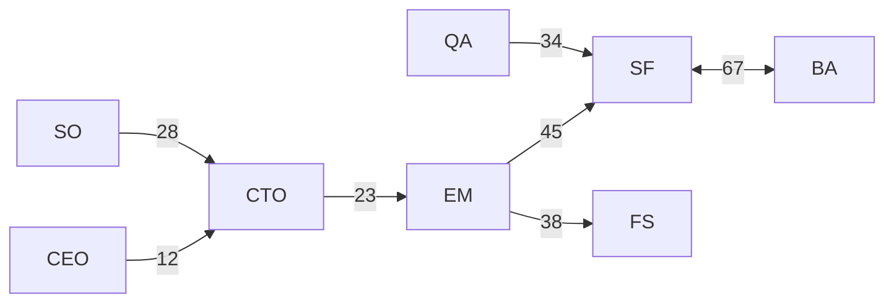

# 📊 特典7：AI組織の完全可視化ダッシュボード＆メトリクスシステム

## リアルタイムで組織のすべてを把握する究極の管理システム

**12名のAIエージェントの活動を完全に可視化**し、データドリブンな意思決定を可能にする包括的なダッシュボードシステムです。

## 🎯 このダッシュボードで分かること

### 一目で把握できる情報
- 各エージェントの稼働状況
- タスクの進捗状況
- コード品質メトリクス
- セキュリティステータス
- コスト使用状況
- チーム健康度
- 学習と改善の履歴

## 📈 メインダッシュボード

### リアルタイムビュー
```
╔══════════════════════════════════════════════════════════════╗
║                 AI組織ダッシュボード                          ║
║                  2024-08-11 14:30 JST                        ║
╠══════════════════════════════════════════════════════════════╣
║                                                              ║
║  組織健全性スコア    ████████████████████░░░░ 85/100       ║
║                                                              ║
║  本日の成果         完了タスク: 23  PR: 8  デプロイ: 3      ║
║                                                              ║
║  アクティブエージェント  ●●●●●●●●●○○○  9/12              ║
║                                                              ║
║  現在の問題         🔴 2  🟡 5  🟢 15                      ║
║                                                              ║
╚══════════════════════════════════════════════════════════════╝
```

## 🤖 エージェント活動モニター

### 個別エージェントステータス
```javascript
{
  "ceo": {
    "status": "active",
    "current_task": "戦略レビュー",
    "utilization": 65,
    "tasks_completed_today": 5,
    "decision_made": 3,
    "meetings_led": 2,
    "health_score": 92
  },
  "cto": {
    "status": "reviewing",
    "current_task": "アーキテクチャ設計レビュー",
    "utilization": 78,
    "prs_reviewed": 12,
    "tech_decisions": 4,
    "blockers_resolved": 3,
    "health_score": 88
  }
  // ... 他の10エージェント
}
```

### エージェント相関マトリクス
```
        CEO CTO EM  SF  FS  BA  QA  SO  DO  TW  HR  PM
CEO     -   85  72  45  40  50  35  60  30  25  70  80
CTO     85  -   90  75  70  95  60  85  80  50  40  65
EM      72  90  -   85  80  75  70  60  65  55  85  75
...
```
（数値は協働頻度を示す）

## 📊 開発メトリクス

### コード品質指標
```yaml
test_coverage:
  current: 83%
  target: 85%
  trend: ↗️ +2%
  
code_complexity:
  average: 6.2
  max_allowed: 10
  files_exceeding: 3
  
technical_debt:
  current_hours: 45
  added_this_week: 8
  resolved_this_week: 15
  trend: ↘️ improving

code_duplication:
  percentage: 3.2%
  threshold: 5%
  status: ✅ healthy
```

### パフォーマンスメトリクス
```
API Response Time (p95)
━━━━━━━━━━━━━━━━━━━━━━━━━━━━━━━━ 145ms

Database Query Time (avg)
━━━━━━━━━━━━━━━━━━━━━━ 23ms

Build Time
━━━━━━━━━━━━━━━━━━━━━━━━━━ 3m 42s

Test Execution Time
━━━━━━━━━━━━━━━━━━━━━━━━━━━━━━ 5m 18s
```

## 💰 コスト追跡ダッシュボード

### API使用量と費用
```markdown
## 本日のAPI使用状況

| サービス | 使用量 | コスト | 予算比 | アラート |
|----------|--------|--------|--------|----------|
| Claude API | 1.2M tokens | $24.50 | 61% | 🟢 |
| O3 API | 45 calls | $6.75 | 45% | 🟢 |
| GitHub API | 234 calls | $0 | - | 🟢 |
| 合計 | - | $31.25 | 52% | 🟢 |

## 月間推移
Day 1-7:   ████████ $218
Day 8-14:  ██████ $165  
Day 15-21: ███████ $189
Day 22-28: █████ $142
予測月額: $750 (予算: $1000)
```

### エージェント別コスト
```python
agent_costs = {
    "backend-architect": {"daily": 4.50, "monthly": 135},
    "security-officer": {"daily": 3.20, "monthly": 96},
    "senior-fullstack": {"daily": 3.80, "monthly": 114},
    "cto": {"daily": 2.90, "monthly": 87},
    # ...
}
```

## 🔒 セキュリティダッシュボード

### 脆弱性トラッカー
```
┌─────────────────────────────────────┐
│ セキュリティステータス               │
├─────────────────────────────────────┤
│ 🔴 Critical: 0  (要即時対応)        │
│ 🟠 High: 2      (24時間以内)        │
│ 🟡 Medium: 5    (1週間以内)         │
│ 🟢 Low: 12      (計画的対応)        │
├─────────────────────────────────────┤
│ 最終スキャン: 2時間前                │
│ 次回スキャン: 4時間後                │
└─────────────────────────────────────┘
```

### セキュリティイベントログ
```json
[
  {
    "timestamp": "2024-08-11T14:25:00Z",
    "type": "auth_failure",
    "severity": "low",
    "source": "api.users.login",
    "action_taken": "rate_limit_applied"
  },
  {
    "timestamp": "2024-08-11T13:15:00Z",
    "type": "dependency_vulnerability",
    "severity": "high",
    "package": "lodash@4.17.20",
    "action_taken": "update_scheduled"
  }
]
```

## 📈 チーム健康度メトリクス

### 組織文化指標
```
チーム満足度
━━━━━━━━━━━━━━━━━━━━━━━━━━━━━━ 4.2/5

コラボレーション指数
━━━━━━━━━━━━━━━━━━━━━━━━━━━ 85%

知識共有頻度
━━━━━━━━━━━━━━━━━━━━━━━ 72%

イノベーション指数
━━━━━━━━━━━━━━━━━━━━━━━━━ 78%

心理的安全性
━━━━━━━━━━━━━━━━━━━━━━━━━━━━ 91%
```

### エージェント間コミュニケーション

（数値は本日のメッセージ数）

## 🎯 KPIトラッキング

### 重要業績評価指標
```yaml
velocity:
  sprint_1: 45
  sprint_2: 52
  sprint_3: 58
  sprint_4: 61
  trend: improving
  
lead_time:
  average: 4.2_hours
  median: 3.5_hours
  p95: 8.1_hours
  
deployment_frequency:
  daily_average: 3.2
  weekly_total: 22
  success_rate: 94%
  
mttr: # Mean Time To Recovery
  current: 23_minutes
  target: 30_minutes
  best_this_month: 12_minutes
```

## 📊 カスタムレポート生成

### 自動レポートテンプレート
```javascript
// 日次レポート
const dailyReport = {
  date: "2024-08-11",
  summary: {
    tasks_completed: 23,
    bugs_fixed: 5,
    features_shipped: 3,
    prs_merged: 8
  },
  highlights: [
    "認証システム実装完了",
    "パフォーマンス15%改善",
    "セキュリティ監査パス"
  ],
  concerns: [
    "技術的負債の増加",
    "テストカバレッジ低下"
  ],
  tomorrow_focus: [
    "リファクタリング",
    "テスト追加"
  ]
};
```

## 🔄 リアルタイム更新設定

### WebSocketによるライブ更新
```javascript
// リアルタイム更新の実装
const ws = new WebSocket('ws://localhost:3000/metrics');

ws.on('message', (data) => {
  const metric = JSON.parse(data);
  updateDashboard(metric);
});

// 5秒ごとの自動更新
setInterval(fetchMetrics, 5000);
```

## 📱 モバイル対応ビュー

### レスポンシブデザイン
```css
/* モバイル最適化 */
@media (max-width: 768px) {
  .dashboard-grid {
    grid-template-columns: 1fr;
  }
  .metric-card {
    width: 100%;
  }
}
```

## 🎨 カスタマイズ可能なウィジェット

### ウィジェットライブラリ
1. **グラフ系**
   - 折れ線グラフ
   - 棒グラフ
   - 円グラフ
   - ヒートマップ

2. **数値系**
   - カウンター
   - ゲージ
   - プログレスバー
   - スパークライン

3. **リスト系**
   - タスクリスト
   - ログビューアー
   - ランキング
   - タイムライン

## 🛠️ 設定とカスタマイズ

### ダッシュボード設定ファイル
```yaml
dashboard_config:
  refresh_interval: 5000
  theme: dark
  layout: grid
  widgets:
    - type: agent_status
      position: [0, 0]
      size: [2, 1]
    - type: cost_tracker
      position: [2, 0]
      size: [1, 1]
    - type: security_status
      position: [0, 1]
      size: [3, 1]
  alerts:
    cost_threshold: 50.00
    error_rate_threshold: 0.05
    response_time_threshold: 500
```

## 📈 データエクスポート

### 対応フォーマット
- CSV
- JSON
- PDF
- Excel
- Google Sheets連携

### エクスポートコマンド
```bash
# 日次レポートをPDFで出力
@.claude/agents/technical-writer.md "本日のメトリクスをPDFレポートにまとめて"

# CSVエクスポート
cat .claude/metrics/dashboard.md | convert-to-csv > metrics.csv
```

## 🎁 ボーナス機能

### 1. 予測分析
```python
# 次週のコスト予測
predicted_cost = analyze_trend(historical_costs)
# 予測: $285 ± $15
```

### 2. 異常検知
```javascript
// 異常なパターンを自動検出
if (current_error_rate > baseline * 2) {
  alert("Error rate spike detected!");
}
```

### 3. 最適化提案
```markdown
## 自動生成された最適化提案
1. Backend Architectの負荷が高い → タスク再配分推奨
2. テストカバレッジ低下傾向 → QA Leadのリソース増強
3. APIレスポンス遅延 → キャッシュ層の追加検討
```

---

**このダッシュボードで、AI組織の全てを掌握できます！**