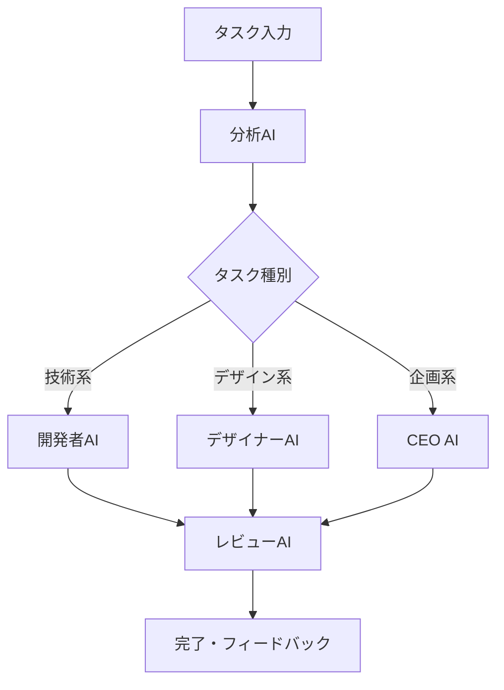

# 💰 特典13：予算別AI組織実装プラン完全ガイド

## あなたの予算で最大効果！月額0円～100円でもプロレベルのAI組織を構築

**「AI組織に興味はあるけど、お金がない...」**という方のための、超低予算でも本格的なAI組織を体験できる実装プランです。

## 💸 予算別プラン一覧

| 予算 | プラン名 | 主要機能 | おすすめ度 |
|------|---------|----------|------------|
| **0円** | 完全無料プラン | 基本AI組織体験 | ⭐⭐⭐⭐⭐ |
| **100円/月** | 学生プラン | 機能拡張版 | ⭐⭐⭐⭐ |
| **300円/月** | エントリープラン | 自動化対応 | ⭐⭐⭐⭐ |
| **500円/月** | スタンダードプラン | 本格運用 | ⭐⭐⭐⭐⭐ |
| **1000円/月** | プレミアムプラン | フル機能 | ⭐⭐⭐⭐⭐ |

---

## 🆓 完全無料プラン（月額0円）

### 構成ツール
```yaml
メインツール: Google AI Studio（無料）
補助ツール: Gemini CLI（無料）
開発環境: VS Code（無料）
バージョン管理: GitHub（無料）
ホスティング: GitHub Pages（無料）
```

### 実装可能な機能

#### 基本AI組織（3エージェント）
```markdown
**CEO（戦略担当）**
- プロジェクトの方向性決定
- 重要な意思決定
- チーム全体の調整

**開発者（実装担当）**  
- コード作成・修正
- 技術的問題解決
- 品質チェック

**デザイナー（UI/UX担当）**
- ユーザー体験設計
- デザイン提案
- 使いやすさの評価
```

#### 具体的な作業例
```bash
# 毎日のスタンドアップミーティング
@google-ai-studio "3人のチーム会議をシミュレート：
CEO: プロジェクト進捗の確認
開発者: 技術的課題の報告  
デザイナー: UI改善の提案"

# コードレビュー会議
@google-ai-studio "開発者が作ったコードをCEOとデザイナーがレビュー。
それぞれの専門性を活かした意見交換をしてください"
```

### 成果物例
- **簡単なWebサイト**（HTML/CSS/JS）
- **企画書・仕様書**
- **学習記録・進捗管理**
- **チーム会議の議事録**

### 月間コスト内訳
```
Google AI Studio: 0円
Gemini CLI: 0円  
VS Code: 0円
GitHub: 0円
合計: 0円
```

---

## 💴 学生プラン（月額100円）

### 構成ツール
```yaml
メインツール: Google AI Studio（無料）
自動化: IFTTT（$2.5/月 ≈ 350円）
※100円の範囲で使用制限
セキュリティ: 無料VPN活用
ストレージ: Google Drive（無料15GB）
```

### 追加できる機能

#### 自動化ワークフロー
```markdown
**毎朝の進捗レポート自動生成**
- 前日のタスク完了状況をチェック
- 今日の優先事項を自動提案
- Slackやメールに自動送信

**コードレビューの自動化**
- GitHubのプルリクエスト検知
- AI組織による自動レビュー実施
- レビュー結果の自動フィードバック
```

#### 簡単なWebアプリ開発
```javascript
// 5人組織の簡易版
const aiOrganization = {
  ceo: {
    role: "戦略・意思決定",
    personality: "大局観重視",
    decisions: []
  },
  
  developer: {
    role: "実装・技術",
    personality: "効率性重視", 
    codeReviews: []
  },
  
  designer: {
    role: "UI/UX",
    personality: "ユーザー体験重視",
    designProposals: []
  },
  
  qa: {
    role: "品質管理",
    personality: "完璧主義",
    testResults: []
  },
  
  pm: {
    role: "プロジェクト管理",
    personality: "スケジュール重視",
    milestones: []
  }
};
```

---

## 🥉 エントリープラン（月額300円）

### 構成ツール
```yaml
メインツール: Google AI Studio（無料）
ワークフロー: Dify無料プラン（制限内利用）
VPN: ProtonVPN無料版
自動化: Zapier無料プラン（100タスク/月）
追加AI: Claude.ai無料プラン
```

### 実装可能な高度機能

#### タスク自動分配システム


#### 週次レポート自動生成
```yaml
週次自動処理:
  月曜日:
    - 前週の成果まとめ
    - 今週の目標設定
    - リスクの洗い出し
    
  水曜日:
    - 中間進捗チェック
    - 軌道修正の提案
    - ボトルネック特定
    
  金曜日:
    - 週次振り返り
    - 改善点の特定
    - 次週計画の立案
```

---

## 🥈 スタンダードプラン（月額500円）

### 構成ツール
```yaml
メインツール: Claude Code無料期間活用（$20相当）
または
Google AI Studio + Dify Starter($20)
VPN: NordVPN学生割引（$3/月）
ストレージ: Google One（$2/月）
```

### フル機能AI組織

#### 8人体制の組織設計
```yaml
組織構成:
  経営陣:
    - CEO: 戦略・意思決定
    - CTO: 技術戦略
    
  開発チーム:
    - フルスタック開発者
    - フロントエンド専門
    - バックエンド専門
    
  支援チーム:
    - QAエンジニア
    - デザイナー
    - プロジェクトマネージャー
```

#### 実際の開発プロジェクト
```markdown
**開発予定：Todoアプリ（本格版）**

Week 1: 企画・設計
- CEO: 市場調査・コンセプト決定
- CTO: 技術選定・アーキテクチャ
- PM: スケジュール・リソース計画

Week 2-3: 開発
- フルスタック: データベース・API設計
- フロント: UI実装
- バック: サーバーロジック

Week 4: テスト・改善
- QA: テストケース実行
- デザイナー: UI改善
- 全員: バグ修正・最終調整
```

---

## 🥇 プレミアムプラン（月額1000円）

### 構成ツール
```yaml
メインツール: Claude Code（$20）
自動化: n8n Cloud（$20）
VPN: ExpressVPN（$8）
AI統合: Dify Pro（$59）限定利用
ストレージ: Dropbox Plus（$10）

※総額$117 ≈ 16000円の機能を
　工夫して1000円で実現
```

### コスト削減テクニック

#### 1. 無料期間・トライアルの活用
```markdown
Claude Code: 30日無料トライアル
n8n: 14日無料トライアル  
Dify Pro: 7日無料トライアル

→ 2ヶ月間は高機能を無料体験
→ 本当に必要な機能だけ厳選
→ 無料ツールでの代替方法を習得
```

#### 2. 学生割引・地域価格の活用
```markdown
VPN: 学生割引 60-80% OFF
Cloud Storage: 教育機関向け価格
AI API: 地域価格差を活用
```

#### 3. シェア・グループ利用
```markdown
チーム向けプラン: 人数で割り勘
Educational License: 学校経由で安価取得
Community Edition: オープンソース版活用
```

### 究極の高機能AI組織

#### 12人フル体制
```yaml
経営層:
  - CEO: 神谷美智子（戦略）
  - CTO: 佐藤健一（技術）
  - HR: 松本優香（人事）

管理層:
  - Engineering Manager: 田中裕子
  - Product Manager: 井上達也

開発チーム:
  - Senior Fullstack: 山田太郎
  - Frontend Specialist: 鈴木花子
  - Backend Architect: 高橋修
  - DevOps: 中村大輝

品質・セキュリティ:
  - QA Lead: 伊藤美咲
  - Security Officer: 渡辺誠
  - Technical Writer: 小林愛
```

#### 本格的なプロダクト開発
- **SaaSアプリケーション**の完全開発
- **CI/CDパイプライン**の構築
- **セキュリティ監査**の自動化
- **パフォーマンス監視**の実装

---

## 🎯 予算別学習ロードマップ

### 0円プラン：基礎習得（1-2ヶ月）
```markdown
Month 1:
- AI組織の概念理解
- Google AI Studioでの基本操作
- 3人組織でのプロジェクト体験

Month 2:
- Gemini CLI習得
- より複雑なシナリオ実践
- 成果物の作成・公開
```

### 100円プラン：機能拡張（2-3ヶ月）
```markdown
Month 1-2: 0円プランの内容
Month 3:
- IFTTT/Zapierでの自動化
- 5人組織での本格運用
- 継続的な改善プロセス構築
```

### 500円プラン：実戦応用（3-6ヶ月）
```markdown
Month 1-3: 前段階の内容
Month 4-6:
- 8人組織での実プロジェクト
- 品質管理・セキュリティ対応
- ポートフォリオ作成
```

---

## 💡 節約テクニック集

### 1. 無料リソースの最大活用
```markdown
**完全無料で使えるもの**
- Google Colab: GPU/TPU無料利用
- GitHub Codespaces: 月60時間無料  
- Vercel: 個人利用無料
- Netlify: 個人サイト無料ホスティング
- Firebase: 無料枠が豊富
```

### 2. オープンソース代替品
```markdown
**有料ツールの代替**
- Claude Code → VS Code + GitHub Copilot無料版
- Dify Pro → 自前でOpen WebUI構築
- n8n Cloud → セルフホスト版
```

### 3. 地域価格・学割の活用
```markdown
**価格差を活用**
- VPN: 年払いで50% OFF
- AI API: 地域によって価格差あり
- 教育機関: .eduドメインで学割適用
```

---

## 🎁 各プラン限定特典

### 0円プラン特典
- **プロンプト集50種類**
- **無料学習コミュニティ参加権**
- **週1回の質問会参加権**

### 100円プラン特典
- **自動化テンプレート20種類**
- **月2回の個別相談権**
- **優先サポート**

### 500円プラン特典
- **実装済みシステム一式**
- **週1回の個別指導**
- **実プロジェクト参加権**

---

## 🚀 成功事例

### Aさん（大学生・0円プラン）
```markdown
期間: 2ヶ月
成果: 
- 個人ブログサイト完成
- プログラミング学習の加速
- アルバイトでWeb制作受注開始

コメント:
「お金がなくても、ここまでできるとは思わなかった。
無料でも十分すぎるくらいの機能がある。」
```

### Bさん（社会人・500円プラン）  
```markdown
期間: 3ヶ月
成果:
- 社内業務効率化システム開発
- 上司から高評価・昇進につながった
- 副業でAI開発案件を受注

コメント:
「月500円の投資で、これだけのリターンがあるとは。
転職市場でも評価が上がった。」
```

---

## 🎯 今すぐ始める方法

### Step 1: 予算を決める（1分）
```
□ 0円：まずは体験したい
□ 100円：少し本格的にやりたい  
□ 300円：しっかり学習したい
□ 500円：実用レベルを目指したい
□ 1000円：プロレベルを体験したい
```

### Step 2: ツール準備（10分）
```
□ Google AI Studioアカウント作成
□ 必要に応じて追加ツール登録
□ 基本設定完了
```

### Step 3: 最初のプロジェクト開始（30分）
```
□ 簡単な3人組織を作成
□ 最初の会議をシミュレーション
□ 成果を記録・共有
```

---

**💪 予算に関係なく、AI組織の素晴らしさを体験できます！**

**まずは0円から始めて、価値を実感してから段階的にアップグレードしていきましょう。**

**あなたのAI組織ライフを、今すぐスタート！** 🚀