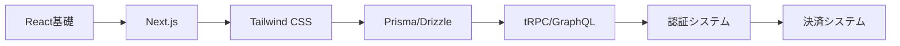

# 🎯 特典2: AI開発に必要なスキル完全ガイド

## 2025年最新版・AI開発者として月収100万円を稼ぐための必須スキルマップ

---

## 📊 AI開発者スキルピラミッド

```
        ╱────────────╲
       ╱  ビジネス力  ╲     【月収100万円ゾーン】
      ╱────────────────╲
     ╱   専門AI技術    ╲    【月収50万円ゾーン】
    ╱──────────────────╲
   ╱   実践開発スキル   ╲   【月収30万円ゾーン】
  ╱────────────────────╲
 ╱    プログラミング基礎   ╲  【月収10万円ゾーン】
╱──────────────────────╲
         基本的なPC操作        【スタートライン】
```

---

## 🎓 スキルレベル診断チェックリスト

### あなたの現在地を確認しよう

#### Level 0: 完全初心者
- [ ] PCの基本操作ができる
- [ ] ブラウザでWebサイトを閲覧できる
- [ ] メールやチャットツールが使える
- [ ] ファイルの保存・管理ができる

#### Level 1: プログラミング初心者
- [ ] HTMLで簡単なWebページが作れる
- [ ] CSSでデザインを整えられる
- [ ] JavaScriptの基本構文を理解している
- [ ] エラーメッセージを読める

#### Level 2: AI開発初心者
- [ ] APIを使ったことがある
- [ ] ChatGPT/Claudeを活用している
- [ ] 簡単なプロンプトが書ける
- [ ] JSONデータを扱える

#### Level 3: AI開発中級者
- [ ] 複数のAI APIを組み合わせられる
- [ ] プロンプトエンジニアリングができる
- [ ] Webアプリをデプロイできる
- [ ] データベースを扱える

#### Level 4: AI開発上級者
- [ ] 独自のAIサービスを運営している
- [ ] 月収30万円以上稼いでいる
- [ ] チーム開発の経験がある
- [ ] 技術選定ができる

---

## 📚 必須スキルカテゴリー別完全ガイド

### 1️⃣ プログラミング基礎スキル

#### JavaScript/TypeScript マスター項目
```javascript
// 絶対に覚えるべき10の概念
const mustKnowConcepts = {
  1: "変数とスコープ（let, const, var）",
  2: "関数（通常関数、アロー関数、高階関数）",
  3: "非同期処理（Promise, async/await）",
  4: "配列操作（map, filter, reduce）",
  5: "オブジェクト操作（分割代入、スプレッド構文）",
  6: "エラーハンドリング（try/catch）",
  7: "モジュールシステム（import/export）",
  8: "クラスとプロトタイプ",
  9: "イベント処理",
  10: "正規表現の基礎"
};
```

#### 実践練習問題
```javascript
// 練習1: API呼び出しとエラー処理
async function fetchAIResponse(prompt) {
  try {
    const response = await fetch('/api/ai', {
      method: 'POST',
      headers: { 'Content-Type': 'application/json' },
      body: JSON.stringify({ prompt })
    });
    
    if (!response.ok) {
      throw new Error(`HTTP error! status: ${response.status}`);
    }
    
    const data = await response.json();
    return data;
  } catch (error) {
    console.error('AI API Error:', error);
    return { error: error.message };
  }
}

// 練習2: データ変換処理
const transformData = (users) => {
  return users
    .filter(user => user.age >= 18)
    .map(user => ({
      ...user,
      fullName: `${user.firstName} ${user.lastName}`,
      isAdult: true
    }))
    .sort((a, b) => a.age - b.age);
};
```

#### HTML/CSS 必須知識
```html
<!-- レスポンシブデザインの基本構造 -->
<!DOCTYPE html>
<html lang="ja">
<head>
  <meta charset="UTF-8">
  <meta name="viewport" content="width=device-width, initial-scale=1.0">
  <title>AI App</title>
  <style>
    /* モバイルファースト設計 */
    .container {
      padding: 1rem;
      max-width: 100%;
    }
    
    /* タブレット以上 */
    @media (min-width: 768px) {
      .container {
        max-width: 750px;
        margin: 0 auto;
      }
    }
    
    /* デスクトップ */
    @media (min-width: 1024px) {
      .container {
        max-width: 1200px;
      }
    }
  </style>
</head>
<body>
  <div class="container">
    <!-- AIアプリのUI -->
  </div>
</body>
</html>
```

---

### 2️⃣ AI/ML基礎知識

#### 理解すべきAI概念
| 概念 | 説明 | 重要度 | 実用例 |
|------|------|--------|--------|
| **LLM（大規模言語モデル）** | GPT、Claude等の基盤技術 | ★★★★★ | チャットボット、文章生成 |
| **プロンプトエンジニアリング** | 効果的な指示の書き方 | ★★★★★ | API利用全般 |
| **Fine-tuning** | モデルのカスタマイズ | ★★★☆☆ | 特定用途への最適化 |
| **Embedding** | テキストのベクトル化 | ★★★★☆ | 検索、分類 |
| **RAG** | 検索拡張生成 | ★★★★☆ | 知識ベースAI |
| **トークン** | テキストの単位 | ★★★★★ | コスト計算 |
| **Temperature** | 出力のランダム性 | ★★★★☆ | 創造性の調整 |
| **コンテキストウィンドウ** | 処理可能な文字数 | ★★★★☆ | 長文処理 |

#### プロンプトエンジニアリング実践
```markdown
## 効果的なプロンプトの5原則

### 1. 役割設定（Role）
あなたは経験豊富なAI開発エンジニアです。

### 2. コンテキスト（Context）
ECサイトのカスタマーサポートを自動化するチャットボットを開発しています。

### 3. 具体的な指示（Instruction）
以下の要件でコードを生成してください：
- Node.jsとExpressを使用
- OpenAI APIと連携
- エラーハンドリング実装
- レート制限の考慮

### 4. 例示（Examples）
入力例: "注文をキャンセルしたい"
出力例: "承知いたしました。注文番号を教えていただけますか？"

### 5. 出力形式（Format）
JavaScript のコードとコメントで出力してください。
```

#### 主要AI APIの使い分けガイド
```javascript
// API選択フローチャート
const selectAIAPI = (task) => {
  const apiGuide = {
    "汎用的な対話": {
      api: "GPT-4",
      理由: "最も汎用性が高い",
      コスト: "高",
      速度: "中"
    },
    "コード生成": {
      api: "Claude 3",
      理由: "コード品質が高い",
      コスト: "中",
      速度: "速"
    },
    "画像認識": {
      api: "GPT-4 Vision",
      理由: "マルチモーダル対応",
      コスト: "高",
      速度: "遅"
    },
    "画像生成": {
      api: "DALL-E 3",
      理由: "高品質な画像生成",
      コスト: "中",
      速度: "中"
    },
    "音声認識": {
      api: "Whisper",
      理由: "高精度な文字起こし",
      コスト: "低",
      速度: "速"
    },
    "埋め込み": {
      api: "text-embedding-3",
      理由: "コスパ最良",
      コスト: "低",
      速度: "速"
    }
  };
  
  return apiGuide[task] || apiGuide["汎用的な対話"];
};
```

---

### 3️⃣ フレームワーク・ライブラリ

#### 必須フレームワーク習得順序


#### Next.js プロジェクト構成
```bash
# 最適なプロジェクト構造
my-ai-app/
├── app/                    # App Router
│   ├── api/               # API Routes
│   │   ├── ai/           # AI関連API
│   │   └── auth/         # 認証API
│   ├── (auth)/           # 認証が必要なページ
│   ├── (public)/         # 公開ページ
│   └── layout.tsx        # ルートレイアウト
├── components/            # 再利用可能コンポーネント
│   ├── ui/              # UIコンポーネント
│   └── features/        # 機能別コンポーネント
├── lib/                  # ユーティリティ
│   ├── ai/             # AI関連ロジック
│   ├── db/             # データベース
│   └── utils/          # 汎用ユーティリティ
├── hooks/               # カスタムフック
├── types/               # TypeScript型定義
└── public/              # 静的ファイル
```

#### 実装サンプル: AI機能付きNext.jsアプリ
```typescript
// app/api/ai/route.ts
import { NextResponse } from 'next/server';
import OpenAI from 'openai';

const openai = new OpenAI({
  apiKey: process.env.OPENAI_API_KEY,
});

export async function POST(request: Request) {
  try {
    const { prompt, model = 'gpt-4' } = await request.json();
    
    // レート制限チェック
    const rateLimitOk = await checkRateLimit(request);
    if (!rateLimitOk) {
      return NextResponse.json(
        { error: 'Rate limit exceeded' },
        { status: 429 }
      );
    }
    
    // AI応答生成
    const completion = await openai.chat.completions.create({
      model,
      messages: [{ role: 'user', content: prompt }],
      temperature: 0.7,
      max_tokens: 1000,
    });
    
    // 使用量を記録
    await logUsage(request, completion.usage);
    
    return NextResponse.json({
      content: completion.choices[0].message.content,
      usage: completion.usage,
    });
    
  } catch (error) {
    console.error('AI API Error:', error);
    return NextResponse.json(
      { error: 'Internal server error' },
      { status: 500 }
    );
  }
}
```

---

### 4️⃣ データベース・バックエンド

#### データベース選択ガイド
| DB種類 | 用途 | メリット | デメリット | 料金 |
|--------|------|---------|-----------|------|
| **PostgreSQL** | 汎用 | 高機能、安定 | 設定が複雑 | 低 |
| **MySQL** | Web全般 | 実績豊富 | 機能制限 | 低 |
| **MongoDB** | NoSQL | 柔軟性高 | 一貫性弱い | 中 |
| **Supabase** | フルスタック | 簡単、リアルタイム | ベンダーロック | 低〜中 |
| **Planetscale** | スケーラブル | 自動スケール | MySQL限定 | 中 |
| **Redis** | キャッシュ | 超高速 | メモリ制限 | 中 |

#### Prisma実装例
```typescript
// prisma/schema.prisma
model User {
  id        String   @id @default(cuid())
  email     String   @unique
  name      String?
  projects  Project[]
  createdAt DateTime @default(now())
  updatedAt DateTime @updatedAt
}

model Project {
  id          String   @id @default(cuid())
  name        String
  description String?
  userId      String
  user        User     @relation(fields: [userId], references: [id])
  aiChats     AIChat[]
  createdAt   DateTime @default(now())
}

model AIChat {
  id        String   @id @default(cuid())
  projectId String
  project   Project  @relation(fields: [projectId], references: [id])
  role      String   // 'user' or 'assistant'
  content   String   @db.Text
  tokens    Int?
  createdAt DateTime @default(now())
}
```

```typescript
// lib/db/queries.ts
import { prisma } from '@/lib/prisma';

export async function createAIChat(
  projectId: string,
  content: string,
  role: 'user' | 'assistant',
  tokens?: number
) {
  return await prisma.aIChat.create({
    data: {
      projectId,
      content,
      role,
      tokens,
    },
  });
}

export async function getProjectChats(projectId: string, limit = 50) {
  return await prisma.aIChat.findMany({
    where: { projectId },
    orderBy: { createdAt: 'desc' },
    take: limit,
  });
}
```

---

### 5️⃣ DevOps・インフラ

#### デプロイ先選択マトリクス
```markdown
## 用途別おすすめデプロイ先

### 初心者向け（簡単）
- **Vercel**: Next.js特化、自動デプロイ
- **Netlify**: 静的サイト、フォーム機能
- **Railway**: フルスタック、DB込み

### 中級者向け（柔軟）
- **Render**: Docker対応、自動スケール
- **Fly.io**: エッジ配信、WebSocket対応
- **Heroku**: 老舗、アドオン豊富

### 上級者向け（自由度高）
- **AWS**: 完全カスタマイズ可能
- **GCP**: AI/ML統合しやすい
- **Azure**: 企業向け、MS連携
```

#### CI/CD設定例（GitHub Actions）
```yaml
# .github/workflows/deploy.yml
name: Deploy to Production

on:
  push:
    branches: [main]

jobs:
  deploy:
    runs-on: ubuntu-latest
    
    steps:
      - uses: actions/checkout@v3
      
      - name: Setup Node.js
        uses: actions/setup-node@v3
        with:
          node-version: '20'
          cache: 'npm'
      
      - name: Install dependencies
        run: npm ci
      
      - name: Run tests
        run: npm test
        env:
          DATABASE_URL: ${{ secrets.DATABASE_URL }}
      
      - name: Build application
        run: npm run build
        env:
          NEXT_PUBLIC_API_URL: ${{ secrets.API_URL }}
      
      - name: Deploy to Vercel
        uses: amondnet/vercel-action@v20
        with:
          vercel-token: ${{ secrets.VERCEL_TOKEN }}
          vercel-org-id: ${{ secrets.ORG_ID }}
          vercel-project-id: ${{ secrets.PROJECT_ID }}
          vercel-args: '--prod'
```

---

### 6️⃣ セキュリティ・認証

#### 必須セキュリティ対策チェックリスト
```typescript
// セキュリティ実装例
import { rateLimit } from '@/lib/rate-limit';
import { validateApiKey } from '@/lib/auth';
import { sanitizeInput } from '@/lib/security';

export async function secureAPIHandler(req: Request) {
  // 1. レート制限
  const identifier = req.headers.get('x-forwarded-for') || 'anonymous';
  const { success } = await rateLimit(identifier);
  if (!success) {
    return new Response('Too Many Requests', { status: 429 });
  }
  
  // 2. API キー検証
  const apiKey = req.headers.get('authorization');
  if (!apiKey || !validateApiKey(apiKey)) {
    return new Response('Unauthorized', { status: 401 });
  }
  
  // 3. 入力検証とサニタイゼーション
  const body = await req.json();
  const sanitized = sanitizeInput(body);
  
  // 4. CSRFトークン検証
  const csrfToken = req.headers.get('x-csrf-token');
  if (!validateCSRFToken(csrfToken)) {
    return new Response('Invalid CSRF Token', { status: 403 });
  }
  
  // 5. SQLインジェクション対策（Prisma使用）
  // Prismaは自動的にパラメータ化クエリを使用
  
  return processRequest(sanitized);
}
```

#### 認証システム実装（NextAuth.js）
```typescript
// app/api/auth/[...nextauth]/route.ts
import NextAuth from 'next-auth';
import GoogleProvider from 'next-auth/providers/google';
import { PrismaAdapter } from '@auth/prisma-adapter';

const handler = NextAuth({
  adapter: PrismaAdapter(prisma),
  providers: [
    GoogleProvider({
      clientId: process.env.GOOGLE_CLIENT_ID!,
      clientSecret: process.env.GOOGLE_CLIENT_SECRET!,
    }),
  ],
  callbacks: {
    session: async ({ session, token }) => {
      if (session?.user) {
        session.user.id = token.sub;
      }
      return session;
    },
    jwt: async ({ user, token }) => {
      if (user) {
        token.uid = user.id;
      }
      return token;
    },
  },
  session: {
    strategy: 'jwt',
  },
});

export { handler as GET, handler as POST };
```

---

## 💼 ビジネススキル

### 案件獲得に必要なスキル

#### ポートフォリオ必須要素
```markdown
## 効果的なポートフォリオ構成

### 1. ヒーローセクション
- プロフェッショナルな写真
- 簡潔なキャッチコピー
- 主要スキルのタグ
- CTAボタン（お問い合わせ）

### 2. 実績セクション（最重要）
- 3-5個の代表作品
- 使用技術の明記
- 成果・数値の記載
- デモリンク/GitHubリンク

### 3. スキルセクション
- 技術スタックの可視化
- 習熟度レベル表示
- 認定資格の記載

### 4. 料金表
- パッケージプラン提示
- 時間単価の目安
- 追加オプション

### 5. お客様の声
- 実際のレビュー
- 評価スコア
- 具体的な成果
```

#### 価格設定戦略
```javascript
// 価格設定計算ツール
const calculatePrice = (project) => {
  const baseRate = {
    junior: 5000,      // 時給5,000円
    middle: 10000,     // 時給10,000円
    senior: 20000,     // 時給20,000円
    expert: 30000      // 時給30,000円
  };
  
  const complexity = {
    simple: 1.0,       // 単純なタスク
    medium: 1.5,       // 中程度の複雑さ
    complex: 2.0,      // 複雑なタスク
    innovative: 3.0    // 革新的・R&D
  };
  
  const urgency = {
    normal: 1.0,       // 通常納期
    rush: 1.5,         // 急ぎ
    urgent: 2.0        // 超特急
  };
  
  const hours = project.estimatedHours;
  const rate = baseRate[project.level];
  const complexityMultiplier = complexity[project.complexity];
  const urgencyMultiplier = urgency[project.urgency];
  
  const totalPrice = hours * rate * complexityMultiplier * urgencyMultiplier;
  
  return {
    総額: totalPrice,
    時給換算: rate * complexityMultiplier * urgencyMultiplier,
    工数: hours,
    値引き可能額: totalPrice * 0.1 // 10%まで値引き可
  };
};
```

---

## 🎯 スキル習得ロードマップ

### 月収別必要スキルマップ

#### 月収10万円レベル
```yaml
必須スキル:
  - HTML/CSS/JavaScript基礎
  - 簡単なWebサイト作成
  - ChatGPT API の基本利用
  - GitHub の基本操作
  
案件例:
  - LP制作: 5-10万円
  - 簡単なフォーム実装: 3-5万円
  - WordPress カスタマイズ: 5-10万円
  
学習期間: 1-2ヶ月
```

#### 月収30万円レベル
```yaml
必須スキル:
  - React/Next.js
  - AI API 統合
  - データベース基礎
  - デプロイ・運用
  
案件例:
  - AIチャットボット開発: 20-30万円
  - Webアプリ開発: 30-50万円
  - AI機能追加: 10-20万円
  
学習期間: 3-4ヶ月
```

#### 月収50万円レベル
```yaml
必須スキル:
  - 複数AI APIの組み合わせ
  - システム設計
  - パフォーマンス最適化
  - チーム開発
  
案件例:
  - AI SaaS開発: 50-100万円
  - エンタープライズ向け開発: 100万円〜
  - 技術顧問: 月額20-30万円
  
学習期間: 6ヶ月-1年
```

#### 月収100万円レベル
```yaml
必須スキル:
  - ビジネス設計
  - プロダクトマネジメント
  - 複数収入源の構築
  - チームビルディング
  
収入源:
  - 自社SaaS運営: 30-50万円
  - 受託開発: 30-40万円
  - コンサルティング: 20-30万円
  - 教育事業: 10-20万円
  
到達期間: 1-2年
```

---

## 📖 学習リソース完全版

### 無料で学べる最強リソース

#### プログラミング基礎
1. **MDN Web Docs**: Web技術の完全リファレンス
2. **JavaScript Primer**: 日本語で学ぶJS基礎
3. **freeCodeCamp**: 実践的な演習問題
4. **The Odin Project**: フルスタック開発カリキュラム

#### AI開発
1. **OpenAI Cookbook**: 公式サンプル集
2. **Anthropic Docs**: Claude API完全ガイド
3. **Hugging Face Course**: 機械学習基礎
4. **Fast.ai**: 実践的なAI開発

#### フレームワーク
1. **Next.js Learn**: 公式チュートリアル
2. **React Docs**: 新しい公式ドキュメント
3. **Tailwind CSS Docs**: デザインシステム
4. **Prisma Docs**: データベースORM

### 有料だが価値あるリソース

#### オンラインコース
- **Udemy**: セール時に購入（1,200円〜）
- **ZeroToMastery**: 体系的カリキュラム
- **Frontend Masters**: プロ向け講座

#### 書籍
- 「リーダブルコード」: コード品質向上
- 「達人プログラマー」: プロの考え方
- 「SOFT SKILLS」: エンジニアのキャリア

---

## 🚀 今すぐ始める実践演習

### Day 1-3: 基礎固め
```javascript
// 課題1: TODOアプリをAI対応に
// - タスクの自動分類
// - 優先度の自動設定
// - 完了時間の予測

// 課題2: AI翻訳ツール
// - 複数言語対応
// - コンテキスト理解
// - 専門用語辞書

// 課題3: AIレシピ生成
// - 材料から提案
// - カロリー計算
// - アレルギー対応
```

### Day 4-7: 実践プロジェクト
```javascript
// ミニプロジェクト: AI営業メール生成ツール
const project = {
  機能要件: [
    "顧客情報の入力フォーム",
    "テンプレート選択",
    "AIによるパーソナライズ",
    "A/Bテスト機能",
    "送信結果トラッキング"
  ],
  技術スタック: [
    "Next.js",
    "OpenAI API",
    "Resend (メール送信)",
    "Supabase (データ保存)",
    "Vercel (デプロイ)"
  ],
  収益モデル: "月額2,980円のSaaS"
};
```

---

## 💡 スキルアップの秘訣

### 効率的な学習方法

#### 1. アウトプット重視
```markdown
インプット : アウトプット = 3 : 7

✅ 良い例:
- チュートリアル30分 → 実装2時間
- 記事を読む → すぐにコードを書く
- 動画視聴 → 自分でアレンジ

❌ 悪い例:
- 動画を見るだけ
- 本を読むだけ
- コピペだけ
```

#### 2. エラーとの向き合い方
```javascript
// エラー解決フローチャート
const errorSolvingFlow = {
  step1: "エラーメッセージを正確に読む",
  step2: "エラーメッセージでGoogle検索",
  step3: "Stack Overflowで類似事例確認",
  step4: "公式ドキュメント確認",
  step5: "ChatGPT/Claudeに質問",
  step6: "コミュニティで質問",
  
  重要: "エラーと解決策を必ず記録する"
};
```

#### 3. 継続のコツ
```markdown
## 習慣化の法則

### 小さく始める
- 1日5分のコーディングから
- 1行でもいいから書く
- 完璧を求めない

### 可視化する
- GitHubの草を生やす
- 学習ログを公開
- SNSで進捗共有

### 仲間を作る
- もくもく会参加
- ペアプロ相手を見つける
- メンターを持つ
```

---

## 🎁 ボーナス: スキルチェックシート

### 自己評価表（5段階評価）

#### 技術スキル
- [ ] HTML/CSS: ☆☆☆☆☆
- [ ] JavaScript: ☆☆☆☆☆
- [ ] TypeScript: ☆☆☆☆☆
- [ ] React/Next.js: ☆☆☆☆☆
- [ ] AI API: ☆☆☆☆☆
- [ ] データベース: ☆☆☆☆☆
- [ ] Git/GitHub: ☆☆☆☆☆
- [ ] デプロイ: ☆☆☆☆☆

#### ビジネススキル
- [ ] 要件定義: ☆☆☆☆☆
- [ ] 見積もり: ☆☆☆☆☆
- [ ] プレゼン: ☆☆☆☆☆
- [ ] 営業: ☆☆☆☆☆
- [ ] マーケティング: ☆☆☆☆☆

---

## 📞 次のステップ

### 今すぐやるべき3つのこと

1. **スキル診断を実施**
   - 上記のチェックリストで現在地を確認
   - 弱点を特定

2. **学習計画を立てる**
   - 週単位での目標設定
   - 毎日の学習時間確保

3. **最初のプロジェクトを始める**
   - 簡単なAIツールから
   - 完成させることが最重要

---

*このガイドは随時アップデートされます*
*最終更新: 2025年1月*
*バージョン: 2.0*

**スキルを身につけて、AI開発者として成功への第一歩を踏み出しましょう！**