# 🎯 特典4: Cursor×Claude Code実践マスターガイド

## 最強AI開発環境で開発速度を1000%向上させる究極の手法

---

## 🚀 この特典で実現できること

### 導入後の開発スタイル革命
- ✅ **コーディング速度10倍**: AIが常にペアプログラミング
- ✅ **バグ発生率90%削減**: リアルタイムエラー検出
- ✅ **学習曲線の短縮**: 知らない技術も即座に習得
- ✅ **24時間365日の開発体制**: AIが疲れ知らずでサポート
- ✅ **月収100万円への最短ルート**: 効率化で案件数3倍

---

## 📊 Cursor vs Claude Code 完全比較

| 項目 | Cursor | Claude Code | 最強の使い分け |
|------|--------|-------------|--------------|
| **得意分野** | コード実装・編集 | 戦略立案・設計 | Cursor→実装、Claude→設計 |
| **料金** | $20/月 | $20/月〜 | 両方で$40/月の投資 |
| **速度** | 超高速 | 高速 | タスクによって使い分け |
| **学習曲線** | 簡単 | やや複雑 | Cursorから始める |
| **統合性** | VSCode完全互換 | CLI/Web | IDE+CLIの二刀流 |
| **日本語対応** | △ | ◎ | 日本語ならClaude Code |

---

## 🎨 第1章: Cursor完全マスター

### Cursorとは？
```markdown
## Cursorの革命的な特徴
1. **AI First IDE**: AIネイティブなコード エディタ
2. **GPT-4/Claude統合**: 最新AIモデルを内蔵
3. **コンテキスト理解**: プロジェクト全体を把握
4. **自然言語プログラミング**: 日本語で指示可能
5. **VSCode互換**: 既存の拡張機能が使える
```

### インストール＆初期設定

#### Step 1: ダウンロード＆インストール
```bash
# 公式サイトからダウンロード
# https://cursor.sh/

# Mac (Homebrew)
brew install --cask cursor

# Windows/Linux
# 公式サイトからインストーラーをダウンロード
```

#### Step 2: 初期設定の最適化
```json
// settings.json (Cmd+, で設定を開く)
{
  // AI設定
  "cursor.aiProvider": "claude-3-opus",  // 最高精度
  "cursor.temperature": 0.7,              // 創造性バランス
  "cursor.maxTokens": 4000,               // 長い応答を許可
  
  // エディタ設定
  "editor.fontSize": 14,
  "editor.tabSize": 2,
  "editor.formatOnSave": true,
  "editor.wordWrap": "on",
  
  // 自動補完
  "editor.suggestSelection": "first",
  "editor.acceptSuggestionOnEnter": "on",
  "editor.snippetSuggestions": "top",
  
  // 日本語対応
  "editor.fontFamily": "Menlo, 'Hiragino Sans', monospace",
  "terminal.integrated.fontFamily": "monospace",
  
  // 拡張機能
  "extensions.autoUpdate": true,
  "extensions.autoCheckUpdates": true
}
```

### Cursor最強ショートカット集

#### 必須ショートカット TOP 20
```bash
# AI機能
Cmd+K        # AIに質問・指示（最重要）
Cmd+L        # チャット開始
Cmd+Shift+L  # コード全体をAIに送信
Cmd+I        # インライン編集
Ctrl+Enter   # AI提案を承認

# コード編集
Cmd+D        # 次の同じ単語を選択
Cmd+Shift+D  # 行複製
Alt+↑/↓      # 行移動
Cmd+/        # コメントトグル
Cmd+Shift+K  # 行削除

# ナビゲーション
Cmd+P        # ファイルクイックオープン
Cmd+Shift+P  # コマンドパレット
Cmd+B        # サイドバートグル
Cmd+J        # ターミナルトグル
Ctrl+Tab     # タブ切り替え

# 検索・置換
Cmd+F        # 検索
Cmd+Shift+F  # プロジェクト全体検索
Cmd+H        # 置換
Cmd+Shift+H  # プロジェクト全体置換
```

### AI機能の実践活用

#### 1. コード生成（Cmd+K）
```javascript
// 使用例: Cmd+K を押して以下を入力
"Create a React component for user authentication with email and password"

// AIが生成するコード例
import React, { useState } from 'react';
import { signIn } from '../lib/auth';

const AuthForm = () => {
  const [email, setEmail] = useState('');
  const [password, setPassword] = useState('');
  const [error, setError] = useState('');
  const [loading, setLoading] = useState(false);

  const handleSubmit = async (e) => {
    e.preventDefault();
    setLoading(true);
    setError('');
    
    try {
      await signIn(email, password);
      // Redirect to dashboard
    } catch (err) {
      setError(err.message);
    } finally {
      setLoading(false);
    }
  };

  return (
    <form onSubmit={handleSubmit}>
      {/* フォームの実装 */}
    </form>
  );
};
```

#### 2. コードリファクタリング
```javascript
// 選択してCmd+K: "Refactor this to use modern JavaScript"
// Before:
function getData(callback) {
  fetch('/api/data')
    .then(function(response) {
      return response.json();
    })
    .then(function(data) {
      callback(data);
    });
}

// After (AIがリファクタリング):
const getData = async () => {
  try {
    const response = await fetch('/api/data');
    const data = await response.json();
    return data;
  } catch (error) {
    console.error('Error fetching data:', error);
    throw error;
  }
};
```

#### 3. バグ修正
```javascript
// エラーが出たコードを選択してCmd+K
"Fix this error: Cannot read property 'map' of undefined"

// AIが提案する修正
// Before:
const items = data.items.map(item => item.name);

// After:
const items = data?.items?.map(item => item.name) || [];
```

### Cursor実践プロジェクト

#### プロジェクト: AI画像生成アプリ
```bash
# Step 1: プロジェクト作成
Cmd+K: "Create a Next.js project structure for AI image generation app"

# Step 2: 主要コンポーネント作成
Cmd+K: "Create ImageGenerator component with DALL-E 3 integration"

# Step 3: API実装
Cmd+K: "Create API endpoint for OpenAI DALL-E 3"

# Step 4: UI改善
Cmd+K: "Add Tailwind CSS styling with modern dark theme"

# Step 5: エラー処理
Cmd+K: "Add comprehensive error handling and loading states"
```

---

## 🤖 第2章: Claude Code完全マスター

### Claude Codeの強み
```markdown
## なぜClaude Codeが最強なのか
1. **プロジェクト全体の理解**: ファイル構造を完全把握
2. **長期記憶**: セッション間で context を保持
3. **マルチファイル編集**: 複数ファイルを同時編集
4. **自律的実行**: 指示だけで完全実装
5. **日本語完全対応**: 日本語での複雑な指示も理解
```

### セットアップ＆設定

#### インストール手順
```bash
# Mac
brew install claude-code

# npm経由
npm install -g @anthropic/claude-code

# 初期設定
claude-code init
claude-code auth login

# プロジェクト設定
cd your-project
claude-code project init
```

#### 最適な設定ファイル
```yaml
# .claude-code.yml
version: 1.0
project:
  name: "My AI Project"
  type: "web-application"
  
settings:
  language: "javascript"
  framework: "nextjs"
  style: "tailwindcss"
  
ai:
  model: "claude-3-opus"
  temperature: 0.7
  max_tokens: 4000
  
rules:
  - "Always use TypeScript"
  - "Follow ESLint rules"
  - "Write comprehensive tests"
  - "Add JSDoc comments"
  - "Use modern JavaScript features"
  
ignore:
  - node_modules/
  - .next/
  - dist/
  - "*.log"
```

### Claude Code実践コマンド

#### 基本コマンド集
```bash
# プロジェクト分析
claude-code analyze
claude-code structure

# コード生成
claude-code generate component UserDashboard
claude-code generate api /api/users CRUD
claude-code generate test src/

# リファクタリング
claude-code refactor --performance
claude-code refactor --readability
claude-code refactor --modern

# デバッグ
claude-code debug "Error message here"
claude-code explain src/complex-function.js
claude-code fix-errors

# セキュリティ
claude-code security-scan
claude-code fix-vulnerabilities

# ドキュメント生成
claude-code docs generate
claude-code readme update
```

### 高度な活用テクニック

#### 1. プロジェクト全体の最適化
```bash
# 全体最適化ワークフロー
claude-code optimize --full <<EOF
1. パフォーマンスボトルネックを特定
2. 不要な依存関係を削除
3. コード分割を実装
4. キャッシング戦略を追加
5. ビルドサイズを最小化
EOF
```

#### 2. AI駆動TDD（テスト駆動開発）
```bash
# テストファースト開発
claude-code tdd <<EOF
機能: ユーザー認証システム
要件:
- メールとパスワードでログイン
- JWTトークン発行
- リフレッシュトークン対応
- 2要素認証オプション
EOF

# Claude Codeが生成:
# 1. テストケース
# 2. 実装コード
# 3. 統合テスト
```

#### 3. 自動レビュー＆改善
```bash
# PRレビュー自動化
claude-code review --branch feature/new-feature

# 出力例:
# 🔍 Code Review Results:
# ✅ Security: No issues found
# ⚠️ Performance: 2 suggestions
# 💡 Best Practices: 5 improvements
# 📝 Documentation: 3 missing comments
```

---

## 🔄 第3章: Cursor×Claude Code最強連携術

### 役割分担の最適化

```mermaid
graph LR
    A[要件定義] -->|Claude Code| B[設計・アーキテクチャ]
    B -->|Claude Code| C[ファイル構造生成]
    C -->|Cursor| D[実装・コーディング]
    D -->|Cursor| E[デバッグ・修正]
    E -->|Claude Code| F[レビュー・最適化]
    F -->|Claude Code| G[ドキュメント生成]
    G -->|Both| H[デプロイ]
```



### 実践ワークフロー

#### Step 1: Claude Codeで設計
```bash
# プロジェクト要件を伝える
claude-code design <<EOF
ECサイトの在庫管理システムを作成
- リアルタイム在庫追跡
- 自動発注機能
- 売上分析ダッシュボード
- マルチ店舗対応
技術: Next.js, Prisma, PostgreSQL
EOF

# Claude Codeが生成:
# - システム設計書
# - データベーススキーマ
# - API設計
# - ファイル構造
```

#### Step 2: Cursorで実装
```javascript
// Cursorで開いて Cmd+K
"Implement the inventory tracking based on the schema"

// リアルタイムでコード生成
// エラーが出たら即座に Cmd+K で修正依頼
```

#### Step 3: 相互補完
```bash
# Claude Codeでレビュー
claude-code review src/

# 問題があればCursorで修正
# Cmd+K: "Fix the security issue in auth.js line 45"

# Claude Codeで最終確認
claude-code test --coverage
claude-code deploy --check
```

### 連携テクニック集

#### 1. コンテキスト共有
```bash
# Claude Codeでコンテキスト生成
claude-code context export > project-context.md

# Cursorで読み込み
# project-context.mdを開いた状態でCmd+K
"Continue implementing based on this context"
```

#### 2. エラー解決フロー
```javascript
// Cursorでエラー発生
// → エラーメッセージをコピー

// Claude Codeで原因分析
claude-code debug "TypeError: Cannot read property..."

// → 解決策を取得

// Cursorに戻って修正
// Cmd+K: "Apply the fix suggested by Claude"
```

#### 3. ペアプログラミング設定
```bash
# tmuxで画面分割
tmux new-session -s dev
# Ctrl+B % で縦分割

# 左画面: Cursor
cursor .

# 右画面: Claude Code監視
watch -n 2 'claude-code status'
```

---

## 💰 第4章: 収益化実践ケース

### Case 1: SaaS開発（月額50万円）

#### 開発フロー
```bash
# Day 1: 要件定義とMVP設計（Claude Code）
claude-code create saas-project "AI Writing Assistant"

# Day 2-3: 基本機能実装（Cursor）
# - ユーザー認証
# - 課金システム
# - AI統合

# Day 4: テスト＆最適化（両方）
claude-code test --e2e
# Cursorでバグ修正

# Day 5: デプロイ＆ローンチ
vercel deploy
```

#### 収益モデル
```javascript
const revenue = {
  価格: 2980,  // 円/月
  目標ユーザー: 200,
  月収: 2980 * 200,  // 596,000円
  開発時間: "5日",
  ROI: "1000%以上"
};
```

### Case 2: 受託開発（案件単価100万円）

#### 高速開発テクニック
```bash
# 1. 要件ヒアリング後、即座に設計
claude-code requirements analyze meeting-notes.md

# 2. プロトタイプを1日で作成
claude-code prototype generate

# 3. Cursorで詳細実装（3日）
# AIアシストで通常の3倍速

# 4. 納品前の品質保証
claude-code quality check --production
```

### Case 3: 教育コンテンツ（月額30万円）

#### コース作成自動化
```bash
# カリキュラム生成
claude-code course create "AI Development Mastery"

# 演習問題自動生成
claude-code exercises generate --difficulty progressive

# 動画スクリプト作成
claude-code script "Lesson 1: Introduction to AI"

# Cursorでデモコード作成
# 各レッスンのサンプルコードを高速作成
```

---

## 🛠️ 第5章: トラブルシューティング

### Cursor トラブル解決

#### 問題1: AIの提案が的外れ
```javascript
// 解決策: コンテキストを明確に
// Bad
"Fix this"

// Good
"Fix the authentication error where JWT token is not being validated properly in the middleware"
```

#### 問題2: 動作が重い
```bash
# メモリ割り当てを増やす
code --max-memory=4096

# 拡張機能の整理
# 不要な拡張機能を無効化

# キャッシュクリア
rm -rf ~/Library/Application\ Support/Cursor/Cache
```

### Claude Code トラブル解決

#### 問題1: プロジェクトを認識しない
```bash
# 再初期化
claude-code project reset
claude-code project init

# 設定ファイル確認
cat .claude-code.yml
```

#### 問題2: API制限エラー
```bash
# レート制限の確認
claude-code limits

# 使用量を削減
claude-code config set max_tokens 2000
claude-code config set cache_responses true
```

---

## 📈 第6章: 実力診断＆スキルアップ

### スキルレベル診断

#### Cursor習熟度チェック
- [ ] Level 1: 基本的なAI補完が使える
- [ ] Level 2: ショートカットを10個以上暗記
- [ ] Level 3: プロジェクト全体をAIで管理
- [ ] Level 4: カスタムコマンドを作成
- [ ] Level 5: 他の開発者に教えられる

#### Claude Code習熟度チェック
- [ ] Level 1: 基本コマンドが使える
- [ ] Level 2: プロジェクト設計ができる
- [ ] Level 3: 自動化ワークフロー構築
- [ ] Level 4: カスタムルール定義
- [ ] Level 5: エンタープライズ開発

### 30日間マスタープラン

#### Week 1: 基礎習得
```markdown
- Day 1-2: Cursorインストール＆設定
- Day 3-4: 基本ショートカット練習
- Day 5-7: 簡単なプロジェクト作成
```

#### Week 2: Claude Code導入
```markdown
- Day 8-10: Claude Code設定
- Day 11-12: コマンド練習
- Day 13-14: 連携ワークフロー
```

#### Week 3: 実践プロジェクト
```markdown
- Day 15-17: ToDoアプリ作成
- Day 18-20: AIチャット実装
- Day 21: デプロイ＆公開
```

#### Week 4: 収益化
```markdown
- Day 22-24: ポートフォリオ作成
- Day 25-26: 案件応募
- Day 27-28: 初案件受注
- Day 29-30: 納品＆次の案件
```

---

## 🎯 実践演習課題

### 課題1: AIブログ生成システム（2時間）
```bash
# Requirements:
# - ブログ記事をAIで自動生成
# - SEO最適化
# - 画像自動生成
# - 自動投稿機能

# Claude Codeで設計
claude-code design "AI Blog Generator with SEO"

# Cursorで実装
# 各機能を15分で実装
```

### 課題2: リアルタイムダッシュボード（3時間）
```javascript
// 要件:
// - WebSocketでリアルタイム更新
// - チャートとグラフ
// - データフィルタリング
// - エクスポート機能

// Cursor: Cmd+K
"Create real-time dashboard with WebSocket and Chart.js"
```

### 課題3: AI画像編集ツール（4時間）
```bash
# 機能要件:
# - 画像アップロード
# - AI背景除去
# - スタイル変換
# - バッチ処理

# 両ツール併用で高速開発
```

---

## 💎 プロの秘密テクニック

### 1. AIプロンプトテンプレート
```javascript
// Cursor用最強プロンプト
const promptTemplate = `
Context: [現在の状況]
Task: [実現したいこと]
Constraints: [制約条件]
Examples: [参考例]
Output: [期待する出力形式]
`;
```

### 2. 自動化スクリプト
```bash
#!/bin/bash
# dev-assist.sh

# Cursor起動＆Claude Code監視
cursor . &
claude-code watch &

# Git自動コミット
while true; do
  git add .
  git commit -m "Auto-save: $(date)"
  sleep 600  # 10分ごと
done
```

### 3. カスタムスニペット
```json
// Cursor snippets
{
  "AI Component": {
    "prefix": "aicomp",
    "body": [
      "// Cmd+K: Create a $1 component with $2 functionality",
      "const $1 = () => {",
      "  return <div>$0</div>",
      "}"
    ]
  }
}
```

---

## 📊 ROI計算

### 投資対効果
```javascript
const roi = {
  投資: {
    Cursor: 20 * 12,      // $240/年
    ClaudeCode: 20 * 12,  // $240/年
    学習時間: 30 * 5000, // 30時間 × 時給5000円
    合計: 630000          // 円
  },
  リターン: {
    開発速度向上: "10倍",
    案件数: "3倍",
    単価向上: "2倍",
    年収増加: 6000000,   // 600万円
    ROI: "950%"
  }
};
```

---

## 🚀 今すぐ始める3ステップ

### Step 1: 環境構築（30分）
```bash
# Cursorインストール
# https://cursor.sh/

# Claude Codeインストール
npm install -g @anthropic/claude-code
```

### Step 2: 初プロジェクト（1時間）
```bash
# AIメモアプリを作る
cursor ~/projects/ai-memo
claude-code create memo-app
```

### Step 3: 公開＆収益化（2時間）
```bash
# Vercelでデプロイ
vercel

# Product Huntで公開
# 収益化開始
```

---

## 📚 追加リソース

### 必見動画
- Cursor公式チュートリアル
- Claude Code実践ガイド
- 成功者インタビュー

### コミュニティ
- Discord: Cursor×Claude Users
- Slack: AI開発者の会
- X: #CursorClaude

### テンプレート
- スターターキット10種
- プロンプト集100選
- 自動化スクリプト集

---

*最終更新: 2025年1月*
*バージョン: 2.0*

**Cursor×Claude Codeで、AI開発の頂点へ！**