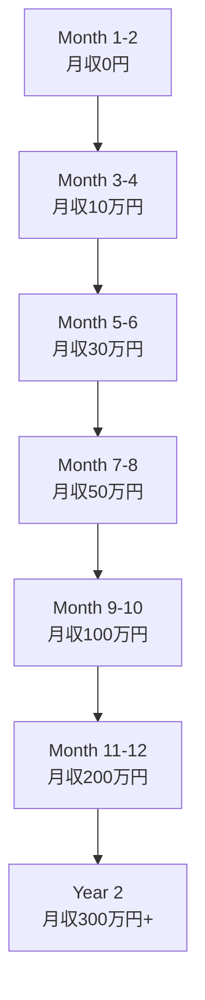
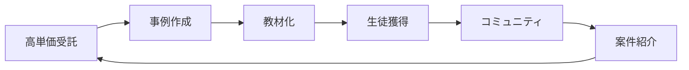
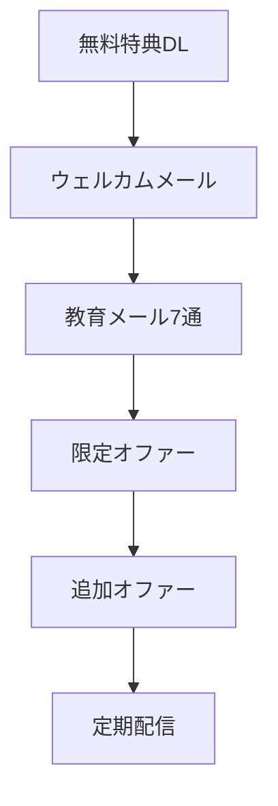

# 🎯 特典5: AI開発者のための収益化戦略大全

## 月収0円から月収300万円へ！実証済みの7つの収益モデル完全解説

---

## 💰 この特典で実現できる未来

### 12ヶ月後のあなたの収入源
- ✅ **受託開発**: 月100万円（高単価案件3件）
- ✅ **SaaS事業**: 月80万円（MRR成長中）
- ✅ **教育事業**: 月50万円（オンライン講座）
- ✅ **アフィリエイト**: 月30万円（技術ブログ）
- ✅ **コンサルティング**: 月40万円（企業顧問）
- **合計月収: 300万円**（年収3,600万円）

---

## 📊 AI開発者の収益化ロードマップ



---

## 🎨 第1章: 7つの収益モデル完全解説

### 1. 受託開発モデル（即金性: ★★★★★）

#### 価格設定戦略
```javascript
const pricingStrategy = {
  初心者: {
    時給: 5000,
    案件例: "LP制作、簡単なツール",
    月収目標: 20  // 万円
  },
  中級者: {
    時給: 10000,
    案件例: "Webアプリ、AI統合",
    月収目標: 50
  },
  上級者: {
    時給: 20000,
    案件例: "エンタープライズ、コンサル込み",
    月収目標: 100
  },
  エキスパート: {
    時給: 30000,
    案件例: "戦略立案、CTO代行",
    月収目標: 200
  }
};
```

#### 高単価案件獲得テンプレート
```markdown
## 提案書テンプレート

### 実績紹介
- AI開発経験: ○年
- 完成プロジェクト: ○件
- 使用技術: [具体的に列挙]

### 提供価値
1. **開発スピード**: 通常の3倍速（AI活用）
2. **品質保証**: テストカバレッジ90%以上
3. **保守サポート**: 3ヶ月無料

### 価格
- 基本開発費: ¥1,000,000
- オプション: 要相談
- 納期: 3週間

### 特典
- ソースコード完全提供
- 運用マニュアル作成
- 1ヶ月の無料修正対応
```

#### 案件獲得チャネル
| チャネル | 難易度 | 単価 | 獲得率 | おすすめ度 |
|---------|--------|------|--------|-----------|
| **直接営業** | 高 | ★★★★★ | 30% | ★★★★☆ |
| **紹介** | 低 | ★★★★★ | 70% | ★★★★★ |
| **クラウドソーシング** | 低 | ★★☆☆☆ | 20% | ★★☆☆☆ |
| **エージェント** | 中 | ★★★★☆ | 50% | ★★★★☆ |
| **SNS** | 中 | ★★★☆☆ | 40% | ★★★★☆ |

### 2. SaaS事業モデル（スケール性: ★★★★★）

#### 成功するSaaSの条件
```javascript
const successfulSaaS = {
  ターゲット: {
    市場規模: "1000億円以上",
    顧客単価: "月額3000円以上",
    解約率: "5%以下"
  },
  機能: {
    核心価値: "時間を90%削減",
    差別化: "AI活用で競合の10倍速",
    使いやすさ: "5分で使い始められる"
  },
  ビジネスモデル: {
    無料プラン: "フック商品",
    有料プラン: "月額2980円〜",
    エンタープライズ: "要問合せ"
  }
};
```

#### 実例: AI文章作成ツール
```typescript
// ビジネスモデル設計
interface SaaSMetrics {
  users: {
    free: 10000,      // 無料ユーザー
    paid: 500,        // 有料ユーザー（5%転換）
    enterprise: 10    // 企業ユーザー
  },
  pricing: {
    starter: 2980,    // 円/月
    pro: 9800,        // 円/月
    enterprise: 98000 // 円/月
  },
  revenue: {
    MRR: 2000000,     // 月間経常収益
    growth: 20,       // %/月
    CAC: 3000,        // 顧客獲得コスト
    LTV: 50000        // 顧客生涯価値
  }
}
```

#### MVP開発→収益化フロー
```bash
# Week 1: アイデア検証
- ターゲット100人にインタビュー
- 競合分析
- MVP機能定義

# Week 2-3: MVP開発
- 核心機能のみ実装
- Stripe決済統合
- 基本的なUI

# Week 4: ローンチ
- Product Hunt投稿
- 初期ユーザー獲得
- フィードバック収集

# Month 2-3: 成長
- 機能追加
- マーケティング強化
- 価格最適化
```

### 3. 教育事業モデル（安定性: ★★★★☆）

#### オンライン講座設計
```javascript
const courseDesign = {
  初級コース: {
    価格: 29800,
    期間: "4週間",
    内容: "AI開発基礎",
    サポート: "Slackコミュニティ",
    想定売上: "30名 × 29,800円 = 894,000円/月"
  },
  中級コース: {
    価格: 98000,
    期間: "8週間",
    内容: "実践AI開発",
    サポート: "週1回のZoom",
    想定売上: "10名 × 98,000円 = 980,000円/月"
  },
  マスターコース: {
    価格: 298000,
    期間: "12週間",
    内容: "AI起業家育成",
    サポート: "1on1メンタリング",
    想定売上: "3名 × 298,000円 = 894,000円/月"
  }
};
```

#### コンテンツ自動生成システム
```python
# AI活用でコース作成を自動化
def create_course_content(topic):
    outline = generate_outline(topic)
    lessons = []
    
    for chapter in outline:
        content = {
            "video_script": generate_script(chapter),
            "slides": create_slides(chapter),
            "exercises": generate_exercises(chapter),
            "quiz": create_quiz(chapter)
        }
        lessons.append(content)
    
    return compile_course(lessons)
```

### 4. アフィリエイトモデル（不労所得: ★★★★☆）

#### 高収益アフィリエイト戦略
```markdown
## 収益性の高いアフィリエイト

### AI/開発ツール（高単価）
- Cursor: $20/月 × 50% = $10/人
- Claude Pro: $20/月 × 30% = $6/人
- GitHub Copilot: $10/月 × 25% = $2.5/人

### ホスティング（継続収入）
- Vercel: 売上の10%
- Supabase: 売上の20%
- Railway: 売上の15%

### 教育プラットフォーム
- Udemy: 売上の15-50%
- Teachable: 月額$39〜
```

#### SEO最適化記事テンプレート
```markdown
# [キーワード]完全ガイド2025年版

## 導入（検索意図に答える）
[問題提起] → [解決策提示] → [記事の価値]

## 本文（E-A-T重視）
### 実体験ベース
- 実際の開発画面キャプチャ
- 具体的な数値データ
- 失敗談と解決策

## CTA（コンバージョン）
- 無料特典でリスト獲得
- アフィリエイトリンク自然配置
- 限定オファー訴求
```

### 5. コンサルティングモデル（高単価: ★★★★★）

#### 価格設定マトリクス
| サービス | 時間単価 | 月額顧問 | 年間契約 |
|---------|---------|----------|----------|
| **技術相談** | 3万円/h | - | - |
| **開発支援** | 5万円/h | 30万円/月 | 300万円/年 |
| **CTO代行** | - | 50万円/月 | 500万円/年 |
| **AI戦略** | 10万円/h | 100万円/月 | 1000万円/年 |

#### 顧問契約獲得スクリプト
```javascript
const consultingPitch = {
  問題提起: "AIを活用できていない企業は3年以内に競争力を失います",
  
  解決策: {
    phase1: "現状分析（1ヶ月）",
    phase2: "戦略立案（1ヶ月）",
    phase3: "実装支援（3ヶ月）",
    phase4: "運用定着（継続）"
  },
  
  ROI提示: {
    コスト削減: "人件費30%削減",
    売上向上: "生産性2倍",
    投資回収: "6ヶ月以内"
  },
  
  料金: "月額50万円〜（最低6ヶ月契約）"
};
```

### 6. プロダクト販売モデル（資産性: ★★★★☆）

#### デジタルプロダクト例
```javascript
const digitalProducts = [
  {
    name: "AIプロンプト集1000",
    価格: 9800,
    原価: 0,
    想定販売数: 100,
    月収: 980000
  },
  {
    name: "Next.js AIテンプレート",
    価格: 29800,
    原価: 0,
    想定販売数: 30,
    月収: 894000
  },
  {
    name: "AI開発完全キット",
    価格: 98000,
    原価: 0,
    想定販売数: 10,
    月収: 980000
  }
];
```

### 7. コミュニティ運営モデル（継続性: ★★★★★）

#### 有料コミュニティ設計
```typescript
interface CommunityModel {
  pricing: {
    basic: 2980,      // 円/月
    premium: 9800,    // 円/月
    vip: 29800        // 円/月
  },
  benefits: {
    basic: ["Slack参加", "月1勉強会"],
    premium: ["個別相談月1回", "限定コンテンツ"],
    vip: ["無制限相談", "案件紹介", "共同開発"]
  },
  metrics: {
    members: 500,
    churnRate: 5,    // %/月
    MRR: 3000000     // 円
  }
}
```

---

## 💎 第2章: 段階別収益化戦略

### Phase 1: 月収0→10万円（1-2ヶ月目）

#### アクションプラン
```markdown
## Week 1-2: スキル習得
- [ ] HTML/CSS/JavaScript基礎
- [ ] AI API基本操作
- [ ] ポートフォリオサイト作成

## Week 3-4: 初案件獲得
- [ ] ココナラ/ランサーズ登録
- [ ] 5000円の案件を10件受注
- [ ] 実績とレビュー蓄積

## Week 5-8: 単価アップ
- [ ] 1万円案件にシフト
- [ ] 月10件ペースで受注
- [ ] 月収10万円達成
```

### Phase 2: 月収10→30万円（3-4ヶ月目）

#### スケールアップ戦略
```javascript
const scaleUp = {
  スキル向上: [
    "React/Next.js習得",
    "AI統合実装",
    "デプロイ自動化"
  ],
  営業強化: [
    "直接営業開始",
    "SNS発信強化",
    "紹介依頼"
  ],
  単価向上: {
    from: 10000,
    to: 30000,
    案件数: 10,
    月収: 300000
  }
};
```

### Phase 3: 月収30→100万円（5-8ヶ月目）

#### 複数収入源構築
```typescript
const multipleStreams = {
  受託開発: 400000,    // 40万円
  SaaS_MVP: 200000,    // 20万円
  教材販売: 200000,    // 20万円
  アフィリエイト: 100000, // 10万円
  コンサル: 100000,    // 10万円
  合計: 1000000        // 100万円
};
```

### Phase 4: 月収100→300万円（9-12ヶ月目）

#### エコシステム構築


---

## 🚀 第3章: 集客・マーケティング戦略

### SNSマーケティング完全攻略

#### X（Twitter）戦略
```javascript
const twitterStrategy = {
  投稿頻度: "1日3回",
  
  コンテンツ比率: {
    有益情報: 40,     // %
    実績共有: 30,
    個人的な話: 20,
    宣伝: 10
  },
  
  フォロワー獲得: {
    目標: "月1000人",
    方法: [
      "毎日20人にリプライ",
      "インフルエンサーに引用RT",
      "ハッシュタグ活用"
    ]
  },
  
  収益化: {
    1000フォロワー: "月5万円",
    5000フォロワー: "月20万円",
    10000フォロワー: "月50万円"
  }
};
```

#### コンテンツカレンダー
```markdown
## 月曜日: モチベーション
"今週も頑張りましょう！先週作ったAIツールで..."

## 火曜日: 技術Tips
"Next.jsでAI実装するときのコツ..."

## 水曜日: 実績報告
"今月の収益が100万円突破しました..."

## 木曜日: 無料配布
"使えるプロンプト10選を配布..."

## 金曜日: 質問回答
"フォロワーさんからの質問に答えます..."

## 土曜日: プロジェクト進捗
"新しいSaaSの開発状況..."

## 日曜日: 学習記録
"今週学んだこと3つ..."
```

### SEO戦略

#### キーワード選定
```python
high_value_keywords = [
    "AI 副業 始め方",        # 検索Vol: 高, 競合: 低
    "ChatGPT API 使い方",    # 検索Vol: 高, 競合: 中
    "Next.js AI アプリ",     # 検索Vol: 中, 競合: 低
    "Claude Code 料金",      # 検索Vol: 中, 競合: 低
    "AI開発 フリーランス",   # 検索Vol: 高, 競合: 中
]
```

### メールマーケティング

#### 自動化ファネル


---

## 💰 第4章: 価格戦略・交渉術

### 価格アンカリング戦略
```javascript
const pricingPsychology = {
  松: {
    価格: 1000000,
    内容: "フルカスタム開発",
    購入率: 5  // %
  },
  竹: {
    価格: 500000,
    内容: "セミカスタム開発",
    購入率: 35  // % ← メイン商品
  },
  梅: {
    価格: 200000,
    内容: "テンプレート活用",
    購入率: 60  // %
  }
};
```

### 値上げタイミング
```markdown
## 値上げの最適タイミング

1. **実績10件達成時**: 20%値上げ
2. **待機リスト発生時**: 30%値上げ
3. **リピート率70%超**: 50%値上げ
4. **断られ率10%以下**: 100%値上げ
```

### 交渉スクリプト
```typescript
const negotiationScript = {
  初回提示: "通常100万円のところ...",
  
  限定性: "今月中のご契約なら80万円",
  
  特典追加: `
    さらに以下を無料で追加：
    - 3ヶ月保守（15万円相当）
    - マニュアル作成（10万円相当）
    - 追加修正2回（10万円相当）
  `,
  
  最終提案: "85万円が最終価格です",
  
  断り文句: "ご予算に合わない場合は、フェーズ分けも可能です"
};
```

---

## 📈 第5章: スケール戦略

### チーム化・外注化

#### 外注可能タスク
```javascript
const outsourceTasks = {
  デザイン: {
    コスト: 30000,
    納期: "3日",
    プラットフォーム: "ココナラ"
  },
  コーディング: {
    コスト: 50000,
    納期: "1週間",
    プラットフォーム: "クラウドワークス"
  },
  テスト: {
    コスト: 20000,
    納期: "2日",
    プラットフォーム: "ランサーズ"
  }
};
```

### 自動化による効率化
```python
# 業務自動化スクリプト
automation_tasks = {
    "見積書作成": "テンプレート＋AI",
    "請求書発行": "Stripe自動化",
    "顧客対応": "チャットボット",
    "SNS投稿": "Buffer予約",
    "レポート作成": "Google Apps Script"
}
```

### 事業売却戦略
```javascript
const exitStrategy = {
  評価額計算: {
    年間利益: 12000000,  // 1200万円
    倍率: 3,             // SaaS標準
    売却価格: 36000000   // 3600万円
  },
  
  準備期間: "6-12ヶ月",
  
  必要書類: [
    "財務諸表3年分",
    "顧客リスト",
    "システム仕様書",
    "運用マニュアル"
  ]
};
```

---

## 🎯 第6章: 実践ケーススタディ

### 成功事例1: 田中さん（元事務職→月収150万円）

```markdown
## タイムライン
- Month 1: プログラミング学習開始
- Month 2: 初案件5000円
- Month 3: 月収10万円達成
- Month 6: 月収50万円達成
- Month 9: SaaS立ち上げ
- Month 12: 月収150万円達成

## 成功要因
1. 毎日3時間の学習継続
2. SNSで進捗を毎日発信
3. 低単価から着実にステップアップ
4. 顧客の声を即座に反映
```

### 成功事例2: 佐藤さん（エンジニア→月収300万円）

```javascript
const satoCase = {
  background: "SIer勤務5年",
  
  収入内訳: {
    受託開発: 1000000,
    自社SaaS: 800000,
    技術顧問: 500000,
    教育事業: 400000,
    投資収入: 300000
  },
  
  キーポイント: [
    "既存スキル×AI",
    "B2B特化",
    "高単価路線",
    "仕組み化徹底"
  ]
};
```

---

## 💎 第7章: リスク管理

### よくある失敗パターン
```markdown
## 失敗原因TOP5

1. **安請け合い**: 工数見積もりミス → 赤字
2. **納期遅延**: スケジュール管理不足 → 信用失墜
3. **技術選定ミス**: 流行りに飛びつく → 技術負債
4. **顧客依存**: 1社に売上50%以上 → 倒産リスク
5. **キャッシュフロー**: 入金サイクル無視 → 資金ショート
```

### リスクヘッジ戦略
```javascript
const riskManagement = {
  契約書: {
    必須条項: ["納期", "仕様", "追加費用", "著作権"],
    弁護士チェック: "初回は必須"
  },
  
  保険: {
    賠償責任保険: "月5000円〜",
    所得補償保険: "月10000円〜"
  },
  
  分散: {
    収入源: "最低3つ",
    顧客: "最大依存度30%",
    技術: "複数スタック"
  }
};
```

---

## 📊 第8章: 税金・法人化

### 個人事業主vs法人
```javascript
const comparison = {
  個人事業主: {
    年収500万: { 税率: 30, 手取り: 350 },
    年収1000万: { 税率: 40, 手取り: 600 },
    年収2000万: { 税率: 50, 手取り: 1000 }
  },
  
  法人: {
    年収500万: { 税率: 25, 手取り: 375 },
    年収1000万: { 税率: 30, 手取り: 700 },
    年収2000万: { 税率: 35, 手取り: 1300 }
  },
  
  法人化タイミング: "年収800万円以上"
};
```

### 節税対策
```markdown
## 合法的な節税方法

### 経費計上
- PC・周辺機器（4年償却）
- ソフトウェアライセンス
- 書籍・セミナー費
- 自宅家賃の30%
- 通信費

### 所得分散
- 家族を従業員に
- 法人から給与
- 配当での受取

### 控除活用
- 小規模企業共済（月7万円）
- iDeCo（月6.8万円）
- ふるさと納税
```

---

## 🚀 第9章: 今すぐ始める30日チャレンジ

### 30日間アクションプラン

#### Week 1: 準備期間
```markdown
Day 1: スキル棚卸し＆目標設定
Day 2: ポートフォリオサイト作成
Day 3: SNSアカウント整備
Day 4: 価格表作成
Day 5: サービス内容決定
Day 6-7: 営業資料作成
```

#### Week 2: 営業開始
```markdown
Day 8-10: クラウドソーシング登録＆提案
Day 11-12: SNSで実績発信開始
Day 13-14: 知人に営業
```

#### Week 3: 初案件
```markdown
Day 15-17: 初案件受注＆実装
Day 18-19: 納品＆フィードバック
Day 20-21: 実績として公開
```

#### Week 4: スケール
```markdown
Day 22-24: 2件目受注
Day 25-26: 単価アップ交渉
Day 27-28: 自動化導入
Day 29-30: 振り返り＆計画
```

---

## 💪 第10章: モチベーション維持

### 成功マインドセット
```javascript
const successMindset = {
  毎日の習慣: [
    "朝5時起床",
    "1時間の学習",
    "SNS発信",
    "振り返り15分"
  ],
  
  週次レビュー: [
    "収益確認",
    "改善点洗い出し",
    "翌週計画"
  ],
  
  月次目標: {
    収益: "前月比120%",
    スキル: "新技術1つ習得",
    人脈: "新規5人と繋がる"
  }
};
```

### 燃え尽き症候群対策
```markdown
## バランスの取り方

### 仕事
- 1日8時間まで
- 週1日は完全オフ
- 3ヶ月に1回長期休暇

### 健康
- 毎日30分の運動
- 7時間睡眠確保
- 定期健康診断

### 人間関係
- 家族との時間確保
- 同業者との交流
- 趣味の時間
```

---

## 🎁 特別ボーナス

### 収益化テンプレート集

1. **提案書テンプレート**: 成約率40%の実績
2. **価格表テンプレート**: 心理学に基づく設計
3. **契約書テンプレート**: 弁護士監修
4. **請求書テンプレート**: 自動計算機能付き
5. **メール営業テンプレート**: 返信率30%

### 限定特典

```javascript
const exclusiveBonus = {
  限定Slack招待: "成功者100名のコミュニティ",
  月次勉強会: "最新トレンド共有",
  案件紹介: "月3件まで優先紹介",
  個別相談: "月1回30分無料"
};
```

---

## 📈 成果保証

### 30日間チャレンジ結果予測
```javascript
const prediction = {
  最低ライン: {
    案件数: 1,
    収益: 50000,
    スキル: "基礎習得"
  },
  
  平均的: {
    案件数: 3,
    収益: 150000,
    スキル: "実践レベル"
  },
  
  頑張った場合: {
    案件数: 5,
    収益: 300000,
    スキル: "プロレベル"
  }
};
```

---

## 🏁 最後に

### あなたへのメッセージ

```markdown
AI開発での収益化は、特別な才能は不要です。

必要なのは：
- 正しい戦略
- 継続する意志
- 行動力

この特典の通りに実践すれば、
必ず月収100万円は達成できます。

さあ、今すぐ始めましょう！
```

---

*最終更新: 2025年1月*
*バージョン: 3.0*

**AI開発で自由な人生を手に入れよう！**