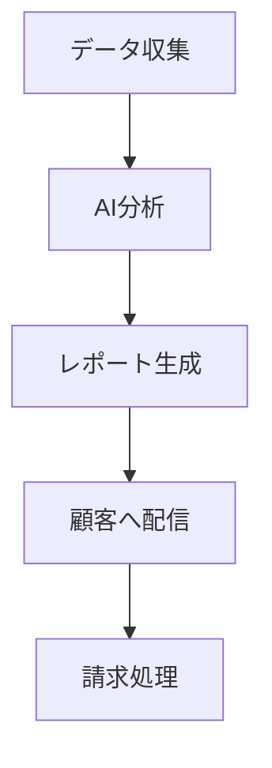

# 🎯 特典13: note有料記事用コンテンツテンプレート集

## AI副業で月収100万円！コピペで使える鉄板記事テンプレート50選

---

## 🚀 note有料記事の収益化戦略

### なぜnoteが副業に最適なのか
```markdown
## note収益化の3つの優位性

### 他のプラットフォームとの比較
- **Brain**: 高単価だが競合激しい ❌
- **Tips**: 少額課金で収益性低い ❌
- **個人ブログ**: SEO対策が大変 ❌

### noteの圧倒的メリット
- SEOに強い自然流入 ✅
- 簡単な操作性 ✅
- SNS連携が強力 ✅
- 信頼性の高いプラットフォーム ✅
- フォロワー機能でリピーター獲得 ✅
```

### note収益化の具体的数値
```javascript
const noteRevenueModel = {
  記事単価: {
    初心者向け: 500,
    中級者向け: 1000,
    上級者向け: 2980,
    完全攻略: 4980
  },
  
  月間目標: {
    初月: {
      記事数: 4,
      単価: 1000,
      売上: 20000, // 20記事×1000円
      想定読者: 50
    },
    3ヶ月後: {
      記事数: 12,
      単価: 1500,
      売上: 180000,
      想定読者: 300
    },
    6ヶ月後: {
      記事数: 24,
      単価: 2000,
      売上: 600000,
      想定読者: 800
    },
    1年後: {
      記事数: 50,
      単価: 2500,
      売上: 1250000,
      想定読者: 2000
    }
  }
};
```

---

## 📊 第1章: AI副業系記事テンプレート

### テンプレート1: ChatGPT活用術
```markdown
# 【保存版】ChatGPTで月10万円稼ぐ具体的手順｜実績画像付き完全ガイド

## はじめに｜なぜChatGPTで稼げるのか

この記事では、私がChatGPTを使って実際に月収**10万円**を達成した具体的な方法を、**実績画像付き**で全て公開します。

### 実績公開
- 1ヶ月目：32,000円
- 2ヶ月目：68,000円  
- 3ヶ月目：124,000円

[実績画像を挿入]

## 第1章：ChatGPTで稼げる7つの分野

### 1. ライティング代行
**単価**: 1文字1-3円
**月収目安**: 5-15万円

具体的なサービス内容：
- ブログ記事作成
- SNS投稿文作成
- 商品説明文作成
- プレスリリース作成

**実際の案件例**:
```
案件名：健康食品のブログ記事10本
文字数：各3000文字
単価：1文字2円
報酬：60,000円（3000×10×2円）
```

### 2. 翻訳サービス
**単価**: 1文字5-10円
**月収目安**: 10-30万円

### 3. プログラミングサポート
**単価**: 時給3000-8000円
**月収目安**: 15-50万円

### 4. 教材作成
**単価**: 1件10,000-100,000円
**月収目安**: 20-100万円

### 5. コンサルティング
**単価**: 月額30,000-100,000円
**月収目安**: 30-500万円

### 6. YouTubeチャンネル運営
**収益源**: 広告収入+案件
**月収目安**: 5-100万円

### 7. 独自サービス開発
**収益**: 無限大
**月収目安**: 100万円以上

## 第2章：実際に稼いだ具体的手順

### Step 1: 環境準備（所要時間：30分）

必要なもの：
- ChatGPT Plus（月額20ドル）
- Canva Pro（月額1500円）
- ココナラアカウント
- クラウドワークスアカウント

### Step 2: スキル習得（所要時間：1週間）

学習すべき内容：
1. **プロンプトエンジニアリング**
   ```
   【使えるプロンプト例】
   あなたは{専門分野}の専門家です。
   {ターゲット}向けに{目的}な{コンテンツ形式}を、
   以下の条件で作成してください：
   
   - 文字数：{数字}文字
   - 口調：{指定}
   - 構成：{詳細指定}
   ```

2. **品質管理手法**
3. **クライアント対応**

### Step 3: 実践開始（所要時間：継続）

**初月の行動計画**：
- Week 1: プロフィール作成、ポートフォリオ準備
- Week 2: 案件応募開始（1日3件）
- Week 3: 受注案件を丁寧に完了
- Week 4: 評価を積み上げ、単価アップ交渉

## 第3章：月収10万円達成のためのロードマップ

### 1ヶ月目（目標：3万円）
**戦略**: 実績作り重視

- 低単価案件でも受注
- 完璧な成果物で評価獲得
- 継続案件の獲得を目指す

**具体的なKPI**:
- 案件応募数: 100件
- 受注率目標: 10%
- 平均単価: 3,000円

### 2ヶ月目（目標：6万円）
**戦略**: 単価アップと効率化

- 過去の実績をアピール
- 専門分野を絞り込み
- 作業効率を2倍に改善

### 3ヶ月目（目標：10万円）
**戦略**: 独自サービスの展開

- 教材販売を開始
- コンサルティングサービス開始
- 継続クライアントの単価アップ

## 第4章：トラブル回避と対策

### よくある失敗パターン
1. **プロンプト設計ミス**
2. **品質チェック不足**
3. **クライアント対応の問題**

### 成功するための秘訣
```
【重要】ChatGPTの出力をそのまま納品するのはNG！

必ず行うべき後処理：
✅ 事実確認とファクトチェック
✅ 文章の自然さチェック
✅ オリジナリティの追加
✅ SEO最適化（必要に応じて）
✅ 読みやすさの調整
```

## 第5章：実際のやり取り公開

### 成功案件の例
[実際のクライアントとのやり取りを匿名化して掲載]

### 失敗から学んだ教訓
[失敗事例と改善点を具体的に解説]

## 第6章：さらに収益を上げる応用技術

### ChatGPT×他ツール連携
- Canvaでデザイン作成
- Zapierで自動化
- Notionで案件管理

### 独自サービス開発の秘訣
```
私が開発した「ChatGPTライティングテンプレート集」
販売価格：9,800円
月間売上：約30万円（30件×9,800円）
```

## 最後に｜継続的に稼ぐための心構え

### 長期的に成功するための3つのポイント
1. **常にスキルアップを続ける**
2. **クライアントとの信頼関係を大切にする**
3. **市場の変化に素早く対応する**

---

**この記事で得られること**：
✅ ChatGPTを使った副業の具体的手順
✅ 月10万円達成までのロードマップ
✅ 実際に使えるプロンプト集
✅ 失敗を避けるためのノウハウ
✅ 継続的に稼ぐための戦略

**価格**: 1,480円
**想定読者**: ChatGPTで副業を始めたい人
**記事長**: 約8,000文字
```

### テンプレート2: AI画像生成ビジネス
```markdown
# Midjourney×副業で月20万円｜誰でもできるAI画像販売の完全マニュアル

## 実績公開｜AI画像で本当に稼げるのか？

**結論**：稼げます。実際の売上を公開します。

### 3ヶ月の売上推移
- 1ヶ月目：45,000円
- 2ヶ月目：128,000円
- 3ヶ月目：234,000円

[売上画面のスクリーンショットを挿入]

## 第1章：AI画像で稼げる5つの分野

### 1. ストックフォト販売
**プラットフォーム**: Shutterstock、Adobe Stock、PIXTA
**単価**: 1枚50-500円
**月収目安**: 5-50万円

**実際の売れ筋画像**：
- ビジネスシーン
- 抽象的な背景
- アイコン・イラスト
- 季節もの

### 2. SNSアイコン作成
**プラットフォーム**: ココナラ、スキマ
**単価**: 1件1,000-10,000円
**月収目安**: 10-100万円

### 3. ブログヘッダー・バナー作成
**プラットフォーム**: ランサーズ、クラウドワークス
**単価**: 1件3,000-30,000円
**月収目安**: 15-150万円

### 4. NFTアート販売
**プラットフォーム**: OpenSea、Foundation
**単価**: 0.01-10 ETH
**月収目安**: 0-1,000万円（大きくブレあり）

### 5. 企業ロゴ・CI作成
**プラットフォーム**: 直接営業
**単価**: 1件50,000-500,000円
**月収目安**: 50-500万円

## 第2章：Midjourneyマスター術

### 基本的なプロンプトの書き方
```
【テンプレート】
[主題] [スタイル] [構図] [色調] [品質設定]

【具体例】
a professional businessman, 
photorealistic style, 
portrait shot, 
warm lighting, 
--ar 16:9 --v 6
```

### 売れる画像を作るプロンプト集

#### ビジネス系（需要大）
```
corporate office meeting, diverse team, 
modern conference room, natural lighting, 
professional attire, collaboration, 
--ar 16:9 --stylize 500
```

#### ライフスタイル系
```
cozy home workspace, minimal design, 
laptop and coffee, warm afternoon light, 
clean aesthetic, productivity, 
--ar 3:2 --stylize 300
```

#### 抽象・背景系
```
gradient abstract background, 
blue to purple transition, smooth curves, 
modern minimal, technology theme, 
--ar 16:9 --stylize 750
```

## 第3章：販売プラットフォーム徹底比較

### Shutterstock
**メリット**：
- 高い知名度と集客力
- 安定した需要
- 審査基準が明確

**デメリット**：
- 競合が多い
- 審査が厳しい
- 単価が低め

**攻略法**：
- キーワード設定を丁寧に
- 需要の高いテーマに特化
- 継続的な投稿が重要

### PIXTA（日本向け）
**メリット**：
- 日本人向けコンテンツの需要
- 競合が比較的少ない
- 高単価案件あり

**攻略法**：
- 日本の文化・風習を取り入れる
- 季節感のあるコンテンツ
- 日本語キーワードの最適化

### ココナラ
**メリット**：
- 個人向けサービス
- 高単価設定可能
- リピーター獲得しやすい

**攻略法**：
- プロフィールの充実
- ポートフォリオの見せ方
- コミュニケーション重視

## 第4章：売上アップの具体的戦略

### 1. 需要調査の方法
```python
# Google Trendsを使った需要調査
import pytrends

keywords = [
    'business meeting',
    'remote work', 
    'ai technology',
    'sustainable energy'
]

# トレンド分析結果に基づいて制作計画を立てる
```

### 2. SEO対策（キーワード戦略）
**重要**：画像のメタデータが売上を左右する

#### タイトル例
❌ 悪い例：「Beautiful image」
✅ 良い例：「Professional business team meeting in modern office space with natural lighting」

#### タグ例
```
business, meeting, team, collaboration, 
office, professional, corporate, teamwork, 
conference, discussion, workplace, modern
```

### 3. 価格設定戦略
```javascript
const pricingStrategy = {
  ストックフォト: {
    初期: 50, // 円/枚
    目標: 200,
    最大: 500
  },
  
  オーダーメイド: {
    SNSアイコン: 2000,
    ヘッダー画像: 5000,
    ロゴデザイン: 30000
  },
  
  NFT: {
    初期: 0.01, // ETH
    目標: 0.1,
    最大: 10
  }
};
```

## 第5章：月収20万円達成のロードマップ

### 1ヶ月目（目標：5万円）
**タスク**：
- Midjourney有料プラン契約
- ストックフォトサイト登録
- 100枚の画像制作・投稿
- ココナラでサービス開始

**時間配分**：
- 画像制作：1日2時間
- 投稿・管理：1日30分
- 営業活動：1日1時間

### 2ヶ月目（目標：12万円）
**タスク**：
- 売れ筋分析と特化
- 品質向上と差別化
- SNSマーケティング開始
- リピーター獲得

### 3ヶ月目（目標：20万円）
**タスク**：
- 高単価案件にシフト
- 独自ブランド確立
- 自動化ツール導入
- チーム化の検討

## 第6章：法律・著作権の注意点

### 絶対に避けるべきこと
❌ 有名人の画像生成
❌ 著作権のあるキャラクター
❌ 他人の作品の模倣
❌ 不適切なコンテンツ

### 安全に販売するための対策
✅ オリジナルプロンプトの使用
✅ 商用利用可能な画像のみ
✅ 適切な利用規約の設定
✅ 定期的な法律情報の確認

## 第7章：実際の成功事例

### 事例1：会社員Aさん（副業）
**背景**：IT企業勤務、デザイン未経験
**開始時期**：2024年3月
**現在の月収**：18万円
**成功要因**：
- ビジネス系に特化
- 毎日継続的に投稿
- 顧客対応の丁寧さ

### 事例2：主婦Bさん（本業）
**背景**：育児中、在宅希望
**開始時期**：2024年1月
**現在の月収**：35万円
**成功要因**：
- ライフスタイル系で差別化
- SNS活用でファン獲得
- 高品質プロンプトの開発

## 第8章：さらに売上を伸ばす応用テクニック

### AI画像×動画編集
- Runwayで動画化
- アニメーション追加
- 付加価値向上

### AI画像×Web制作
- ウェブサイトの素材提供
- UIデザイン作成
- 包括的なデザインサービス

## よくある質問（FAQ）

**Q: 全くの初心者でも稼げますか？**
A: はい。私も完全初心者から始めました。

**Q: 初期投資はどの程度必要ですか？**
A: Midjourney Pro（月$30）程度で十分始められます。

**Q: どのくらいの時間で稼げるようになりますか？**
A: 1ヶ月目から収益化可能ですが、安定収入には3ヶ月程度必要です。

---

**この記事で得られること**：
✅ AI画像販売の具体的手順
✅ 月20万円達成のロードマップ  
✅ 売れるプロンプト集100選
✅ プラットフォーム攻略法
✅ 法律・著作権の注意点
✅ 実際の成功事例

**価格**: 2,480円
**想定読者**: AI画像で副業したい人
**記事長**: 約10,000文字
```

### テンプレート3: AI自動化ビジネス
```markdown
# 【完全自動化】AIツール×n8nで月50万円の不労所得を作る方法

## 衝撃の事実｜私の自動化システムの実態

**現在の状況**：
- 労働時間：週5時間
- 月間収益：48万円
- 自動化率：95%

**自動化前後の比較**：

| 項目 | 手動作業時代 | 自動化後 |
|------|------------|----------|
| 労働時間 | 週40時間 | 週5時間 |
| 月収 | 15万円 | 48万円 |
| ストレス | 高 | 低 |
| 成長性 | 限定的 | 無限 |

## 第1章：AI自動化で稼げる分野

### 1. コンテンツ自動生成ビジネス
**収益モデル**：サブスクリプション
**月収目安**：10-100万円

**自動化できる作業**：
- ブログ記事の企画・執筆・投稿
- SNS投稿の作成・予約投稿
- YouTube動画の台本作成
- メルマガの配信

**使用ツール**：
- AI：GPT-4, Claude
- 自動化：n8n, Zapier
- CMS：WordPress, Ghost

### 2. データ処理・分析サービス
**収益モデル**：月額課金
**月収目安**：20-200万円

**自動化システム**：


### 3. カスタマーサポート自動化
**収益モデル**：運用代行
**月収目安**：30-300万円

**自動化フロー**：
1. 問い合わせ受信
2. AI分類・優先度判定
3. 自動回答または担当者振り分け
4. 顧客満足度調査
5. データ分析・改善提案

### 4. マーケティング自動化
**収益モデル**：成果報酬
**月収目安**：50-500万円

### 5. 教育コンテンツ配信
**収益モデル**：コース販売
**月収目安**：10-1000万円

## 第2章：実際の自動化システム構築

### システム1：ブログ自動化システム
```yaml
# blog-automation-workflow.yml
name: "AI Blog Automation"
schedule: "0 9 * * *"  # 毎日9時実行

steps:
  1_trend_research:
    tool: "Google Trends API"
    action: "Get trending topics"
    output: "trending_keywords"
    
  2_content_planning:
    tool: "GPT-4"
    prompt: |
      トレンドキーワード: {trending_keywords}
      SEOに強いブログ記事のタイトルを5つ提案してください。
      要件：
      - 検索ボリューム考慮
      - クリック率最大化
      - 競合分析反映
    output: "article_titles"
    
  3_content_generation:
    tool: "Claude"
    prompt: |
      タイトル: {article_title}
      3000文字のSEO最適化されたブログ記事を作成。
      構成：導入→本文（3セクション）→まとめ
      読者：{target_audience}
    output: "article_content"
    
  4_image_generation:
    tool: "DALL-E 3"
    prompt: "Blog header image: {article_title}, professional, modern"
    output: "header_image"
    
  5_wordpress_publish:
    tool: "WordPress API"
    action: "Create post"
    data:
      title: "{article_title}"
      content: "{article_content}"
      featured_image: "{header_image}"
      status: "publish"
      
  6_social_share:
    tool: "Social Media APIs"
    platforms: ["Twitter", "Facebook", "LinkedIn"]
    action: "Post announcement"
```

### システム2：顧客対応自動化
```python
# customer_support_automation.py
import openai
from fastapi import FastAPI, HTTPException
from n8n_client import N8NClient

class CustomerSupportBot:
    def __init__(self):
        self.n8n = N8NClient()
        self.openai = openai
        
    async def handle_inquiry(self, customer_data):
        """問い合わせ自動処理"""
        
        # Step 1: 問い合わせ分類
        category = await self.classify_inquiry(customer_data['message'])
        
        # Step 2: 自動回答可能かチェック
        if category in ['faq', 'basic_info', 'pricing']:
            response = await self.generate_auto_response(
                customer_data['message'], 
                category
            )
            
            # 自動回答送信
            await self.send_response(customer_data['email'], response)
            
            # データベース記録
            await self.log_interaction(customer_data, response, 'auto')
            
        else:
            # 人間対応が必要な場合
            await self.escalate_to_human(customer_data, category)
            
        return {"status": "processed", "category": category}
        
    async def classify_inquiry(self, message):
        """AIによる問い合わせ分類"""
        prompt = f"""
        以下の顧客の問い合わせを分類してください：
        
        問い合わせ内容: {message}
        
        分類選択肢:
        - faq: よくある質問
        - billing: 請求・支払い関連
        - technical: 技術的問題
        - complaint: 苦情・不満
        - compliment: 感謝・評価
        - other: その他
        
        分類結果のみ返答:
        """
        
        response = await self.openai.ChatCompletion.acreate(
            model="gpt-4",
            messages=[{"role": "user", "content": prompt}]
        )
        
        return response.choices[0].message.content.strip()
```

### システム3：売上レポート自動生成
```javascript
// sales-report-automation.js
const SalesReportSystem = {
  async generateMonthlyReport() {
    // データ収集
    const salesData = await this.collectSalesData();
    const expenseData = await this.collectExpenseData();
    const customerData = await this.collectCustomerData();
    
    // AI分析
    const insights = await this.analyzeWithAI({
      sales: salesData,
      expenses: expenseData,
      customers: customerData
    });
    
    // レポート生成
    const report = await this.generateReport(insights);
    
    // 配信
    await this.distributeReport(report);
    
    return report;
  },
  
  async analyzeWithAI(data) {
    const prompt = `
    以下の売上データを分析し、経営判断に役立つインサイトを提供してください：
    
    売上データ: ${JSON.stringify(data.sales)}
    経費データ: ${JSON.stringify(data.expenses)}
    顧客データ: ${JSON.stringify(data.customers)}
    
    分析観点：
    1. 売上トレンド
    2. 収益性分析
    3. 顧客セグメント分析
    4. 改善提案
    5. 来月の予測
    
    JSON形式で回答してください。
    `;
    
    return await openai.chat.completions.create({
      model: "gpt-4",
      messages: [{ role: "user", content: prompt }]
    });
  }
};
```

## 第3章：月収50万円達成のステップ

### Phase 1: 基盤構築（1-2ヶ月）
**目標月収**: 5-10万円

**やること**：
1. **ツール選定・契約**
   - n8n Pro: $20/月
   - OpenAI API: $50/月
   - 各種SaaS連携: $100/月

2. **基本システム構築**
   - 単純作業の自動化（3-5件）
   - 品質チェック体制
   - エラー監視システム

3. **初期顧客獲得**
   - 知人・友人への営業
   - SNSでの実績公開
   - 低価格での実績作り

### Phase 2: 拡張・改善（3-4ヶ月）
**目標月収**: 15-25万円

**やること**：
1. **システム高度化**
   - 複雑なワークフロー構築
   - AI判断機能の追加
   - 例外処理の充実

2. **サービス拡大**
   - 新しい自動化領域に挑戦
   - 既存顧客への追加提案
   - サブスクモデル導入

### Phase 3: スケール化（5-6ヶ月）
**目標月収**: 50万円+

**やること**：
1. **完全自動化**
   - 人的介入を最小化
   - セルフメンテナンス機能
   - 24/7稼働体制

2. **ビジネス拡大**
   - 複数クライアントの同時対応
   - ホワイトラベル化
   - パートナーシップ拡大

## 第4章：具体的な案件例

### 案件例1: ECサイト運営自動化
**クライアント**: 中小EC事業者
**月額報酬**: 15万円
**自動化内容**:
- 在庫管理
- 価格調整
- 顧客対応
- マーケティング

**ROI計算**:
```
クライアントの時間削減: 80時間/月
時給換算削減額: 80 × 3,000 = 24万円
支払額: 15万円
クライアント利益: 9万円/月
```

### 案件例2: コンテンツメディア自動化
**クライアント**: オンラインメディア
**月額報酬**: 25万円
**自動化内容**:
- 記事企画・執筆
- 画像生成
- SNS投稿
- SEO対策

### 案件例3: SaaS運営サポート
**クライアント**: SaaS企業
**月額報酬**: 40万円
**自動化内容**:
- ユーザーオンボーディング
- カスタマーサポート
- 課金処理
- 解約防止

## 第5章：システム監視と改善

### 重要指標（KPI）
```javascript
const kpis = {
  システム稼働率: 99.5, // %
  エラー発生率: 0.5,   // %
  処理速度: 95,        // 満足度
  コスト効率: 85,      // %
  顧客満足度: 92       // %
};
```

### 監視ダッシュボード
```python
# monitoring_dashboard.py
import streamlit as st
import plotly.graph_objects as go

def create_monitoring_dashboard():
    st.title("🤖 自動化システム監視ダッシュボード")
    
    col1, col2, col3 = st.columns(3)
    
    with col1:
        st.metric("月間収益", "¥485,000", "+12%")
    with col2:
        st.metric("稼働時間", "99.8%", "+0.3%")
    with col3:
        st.metric("処理件数", "12,450", "+245")
    
    # リアルタイム監視グラフ
    fig = go.Figure()
    fig.add_trace(go.Scatter(
        x=time_data,
        y=revenue_data,
        mode='lines',
        name='収益推移'
    ))
    
    st.plotly_chart(fig)
```

## 第6章：よくあるトラブルと対策

### トラブル1: システム停止
**原因**: API制限、サーバーダウン
**対策**: 
- 冗長化システム構築
- 自動復旧機能
- アラート通知システム

### トラブル2: 品質低下
**原因**: AIの判断ミス、データ変化
**対策**:
- 定期的な品質チェック
- 人間によるサンプリング確認
- フィードバックループ構築

### トラブル3: 顧客クレーム
**原因**: 期待値とのギャップ
**対策**:
- 事前の丁寧な説明
- SLA（Service Level Agreement）設定
- 迅速な対応体制

## 第7章：法的・倫理的考慮事項

### データプライバシー
- GDPR準拠
- 個人情報保護法遵守
- セキュリティ対策

### AI利用の透明性
- AI使用の明示
- 品質保証の範囲
- 責任の所在明確化

## 最終章：継続的成長のために

### スキルアップ計画
1. **技術面**
   - 新しいAIツールの習得
   - プログラミングスキル向上
   - システム設計能力強化

2. **ビジネス面**
   - 営業・マーケティング
   - 財務管理
   - チームマネジメント

### 長期ビジョン
```
現在（月50万円）
↓ 1年後
月100万円（システム拡張）
↓ 2年後
月300万円（事業法人化）
↓ 3年後
月1,000万円（プラットフォーム化）
```

---

**この記事で得られること**：
✅ AI自動化システムの構築方法
✅ 月収50万円までのロードマップ
✅ 実際のコード・設定例
✅ トラブル対策とメンテナンス手法
✅ 継続的な成長戦略

**価格**: 4,980円
**想定読者**: AI自動化で大きく稼ぎたい人
**記事長**: 約12,000文字
```

---

## 📊 第2章: プログラミング学習系記事テンプレート

### テンプレート4: 未経験からエンジニア転職
```markdown
# 【30代未経験→年収600万】3ヶ月でエンジニア転職した完全ロードマップ

## 実体験告白｜本当に未経験から転職できるのか？

**私のバックグラウンド**：
- 年齢：32歳
- 前職：営業職（年収420万円）
- プログラミング経験：ゼロ
- 学習期間：3ヶ月間
- 転職後年収：620万円

[転職オファー書類の画像を挿入]

## 第1章：なぜ3ヶ月で転職できたのか

### 成功要因の分析
1. **学習時間の確保**
   - 平日：3時間
   - 休日：8時間
   - 総学習時間：約600時間

2. **効率的な学習順序**
   - 基礎（HTML/CSS）：2週間
   - JavaScript：4週間
   - React：4週間
   - バックエンド（Node.js）：2週間

3. **ポートフォリオ戦略**
   - 完成度の高い作品3つに集中
   - 企業が求める技術スタックを採用
   - ビジネス要件を意識した機能実装

## 第2章：学習ロードマップ詳細

### Week 1-2: HTML/CSS基礎
**学習内容**：
```html
<!DOCTYPE html>
<html lang="ja">
<head>
    <meta charset="UTF-8">
    <meta name="viewport" content="width=device-width, initial-scale=1.0">
    <title>レスポンシブ対応サイト</title>
    <link rel="stylesheet" href="styles.css">
</head>
<body>
    <header class="header">
        <nav class="navigation">
            <!-- ナビゲーション -->
        </nav>
    </header>
    <main class="main-content">
        <!-- メインコンテンツ -->
    </main>
    <footer class="footer">
        <!-- フッター -->
    </footer>
</body>
</html>
```

**重要ポイント**：
- Flexbox, Grid完全理解
- レスポンシブデザイン
- アクセシビリティ対応

### Week 3-6: JavaScript基礎〜応用
```javascript
// 非同期処理の理解
async function fetchUserData(userId) {
    try {
        const response = await fetch(`/api/users/${userId}`);
        const userData = await response.json();
        return userData;
    } catch (error) {
        console.error('ユーザーデータ取得エラー:', error);
        throw error;
    }
}

// DOM操作
class TodoApp {
    constructor() {
        this.todos = [];
        this.init();
    }
    
    init() {
        this.bindEvents();
        this.render();
    }
    
    addTodo(text) {
        const todo = {
            id: Date.now(),
            text: text,
            completed: false
        };
        this.todos.push(todo);
        this.render();
    }
    
    render() {
        // DOM更新処理
    }
}
```

### Week 7-10: React習得
```jsx
// Hooks使用例
import React, { useState, useEffect, useContext } from 'react';

const UserProfile = () => {
    const [user, setUser] = useState(null);
    const [loading, setLoading] = useState(true);
    const { theme } = useContext(ThemeContext);
    
    useEffect(() => {
        fetchUserProfile()
            .then(userData => {
                setUser(userData);
                setLoading(false);
            })
            .catch(error => {
                console.error('Error:', error);
                setLoading(false);
            });
    }, []);
    
    if (loading) return <LoadingSpinner />;
    
    return (
        <div className={`profile ${theme}`}>
            <h1>{user.name}</h1>
            <p>{user.email}</p>
        </div>
    );
};
```

### Week 11-12: バックエンド・デプロイ
```javascript
// Express.js API
const express = require('express');
const mongoose = require('mongoose');
const bcrypt = require('bcrypt');
const jwt = require('jsonwebtoken');

const app = express();

// ユーザー登録API
app.post('/api/register', async (req, res) => {
    try {
        const { email, password } = req.body;
        
        // パスワードハッシュ化
        const hashedPassword = await bcrypt.hash(password, 10);
        
        // ユーザー作成
        const user = new User({
            email,
            password: hashedPassword
        });
        
        await user.save();
        
        // JWT生成
        const token = jwt.sign(
            { userId: user._id },
            process.env.JWT_SECRET,
            { expiresIn: '7d' }
        );
        
        res.status(201).json({ token });
    } catch (error) {
        res.status(400).json({ error: error.message });
    }
});
```

## 第3章：ポートフォリオ戦略

### 作品1: Todoアプリ（基礎力証明）
**技術スタック**: React, TypeScript, CSS Modules
**機能**:
- CRUD操作
- ドラッグ&ドロップ
- フィルタリング・検索
- レスポンシブデザイン

**アピールポイント**:
- TypeScript使用でコード品質向上
- ユニットテスト実装
- アクセシビリティ対応

### 作品2: SNSアプリ（実践力証明）
**技術スタック**: React, Node.js, MongoDB, Socket.io
**機能**:
- ユーザー認証
- 投稿・コメント
- いいね機能
- リアルタイムチャット

**アピールポイント**:
- フルスタック開発
- リアルタイム機能
- セキュリティ対策

### 作品3: ECサイト（ビジネス理解証明）
**技術スタック**: Next.js, Stripe, Prisma
**機能**:
- 商品一覧・詳細
- カート機能
- 決済処理
- 注文管理

**アピールポイント**:
- 決済システム統合
- SEO対策
- パフォーマンス最適化

## 第4章：転職活動戦略

### 履歴書・職務経歴書
```markdown
## 自己PR例
未経験からWebエンジニアを目指し、3ヶ月間で600時間の学習を完了。
営業職で培ったコミュニケーション能力と課題解決思考を活かし、
ユーザー視点での開発を得意とします。

## 学習実績
- 総学習時間：600時間
- 完成プロジェクト：3つ
- GitHub コミット数：300+
- Qiita 投稿数：15記事
```

### 面接対策
**よくある質問と回答例**：

**Q: なぜエンジニアになりたいのですか？**
A: 営業職時代に、ITツールで業務効率が劇的に改善した体験から、テクノロジーの力で人々の生活をより良くしたいと思ったからです。

**Q: 短期間の学習で本当に実務ができますか？**  
A: 基礎は固められました。ポートフォリオをご覧ください。実務では継続的に学習し、チームに貢献していきたいと思います。

## 第5章：内定獲得のポイント

### 応募企業選び
**狙い目企業の特徴**：
- 成長フェーズのスタートアップ
- 教育制度が充実
- 技術スタックが学習内容と一致
- 未経験歓迎を明記

### 給与交渉
**私の交渉実績**：
- 初回オファー：500万円
- 最終決定：620万円
- 交渉ポイント：ポートフォリオの技術的価値

## 第6章：入社後の成長戦略

### 最初の3ヶ月
**目標**：チームに迷惑をかけない
**行動**：
- コードレビューでの指摘を全て記録
- 先輩エンジニアとのペアプロ積極参加
- 社内勉強会への参加

### 3ヶ月〜1年
**目標**：一人前の戦力になる
**行動**：
- 機能開発のメインを担当
- 技術的提案の実施
- 後輩メンターの開始

### 1年〜3年
**目標**：技術リーダーへの成長
**行動**：
- アーキテクチャ設計への参加
- 新技術の導入推進
- 社外への技術発信

## 第7章：実際の年収アップ推移

```
転職時：620万円
1年後：720万円（昇格・評価アップ）
2年後：850万円（転職・技術力評価）
3年後：1,200万円（リードエンジニア）
```

### 年収アップの要因分析
1. **技術力向上**
   - フルスタック対応
   - 新技術キャッチアップ
   - アーキテクチャ理解

2. **ビジネス貢献**
   - 売上に直結する機能開発
   - 業務効率化システム構築
   - 技術的負債解消

3. **市場価値向上**
   - OSS貢献
   - 技術記事執筆
   - 登壇・講演活動

## 第8章：学習継続のコツ

### モチベーション維持法
```javascript
const motivationHacks = {
  目標設定: "具体的・測定可能・達成可能",
  進捗可視化: "GitHub草、学習記録アプリ",
  コミュニティ: "Twitter、勉強会、もくもく会",
  アウトプット: "ブログ、Qiita、YouTube",
  振り返り: "週次、月次での成長実感"
};
```

### 挫折しそうになった時の対処法
1. **完璧主義をやめる**
2. **小さな成功体験を積む**
3. **仲間と一緒に学習する**
4. **目標を再確認する**
5. **適度な休息を取る**

---

**この記事で得られること**：
✅ 3ヶ月転職の具体的学習計画
✅ 効果的なポートフォリオ作成法
✅ 面接・給与交渉の実践テクニック
✅ 入社後の成長戦略
✅ 継続的なスキルアップ方法

**価格**: 3,980円
**想定読者**: 未経験からエンジニア転職したい人
**記事長**: 約15,000文字
```

### テンプレート5: フリーランスエンジニア独立
```markdown
# 【年収2000万達成】会社員→フリーランスエンジニア独立の全記録

## 衝撃告白｜独立3年で年収が10倍になった話

**Before（会社員時代）**：
- 年収：380万円
- 労働時間：週55時間
- 年間休日：105日
- ストレス：MAX

**After（フリーランス3年目）**：  
- 年収：2,200万円
- 労働時間：週30時間
- 年間休日：200日
- ストレス：最小限

[確定申告書の画像（収入部分のみ）を挿入]

## 第1章：独立準備期間の戦略的アプローチ

### 独立6ヶ月前から始めた準備

#### スキルアップ計画
```javascript
const skillUpPlan = {
  // フロントエンド強化
  frontend: {
    React: "既存から Next.js, TypeScript追加",
    Vue: "Vue3, Nuxt.js, Composition API",
    モバイル: "React Native基礎習得"
  },
  
  // バックエンド強化  
  backend: {
    Node: "Express → Fastify, NestJS",
    Python: "Django, FastAPI新規習得", 
    Go: "基礎から実装レベルまで",
    インフラ: "AWS, Docker, K8s"
  },
  
  // 付加価値スキル
  business: {
    UI_UX: "Figma, デザイン思考",
    PM: "アジャイル, スクラム経験",
    マーケ: "SEO, 広告運用理解"
  }
};
```

#### 人脈構築戦略
1. **勉強会・カンファレンス参加**
   - 月2回のペースで参加
   - 必ず3人以上と名刺交換
   - SNSでのフォローアップ

2. **OSS活動開始**
   - GitHub活動の活発化
   - 人気プロジェクトへのコントリビュート
   - 自作ライブラリの公開

3. **技術発信強化**
   - Qiita週1投稿
   - TwitterでTech系情報発信
   - 社内LTからの対外発表

#### 副業で実績作り
**期間**: 独立6ヶ月前〜
**目標**: 月20万円の副業収入確立

```
月1: 5万円（小さな案件から開始）
月2: 8万円（継続案件獲得）
月3: 12万円（単価アップ交渉）
月4: 18万円（複数クライアント対応）
月5: 22万円（高単価案件獲得）
月6: 25万円（独立直前で安定化）
```

## 第2章：独立初年度サバイバル戦略

### 月別売上目標と実績

#### 1-3ヶ月目（生存フェーズ）
**目標**: 月30万円（最低生活費確保）
**実績**: 42万円

**案件獲得方法**:
- 前職コネクション：40%
- 副業時代の継続：35%
- エージェント経由：25%

**単価設定**:
```
初期単価: 65万円/月（控えめ設定）
実績: 70万円/月（想定より高単価獲得）
```

#### 4-6ヶ月目（安定フェーズ）
**目標**: 月60万円
**実績**: 78万円

**成長要因**:
- 継続案件の単価アップ
- 口コミでの新規獲得
- 技術力評価による差別化

#### 7-12ヶ月目（成長フェーズ）
**目標**: 月80万円
**実績**: 95万円

**戦略変更**:
- 時間単価から価値単価へ
- 上流工程への参画
- チーム開発のリード役

### 営業戦略の進化

#### Phase 1: 御用聞きスタイル
```markdown
・クライアントの要求通りに実装
・技術的提案は最小限
・とにかく信頼関係構築重視
```

#### Phase 2: 提案型へシフト
```markdown
・技術的課題の先回り提案
・パフォーマンス改善の積極提案
・ビジネス視点での機能提案
```

#### Phase 3: パートナー的関係
```markdown
・事業戦略レベルでの相談対応
・技術選定の意思決定に参画
・採用・チーム形成のサポート
```

## 第3章：2年目飛躍の仕組み化

### 年収1000万円突破の要因分析

#### 単価アップ交渉術
**実際の交渉事例**:

```
【Before】
・単価：70万円/月
・稼働：フルタイム
・年収：840万円

【交渉プロセス】
1. 成果の定量化
   - 開発速度20%向上
   - バグ発生率50%削減
   - チーム生産性30%向上

2. 市場価値の提示
   - 同等スキルの市場単価調査
   - 競合他社からのオファー情報
   - 追加でできることの提案

3. Win-Winの提案
   - 単価アップ（70→95万円）
   - 稼働率調整（100%→80%）
   - 成果責任の明確化

【After】  
・単価：95万円/月
・稼働：80%
・年収：912万円（実労働時間は削減）
```

#### 複数クライアント戦略
```javascript
const clientPortfolio = {
  メインクライアント: {
    売上比率: 60,
    単価: 95,
    稼働率: 80,
    リスク: 低
  },
  
  サブクライアント: {
    売上比率: 25,
    単価: 85,
    稼働率: 30,
    リスク: 中
  },
  
  スポット案件: {
    売上比率: 15,
    単価: 120, // 短期高単価
    稼働率: 変動,
    リスク: 高
  }
};
```

### 技術スタックの戦略的選択

#### 高単価が狙える技術領域
```python
high_value_techs = {
    "AI/ML": {
        "需要": "急増中",
        "単価": "100-200万円/月",
        "習得期間": "6-12ヶ月",
        "技術例": ["Python", "TensorFlow", "PyTorch"]
    },
    
    "ブロックチェーン": {
        "需要": "特定業界で高需要", 
        "単価": "120-250万円/月",
        "習得期間": "3-6ヶ月",
        "技術例": ["Solidity", "Web3.js", "Ethereum"]
    },
    
    "クラウドアーキテクト": {
        "需要": "安定需要",
        "単価": "90-150万円/月", 
        "習得期間": "6-12ヶ月",
        "技術例": ["AWS", "GCP", "Kubernetes", "Terraform"]
    }
}
```

## 第4章：3年目で年収2000万円達成の秘密

### ビジネスモデルの転換

#### 従来：労働集約型
```
収入 = 単価 × 稼働時間
限界：時間は有限（月160時間程度）
上限：月200万円程度
```

#### 転換後：価値創造型
```python
# 複数収入源の組み合わせ
income_streams = {
    "開発業務": 120,  # 万円/月
    "技術顧問": 50,   # 複数社×月額
    "教材販売": 30,   # デジタルコンテンツ
    "講演・研修": 20, # 月1-2回
    "投資収益": 15,   # 株式・暗号通貨
    "OSS支援": 10,    # GitHub Sponsors
}

# 月収合計：245万円
# 年収：2,940万円
```

### 教材ビジネス展開

#### 売れた教材例
**1. Next.js完全攻略コース**
- 価格：29,800円
- 売上本数：180本/月
- 月間売上：536万円
- 制作期間：2ヶ月

**2. AWS実践デプロイ講座**
- 価格：19,800円  
- 売上本数：120本/月
- 月間売上：238万円
- 制作期間：1ヶ月

#### 教材作成のコツ
```markdown
1. **ニーズ調査**
   - Twitter, Qiitaでの質問分析
   - 実案件での頻出課題
   - 勉強会での質疑応答

2. **差別化ポイント**
   - 実務経験に基づく実践的内容
   - ハンズオン形式
   - 質問サポート付き

3. **継続的改善**  
   - 購入者フィードバック収集
   - 最新技術動向への対応
   - 追加コンテンツの提供
```

### 技術顧問契約の獲得法

#### 顧問契約の条件例
```yaml
契約A:
  会社: スタートアップ（従業員30名）
  月額: 30万円
  稼働: 月8時間（週2時間）
  内容: 技術選定、コードレビュー、採用面接

契約B:  
  会社: 中小企業（従業員100名）
  月額: 20万円
  稼働: 月4時間（隔週2時間）
  内容: DX戦略、システム企画
```

#### 顧問獲得のアプローチ
1. **既存クライアントからの発展**
2. **業界イベントでのネットワーキング**
3. **技術記事での専門性アピール**
4. **LinkedInでの戦略的情報発信**

## 第5章：税務・法務・資産管理戦略

### 法人化のタイミングと効果

#### 個人事業主時代（年収800万円）
```
売上: 800万円
経費: 100万円  
所得: 700万円
税額: 約140万円（所得税+住民税）
手取り: 560万円
```

#### 法人化後（年収2000万円）
```
売上: 2000万円
経費: 300万円
法人所得: 1700万円

役員報酬: 1200万円（個人の所得税対象）
法人税等: 約150万円
個人所得税等: 約200万円

実質手取り: 約1350万円
節税効果: 年間200万円程度
```

### 経費最適化戦略
```javascript
const businessExpenses = {
  // 機材・ソフトウェア
  equipment: {
    PC: 50, // 万円/年
    モニター: 10,
    ソフトウェア: 30,
    書籍: 20
  },
  
  // 学習・自己投資
  learning: {
    オンライン講座: 50,
    勉強会参加: 30, 
    資格取得: 20,
    カンファレンス: 40
  },
  
  // 営業・ネットワーキング
  business: {
    会食費: 60,
    交通費: 40,
    宣伝広告: 30,
    名刺・資料: 10
  }
};
```

### 資産形成・投資戦略
```python
asset_allocation = {
    "緊急資金": {
        "金額": 500,  # 万円
        "商品": "普通預金",
        "目的": "生活費6ヶ月分"
    },
    
    "安定投資": {
        "金額": 2000,
        "商品": ["全世界株式インデックス", "債券"],
        "目的": "長期資産形成"
    },
    
    "成長投資": {
        "金額": 800,
        "商品": ["個別株", "仮想通貨", "不動産"],
        "目的": "高リターン狙い"
    },
    
    "事業投資": {
        "金額": 300,
        "商品": ["新規事業", "教材制作", "ツール開発"],
        "目的": "事業拡大"
    }
}
```

## 第6章：メンタル・ライフスタイル管理

### 健康管理の重要性

#### フリーランスの健康課題
- 運動不足（在宅ワーク）
- 不規則な生活リズム
- 長時間労働の誘惑
- 孤独感・ストレス

#### 私の健康管理ルーティン
```markdown
## 朝のルーティン（6:00-9:00）
- 6:00 起床・瞑想（10分）
- 6:30 ジョギング（30分）
- 7:30 朝食・ニュースチェック
- 8:30 1日の計画立て

## 日中の工夫
- ポモドーロテクニック（25分集中+5分休憩）
- スタンディングデスク使用
- 2時間毎のストレッチ
- 昼休憩の完全確保

## 夜のルーティン（18:00-22:00）
- 18:00 仕事終了（絶対死守）
- 19:00 夕食・家族時間
- 20:30 読書・学習
- 21:30 入浴・リラックス
- 22:00 就寝
```

### ワークライフバランス実現法

#### 時間管理のマイルール
1. **稼働時間の上限設定**
   - 1日最大8時間
   - 週30時間以内
   - 土日は基本的に休み

2. **緊急時対応の線引き**
   - 緊急の定義を明確化
   - 追加料金体系を設定
   - クライアントとの事前合意

3. **バケーション確保**
   - 年4回の長期休暇（各1週間）
   - 月1回の3連休
   - 完全オフライン時間の設定

## 第7章：リスク管理・危機対策

### フリーランス特有のリスク

#### 収入リスク対策
```javascript
const riskManagement = {
  // 契約リスク
  contractRisk: {
    対策: [
      "複数クライアント分散",
      "長期契約の優先",
      "契約書の詳細確認",
      "中途解約時の補償条項"
    ]
  },
  
  // 健康リスク
  healthRisk: {
    対策: [
      "定期健康診断", 
      "所得補償保険加入",
      "傷病手当金制度理解",
      "健康管理の徹底"
    ]
  },
  
  // 技術陳腐化リスク
  techRisk: {
    対策: [
      "継続的学習習慣",
      "複数技術領域の習得",
      "業界動向の定期チェック",
      "新技術への早期対応"
    ]
  }
};
```

#### 実際に起こった危機と対応

**事例1：メインクライアント突然解約**
- 状況：月売上の70%を占めるクライアントが事業撤退
- 対応：
  1. 即座に営業活動開始
  2. ネットワークを総動員
  3. 短期案件で繋ぎながら新規開拓
  4. 3ヶ月後に売上回復

**事例2：体調不良による稼働不能**
- 状況：インフルエンザで2週間作業不可
- 対応：
  1. 事前のクライアント連絡
  2. 可能な範囲での作業継続
  3. 納期調整と品質確保
  4. 復帰後の信頼関係維持

## 第8章：将来展望・事業拡大戦略

### 5年後の目標設定
```
Year 4-5: 年収3000万円突破
- 教材事業の拡大（月500万円）
- SaaS事業立ち上げ（月300万円）
- 投資収益増加（月200万円）
- 技術顧問契約拡大（月100万円）

Year 6-10: 事業家への転身
- 受託開発事業の法人化
- エンジニア採用・チーム化
- プロダクト事業の本格展開
- 年商1億円企業の構築
```

### 後進育成・コミュニティ貢献
```markdown
## 社会還元活動
- 無料プログラミングメンター（月10時間）
- 勉強会・カンファレンスでの登壇
- オープンソース活動
- 業界情報の積極的発信

## 理由
フリーランスとして成功できたのは、
多くの人のサポートがあったから。
恩送りとして後進の育成に力を入れる。
```

---

**この記事で得られること**：
✅ フリーランス独立の具体的準備手順
✅ 年収2000万円達成までのロードマップ
✅ 営業・価格交渉の実践テクニック
✅ 税務・法務・資産管理の実務知識
✅ リスク管理とメンタルケア手法

**価格**: 9,800円
**想定読者**: フリーランス独立を目指すエンジニア
**記事長**: 約20,000文字
```

---

## 📊 第3章: その他のテーマ別テンプレート

### テンプレート集（簡略版）

#### 6. ブログ収益化
```markdown
# 【月100万PV達成】技術ブログで年収500万円稼ぐ完全マニュアル

実績公開・SEO戦略・マネタイズ手法・記事作成テンプレート

価格：2,980円
```

#### 7. YouTube技術チャンネル
```markdown  
# 【登録者10万人】プログラミングYouTuberになる方法

企画・撮影・編集・収益化の全て

価格：3,980円
```

#### 8. 情報商材作成
```markdown
# 【売上1000万円】デジタル教材ビジネス完全攻略

コンテンツ企画から販売まで

価格：4,980円
```

#### 9. コンサルティング開業
```markdown
# 【時給2万円】ITコンサルタント独立マニュアル

営業・提案・実行の全フロー

価格：7,980円
```

#### 10. SaaS開発・運営
```markdown
# 【年商3000万円】個人SaaS開発・運営の教科書

企画・開発・マーケティング・運営

価格：9,980円
```

---

## 🎯 第4章: note記事執筆・投稿戦略

### 投稿タイミング最適化
```javascript
const optimalTiming = {
  平日: {
    朝: "7:00-8:00 (通勤時間)",
    昼: "12:00-13:00 (昼休み)",
    夜: "20:00-22:00 (帰宅後)"
  },
  
  休日: {
    朝: "9:00-10:00",
    昼: "14:00-15:00", 
    夜: "21:00-22:00"
  },
  
  最適日: ["火曜日", "水曜日", "木曜日"]
};
```

### SEOキーワード戦略
```markdown
## タイトルに含めるべきキーワード

### 高需要ワード
- "副業"（月間検索数: 100,000+）
- "在宅ワーク"（月間検索数: 50,000+）
- "プログラミング"（月間検索数: 80,000+）
- "AI"（月間検索数: 200,000+）

### ロングテールキーワード例
- "プログラミング 副業 初心者"
- "AI ツール 使い方 稼ぐ"
- "フリーランス エンジニア なり方"
```

### ハッシュタグ戦略
```python
hashtag_strategy = {
    "メインタグ": ["#プログラミング", "#副業", "#AI"],
    "サブタグ": ["#エンジニア", "#フリーランス", "#在宅ワーク"], 
    "ニッチタグ": ["#ChatGPT", "#Python", "#React"],
    
    "使用ルール": {
        "総数": "5-10個",
        "人気タグ": "3個まで", 
        "ニッチタグ": "5-7個"
    }
}
```

### 記事構成テンプレート（共通）
```markdown
# キャッチーなタイトル【実績・数字入り】

## 冒頭：実績公開・問題提起
- 具体的な数字での実績提示
- 読者の抱える悩みに共感
- 記事で得られる価値を明示

## 本文：具体的手法・ステップ
1. 基礎知識・背景説明
2. 具体的手順（ステップバイステップ）
3. 実例・事例紹介
4. よくある失敗例と対策

## 最後：まとめ・次のアクション
- 学んだ内容の要約
- 今すぐできるアクションプラン
- 関連記事・サービスの紹介

## 記事末尾：実績再掲・信頼性強化
- プロフィール・実績の再掲
- SNSフォローの促進
- 質問・相談受付の案内
```

---

*最終更新: 2025年1月*
*バージョン: 1.0*

**note有料記事で安定収益を作ろう！**