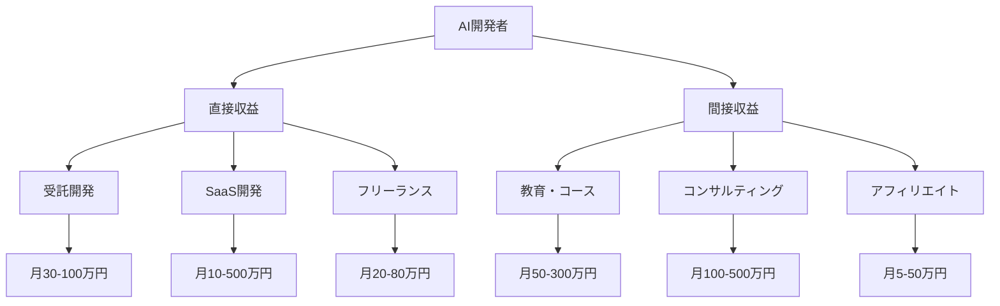
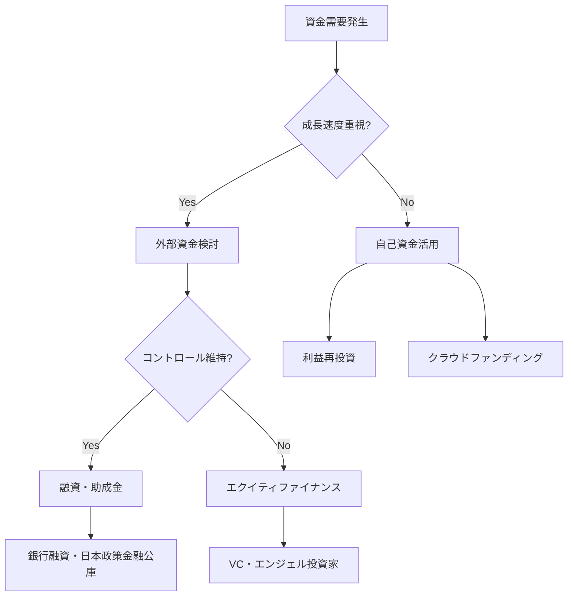

# AI開発者のための収益化戦略大全

## 目次
1. [AI開発者の収益化マップ](#ai開発者の収益化マップ)
2. [フリーランス・受託開発](#フリーランス・受託開発)
3. [SaaS・プロダクト開発](#saas・プロダクト開発)
4. [コンサルティング・技術顧問](#コンサルティング・技術顧問)
5. [教育・コース作成](#教育・コース作成)
6. [スケーリング戦略](#スケーリング戦略)
7. [収益多角化の実践](#収益多角化の実践)
8. [成功事例と具体的数値](#成功事例と具体的数値)

---

## AI開発者の収益化マップ

### 2025年AI市場の現状

AI開発市場は前例のない成長を遂げており、個人開発者にも多大な機会をもたらしています。

#### 市場規模と成長率
- **世界のAI市場**: 2024年1,840億ドル → 2030年1.8兆ドル（年平成長率42%）
- **日本のAI市場**: 2024年9,600億円 → 2030年4兆円
- **個人開発者の機会**: 月収100万円以上のAI開発者が1万人突破（2024年）

#### 収益化チャネル全体図



### 開発者スキルレベル別の収益化戦略

#### 初級者（0-6ヶ月）
**目標月収**: 10-30万円
**主戦略**: フリーランス + 学習記録発信

```
収益化ロードマップ:
Week 1-4: 基礎学習 + ポートフォリオ作成
Week 5-8: 簡単な受託案件開始
Week 9-12: 単価アップ + リピーター獲得
Week 13-24: 専門性を深める + 発信開始
```

#### 中級者（6ヶ月-2年）
**目標月収**: 50-100万円
**主戦略**: 専門特化 + SaaS開発

```
専門分野の選択:
1. ビジネス自動化 (RPA + AI)
2. データ分析・可視化
3. チャットボット開発
4. 画像・動画処理
5. 音声認識・合成
```

#### 上級者（2年以上）
**目標月収**: 100-500万円
**主戦略**: プロダクト開発 + コンサルティング

```
事業化戦略:
- 独自SaaSの開発・運営
- 技術顧問・CTO業務
- 大企業向けコンサルティング
- 投資家・起業家との連携
```

---

## フリーランス・受託開発

### 案件獲得戦略

#### 1. プラットフォーム別攻略法

**高単価プラットフォーム**

| プラットフォーム | 平均単価 | 特徴 | 攻略法 |
|------------------|----------|------|--------|
| Upwork Global | $50-150/h | 海外案件中心 | 英語力 + 専門性 |
| Toptal | $100-200/h | トップ3%認定 | 厳格な審査通過 |
| 直接営業 | 月50-200万 | 高い利益率 | 長期関係構築 |

**日本国内プラットフォーム**

| プラットフォーム | 平均単価 | 特徴 | 攻略法 |
|------------------|----------|------|--------|
| レバテックフリーランス | 60-120万/月 | 高単価案件豊富 | 技術力証明 |
| クラウドワークス | 5-50万/月 | 案件数が多い | 差別化が重要 |
| ランサーズ | 10-80万/月 | 継続案件獲得 | 信頼関係重視 |

#### 2. 提案書テンプレート（高成約率）

```markdown
## AI開発案件提案書

### 【1】課題理解と解決アプローチ
お客様の課題：[具体的な課題を記載]
提案解決策：[技術的アプローチ]
期待効果：[定量的な効果予測]

### 【2】技術仕様
使用技術：Python, TensorFlow, FastAPI
開発期間：4週間
成果物：AIモデル + API + ダッシュボード

### 【3】過去実績
類似案件：[具体的な成果を記載]
技術証明：[GitHubリポジトリリンク]
お客様の声：[推薦文があれば]

### 【4】価格と保証
開発費：80万円（分割払い対応可）
保証期間：3ヶ月（無料サポート）
追加開発：応相談

### 【5】次のステップ
1. 無料相談（30分）
2. 要件定義書作成
3. 契約・開発開始
```

#### 3. 単価アップ戦略

**段階的単価上昇モデル**
```
Phase 1 (0-3ヶ月): 時給3,000-5,000円
→ 実績作り、評価獲得に集中

Phase 2 (3-6ヶ月): 時給5,000-8,000円  
→ 専門性アピール、複雑案件挑戦

Phase 3 (6-12ヶ月): 時給8,000-12,000円
→ リピーター獲得、長期契約

Phase 4 (12ヶ月-): 時給12,000円以上
→ 技術顧問、プロジェクトリード
```

### 高収益案件の具体例

#### 案件例1: 製造業の品質管理AI
**内容**: 製品画像から不良品を自動検出
**技術**: Computer Vision, PyTorch, OpenCV
**期間**: 2ヶ月
**報酬**: 120万円
**継続**: 月10万円のメンテナンス契約

**実装ポイント**:
```python
# 品質管理AI の基本構造
import torch
import torchvision.transforms as transforms
from torch import nn

class QualityInspectionModel(nn.Module):
    def __init__(self, num_classes=2):
        super().__init__()
        self.backbone = torchvision.models.resnet50(pretrained=True)
        self.classifier = nn.Linear(2048, num_classes)
    
    def forward(self, x):
        features = self.backbone.features(x)
        features = F.adaptive_avg_pool2d(features, 1).flatten(1)
        return self.classifier(features)

# 実装の差別化ポイント
# 1. 高精度（95%以上）
# 2. リアルタイム処理（10fps以上）
# 3. 誤検出最小化
# 4. 運用しやすいUI
```

#### 案件例2: EC売上予測システム
**内容**: 商品売上を1ヶ月先まで予測
**技術**: Time Series Analysis, LightGBM, FastAPI
**期間**: 6週間
**報酬**: 90万円
**継続**: 月15万円のデータ更新・調整

**実装ポイント**:
```python
# 売上予測モデル
import lightgbm as lgb
import pandas as pd
from sklearn.preprocessing import LabelEncoder

def create_features(df):
    """時系列特徴量生成"""
    df['month'] = df['date'].dt.month
    df['day_of_week'] = df['date'].dt.dayofweek
    df['is_weekend'] = df['day_of_week'].isin([5, 6])
    
    # ラグ特徴量
    df['sales_lag_7'] = df['sales'].shift(7)
    df['sales_lag_30'] = df['sales'].shift(30)
    
    # 移動平均
    df['sales_ma_7'] = df['sales'].rolling(7).mean()
    df['sales_ma_30'] = df['sales'].rolling(30).mean()
    
    return df

# 顧客が重視するポイント
# 1. 予測精度（MAPE 10%以下）
# 2. 解釈可能性
# 3. 自動更新機能
# 4. アラート機能
```

### 長期契約獲得のコツ

#### 1. 信頼関係構築フロー
```
初回契約 → 期待以上の成果 → 追加要望対応 → 定期メンテナンス契約 → 新規案件紹介
```

#### 2. 保守・メンテナンス契約の設計
```
基本パック: 月額5万円
- バグ修正
- データ更新
- 簡単な機能追加

プレミアムパック: 月額15万円
- 基本パック内容
- 新機能開発
- パフォーマンス最適化
- 24時間サポート

エンタープライズ: 月額30万円以上
- プレミアム内容
- 専任サポート
- 定期改善提案
- 技術コンサルティング
```

---

## SaaS・プロダクト開発

### AI SaaS開発の成功パターン

#### 1. ニッチ特化戦略

**成功事例分析**:
- **Notion AI**: 文書作成支援 → 年間売上200億円
- **Grammarly**: 英文校正 → 年間売上400億円  
- **Copy.ai**: マーケティングコピー生成 → 年間売上50億円

**日本市場での機会**:
```
1. 業界特化AI
   - 不動産: 物件価格予測、間取り最適化
   - 医療: 診断支援、カルテ分析
   - 教育: 学習最適化、採点自動化

2. 地域特化AI  
   - 日本語特化: 敬語変換、文章要約
   - 日本の商習慣: 契約書分析、営業支援
   - 規制対応: コンプライアンスチェック
```

#### 2. MVPから収益化までのロードマップ

**Phase 1: MVP開発（1-2ヶ月）**
```python
# 最小機能での実装例 - AI文章校正サービス
from fastapi import FastAPI, HTTPException
from transformers import pipeline
import openai

app = FastAPI()

# 基本の校正機能
corrector = pipeline("text2text-generation", 
                    model="japanese-corrector-model")

@app.post("/correct")
async def correct_text(text: str):
    try:
        corrected = corrector(text, max_length=512)
        return {"original": text, "corrected": corrected[0]['generated_text']}
    except Exception as e:
        raise HTTPException(status_code=500, detail=str(e))

# MVPの要件
# - 1つのコア機能
# - 簡単なUI
# - 基本的なエラーハンドリング
# - 無料プラン（制限付き）
```

**Phase 2: トラクション獲得（3-6ヶ月）**
```
目標:
- MAU 1,000人達成
- 有料化率 5%
- MRR 50万円

施策:
- Product Hunt発表
- Twitter/LinkedInでの発信
- ユーザーフィードバック収集
- 機能改善・追加
```

**Phase 3: スケール（6-12ヶ月）**
```
目標:
- MAU 10,000人
- 有料化率 10%
- MRR 500万円

施策:
- SEO強化
- コンテンツマーケティング  
- パートナーシップ
- API提供開始
```

#### 3. 価格設定戦略

**フリーミアム価格設定例**
```
無料プラン:
- 月間100回まで処理
- 基本機能のみ
- コミュニティサポート

ベーシック (月額980円):
- 月間1,000回処理
- 全機能利用可
- メールサポート

プロ (月額2,980円):
- 月間10,000回処理
- API利用可
- 優先サポート
- 詳細分析レポート

エンタープライズ (月額9,800円):
- 無制限処理
- カスタム機能
- 専任サポート
- SLA保証
```

#### 4. 技術アーキテクチャ設計

**スケーラブルなSaaS構成**
```yaml
# Docker Compose設定例
version: '3.8'
services:
  frontend:
    build: ./frontend
    ports:
      - "3000:3000"
    environment:
      - REACT_APP_API_URL=http://api:8000

  api:
    build: ./backend
    ports:
      - "8000:8000"
    environment:
      - DATABASE_URL=postgresql://user:pass@db:5432/saas_db
      - REDIS_URL=redis://redis:6379
      - OPENAI_API_KEY=${OPENAI_API_KEY}
    depends_on:
      - db
      - redis

  db:
    image: postgres:15
    environment:
      - POSTGRES_DB=saas_db
      - POSTGRES_USER=user
      - POSTGRES_PASSWORD=pass
    volumes:
      - postgres_data:/var/lib/postgresql/data

  redis:
    image: redis:7-alpine
    volumes:
      - redis_data:/data

  nginx:
    image: nginx:alpine
    ports:
      - "80:80"
      - "443:443"
    volumes:
      - ./nginx.conf:/etc/nginx/nginx.conf
    depends_on:
      - frontend
      - api

volumes:
  postgres_data:
  redis_data:
```

### 成功するSaaSの特徴分析

#### 1. プロダクト・マーケット・フィット指標

```python
# PMF測定ダッシュボード
class PMFMetrics:
    def __init__(self, db_connection):
        self.db = db_connection
    
    def calculate_retention_curve(self, cohort_period='month'):
        """コホート別リテンション率計算"""
        query = f"""
        WITH cohorts AS (
            SELECT user_id, 
                   DATE_TRUNC('{cohort_period}', created_at) as cohort_month
            FROM users
        ),
        user_activities AS (
            SELECT u.user_id,
                   cohort_month,
                   DATE_TRUNC('{cohort_period}', activity_date) as period_number
            FROM cohorts u
            LEFT JOIN user_activities a ON u.user_id = a.user_id
        )
        SELECT cohort_month,
               period_number,
               COUNT(DISTINCT user_id) as active_users
        FROM user_activities
        GROUP BY cohort_month, period_number
        """
        return pd.read_sql(query, self.db)
    
    def nps_score(self):
        """Net Promoter Score計算"""
        scores = pd.read_sql("""
            SELECT rating FROM user_feedback 
            WHERE feedback_type = 'nps'
            AND created_at >= NOW() - INTERVAL '30 days'
        """, self.db)
        
        promoters = len(scores[scores['rating'] >= 9])
        detractors = len(scores[scores['rating'] <= 6]) 
        total = len(scores)
        
        return (promoters - detractors) / total * 100

# PMFの判定基準
# - 月次リテンション率 > 40%
# - NPS > 50
# - オーガニック成長率 > 20%/月
```

#### 2. ユニットエコノミクス最適化

```python
class UnitEconomics:
    def __init__(self, monthly_data):
        self.data = monthly_data
    
    def calculate_ltv_cac_ratio(self):
        """LTV/CAC比率計算"""
        arpu = self.data['monthly_revenue'] / self.data['active_users']
        churn_rate = self.data['churned_users'] / self.data['active_users']
        ltv = arpu / churn_rate
        
        cac = self.data['marketing_spend'] / self.data['new_users']
        
        return ltv / cac
    
    def payback_period(self):
        """投資回収期間"""
        arpu = self.data['monthly_revenue'] / self.data['active_users']
        cac = self.data['marketing_spend'] / self.data['new_users']
        
        return cac / arpu

# 健全な指標
# - LTV/CAC ratio > 3
# - Payback period < 12 months
# - Monthly churn < 5%
```

---

## コンサルティング・技術顧問

### 高単価コンサルティングの構築

#### 1. 専門性の確立

**技術顧問としての価値提供**
```
Phase 1: 技術評価・戦略立案
- 現行システム診断
- AI導入可能性調査
- 技術ロードマップ作成
- ROI試算

Phase 2: 実装支援
- アーキテクチャ設計
- チーム立ち上げ支援
- 開発プロセス構築
- 品質管理体制整備

Phase 3: 運用最適化
- パフォーマンス改善
- コスト最適化
- スケーリング支援
- チーム育成
```

#### 2. サービスメニュー設計

**コンサルティングパッケージ例**

| サービス | 期間 | 価格 | 内容 |
|----------|------|------|------|
| AI戦略診断 | 2週間 | 50万円 | 現状分析・提案書作成 |
| POC支援 | 1ヶ月 | 150万円 | プロトタイプ開発・検証 |
| 技術顧問 | 月額 | 30-100万円 | 継続的な技術支援 |
| チーム立ち上げ | 3ヶ月 | 300万円 | 採用・育成・プロセス構築 |

#### 3. 提案資料テンプレート

```markdown
# AI導入戦略提案書

## エグゼクティブサマリー
### 現状の課題
- 人的コストの増大（年間2,000万円）
- 処理精度のばらつき（エラー率15%）
- スケーラビリティの限界

### AI導入による効果
- コスト削減: 年間1,200万円（60%減）
- 精度向上: エラー率3%以下（80%改善）
- 処理能力: 10倍向上

### 投資回収期間: 8ヶ月

## 技術提案
### 推奨アーキテクチャ
[システム図]

### 実装フェーズ
Phase 1 (1-2ヶ月): データ基盤構築
Phase 2 (2-3ヶ月): モデル開発・検証
Phase 3 (3-4ヶ月): 本番運用開始

### リスク分析と対策
[リスクマトリックス]

## 投資計画
### 初期投資: 800万円
- システム開発: 500万円
- インフラ構築: 200万円
- 人材育成: 100万円

### 運用コスト: 月額50万円
- インフラ: 20万円
- 保守・監視: 30万円
```

### 企業規模別アプローチ

#### スタートアップ (従業員10-50名)
**ニーズ**: 迅速な成果、低コスト
**提案内容**: 
- クラウドAIサービス活用
- ノーコード/ローコード導入
- 短期ROI重視

**価格レンジ**: 月額10-30万円

#### 中小企業 (従業員50-500名)
**ニーズ**: 業務効率化、競争力向上
**提案内容**:
- 既存システムとの連携
- 段階的なAI導入
- 社内人材育成

**価格レンジ**: 月額30-80万円

#### 大企業 (従業員500名以上)
**ニーズ**: DX推進、イノベーション創出
**提案内容**:
- カスタムAI開発
- 組織変革支援
- 長期戦略立案

**価格レンジ**: 月額100-500万円

---

## 教育・コース作成

### オンライン教育市場での位置づけ

#### 市場分析
```
日本のオンライン教育市場:
2024年: 3,000億円 → 2030年: 8,000億円

AI教育セグメント:
- 技術者向け: 800億円 (成長率50%/年)
- ビジネス向け: 400億円 (成長率30%/年)
- 学生向け: 200億円 (成長率40%/年)
```

#### 成功する教育コンテンツの特徴

**1. 実践重視の構成**
```
理論 20% : 実践 80% の割合

例: AI開発実践コース
Week 1-2: 基礎理論 (20%)
Week 3-8: プロジェクト実践 (60%)  
Week 9-10: ポートフォリオ作成 (20%)
```

**2. 段階的な学習設計**
```python
# 学習プログレッション設計
learning_path = {
    "beginner": {
        "duration": "4週間",
        "objective": "AIツール活用",
        "projects": ["ChatGPT活用", "画像生成AI", "音声変換"]
    },
    "intermediate": {
        "duration": "8週間", 
        "objective": "簡単なAI開発",
        "projects": ["チャットボット", "画像分類", "データ分析"]
    },
    "advanced": {
        "duration": "12週間",
        "objective": "本格的なAI開発",  
        "projects": ["カスタムモデル", "MLOps", "プロダクト化"]
    }
}
```

### 高収益教育コンテンツの作成法

#### 1. コース設計フレームワーク

**ADDIE モデルの適用**
```
Analyze (分析):
- ターゲット学習者の特定
- 学習ニーズの調査
- 既存競合の分析

Design (設計):
- 学習目標の設定
- カリキュラム構成
- 評価方法の決定

Develop (開発):
- コンテンツ制作
- 実習環境構築
- サポート体制整備

Implement (実施):
- β版リリース
- フィードバック収集
- 改善実装

Evaluate (評価):
- 学習効果測定
- 満足度調査
- 継続改善
```

#### 2. 価格設定戦略

**階層別価格モデル**
```
入門コース: 19,800円
- 動画20時間
- 基本サポート
- 修了証発行

実践コース: 49,800円
- 動画40時間 + 実習
- メンターサポート
- プロジェクトレビュー

マスターコース: 98,000円
- 動画60時間 + 個別指導
- 1on1メンタリング
- 就職・転職サポート

企業研修: 500,000円/10名
- カスタマイズ対応
- 現場での実習
- 継続サポート
```

#### 3. マーケティング・集客戦略

**コンテンツマーケティング**
```python
# ブログ記事企画例
blog_strategy = {
    "SEO記事": {
        "頻度": "週3本",
        "狙いキーワード": ["AI 開発 初心者", "機械学習 Python", "ChatGPT 活用法"],
        "目標PV": "月間10万PV"
    },
    "技術解説": {
        "頻度": "週1本", 
        "内容": "最新AI技術の解説",
        "目標": "専門性アピール"
    },
    "成功事例": {
        "頻度": "月2本",
        "内容": "受講生の成果紹介", 
        "目標": "社会的証明"
    }
}
```

**SNS活用戦略**
```
Twitter/X:
- 技術情報の発信 (毎日)
- 学習者との交流 (リプライ対応)
- ライブ配信 (週1回)

YouTube:
- 技術解説動画 (週1本)
- コース紹介動画
- 受講生インタビュー

LinkedIn:
- ビジネス向け記事
- 業界トレンド分析
- ネットワーキング
```

### 受講生成果の最大化

#### 1. 学習継続率向上施策

```python
# 学習進捗管理システム
class LearningProgressManager:
    def __init__(self, student_id):
        self.student_id = student_id
        self.progress_data = {}
    
    def track_engagement(self, lesson_id, engagement_time):
        """学習エンゲージメント追跡"""
        self.progress_data[lesson_id] = {
            'completion_time': engagement_time,
            'timestamp': datetime.now(),
            'comprehension_score': self.calculate_comprehension()
        }
    
    def send_encouragement(self):
        """適切なタイミングでの励ましメッセージ"""
        if self.detect_learning_plateau():
            self.send_personalized_message()
            self.suggest_study_buddy()
    
    def adaptive_learning_path(self):
        """学習者に応じたパス調整"""
        if self.progress_data['comprehension_avg'] < 70:
            return self.recommend_supplementary_content()
        else:
            return self.recommend_advanced_challenges()
```

#### 2. 実践プロジェクト設計

**段階的プロジェクト例**
```
プロジェクト1: AIチャットボット (初級)
- 所要時間: 1週間
- 学習要素: API利用、基本プログラミング
- 成果物: 実動するチャットボット

プロジェクト2: 画像分類アプリ (中級)
- 所要時間: 2週間  
- 学習要素: 機械学習、Webアプリ開発
- 成果物: デプロイ済みWebアプリ

プロジェクト3: 予測分析システム (上級)
- 所要時間: 4週間
- 学習要素: データサイエンス、MLOps
- 成果物: ビジネス活用可能なシステム
```

---

## スケーリング戦略

### 個人事業からチーム化への移行

#### 1. 組織化のタイミング指標

**月収100万円突破時の選択肢**
```python
scaling_decision_matrix = {
    "個人継続": {
        "メリット": ["自由度高", "利益率最大", "意思決定高速"],
        "デメリット": ["成長限界", "属人化リスク", "スケール困難"],
        "適用条件": "ライフスタイル重視、ニッチ特化"
    },
    "チーム化": {
        "メリット": ["成長加速", "事業拡大", "リスク分散"],
        "デメリット": ["管理コスト", "利益率低下", "複雑性増大"],
        "適用条件": "市場機会大、スケール可能性高"
    },
    "パートナーシップ": {
        "メリット": ["補完関係", "リスク分担", "ネットワーク拡大"],
        "デメリット": ["利益分配", "意思決定複雑化", "依存リスク"],
        "適用条件": "専門性補完、大型案件対応"
    }
}
```

#### 2. チームメンバー採用戦略

**採用ポジション優先順位**
```
1位: フロントエンドエンジニア
理由: UI/UX改善で成約率向上

2位: データサイエンティスト  
理由: AI技術の高度化

3位: セールス・マーケティング
理由:新規顧客獲得の効率化

4位: プロジェクトマネージャー
理由: 複数案件の同時進行

5位: デザイナー
理由: ブランド強化・差別化
```

**採用基準設計**
```python
class TeamMemberEvaluation:
    def __init__(self):
        self.criteria = {
            "technical_skills": 0.4,  # 技術力
            "communication": 0.2,     # コミュニケーション
            "ownership": 0.2,         # 当事者意識
            "adaptability": 0.1,      # 適応力
            "cultural_fit": 0.1       # カルチャーフィット
        }
    
    def calculate_score(self, candidate_data):
        total_score = 0
        for criterion, weight in self.criteria.items():
            score = candidate_data.get(criterion, 0)
            total_score += score * weight
        return total_score
    
    def hiring_decision(self, score):
        if score >= 80:
            return "即決採用"
        elif score >= 70:
            return "条件付き採用"
        elif score >= 60:
            return "再面接"
        else:
            return "不採用"
```

#### 3. 事業構造の最適化

**収益モデルの多角化**
```
主力事業 (60%): 受託開発・コンサルティング
成長事業 (30%): SaaS・プロダクト
新規事業 (10%): 教育・投資

リスク分散効果:
- 景気影響の軽減
- 季節変動の平準化  
- 市場変化への対応力
```

### 投資・資金調達戦略

#### 1. 自己資金vs外部資金

**資金調達判断フローチャート**


#### 2. 投資家向けピッチデック

```markdown
# AI開発事業 投資提案書

## Slide 1: 問題提起
- 企業のAI導入率: 15% (アメリカ40%と比較して低い)
- 導入障壁: 技術不足、高コスト、ROI不明

## Slide 2: ソリューション  
- AI開発・コンサルティングのワンストップサービス
- 業界特化の実績とノウハウ
- 低コスト・短期間での導入支援

## Slide 3: 市場規模
- TAM: 日本AI市場 4兆円 (2030年)
- SAM: 中小企業向けAI導入支援 5,000億円
- SOM: 当社ターゲット 500億円

## Slide 4: ビジネスモデル
- 受託開発: 単発収益
- SaaS: 継続収益
- コンサルティング: 高単価

## Slide 5: 競合分析
[競合他社との差別化ポイント]

## Slide 6: 財務計画
- 現在売上: 年間3,600万円
- 3年後目標: 年間5億円
- 調達希望額: 1億円
- 使途: 人材採用60%, 開発40%

## Slide 7: チーム
[創業者・主要メンバーの経歴]

## Slide 8: 資金使途
- エンジニア採用: 6,000万円
- プロダクト開発: 3,000万円  
- マーケティング: 1,000万円
```

---

## 収益多角化の実践

### ポートフォリオ収益の構築

#### 1. 収益安定化戦略

**理想的な収益ポートフォリオ**
```python
revenue_portfolio = {
    "フロー収益": {
        "受託開発": {"割合": 40, "特徴": "高単価・変動大"},
        "コンサル": {"割合": 20, "特徴": "超高単価・不定期"}
    },
    "ストック収益": {
        "SaaS": {"割合": 25, "特徴": "継続・成長性"},
        "教育": {"割合": 10, "特徴": "安定・スケーラブル"},
        "投資": {"割合": 5, "特徴": "長期・複利効果"}
    }
}

# 収益安定性指標
stability_metrics = {
    "収益変動係数": 0.3,  # 目標値 < 0.4
    "継続収益率": 35,     # 目標値 > 30%
    "顧客集中度": 15      # 目標値 < 20%
}
```

#### 2. パッシブ収入の創出

**デジタル資産化戦略**
```
Phase 1: コンテンツ資産化
- ブログ記事 → SEO経由の集客
- YouTube動画 → 広告収入
- オンラインコース → 自動販売

Phase 2: システム資産化  
- SaaSプロダクト → 月額課金
- APIサービス → 従量課金
- マーケットプレイス → 手数料収入

Phase 3: 投資資産化
- エンジェル投資 → 株式リターン
- 不動産投資 → 賃料収入  
- 金融商品 → 配当・利息
```

#### 3. 地域・言語拡張戦略

**グローバル展開のロードマップ**
```
Domestic Phase (0-2年):
- 日本市場での確固たる地位確立
- 英語コンテンツの準備

Regional Phase (2-3年):  
- APAC地域への展開
- 現地パートナーとの提携
- ローカライゼーション

Global Phase (3年-):
- 欧米市場参入
- 多言語対応
- グローバルブランド確立
```

### リスク管理とコンティンジェンシー

#### 1. 事業リスクの識別・対策

```python
risk_management = {
    "技術リスク": {
        "リスク": "AI技術の急速な変化",
        "対策": ["継続学習", "技術投資", "専門家ネットワーク"],
        "影響度": "高", "発生確率": "高"
    },
    "競合リスク": {
        "リスク": "大手企業の参入",
        "対策": ["ニッチ特化", "顧客密着", "技術差別化"],
        "影響度": "中", "発生確率": "高"
    },
    "顧客リスク": {
        "リスク": "主要顧客の離脱", 
        "対策": ["顧客分散", "契約延長", "価値向上"],
        "影響度": "高", "発生確率": "低"
    },
    "規制リスク": {
        "リスク": "AI規制の強化",
        "対策": ["コンプライアンス強化", "業界動向監視"],
        "影響度": "中", "発生確率": "中"
    }
}
```

#### 2. 財務リスク管理

**キャッシュフロー管理**
```python
class CashFlowManager:
    def __init__(self):
        self.emergency_fund_ratio = 0.3  # 3ヶ月分の運転資金
        self.revenue_concentration_limit = 0.3  # 単一顧客30%未満
        
    def assess_financial_health(self, financial_data):
        """財務健全性評価"""
        indicators = {
            "流動性": self.calculate_liquidity(financial_data),
            "収益性": self.calculate_profitability(financial_data), 
            "安定性": self.calculate_stability(financial_data),
            "成長性": self.calculate_growth(financial_data)
        }
        return self.overall_score(indicators)
    
    def recommend_actions(self, score):
        if score >= 80:
            return ["積極投資", "事業拡大"]
        elif score >= 60:
            return ["慎重拡大", "リスク監視"]  
        else:
            return ["コスト削減", "現金確保", "リスク回避"]
```

---

## 成功事例と具体的数値

### ケーススタディ1: フリーランスから年商3億円企業へ

#### プロフィール
- **開始時**: 28歳、エンジニア経験5年
- **専門分野**: 自然言語処理・チャットボット開発
- **期間**: 4年間での成長記録

#### 成長軌跡
```python
growth_timeline = {
    "Year 1": {
        "月収": "15-30万円",
        "主要収益": "クラウドワークス受託",
        "学び": "単価アップの重要性",
        "年収": 300万円
    },
    "Year 2": {
        "月収": "50-80万円", 
        "主要収益": "直接契約・リピーター",
        "学び": "専門性による差別化",
        "年収": 800万円
    },
    "Year 3": {
        "月収": "100-200万円",
        "主要収益": "技術顧問・コンサル",
        "学び": "事業化の必要性",
        "年収": 1,800万円
    },
    "Year 4": {
        "月収": "300-500万円",
        "主要収益": "SaaS・チーム化",
        "学び": "スケーリングの力",
        "年収": 5,000万円
    }
}
```

#### 成功要因分析
```
1. 早期の専門性確立
   - 自然言語処理に特化
   - 日本語特有の課題解決

2. 価値提供の継続的向上
   - 技術力 → コンサル力 → 事業力
   - 顧客の成功を第一に考慮

3. 戦略的なスケーリング  
   - 個人 → チーム → 会社
   - フロー収益 → ストック収益

4. ネットワークの活用
   - 技術コミュニティでの発信
   - 顧客からの紹介拡大
```

### ケーススタディ2: AI教育事業で年商1億円

#### ビジネスモデル
```python
education_business = {
    "個人向けコース": {
        "価格": "29,800-98,000円",
        "受講者": "月間200-300名",
        "月商": "800-1,200万円"
    },
    "企業研修": {
        "価格": "50-300万円/案件",
        "案件数": "月2-3件",
        "月商": "200-600万円"
    },
    "サブスク教材": {
        "価格": "月額2,980円", 
        "会員数": "1,500名",
        "月商": "450万円"
    }
}

# 年間売上: 1億2,000万円
# 利益率: 65% (人件費・制作費除く)
```

#### マーケティング戦略の詳細
```
コンテンツマーケティング:
- ブログ記事: 週5本投稿
- YouTube: 週2本投稿  
- SEO流入: 月間50万PV
- 成約率: 3.5%

SNSマーケティング:
- Twitter: フォロワー8万人
- LinkedIn: フォロワー1.2万人
- 口コミ経由: 全契約の40%

パートナーシップ:
- 人材会社との提携
- 大学との連携講座
- 企業の人事部門との関係構築
```

### 数値で見る成功パターン

#### 収益化までの期間分析
```python
monetization_timeline = {
    "フリーランス": {
        "初収益": "1-2ヶ月",
        "月収30万": "6-12ヶ月", 
        "月収100万": "18-36ヶ月",
        "成功率": "60%"
    },
    "SaaS開発": {
        "初収益": "3-6ヶ月",
        "月収30万": "12-24ヶ月",
        "月収100万": "24-48ヶ月", 
        "成功率": "15%"
    },
    "教育事業": {
        "初収益": "2-4ヶ月",
        "月収30万": "8-16ヶ月",
        "月収100万": "18-36ヶ月",
        "成功率": "25%"
    },
    "コンサルティング": {
        "初収益": "6-12ヶ月",
        "月収30万": "12-18ヶ月",
        "月収100万": "24-36ヶ月",
        "成功率": "40%"
    }
}
```

#### 投資対効果の実績データ
```
学習投資 vs 収益向上:
- 書籍・コース: 年間50万円 → 収益20%向上
- カンファレンス参加: 年間30万円 → ネットワーク拡大
- 技術認定: 年間20万円 → 単価10%向上

ツール・環境投資 vs 生産性:
- 開発環境: 初期100万円 → 開発速度30%向上
- AI/MLツール: 月額10万円 → 精度向上・差別化
- デザイン・マーケツール: 月額5万円 → 成約率向上

人材投資 vs 事業成長:
- 初回採用: 年間600万円 → 売上150%成長
- チーム拡大: 追加1,000万円 → 売上200%成長  
- 専門家契約: 月額50万円 → 新規事業開拓
```

この収益化戦略大全を参考に、自分の状況と目標に最適な戦略を選択し、段階的に実行していくことで、AI開発者として持続可能で高収益なビジネスを構築できます。重要なのは、一つずつ確実に実行し、継続的に改善していくことです。