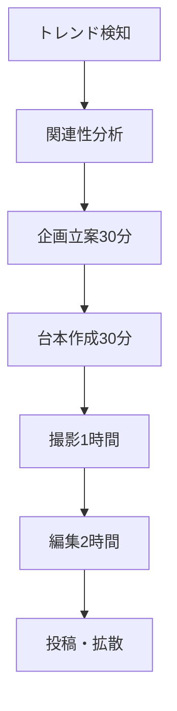

# ショート動画企画&台本作成プロンプト集

## 概要

TikTok、YouTube Shorts、Instagram Reelsで再生回数を爆発的に増やすための実践的なプロンプト集です。バイラル動画の法則、エンゲージメント最大化のテクニック、プラットフォーム別最適化手法を網羅しています。

## 目次

1. [バイラル動画企画プロンプト](#バイラル動画企画プロンプト)
2. [台本作成テンプレート](#台本作成テンプレート)
3. [プラットフォーム別最適化](#プラットフォーム別最適化)
4. [エンゲージメント最大化手法](#エンゲージメント最大化手法)
5. [トレンド活用戦略](#トレンド活用戦略)
6. [分析・改善プロンプト](#分析改善プロンプト)

---

## バイラル動画企画プロンプト

### 鉄板バイラル企画生成

```
# バイラル動画企画立案

以下の条件でバイラル性の高い動画企画を10案作成してください：

**ターゲット**: [年齢層・興味関心を指定]
**プラットフォーム**: [TikTok/YouTube Shorts/Instagram Reels]
**ジャンル**: [教育/エンタメ/ライフスタイル/ビジネス/その他]
**動画時間**: [15秒/30秒/60秒]

## バイラル要素（必須）
1. **フック**: 最初の3秒で注意を引く要素
2. **サプライズ**: 予想外の展開や結果
3. **エモーション**: 強い感情を呼び起こす内容
4. **シェア動機**: 人に教えたくなる情報
5. **トレンド**: 現在のトレンドとの組み合わせ

## 企画フォーマット
```yaml
企画名: "キャッチーなタイトル"
概要: "30文字以内の説明"
フック: "最初の3秒の内容"
展開: "中盤の流れ"
オチ: "最後のサプライズや学び"
CTA: "視聴者への行動促進"
ハッシュタグ: "#関連タグ5個"
期待効果: "再生数・エンゲージメント予想"
```

## 成功指標
- 視聴完了率: 80%以上
- いいね率: 5%以上
- シェア率: 2%以上
- コメント率: 1%以上

各企画に具体的な撮影方法と編集ポイントも含めてください。
```

### トレンド活用企画

```
# 最新トレンド組み合わせ動画

現在のトレンドを分析し、バイラルポテンシャルの高い動画企画を作成してください：

**分析対象**:
- 急上昇ハッシュタグTOP20
- 人気楽曲・サウンド
- 話題のフォーマット
- 季節・イベント要素

## トレンド分析フレームワーク
```javascript
const trendAnalysis = {
  hashtag: {
    name: "#トレンドタグ",
    volume: "検索ボリューム",
    growth: "成長率",
    competition: "競合レベル"
  },
  format: {
    type: "動画フォーマット",
    popularity: "人気度",
    lifecycle: "ライフサイクル段階"
  }
};
```

## 企画アイデア生成
1. **トレンドミックス**
   - 複数トレンドの組み合わせ
   - 意外性のある掛け合わせ

2. **オリジナル要素追加**
   - 独自の視点・解釈
   - パーソナル体験の融合

3. **タイミング最適化**
   - トレンドピーク予測
   - 投稿スケジュール最適化

## 実行計画
- 企画案3つ以上
- 撮影スケジュール
- 投稿タイミング
- ハッシュタグ戦略
- インフルエンサーコラボ案

トレンドの持続性も考慮した提案をしてください。
```

---

## 台本作成テンプレート

### 15秒動画台本テンプレート

```
# 15秒バイラル動画台本

以下の構成で15秒動画の台本を作成してください：

**テーマ**: [具体的なテーマを指定]
**目的**: [認知度向上/教育/エンタメ/販促]

## 台本構成（秒数指定）
```
【0-3秒】フック
- 視覚的インパクト: "画面に映る最初の要素"
- テキスト: "キャッチコピー"
- 音声/ナレーション: "最初の言葉"
- カメラワーク: "動きや角度"

【4-10秒】メイン展開
- アクション1: "具体的な行動や説明"
- アクション2: "次の展開"
- アクション3: "クライマックス"
- BGM: "音楽の切り替えポイント"

【11-15秒】クロージング
- オチ/結論: "最終的なメッセージ"
- CTA: "いいね・フォローお願い"
- テキスト表示: "まとめや次回予告"
- エンディング: "ロゴやハッシュタグ"
```

## 演出指示
- **カメラアングル**: [正面/斜め/上から/下から]
- **照明**: [自然光/リングライト/カラー照明]
- **編集**: [カット割り/エフェクト/トランジション]
- **音響**: [BGM/効果音/ナレーション音量]

## バリエーション案
同じテーマで異なるアプローチの台本も3パターン提案してください。

台本と併せて、絵コンテや撮影チェックリストも作成してください。
```

### 教育系動画台本

```
# 学習効果最大化動画台本

教育コンテンツとして価値があり、かつエンゲージメントの高い動画台本を作成してください：

**学習内容**: [具体的なスキルや知識]
**難易度**: [初心者/中級者/上級者]
**時間**: [30秒/60秒]

## 教育動画の構成要素
```yaml
hook:
  type: "問題提起"
  content: "視聴者の痛みポイント"
  duration: "3秒"

teaching:
  method: "ステップバイステップ"
  visual_aids: "図解・デモンストレーション"
  key_points: "覚えやすいポイント3つ"
  duration: "20-50秒"

reinforcement:
  summary: "重要ポイントの復習"
  call_to_action: "実践への促し"
  next_steps: "次に学ぶべきこと"
  duration: "7-10秒"
```

## 学習効果向上テクニック
1. **マイクロラーニング**
   - 1つの概念に集中
   - 段階的な理解構築

2. **視覚的説明**
   - インフォグラフィック活用
   - 実演による理解促進

3. **記憶定着法**
   - 語呂合わせ・覚え方
   - 反復とまとめ

## エンゲージメント要素
- クイズ・問いかけ
- 視聴者参加型要素
- コメント欄での継続学習
- シリーズ化による継続視聴

実用的で即座に使える内容に焦点を当てた台本を作成してください。
```

---

## プラットフォーム別最適化

### TikTok最適化戦略

```
# TikTok専用コンテンツ戦略

TikTokアルゴリズムに最適化された動画企画・台本を作成してください：

**TikTok特化要素**:
- 縦型9:16画面
- 15-60秒の時間制限
- サウンド重視
- ハッシュタグ戦略

## アルゴリズム対策
```javascript
const tiktokOptimization = {
  timing: {
    best_hours: ["19:00-22:00", "12:00-13:00"],
    frequency: "1日1-3投稿",
    consistency: "毎日投稿"
  },
  engagement: {
    quick_hook: "最初の1秒でインパクト",
    watch_time: "完視聴率80%以上目標",
    loop_effect: "ループ再生を意識した構成"
  }
};
```

## コンテンツカテゴリ別戦略

### 1. ダンス・音楽系
```
企画: "バイラルダンスのアレンジ版"
- オリジナル要素追加
- 簡単すぎず難しすぎない振り付け
- キャッチーな音楽選択
- フォロワーとのコラボ企画
```

### 2. 教育・ライフハック系
```
企画: "知らないと損する裏技"
- 即実践可能なテクニック
- ビフォーアフターの明確化
- 驚きの要素を含む結果
- 日常生活への応用性
```

### 3. エンタメ・コメディ系
```
企画: "あるある共感コンテンツ"
- 世代・性別を超えた共感ポイント
- オーバーリアクション
- 関係性の面白さ
- 予想外のオチ
```

## ハッシュタグ戦略
- メインタグ（1-2個）: 広いリーチ
- ニッチタグ（3-5個）: ターゲット精度
- ブランドタグ（1-2個）: 独自性

具体的なコンテンツ案と投稿スケジュールも提案してください。
```

### YouTube Shorts特化

```
# YouTube Shorts収益最大化戦略

YouTube Shortsで再生数とチャンネル登録者を増やす戦略を立案してください：

**YouTube Shorts特徴**:
- 60秒以内の縦型動画
- YouTube検索との連携
- 長尺動画への導線
- 収益化しやすい

## 収益化戦略
```yaml
monetization_paths:
  ad_revenue:
    - shorts_fund: "YouTube Shortsファンド"
    - regular_ads: "通常の広告収入"
  
  channel_growth:
    - subscriber_increase: "登録者数増加"
    - long_form_traffic: "長尺動画への誘導"
  
  external_revenue:
    - affiliate: "アフィリエイト"
    - sponsorship: "企業案件"
    - products: "自社商品販売"
```

## コンテンツ戦略

### 1. シリーズ化戦略
```
例: "30日間チャレンジ"
- Day1: チャレンジ開始宣言
- Day5: 最初の変化報告
- Day15: 中間報告と困難
- Day30: 最終結果発表
```

### 2. 検索最適化
```
SEO要素:
  title: "検索キーワード含有"
  description: "詳細説明とキーワード"
  tags: "関連タグ設定"
  thumbnail: "目立つサムネイル"
```

### 3. 視聴者維持率向上
```
retention_tactics:
  - preview: "冒頭で結果を予告"
  - pacing: "テンポの良い編集"
  - curiosity: "次が気になる構成"
  - payoff: "最後まで価値提供"
```

## 分析・改善指標
- 視聴者維持率
- クリック率
- 登録率
- エンゲージメント率

データに基づいた改善案も含めて提案してください。
```

---

## エンゲージメント最大化手法

### コメント誘発テクニック

```
# コメント率向上戦略

視聴者のコメントを積極的に引き出すコンテンツ戦略を構築してください：

**コメント誘発手法**:
1. 質問投げかけ
2. 論争的なトピック
3. 個人的な体験談
4. 視聴者参加型企画
5. クイズ・予想ゲーム

## 効果的な質問パターン
```javascript
const engagementQuestions = {
  opinion: "あなたはどう思いますか？",
  experience: "同じ経験ありますか？",
  preference: "AとB、どちらが好き？",
  prediction: "次はどうなると思う？",
  advice: "おすすめがあれば教えて！"
};
```

## コンテンツ例

### 1. 論争系コンテンツ
```
テーマ: "パイナップルピザ論争"
構成:
- 両方の意見を公平に紹介
- それぞれのメリット説明
- 最後に視聴者の意見を求める
- コメントで理由も聞く
```

### 2. 予想ゲーム系
```
テーマ: "この後どうなる？"
構成:
- 興味深い状況設定
- 複数の可能性を示唆
- 視聴者に予想をコメントで投稿依頼
- 次の動画で答え発表
```

### 3. 体験談系
```
テーマ: "失敗から学んだこと"
構成:
- 個人的な失敗体験の共有
- そこから得た教訓
- 視聴者の似た体験を募集
- コメントで交流促進
```

## コメント管理戦略
- 積極的な返信
- ポジティブなコミュニティ作り
- 建設的な議論の促進
- トロール対策

視聴者との長期的な関係構築も考慮した戦略を提案してください。
```

### シェア率向上戦略

```
# バイラル拡散メカニクス設計

視聴者が自発的にシェアしたくなるコンテンツ要素を分析・設計してください：

**シェア動機**:
- 情報価値の高さ
- エンターテイメント性
- 社会的アイデンティティ表現
- 他者への貢献

## シェア誘発要素
```yaml
shareability_factors:
  information:
    - useful_tips: "実用的なライフハック"
    - exclusive_info: "知る人ぞ知る情報"
    - trending_topics: "話題のトピック解説"
  
  entertainment:
    - humor: "笑える・面白い内容"
    - surprise: "予想外の展開"
    - cuteness: "可愛さ・癒し要素"
  
  identity:
    - values: "価値観の表現"
    - interests: "趣味・関心の共有"
    - status: "知識・センスのアピール"
```

## コンテンツ設計例

### 1. ライフハック系
```
タイトル: "知らないと絶対損する○○の裏技"
シェア要素:
- 即効性のある解決策
- 身近な材料で実現可能
- ビフォーアフターが明確
- 友人に教えたくなる有用性
```

### 2. 感動系
```
タイトル: "涙なしでは見られない○○の話"
シェア要素:
- 強い感情を呼び起こす
- 普遍的なテーマ
- 希望や勇気を与える
- 大切な人と共有したくなる
```

### 3. トレンド解説系
```
タイトル: "今話題の○○を分かりやすく解説"
シェア要素:
- タイムリーな話題
- 複雑な内容を簡単に説明
- 知識のアップデート価値
- 会話のネタとして活用
```

## 拡散最適化
- プラットフォーム別シェア機能活用
- インフルエンサーとの連携
- ハッシュタグ戦略
- クロスプラットフォーム展開

各要素の具体的な実装方法も詳述してください。
```

---

## トレンド活用戦略

### リアルタイムトレンド対応

```
# 瞬発的トレンド活用システム

突発的なトレンドや話題に素早く対応する動画制作システムを構築してください：

**監視対象**:
- Twitter急上昇トレンド
- Google急上昇検索ワード
- YouTube急上昇動画
- ニュース・時事問題
- 季節イベント・記念日

## 迅速対応フロー


## トレンド分析テンプレート
```json
{
  "trend_analysis": {
    "keyword": "トレンドキーワード",
    "volume": "検索ボリューム",
    "growth_rate": "成長率(%/hour)",
    "competition": "競合コンテンツ数",
    "peak_prediction": "ピーク予想時間",
    "relevance_score": "関連性スコア(1-10)",
    "content_gap": "コンテンツギャップ分析"
  }
}
```

## 即効企画パターン

### 1. ニュース解説型
```
構成:
- 冒頭でニュース概要(10秒)
- 分かりやすい解説(40秒)
- 個人的見解・影響(10秒)
```

### 2. トレンド参加型
```
構成:
- トレンドの紹介(5秒)
- オリジナル要素追加(45秒)
- ハッシュタグで拡散促進(10秒)
```

### 3. 便乗解説型
```
構成:
- 話題の背景説明(15秒)
- 関連する豆知識(35秒)
- まとめ・次回予告(10秒)
```

## リスク管理
- 炎上リスクの事前評価
- ファクトチェック体制
- 批判的意見への対応準備
- 撤回・修正の判断基準

スピードと品質のバランスを保つガイドラインも含めてください。
```

### 季節・イベント戦略

```
# 年間コンテンツカレンダー戦略

季節イベントや記念日を活用した計画的コンテンツ戦略を立案してください：

**年間イベント**:
- 1月: 新年、成人の日
- 2月: バレンタイン、節分
- 3月: ひな祭り、卒業シーズン
- 4月: 入学・就職、花見
- 5月: GW、母の日
- 6月: 父の日、梅雨
- 7月: 七夕、夏休み開始
- 8月: お盆、夏祭り
- 9月: 敬老の日、新学期
- 10月: ハロウィン
- 11月: 紅葉、ブラックフライデー
- 12月: クリスマス、年末

## 戦略的コンテンツ企画
```yaml
seasonal_strategy:
  preparation_period: "2週間前から企画開始"
  content_types:
    - educational: "季節の豆知識・由来"
    - entertainment: "イベント参加型コンテンツ"
    - lifestyle: "季節に合わせたライフハック"
    - emotional: "思い出・体験談シェア"
  
  timing_optimization:
    - pre_event: "イベント1週間前から盛り上げ"
    - during_event: "リアルタイム参加コンテンツ"
    - post_event: "振り返り・来年への準備"
```

## 月別コンテンツ例

### 春（3-5月）
```
3月企画例:
- "卒業・新生活応援コンテンツ"
- "桜の名所紹介・お花見裏技"
- "新しいことを始める方法"

4月企画例:
- "新生活お役立ちグッズ"
- "人間関係構築のコツ"
- "春のファッション・メイク"
```

### 夏（6-8月）
```
6月企画例:
- "梅雨を楽しく過ごす方法"
- "雨の日の楽しみ方"
- "湿気対策・髪型キープ術"

7-8月企画例:
- "夏祭り・花火大会情報"
- "暑さ対策・涼しく過ごすコツ"
- "夏休みの思い出作り"
```

## 継続性戦略
- シリーズ化によるフォロワー維持
- 年間を通じたストーリー構築
- 前年コンテンツのアップデート
- コミュニティとの思い出共有

長期的なブランド構築も考慮した提案をしてください。
```

---

## 分析・改善プロンプト

### パフォーマンス分析システム

```
# 動画パフォーマンス分析・改善フレームワーク

投稿した動画の詳細分析と改善案を提案するシステムを構築してください：

**分析項目**:
- 再生数・リーチ
- 視聴者維持率
- エンゲージメント率
- シェア率
- フォロワー獲得数

## 分析テンプレート
```json
{
  "video_performance": {
    "basic_metrics": {
      "views": "再生数",
      "reach": "リーチ数",
      "impressions": "インプレッション",
      "ctr": "クリック率(%)"
    },
    "engagement_metrics": {
      "likes": "いいね数",
      "comments": "コメント数",
      "shares": "シェア数",
      "saves": "保存数",
      "engagement_rate": "エンゲージメント率(%)"
    },
    "retention_metrics": {
      "average_watch_time": "平均視聴時間(秒)",
      "watch_percentage": "視聴完了率(%)",
      "drop_off_points": "離脱ポイント分析"
    }
  }
}
```

## 改善分析フレームワーク

### 1. 低パフォーマンス要因分析
```yaml
low_performance_analysis:
  hook_issues:
    - weak_opening: "弱いオープニング"
    - unclear_value: "価値提案不明確"
    - slow_pacing: "テンポが遅い"
  
  content_issues:
    - poor_quality: "画質・音質問題"
    - lengthy_content: "冗長な内容"
    - unclear_message: "メッセージ不明確"
  
  timing_issues:
    - wrong_timing: "投稿タイミング不適切"
    - poor_hashtags: "ハッシュタグ戦略失敗"
    - platform_mismatch: "プラットフォーム不一致"
```

### 2. 改善アクション案
```yaml
improvement_actions:
  content_optimization:
    - strengthen_hook: "冒頭3秒の強化"
    - improve_pacing: "編集テンポ改善"
    - add_captions: "字幕・テロップ追加"
  
  technical_optimization:
    - video_quality: "画質向上"
    - audio_clarity: "音声クリア化"
    - mobile_optimization: "モバイル最適化"
  
  distribution_optimization:
    - posting_schedule: "投稿時間最適化"
    - hashtag_research: "ハッシュタグ再選定"
    - cross_platform: "クロスプラットフォーム展開"
```

## 競合分析
- 同ジャンルトップ動画分析
- 成功要因の抽出
- 差別化ポイント発見
- ベンチマーク設定

## 改善実行計画
- 優先順位付け
- 実行スケジュール
- 効果測定方法
- 継続改善サイクル

具体的な改善テクニックとツール活用法も含めてください。
```

### A/Bテスト実施ガイド

```
# 動画コンテンツA/Bテスト設計

効果的なA/Bテストによる動画最適化手法を構築してください：

**テスト対象要素**:
- サムネイル
- タイトル
- 冒頭3秒
- 動画時間
- ハッシュタグ
- 投稿時間

## A/Bテスト設計フレームワーク
```yaml
ab_test_design:
  hypothesis:
    - null_hypothesis: "変更による効果なし"
    - alternative_hypothesis: "変更により○○が改善"
  
  variables:
    - independent: "変更する要素"
    - dependent: "測定する指標"
    - controlled: "統制する要因"
  
  sample_size:
    - minimum_sample: "統計的有意性確保"
    - test_duration: "テスト期間設定"
    - confidence_level: "信頼度設定(95%)"
```

## テストパターン例

### 1. サムネイルテスト
```
Test A: 人物メインの表情重視
Test B: テキスト重視のインフォグラフィック
Test C: 商品・アイテム重視

測定指標:
- クリック率(CTR)
- 視聴完了率
- エンゲージメント率
```

### 2. タイトルテスト
```
Test A: 疑問文形式("○○って知ってた？")
Test B: 数字入り("5つの○○")
Test C: 感情訴求("絶対見て！○○")

測定指標:
- インプレッション数
- クリック率
- シェア率
```

### 3. 構成テスト
```
Test A: 結論先出し構成
Test B: ストーリー型構成  
Test C: 問題解決型構成

測定指標:
- 視聴者維持率
- コメント数
- 保存数
```

## データ収集・分析
```javascript
const abTestAnalysis = {
  data_collection: {
    period: "1週間〜1ヶ月",
    sample_size: "各パターン最低1000再生",
    metrics: ["CTR", "維持率", "エンゲージメント"]
  },
  
  statistical_analysis: {
    significance_test: "t検定またはカイ二乗検定",
    confidence_interval: "95%信頼区間",
    effect_size: "実際の効果の大きさ"
  },
  
  decision_making: {
    criteria: "統計的有意性 + 実用的意義",
    implementation: "勝ちパターンの全面採用",
    learning: "次回テストへの活用"
  }
};
```

## 継続的最適化
- テスト結果のドキュメント化
- 成功パターンのテンプレート化
- 失敗要因の分析・共有
- 新たな仮説の立案

長期的な成長戦略も含めた包括的な最適化プランを提案してください。
```

---

## 実践活用ガイド

### 初心者向けスタートガイド

```
# ショート動画制作 30日チャレンジ

初心者が30日間で効果的なショート動画制作スキルを身につけるプログラムを設計してください：

**Week 1: 基礎固め**
- Day 1-2: プラットフォーム分析・アカウント設定
- Day 3-4: 撮影機材・編集アプリの準備
- Day 5-7: 基本的な動画制作・投稿

**Week 2: コンテンツ探求**
- Day 8-10: 得意ジャンル発見
- Day 11-13: 競合分析・ベンチマーク設定
- Day 14: 週間振り返り・戦略調整

**Week 3: 品質向上**
- Day 15-17: 編集技術向上
- Day 18-20: エンゲージメント最適化
- Day 21: 中間分析・改善点抽出

**Week 4: 拡散最大化**
- Day 22-24: ハッシュタグ戦略最適化
- Day 25-27: コラボレーション企画
- Day 28-30: 総合分析・次月計画

## 日別アクションプラン
```yaml
daily_actions:
  content_creation:
    - ideation: "企画アイデア3つ考案"
    - scripting: "台本作成・絵コンテ"
    - filming: "撮影実行"
    - editing: "編集・最終調整"
    - posting: "投稿・ハッシュタグ設定"
  
  analysis_learning:
    - performance_check: "前日投稿の分析"
    - competitor_study: "競合動画1本分析"
    - trend_research: "トレンド調査"
    - skill_improvement: "新技術習得"
```

## 成長測定指標
- フォロワー数増加
- 平均再生数向上
- エンゲージメント率改善
- 制作時間短縮

## リソース・ツール
- 推奨編集アプリ
- 無料素材サイト
- 分析ツール
- 学習コンテンツ

挫折防止のモチベーション維持策も含めてください。
```

### 上級者向け収益化戦略

```
# ショート動画収益最大化マスタープラン

既に基本スキルを持つクリエイター向けの収益化・スケール戦略を構築してください：

**収益化チャネル**:
1. プラットフォーム収益
2. ブランドパートナーシップ
3. 自社商品・サービス
4. アフィリエイト
5. コンサルティング

## 収益化段階別戦略
```yaml
monetization_stages:
  stage_1: # フォロワー1,000-10,000
    focus: "エンゲージメント率最大化"
    revenue_sources:
      - platform_monetization: "プラットフォーム収益化プログラム"
      - affiliate_marketing: "アフィリエイト導入"
    
  stage_2: # フォロワー10,000-100,000
    focus: "ブランド価値構築"
    revenue_sources:
      - brand_partnerships: "企業案件獲得"
      - product_placement: "商品紹介・レビュー"
      - own_products: "オリジナル商品販売"
    
  stage_3: # フォロワー100,000+
    focus: "ビジネス拡張・システム化"
    revenue_sources:
      - premium_content: "有料コンテンツ"
      - consulting: "コンサルティング事業"
      - team_expansion: "チーム化・外注活用"
```

## ブランド構築戦略
```javascript
const brandBuilding = {
  positioning: {
    unique_value: "独自の価値提案",
    target_audience: "明確なターゲット設定",
    brand_personality: "ブランドパーソナリティ"
  },
  
  content_strategy: {
    pillar_content: "核となるコンテンツテーマ",
    content_calendar: "戦略的投稿計画",
    cross_platform: "プラットフォーム横断戦略"
  },
  
  community_building: {
    engagement: "フォロワーとの関係構築",
    user_generated: "UGC促進",
    loyalty_programs: "ファン限定特典"
  }
};
```

## 企業案件獲得戦略
- ポートフォリオ作成
- レートカード設定
- 企業へのアプローチ方法
- 契約・法務面の注意点

## スケール化システム
- コンテンツ制作の効率化
- チーム構築・役割分担
- 分析・改善の自動化
- 新規チャネル開拓

持続可能な成長モデルも含めた包括的な戦略を提案してください。
```

---

## まとめ

このプロンプト集は、ショート動画制作の全工程をカバーする実践的なガイドです。各プロンプトは実際のプロジェクトに応じてカスタマイズしてご活用ください。

**活用のポイント**:
1. **段階的な成長**: 初心者から上級者まで対応
2. **データドリブン**: 分析に基づいた改善
3. **トレンド対応**: 最新動向への迅速な適応
4. **収益化視点**: ビジネス成果の実現

**継続的な成功のために**:
- 定期的な戦略見直し
- 新しいプラットフォーム・機能への対応
- コミュニティとの関係構築
- 長期的なブランド価値向上

このプロンプト集を活用して、多くの人に愛され、ビジネス成果も生み出すショート動画コンテンツを制作していきましょう。