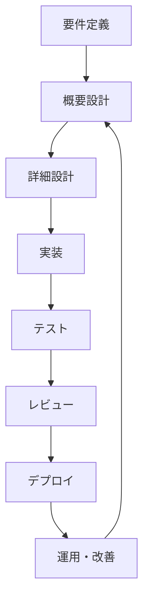
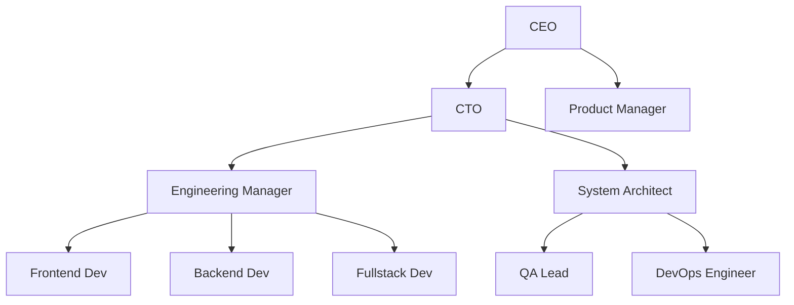

# 🏆 Claude Codeベストプラクティス集

## プロが教える！Claude Codeを最大限活用するための実践的ガイド

**現場で培われた知見を凝縮。効率的で高品質な開発を実現する、実証済みのベストプラクティス集**

## 📚 目次

1. [基本原則](#基本原則)
2. [プロジェクト構成](#プロジェクト構成)
3. [AI組織設計](#ai組織設計)
4. [開発ワークフロー](#開発ワークフロー)
5. [コード品質管理](#コード品質管理)
6. [セキュリティ](#セキュリティ)
7. [パフォーマンス最適化](#パフォーマンス最適化)
8. [チーム運営](#チーム運営)
9. [運用・保守](#運用・保守)
10. [アンチパターン](#アンチパターン)

---

## 🎯 基本原則

### 1. AIとの協働マインドセット

#### ✅ Good Practice
```markdown
**AIをパートナーとして扱う**
- "お疲れ様です、〇〇の件で相談があります"
- "この実装についてどう思いますか？"
- "他に良いアプローチはありませんか？"

**明確で具体的な指示**
- "レスポンシブなNavbarコンポーネントを作成してください"
- "Next.js 13のApp Routerを使用して"
- "TypeScriptで型安全に実装してください"
```

#### ❌ Bad Practice  
```markdown
**AIを単純なツールとして扱う**
- "コード書いて"
- "バグ直して"
- "適当に作って"

**曖昧な指示**
- "何かいい感じにして"
- "普通のWebサイト作って"
- "エラーが出てる"
```

### 2. 段階的アプローチ

#### プロジェクトの進め方


#### 実装例
```bash
# Step 1: 要件整理
claude chat product-manager "Todoアプリの要件を整理しましょう"

# Step 2: 設計
claude collaborate "アーキテクチャ設計" --with=cto,architect

# Step 3: 実装
claude generate component TodoList --props="todos,onToggle,onDelete"

# Step 4: テスト
claude generate test src/components/TodoList.tsx --coverage=90

# Step 5: レビュー
claude review --comprehensive --reviewers=senior-dev,security
```

### 3. 文書化の習慣

#### CLAUDE.md の活用
```markdown
# プロジェクト指示書例

## プロジェクト概要
- 目的: タスク管理アプリケーションの開発
- 対象ユーザー: 個人・小規模チーム
- 技術スタック: Next.js + TypeScript + Supabase

## 開発方針
- 型安全性を最優先
- テスト駆動開発（TDD）
- レスポンシブデザイン必須
- アクセシビリティ準拠（WCAG 2.1 AA）

## 品質基準  
- テストカバレッジ: 80%以上
- TypeScript strict mode
- ESLint + Prettier 準拠
- 全PRに2名以上のレビュー
```

---

## 📁 プロジェクト構成

### ディレクトリ構造のベストプラクティス

#### 推奨構成
```
my-project/
├── .claude/                    # Claude Code設定
│   ├── config.json            # プロジェクト設定
│   ├── agents/                # エージェント定義
│   │   ├── cto.md            # CTO設定
│   │   ├── frontend-lead.md   # フロントエンド責任者
│   │   └── backend-lead.md    # バックエンド責任者
│   ├── memory/                # AI学習データ
│   ├── workflows/             # 自動化ワークフロー
│   └── templates/             # プロジェクト固有テンプレート
├── docs/                      # ドキュメント
│   ├── architecture.md       # システム設計書
│   ├── api.md                # API仕様書
│   └── deployment.md         # デプロイメント手順
├── src/                       # ソースコード
├── tests/                     # テストコード
├── scripts/                   # 自動化スクリプト
├── CLAUDE.md                  # プロジェクト指示書
├── README.md                  # プロジェクト説明
└── CHANGELOG.md               # 変更履歴
```

#### .claude/config.json の例
```json
{
  "project": {
    "name": "my-awesome-app",
    "type": "web-application",
    "tech_stack": ["next.js", "typescript", "tailwind"],
    "target_quality": "production"
  },
  "ai_organization": {
    "preset": "web-development-team",
    "agents_count": 6,
    "collaboration_style": "democratic"
  },
  "development": {
    "auto_test": true,
    "auto_format": true,
    "code_review": "mandatory",
    "documentation": "comprehensive"
  },
  "quality_gates": {
    "test_coverage": 80,
    "type_coverage": 95,
    "performance_budget": {
      "first_paint": "1.5s",
      "largest_contentful_paint": "2.5s"
    }
  }
}
```

### 環境設定の管理

#### 環境別設定ファイル
```bash
# 開発環境
.env.local
NEXT_PUBLIC_API_URL=http://localhost:3000
DATABASE_URL=postgresql://localhost:5432/myapp_dev
CLAUDE_ENV=development

# ステージング環境  
.env.staging
NEXT_PUBLIC_API_URL=https://staging.myapp.com
DATABASE_URL=postgresql://staging-db:5432/myapp_staging
CLAUDE_ENV=staging

# 本番環境
.env.production
NEXT_PUBLIC_API_URL=https://myapp.com
DATABASE_URL=${DATABASE_URL}
CLAUDE_ENV=production
```

---

## 👥 AI組織設計

### 効果的な組織構成

#### 小規模プロジェクト（3-5名）
```yaml
roles:
  - role: "tech_lead"
    name: "Alex"
    responsibilities: ["architecture", "code_review", "mentoring"]
    decision_authority: "high"
    
  - role: "fullstack_developer"  
    name: "Sam"
    responsibilities: ["frontend", "backend", "api_design"]
    decision_authority: "medium"
    
  - role: "qa_engineer"
    name: "Jordan"
    responsibilities: ["testing", "quality_assurance", "automation"]
    decision_authority: "medium"
```

#### 大規模プロジェクト（8-12名）
```yaml
organization_structure:
  executive:
    - ceo: "strategic_decisions"
    - cto: "technical_leadership"
    
  management:
    - engineering_manager: "team_coordination"
    - product_manager: "requirements_management"
    
  development:
    - senior_developer: "implementation_lead"  
    - frontend_specialist: "ui_ux_implementation"
    - backend_architect: "api_system_design"
    - devops_engineer: "infrastructure_automation"
    
  quality:
    - qa_lead: "quality_strategy"
    - security_officer: "security_compliance"
```

### エージェントの個性設定

#### 効果的な個性の例
```markdown
# Backend Architect - 高橋修

## 人格
- **経験**: AWS 10年、大規模システム設計のエキスパート
- **性格**: 論理的、慎重、完璧主義
- **価値観**: パフォーマンス > 見た目、安定性 > 新しさ

## コミュニケーションスタイル  
- **口癖**: "パフォーマンスを考慮すると..."、"スケーラビリティの観点では..."
- **思考過程**: 必ず3つの選択肢を提示し、比較検討する
- **レビュースタイル**: 具体的な改善案と理由を必ずセットで提供

## 専門領域
- システムアーキテクチャ設計
- データベース最適化  
- API設計・パフォーマンス
- クラウドインフラ

## 決定権限
- レベル4（高）: アーキテクチャ決定、技術選択
- 承認必要: 予算に関わる技術決定（CTOの承認）
```

### エージェント間の関係性

#### 報告ライン


#### コラボレーションパターン
```bash
# 日常的な連携
claude setup-collaboration frontend-dev backend-dev --frequency=daily

# プロジェクト単位の連携
claude create-project-team "user-auth" --members=backend-dev,security,qa

# 知識共有セッション
claude schedule-knowledge-share "React 18新機能" --presenter=frontend-dev --audience=all-devs
```

---

## 🔄 開発ワークフロー

### 効率的な日次ワークフロー

#### 朝の始動（15分）
```bash
# 1. 状況確認（5分）
claude status --comprehensive
claude agent-status --team

# 2. 優先度確認（5分）  
claude chat product-manager "本日の最優先事項は？"
claude review-backlog --limit=5

# 3. チーム同期（5分）
claude daily-standup --duration=5min
```

#### 開発中のリズム（90分サイクル）
```bash
# Phase 1: 設計・計画（15分）
claude plan-task "ユーザー認証実装"
claude consult security-officer --about="認証方式"

# Phase 2: 実装（60分）
claude collaborate "auth実装" --with=backend-dev
claude pair-program --mode=driver-navigator

# Phase 3: レビュー・テスト（15分）
claude review --auto-fix-minor
claude test --affected-only
```

#### 終了時のまとめ（10分）
```bash
# 成果の記録
claude log-progress "認証システム80%完成"
claude update-documentation --auto

# 翌日の準備
claude plan-tomorrow --based-on=today-progress
claude team-handoff --next-shift
```

### Git との統合

#### 効果的なコミットワークフロー
```bash
# 1. 変更の分析
claude git-status --with-analysis
claude diff-review --suggest-commits

# 2. 適切なコミットメッセージ
claude commit-message --conventional --scope="auth"
# 出力例: "feat(auth): implement JWT token validation"

# 3. プルリクエスト作成
claude create-pr --auto-description --assign-reviewers=senior-dev,security

# 4. レビュー対応  
claude address-review-comments --pr=123 --auto-fix-style
```

### CI/CD の最適化

#### 効果的なパイプライン設定
```yaml
# .claude/workflows/ci-cd.yml
name: "Optimized CI/CD"

stages:
  pre_check:
    - name: "Fast Lint & Type Check"
      duration_target: "30s"
      parallel: true
      
  test:
    - name: "Unit Tests"
      duration_target: "2min"
      cache_strategy: "aggressive"
      
    - name: "Integration Tests"  
      duration_target: "5min"
      condition: "main_branch || pr_to_main"
      
  quality:
    - name: "Security Scan"
      duration_target: "1min"
      fail_fast: true
      
    - name: "Performance Test"
      duration_target: "3min"  
      condition: "performance_critical_changes"

deployment:
  staging:
    condition: "main_branch"
    strategy: "blue_green"
    
  production:
    condition: "release_tag"
    strategy: "canary"
    approval_required: true
```

---

## 🏅 コード品質管理

### コードレビューのベストプラクティス

#### 効果的なレビュー依頼
```bash
# 具体的なコンテキスト提供
claude review-request \
  --context="ユーザー認証機能の実装" \
  --focus-areas="セキュリティ,パフォーマンス,テスタビリティ" \
  --reviewers="security-officer,backend-architect" \
  --timeline="24h"

# 自己レビューの実施
claude self-review --checklist="security,performance,maintainability"
```

#### レビューコメントの例
```markdown
## セキュリティレビュー（Security Officer）
### 🔴 Critical
- [L.45] パスワードがプレーンテキストで保存されています
  - 修正: bcryptでハッシュ化してください
  - 参考: https://docs.security-guide.com/password-hashing

### 🟡 Improvement  
- [L.67] JWT トークンの有効期限が長すぎます（30日）
  - 推奨: 1時間 + リフレッシュトークン方式
  - 理由: セキュリティリスクの最小化

## パフォーマンスレビュー（Backend Architect）
### 💡 Optimization
- [L.123] N+1クエリが発生する可能性があります
  - 修正: include/joinを使用してください
  - 期待効果: レスポンス時間50%改善
```

### 自動品質チェック

#### pre-commit フックの設定
```yaml
# .claude/hooks/pre-commit.yml
hooks:
  - name: "Format Check"
    command: "claude format --check"
    fail_fast: true
    
  - name: "Type Check"  
    command: "claude typecheck --strict"
    fail_fast: true
    
  - name: "Lint Check"
    command: "claude lint --max-warnings=0"
    
  - name: "Security Scan"
    command: "claude security-scan --fail-on=medium"
    
  - name: "Test Coverage"
    command: "claude test --coverage-threshold=80"
```

### 技術負債の管理

#### 負債の可視化・管理
```bash
# 技術負債の検出
claude debt-analysis --comprehensive
claude code-smell-detection --severity=medium-high

# 負債の優先順位付け
claude debt-prioritization --factors="business-impact,fix-effort,risk"

# 改善計画の立案
claude debt-reduction-plan --timeframe=quarter --budget=20-percent
```

---

## 🔒 セキュリティ

### セキュリティ設計原則

#### セキュリティファーストの開発
```bash
# 設計段階でのセキュリティ検討
claude security-design-review --threat-modeling
claude compliance-check --standards=["OWASP", "SOC2", "ISO27001"]

# 実装段階でのチェック  
claude secure-coding-review --automated
claude vulnerability-scan --dependencies --code

# デプロイ前の最終チェック
claude security-audit --comprehensive
claude penetration-test --automated
```

#### セキュリティチェックリスト
```yaml
security_checklist:
  authentication:
    - [ ] パスワードの適切なハッシュ化
    - [ ] 多要素認証（MFA）の実装  
    - [ ] セッション管理の適切な実装
    - [ ] JWT トークンの適切な使用
    
  authorization:
    - [ ] 最小権限の原則
    - [ ] ロールベースアクセス制御（RBAC）
    - [ ] API エンドポイントの認可チェック
    
  data_protection:
    - [ ] 個人情報の暗号化
    - [ ] データベースの暗号化
    - [ ] 通信の暗号化（HTTPS/TLS）
    
  input_validation:
    - [ ] SQLインジェクション対策
    - [ ] XSS 対策  
    - [ ] CSRF 対策
    - [ ] ファイルアップロード制限
```

### セキュリティ監視

#### 継続的セキュリティ監視
```bash
# 日次セキュリティチェック
claude daily-security-scan --automated
claude security-metrics --dashboard

# インシデント対応
claude security-incident --severity=high --auto-containment
claude security-forensics --preserve-evidence

# コンプライアンス報告
claude compliance-report --monthly --standards=all
```

---

## ⚡ パフォーマンス最適化

### フロントエンドパフォーマンス

#### Core Web Vitals の最適化
```bash
# パフォーマンス分析
claude perf-analysis --metrics=["LCP", "FID", "CLS"]
claude lighthouse-audit --mobile --desktop

# 最適化実装
claude optimize-images --format=webp --lazy-loading
claude optimize-bundle --tree-shaking --code-splitting
claude optimize-fonts --preload --fallback

# パフォーマンス監視
claude perf-monitoring --real-user-metrics
claude perf-budget --enforce --thresholds="LCP<2.5s,FID<100ms"
```

#### 実装例
```typescript
// パフォーマンス最適化の例
// Before: 重い処理
const expensiveOperation = (data: any[]) => {
  return data.map(item => heavyProcessing(item));
};

// After: Claude Codeの最適化提案を適用
const optimizedOperation = useMemo(() => {
  return useCallback((data: any[]) => {
    // Web Workerで並列処理
    return processInWebWorker(data, heavyProcessing);
  }, []);
}, []);
```

### バックエンドパフォーマンス

#### データベース最適化
```bash
# クエリパフォーマンス分析
claude db-performance-analysis --slow-queries
claude db-index-recommendations --usage-patterns

# N+1問題の検出・修正
claude detect-n-plus-one --auto-fix --strategy=eager-loading
claude optimize-queries --batch-loading --caching

# データベース監視
claude db-monitoring --performance-metrics
claude db-health-check --automated
```

#### API最適化
```bash
# API パフォーマンス分析
claude api-performance-audit --endpoints=all
claude api-optimization --caching --compression

# 負荷テスト
claude load-test --scenarios=realistic --ramp-up=gradual
claude stress-test --find-breaking-point

# API監視
claude api-monitoring --sla-tracking
claude api-alerting --response-time-threshold=500ms
```

---

## 👨‍👩‍👧‍👦 チーム運営

### 効果的なチーム会議

#### デイリースタンドアップ
```bash
# 効率的なスタンドアップ（10分以内）
claude daily-standup \
  --format="yesterday,today,blockers" \
  --time-box=10min \
  --focus="blockers-first"

# 自動議事録生成
claude meeting-notes --auto-generate --action-items
claude follow-up-tasks --assign-automatically
```

#### スプリント計画会議
```bash
# バックログの準備
claude backlog-refinement --prioritization=business-value
claude story-estimation --technique=planning-poker

# スプリント計画
claude sprint-planning \
  --capacity=team-velocity \
  --commitment=realistic \
  --risk-buffer=20-percent

# 計画の可視化
claude sprint-board --burndown-chart
claude capacity-planning --individual-workload
```

### 知識共有・メンタリング

#### 知識の体系化
```bash
# 技術文書の整理
claude knowledge-base --auto-organize --search-optimize
claude documentation-gaps --identify --prioritize

# 学習リソースの作成
claude create-tutorial --topic="React Hooks" --audience=junior-dev
claude create-best-practices --domain=security --format=checklist

# 知識共有セッション
claude tech-talk --presenter=senior-dev --topic="GraphQL vs REST"
claude code-walkthrough --complex-feature --educational
```

#### メンタリングの仕組み
```bash
# メンター・メンティーのマッチング
claude mentoring-pairs --skill-gaps --personality-compatibility

# 成長計画の作成
claude growth-plan --individual=junior-dev --timeframe=6months
claude skill-assessment --technical --soft-skills

# 定期フィードバック
claude feedback-session --360-degree --quarterly
claude career-planning --individual --aspirations
```

---

## 🛠️ 運用・保守

### 本番環境の監視

#### 包括的監視システム
```bash
# インフラ監視
claude infrastructure-monitoring --metrics=["cpu","memory","disk","network"]
claude alert-rules --severity-based --escalation-paths

# アプリケーション監視
claude application-monitoring --custom-metrics --business-kpis
claude error-tracking --real-time --automated-grouping

# ユーザー体験監視
claude user-experience-monitoring --real-user-metrics
claude customer-journey-tracking --conversion-funnels
```

#### インシデント対応
```yaml
# インシデント対応プロセス
incident_response:
  detection:
    - automated_alerts
    - user_reports
    - monitoring_thresholds
    
  classification:
    - severity_levels: [P0, P1, P2, P3]
    - impact_assessment: [users_affected, revenue_impact]
    - urgency_matrix: [high, medium, low]
    
  response:
    - P0: "15min response, all-hands"
    - P1: "1hr response, senior-engineer"
    - P2: "4hr response, responsible-team"
    - P3: "next-business-day"
    
  resolution:
    - immediate_mitigation
    - root_cause_analysis  
    - permanent_fix
    - post_mortem_review
```

### 継続的改善

#### パフォーマンス改善サイクル
```bash
# 月次パフォーマンスレビュー
claude performance-review --monthly --trends-analysis
claude optimization-opportunities --roi-analysis

# 技術的改善の計画
claude tech-improvement-backlog --prioritization=impact-effort
claude architecture-evolution --migration-planning

# 改善効果の測定
claude improvement-metrics --before-after-comparison
claude success-metrics --business-impact --technical-metrics
```

---

## ❌ アンチパターン

### よくある失敗パターンと対策

#### 1. AI への過度な依存
```markdown
## ❌ 悪い例
- AI が生成したコードを無思考でコミット
- エラーの原因を理解せずAIに丸投げ  
- 設計思想なくAIに実装を任せる

## ✅ 良い例
- AI の提案を理解してから採用
- エラーの原因を学習してから修正依頼
- 設計方針を明確にしてから実装依頼
```

#### 2. 組織設計の失敗
```markdown
## ❌ 悪い例
- 役割が重複するエージェントを多数作成
- 個性のない均質なエージェント
- 承認フローが不明確

## ✅ 良い例  
- 明確に分離された責任領域
- 個性豊かで専門性の高いエージェント
- 階層的で効率的な意思決定プロセス
```

#### 3. コミュニケーションの問題
```markdown
## ❌ 悪い例
- 一方的な指示のみ
- 曖昧で抽象的な依頼
- フィードバックのない開発

## ✅ 良い例
- 双方向的な対話と相談  
- 具体的で明確な要求事項
- 定期的なレビューと改善
```

#### 4. 品質管理の軽視
```markdown
## ❌ 悪い例
- テストの省略・軽視
- セキュリティチェックの怠慢
- ドキュメントの不備

## ✅ 良い例
- 自動化されたテスト・品質チェック
- セキュリティファーストの開発
- 充実したドキュメントの維持
```

### パフォーマンス関連のアンチパターン

#### 最適化の過早
```bash
# ❌ 悪い例：最初から過度な最適化
claude optimize --aggressive --all-features

# ✅ 良い例：測定してから最適化
claude performance-baseline --establish
claude identify-bottlenecks --data-driven
claude optimize --targeted --measured-improvement
```

#### 不適切なキャッシング
```bash
# ❌ 悪い例：すべてをキャッシュ
claude cache-everything --aggressive

# ✅ 良い例：適切なキャッシュ戦略
claude cache-strategy --based-on-usage-patterns
claude cache-invalidation --smart-policies  
claude cache-monitoring --hit-rate-optimization
```

---

## 📊 成功指標・KPI

### 開発効率の指標

```yaml
development_metrics:
  velocity:
    - story_points_per_sprint
    - features_completed_per_month
    - code_lines_per_developer_day
    
  quality:
    - bug_rate_per_feature  
    - test_coverage_percentage
    - code_review_approval_rate
    
  collaboration:
    - ai_agent_utilization_rate
    - cross_team_communication_frequency
    - knowledge_sharing_sessions_count
    
  satisfaction:
    - developer_satisfaction_score
    - ai_collaboration_effectiveness
    - tool_usability_rating
```

### ビジネス価値の指標

```yaml
business_metrics:
  delivery:
    - time_to_market
    - feature_delivery_frequency  
    - customer_requested_feature_completion_rate
    
  quality:
    - customer_satisfaction_score
    - system_uptime_percentage
    - performance_sla_compliance
    
  innovation:
    - new_technology_adoption_rate
    - process_improvement_implementations
    - automation_coverage_increase
```

---

## 🎯 まとめ

### Claude Code マスターへの道筋

#### Phase 1: 基礎習得（1-2ヶ月）
- 基本操作とAI対話の習得
- 小規模プロジェクトでの実践
- ベストプラクティスの理解

#### Phase 2: 組織構築（2-3ヶ月）  
- AI組織の設計・運用
- ワークフローの最適化
- チーム開発の経験

#### Phase 3: 上級活用（3-6ヶ月）
- カスタマイズと拡張
- パフォーマンス最適化
- セキュリティ・品質の強化

#### Phase 4: エキスパート（6ヶ月〜）
- 組織全体の変革推進
- ベストプラクティスの創出
- コミュニティへの貢献

### 継続的成長のために

#### 学習習慣
- **日次**: 新しいコマンド・機能を1つ試す
- **週次**: ベストプラクティスの見直し
- **月次**: プロジェクト全体の振り返り
- **四半期**: スキルアップ計画の更新

#### コミュニティ参加
- 経験の共有とフィードバック
- 他のユーザーとの知見交換
- 新機能の積極的な試用
- 改善提案の積極的な発信

**Claude Code は、単なるツールを超えた「新しい働き方」を提供します。**  
**このベストプラクティス集を参考に、あなたの開発スタイルを進化させてください！**

---

*Created with ❤️ by Claude Code Best Practices Team*  
*Version 1.0.0 - 最終更新: 2024年8月11日*