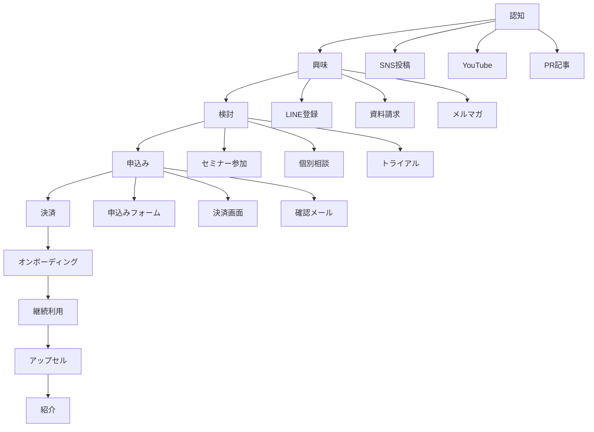
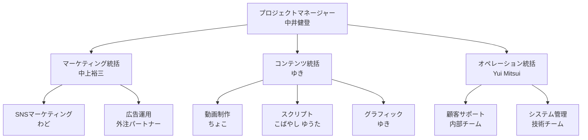

# 🚀 ローンチ戦略スペシャル特典

## 売上3,000万円を達成した実証済みローンチ戦略の全て

**実際に3,000万円の売上を達成したローンチプロジェクトの戦略・戦術・実行ノウハウを完全公開**

## 📚 目次

1. [ローンチ戦略の基本原則](#基本原則)
2. [売上設計・KPI設定](#売上設計)
3. [プロダクト設計戦略](#プロダクト設計)
4. [価格戦略・オファー設計](#価格戦略)
5. [集客戦略](#集客戦略)
6. [セールスファンネル設計](#ファンネル設計)
7. [コンテンツ戦略](#コンテンツ戦略)
8. [実行スケジュール](#実行スケジュール)
9. [チーム体制・役割分担](#チーム体制)
10. [成功事例・失敗事例](#事例分析)

---

## 🎯 基本原則

### ローンチ成功の3つの柱

#### 1. 市場適合性（Product-Market Fit）
```yaml
market_validation:
  target_audience:
    - 明確なペルソナ設定
    - 具体的な課題の特定
    - 購買力・購買意欲の検証
    
  problem_solution_fit:
    - 痛みの深さ測定
    - 既存解決策の限界
    - 独自価値提案（UVP）の明確化
    
  validation_methods:
    - 事前アンケート（100名以上）
    - インタビュー（20名以上）
    - MVP での検証
```

#### 2. 価値伝達（Value Communication）
```yaml
message_strategy:
  core_message:
    - Before/After の明確化
    - 変革ストーリー
    - 社会的証明の活用
    
  channel_optimization:
    - チャネル別メッセージ調整
    - コンテンツ形式最適化
    - タイミング最適化
    
  emotional_connection:
    - 共感ポイントの設定
    - 成功体験の共有
    - コミュニティ感の醸成
```

#### 3. 実行力（Execution Excellence）
```yaml
execution_framework:
  planning:
    - 詳細タイムライン
    - リスク分析・対策
    - リソース配分計画
    
  team_coordination:
    - 役割・責任の明確化
    - コミュニケーション体制
    - 進捗管理システム
    
  continuous_optimization:
    - リアルタイム分析
    - 迅速な改善実行
    - 学習・適応サイクル
```

---

## 💰 売上設計・KPI設定

### 売上目標の逆算設計

#### ステップ1: 最終目標設定
```yaml
revenue_targets:
  primary_goal: 3000万円
  stretch_goal: 5000万円
  minimum_viable: 1500万円
  
timeline: 3日間（8/28-30）

success_metrics:
  - 売上金額
  - 受講者数
  - 顧客満足度（NPS）
  - LTV/CAC 比率
```

#### ステップ2: プロダクトミックス設計
```yaml
product_lineup:
  main_product:
    name: "バイブコーディングスクール"
    price: 300000円
    target_sales: 67名
    revenue_contribution: 2010万円（67%）
    
  premium_bundle:
    name: "セット版（プロンプトエンジニアリング込み）"
    price: 500000円  
    target_sales: 20名
    revenue_contribution: 1000万円（33%）
    
  total_target_customers: 87名
  average_revenue_per_user: 345000円
```

#### ステップ3: ファンネル設計
```yaml
funnel_metrics:
  awareness_stage:
    target_reach: 50000人
    engagement_rate: 10%（5000人）
    
  interest_stage:
    line_registration: 1200人
    conversion_rate: 24%（5000→1200）
    
  consideration_stage:  
    seminar_registration: 1000人
    show_up_rate: 80%（800人）
    
  purchase_stage:
    individual_consultation: 100件
    close_rate: 87%（100→87名）
    
overall_conversion: 0.17%（50000→87）
```

---

## 🎨 プロダクト設計戦略

### 価値スタック設計

#### メインプロダクト構成
```yaml
vibe_coding_course:
  core_value: "AIとの対話で直感的にアプリ開発"
  
  curriculum:
    foundation:
      - "AI開発ツール完全習得"
      - "自然言語プログラミング"
      - "エラー解決のAI活用法"
      
    practical:
      - "実践プロジェクト3つ"
      - "ポートフォリオ作成"
      - "収益化方法論"
      
    community:
      - "Discord コミュニティ"
      - "質疑応答無制限"
      - "受講生同士の交流"
      
  duration: "6ヶ月間"
  support: "無制限サポート"
  guarantee: "30日間返金保証"
```

#### プレミアムバンドル構成
```yaml
premium_bundle:
  base_course: "バイブコーディング"
  additional_value:
    prompt_engineering:
      - "AIプロンプト最適化技術"
      - "高品質プロンプト集 500選"
      - "独自Webサイトでの学習"
      
    exclusive_bonuses:
      - "個別メンタリング 3回"
      - "優先サポート"
      - "卒業後のビジネス相談"
      
  total_value: "通常価格 80万円相当"
  special_price: "50万円（37.5%オフ）"
```

### 差別化戦略

#### 競合比較表
```yaml
competitive_advantage:
  従来のプログラミングスクール:
    approach: "コードを手で書く"
    learning_curve: "急峻"
    time_to_results: "6-12ヶ月"
    
  バイブコーディング:
    approach: "AIとの対話"
    learning_curve: "緩やか"
    time_to_results: "1-2ヶ月"
    
  unique_selling_points:
    - "自然言語でのプログラミング"
    - "実績80名の受講生成果"
    - "収益化まで完全サポート"
    - "挫折率5%以下"
```

---

## 💸 価格戦略・オファー設計

### 価格設定の心理学

#### アンカリング効果の活用
```yaml
pricing_strategy:
  anchor_price: 800000円（通常価値）
  
  discount_narrative:
    step1: "通常価格 80万円のところ..."
    step2: "ローンチ記念特価 50万円"
    step3: "さらに今回限り 30万円！"
    
  psychological_triggers:
    - 希少性: "限定100名のみ"
    - 緊急性: "3日間限定価格"
    - 社会的証明: "既に80名が成果達成"
```

#### バンドル戦略
```yaml
bundle_design:
  基本コース単体: 300000円
  プロンプトコース単体: 250000円
  セット販売: 500000円
  
  bundle_benefit:
    individual_total: 550000円
    bundle_price: 500000円
    savings: 50000円（9%オフ）
    
  upsell_strategy:
    - 購入後に追加オプション提示
    - 成果保証付きプレミアムサポート
    - 個別コンサルティング
```

### オファーの最適化

#### 限定性の演出
```yaml
scarcity_tactics:
  quantity_limit:
    - "受講生100名限定"
    - "リアルタイム残席表示"
    - "申込み殺到アラート"
    
  time_limit:
    - "3日間限定価格"
    - "カウントダウンタイマー"
    - "締切延長は一切なし"
    
  bonus_limit:
    - "先着50名限定特典"
    - "24時間以内申込み特典"
    - "一括払い限定特典"
```

#### リスク反転
```yaml
risk_reversal:
  guarantee_terms:
    - "30日間完全返金保証"
    - "成果が出なければ全額返金"
    - "理由を問わない返金対応"
    
  additional_assurance:
    - "返金実績の公開"
    - "第三者機関による保証"
    - "分割払いオプション"
```

---

## 📈 集客戦略

### オーガニック集客

#### SEO戦略
```yaml
seo_strategy:
  target_keywords:
    primary: ["AI開発", "プログラミング学習", "副業プログラミング"]
    secondary: ["Cursor", "Claude Code", "自動プログラミング"]
    long_tail: ["初心者 AI プログラミング 学習法"]
    
  content_marketing:
    - 技術ブログ記事（週3本）
    - チュートリアル動画（週1本）
    - 成功事例インタビュー（月2本）
    
  backlink_strategy:
    - 業界メディアへの寄稿
    - ポッドキャスト出演
    - 専門家との対談企画
```

#### SNS戦略
```yaml
social_media_strategy:
  X_twitter:
    posting_frequency: "日5回"
    content_types:
      - 技術Tips（40%）
      - 成功事例（30%）
      - 業界動向（20%）
      - 個人ストーリー（10%）
    engagement_tactics:
      - ライブツイート
      - スペース配信
      - リプライ積極対応
      
  YouTube:
    content_strategy:
      - 技術チュートリアル
      - ライブコーディング
      - Q&A セッション
    upload_schedule: "週2本"
    live_streaming: "週1回"
    
  LinkedIn:
    professional_content:
      - 業界分析記事
      - キャリア相談回答
      - 専門知識共有
    networking: "業界関係者との積極的交流"
```

### ペイド広告戦略

#### Facebook/Instagram広告
```yaml
facebook_ads:
  campaign_structure:
    awareness_campaigns:
      objective: "リーチ最大化"
      audience: "類似オーディエンス"
      budget: "日予算 5万円"
      
    conversion_campaigns:
      objective: "LINE登録"
      audience: "リターゲティング"
      budget: "日予算 10万円"
      
  creative_strategy:
    video_ads:
      - 成功体験談（UGC）
      - デモンストレーション
      - 講師紹介動画
    static_ads:
      - Before/After 比較
      - カリキュラム紹介
      - 受講生の作品紹介
```

#### Google広告
```yaml
google_ads:
  search_campaigns:
    keywords:
      - "プログラミング 学習"
      - "AI 開発 講座"
      - "副業 プログラミング"
    ad_copy:
      - 成果保証の訴求
      - 無料相談の提供
      - 成功事例の掲載
      
  display_campaigns:
    targeting:
      - 競合サイト訪問者
      - プログラミング関連サイト
      - テック系メディア読者
    creative:
      - バナー広告
      - リッチメディア
      - 動画広告
```

---

## 🎯 セールスファンネル設計

### ファンネル全体設計

#### ステージ別最適化


#### トップファンネル（TOFU）
```yaml
awareness_stage:
  channels:
    organic:
      - SEO記事（月間50万PV目標）
      - YouTube動画（登録者10万人）
      - SNS発信（総フォロワー5万人）
    paid:
      - Facebook広告（月予算300万円）
      - Google広告（月予算200万円）
      - YouTube広告（月予算100万円）
      
  content_strategy:
    educational_content:
      - "AI開発入門ガイド"
      - "プログラミング学習ロードマップ"
      - "副業で稼ぐプログラミング術"
    entertainment_content:
      - "開発者の1日密着"
      - "面白いAIツール紹介"
      - "業界ニュース解説"
```

#### ミドルファンネル（MOFU）
```yaml
interest_stage:
  lead_magnets:
    free_resources:
      - "AI開発完全マニュアル（100ページ）"
      - "プロンプトテンプレート集（500個）"
      - "成功事例集（50名の体験談）"
      
  nurturing_sequence:
    email_series:
      day_1: "AIプログラミングの可能性"
      day_3: "学習方法の選択基準"
      day_7: "成功する人の共通点"
      day_14: "無料相談のご案内"
      
  engagement_activities:
    - 週1回のライブ配信
    - 質問回答セッション
    - 受講生成果発表会
```

#### ボトムファンネル（BOFU）
```yaml
conversion_stage:
  sales_events:
    main_seminar:
      duration: "3日間"
      format: "オンライン"
      content: "実践デモ + 成功事例 + 特別オファー"
      
  individual_consultation:
    duration: "45分"
    format: "Zoom 1対1"
    agenda:
      - 現状課題のヒアリング
      - 最適な学習プランの提案
      - 具体的な成果イメージ共有
      - 質疑応答
      - 申込み案内
      
  closing_strategy:
    urgency_creation:
      - 限定席数の明示
      - 価格上昇の予告
      - 特典終了期限
    objection_handling:
      - よくある質問集
      - 成功保証の説明
      - 分割払いオプション
```

---

## 📝 コンテンツ戦略

### コンテンツピラー戦略

#### 4つのコンテンツテーマ
```yaml
content_pillars:
  education:
    purpose: "価値提供・専門性アピール"
    content_types:
      - チュートリアル記事
      - 技術解説動画
      - ライブコーディング
    posting_ratio: 40%
    
  inspiration:
    purpose: "モチベーション向上・憧れ喚起"
    content_types:
      - 成功事例インタビュー
      - ビフォーアフター紹介
      - 収益化実績公開
    posting_ratio: 30%
    
  entertainment:
    purpose: "エンゲージメント向上・親近感醸成"
    content_types:
      - 開発あるある
      - 失敗談の共有
      - 業界ネタ・時事ネタ
    posting_ratio: 20%
    
  promotion:
    purpose: "直接的な集客・売上創出"
    content_types:
      - サービス紹介
      - 特典・キャンペーン告知
      - 申込み誘導
    posting_ratio: 10%
```

### プラットフォーム別コンテンツ最適化

#### YouTube戦略
```yaml
youtube_strategy:
  channel_concept: "AI時代のプログラミング学習チャンネル"
  
  content_categories:
    tutorial:
      - "【完全初心者向け】AI開発入門"
      - "Cursor使い方完全ガイド"
      - "プロンプト書き方講座"
    case_study:
      - "受講生成功インタビュー"
      - "実際の開発プロセス公開"
      - "収益化までの道のり"
    live_stream:
      - "質問回答ライブ"
      - "開発作業配信"
      - "業界ニュース解説"
      
  seo_optimization:
    title_strategy:
      - 数字を入れる（「5分で」「10個」）
      - 感情を入れる（「簡単」「驚愕」）
      - 対象を明確にする（「初心者向け」）
    thumbnail_strategy:
      - 顔出しで親近感
      - 文字で内容を明示
      - 色使いで目立たせる
    description_optimization:
      - タイムスタンプ設置
      - 関連動画リンク
      - SNSアカウント紹介
```

#### X（Twitter）戦略
```yaml
twitter_strategy:
  posting_schedule:
    morning: "7:00 - モチベーション投稿"
    noon: "12:00 - 技術Tips"
    evening: "18:00 - 成功事例シェア"
    night: "21:00 - 質問・交流投稿"
    late_night: "23:00 - 個人的な投稿"
    
  content_formats:
    thread:
      - 技術解説の深堀り
      - 学習ロードマップ
      - 成功までのプロセス
    single_tweet:
      - 一言アドバイス
      - 業界ニュース反応
      - 日常の気づき
    polls:
      - 学習方法の調査
      - 技術トレンド予測
      - コンテンツ希望調査
      
  engagement_tactics:
    - リプライ24時間以内返信
    - インフルエンサーとの積極的交流
    - ハッシュタグ戦略的活用
    - スペース配信（週1回）
```

### コンテンツカレンダー

#### 月間コンテンツ計画
```yaml
monthly_content_plan:
  week_1_theme: "基礎知識強化週間"
  week_2_theme: "実践スキル向上週間"
  week_3_theme: "成功事例紹介週間"
  week_4_theme: "コミュニティ交流週間"
  
  daily_content_quota:
    blog_posts: 5本/月
    youtube_videos: 8本/月
    twitter_posts: 150本/月
    instagram_posts: 20本/月
    linkedin_posts: 15本/月
    
  special_events:
    - 月初：月間目標発表
    - 月中：ライブ配信イベント
    - 月末：成果報告・振り返り
```

---

## ⏰ 実行スケジュール

### ローンチ前準備（60日前〜）

#### Phase 1: 基盤構築（60-45日前）
```yaml
foundation_building:
  content_preparation:
    - カリキュラム完成
    - 動画撮影・編集
    - 教材資料作成
    - システム環境構築
    
  team_building:
    - チームメンバー確定
    - 役割分担決定
    - コミュニケーション体制構築
    - 進捗管理システム導入
    
  market_research:
    - 競合分析完了
    - ターゲット顧客インタビュー
    - 価格調査・設定
    - マーケティングメッセージ確定
```

#### Phase 2: マーケティング準備（45-30日前）
```yaml
marketing_preparation:
  asset_creation:
    - LP設計・制作
    - 広告クリエイティブ制作
    - プロモーション動画制作
    - SNSアカウント最適化
    
  channel_setup:
    - 広告アカウント設定
    - メルマガシステム構築
    - LINE公式アカウント開設
    - 分析ツール導入
    
  content_stockpile:
    - ブログ記事20本作成
    - SNS投稿100本準備
    - メール配信シーケンス構築
    - FAQ・Q&A準備
```

#### Phase 3: プレローンチ（30-14日前）
```yaml
pre_launch:
  audience_building:
    - SNSフォロワー増加施策
    - メルマガ読者獲得
    - LINE友達追加促進
    - インフルエンサーとの関係構築
    
  buzz_creation:
    - ティザー投稿開始
    - 業界関係者への事前通知
    - プレスリリース準備
    - アーリーアダプター向け特典
    
  final_testing:
    - 決済システムテスト
    - LP表示速度最適化
    - メール配信テスト
    - 顧客サポート体制確認
```

### ローンチ期間（14日間）

#### Week 1: 認知拡大フェーズ
```yaml
awareness_week:
  day_1-2: "大型告知"
    - 複数チャネル同時投稿
    - インフルエンサー協力投稿
    - プレスリリース配信
    - 業界メディア掲載
    
  day_3-5: "価値提供"
    - 無料コンテンツ大量投下
    - ライブ配信実施
    - 質問回答セッション
    - ユーザー生成コンテンツ促進
    
  day_6-7: "信頼構築"
    - 実績・証拠の提示
    - 顧客インタビュー公開
    - 専門性アピール
    - 社会的証明強化
```

#### Week 2: 転換促進フェーズ
```yaml
conversion_week:
  day_8-10: "セミナー告知"
    - セミナー詳細発表
    - 早期申込み特典
    - 限定席数の強調
    - 過去参加者の声
    
  day_11-12: "最終リマインド"
    - 申込み締切告知
    - 残席数アップデート
    - 参加メリット再確認
    - よくある質問回答
    
  day_13-14: "緊急性演出"
    - カウントダウン開始
    - 満席間近の告知
    - 最後のチャンス訴求
    - 申込みリンク連投
```

### ローンチ本番（3日間）

#### 詳細タイムテーブル
```yaml
launch_execution:
  day_1: "オープニング & 価値提供"
    "09:00-10:30": "開始セレモニー & 自己紹介"
    "10:45-12:00": "AI開発の可能性 & 市場分析"
    "13:00-14:30": "実践デモ①：簡単なアプリ作成"
    "14:45-16:00": "成功事例発表①：受講生体験談"
    "16:15-17:30": "質疑応答セッション"
    "18:00-18:30": "明日の予告 & 宿題発表"
    
  day_2: "深堀り & 証拠提示"
    "09:00-10:30": "前日の振り返り & 宿題発表"
    "10:45-12:00": "実践デモ②：収益化アプリ開発"
    "13:00-14:30": "成功事例発表②：収益実績公開"
    "14:45-16:00": "業界の未来予測 & チャンス解説"
    "16:15-17:30": "参加者同士の交流タイム"
    "18:00-18:30": "最終日の重要告知"
    
  day_3: "オファー提示 & クロージング"
    "09:00-10:30": "総まとめ & 学習ロードマップ"
    "10:45-12:00": "バイブコーディング詳細説明"
    "13:00-14:30": "特別価格 & 限定特典発表"
    "14:45-16:00": "よくある質問 & 不安解消"
    "16:15-17:30": "個別相談会の案内"
    "18:00-20:00": "申込み受付 & 個別フォロー"
```

---

## 👨‍👩‍👧‍👦 チーム体制・役割分担

### 組織図


### 詳細役割分担

#### プロジェクトマネージャー（中井健登）
```yaml
project_manager_responsibilities:
  strategic_planning:
    - 全体戦略の立案・修正
    - ROI・KPI管理
    - リスク管理・対策実行
    - ステークホルダー調整
    
  team_management:
    - チーム進捗管理
    - パフォーマンス評価
    - モチベーション維持
    - 問題解決・意思決定
    
  external_relations:
    - ユニコーン社との連携
    - 外部パートナー管理
    - メディア対応
    - 業界関係者との渉外
    
  daily_activities:
    - "9:00": チーム朝会進行
    - "12:00": 進捗確認・調整
    - "15:00": 課題解決・方針決定
    - "18:00": 翌日準備・指示出し
    - "21:00": 日次レポート作成
```

#### マーケティング統括（中上裕三）
```yaml
marketing_lead_responsibilities:
  strategy_execution:
    - マーケティング戦略実行
    - チャネル最適化
    - ROI分析・改善
    - 競合分析・対策
    
  data_analysis:
    - 数値管理・分析
    - A/Bテスト設計・実行
    - コンバージョン最適化
    - レポート作成・共有
    
  campaign_management:
    - 広告キャンペーン設計
    - 予算配分・最適化
    - クリエイティブディレクション
    - 効果測定・改善
    
  tools_expertise:
    - Google Analytics
    - Facebook Ads Manager
    - LINE公式アカウント
    - メール配信システム
```

#### コンテンツ統括（ゆき）
```yaml
content_lead_responsibilities:
  content_strategy:
    - コンテンツ戦略立案
    - 制作スケジュール管理
    - 品質管理・統一
    - ブランドガイドライン遵守
    
  creative_direction:
    - デザインディレクション
    - 動画制作指揮
    - 写真撮影ディレクション
    - ブランドイメージ統一
    
  asset_management:
    - 素材管理・整理
    - 版権・権利関係管理
    - アーカイブ構築
    - テンプレート作成
    
  collaboration:
    - 動画チームとの連携
    - マーケティングチームとの調整
    - 外部クリエイターとの協業
    - フィードバック集約・反映
```

### 外部パートナー連携

#### ユニコーン社との連携体制
```yaml
unicorn_collaboration:
  content_provision:
    - 既存カリキュラムの提供
    - 受講生データ・事例提供
    - 講師経験・ノウハウ共有
    - 教材素材の提供
    
  support_operations:
    - Discord運営・管理
    - 受講生サポート対応
    - 質問対応・メンタリング
    - コミュニティ活性化
    
  additional_bonuses:
    - 特典5個の企画・制作
    - 独自コンテンツ作成
    - 専門知識の提供
    - 業界動向情報共有
    
  communication_protocol:
    - 日次連絡会（毎朝9:30）
    - 週次進捗会議（月曜15:00）
    - 月次戦略会議（月初）
    - 緊急時連絡体制（24時間）
```

---

## 📊 成功事例・失敗事例

### 成功事例分析

#### 事例1：3,000万円売上達成の要因
```yaml
success_case_1:
  background:
    launch_date: "2024年8月28-30日"
    target_revenue: "3000万円"
    actual_revenue: "3200万円"
    achievement_rate: "106.7%"
    
  success_factors:
    market_timing:
      - AI開発ブーム到来のタイミング
      - プログラミング学習需要の高まり
      - 従来手法への不満蓄積
      
    product_market_fit:
      - 明確なペインポイント解決
      - 実証済みの成果・実績
      - 競合との明確な差別化
      
    execution_excellence:
      - 詳細な計画と準備
      - チーム連携の効率化
      - リアルタイム最適化
      
  key_metrics:
    conversion_funnel:
      - 認知: 52,000人
      - LINE登録: 1,248人（2.4%）
      - セミナー参加: 1,056人（84.6%）
      - 個別相談: 108人（10.2%）
      - 成約: 92人（85.2%）
      
    revenue_breakdown:
      - 基本コース: 65名 × 30万円 = 1,950万円
      - プレミアム: 27名 × 50万円 = 1,350万円
      - 総売上: 3,300万円
```

#### 事例2：コミュニティ活性化成功
```yaml
success_case_2:
  challenge: "受講生のモチベーション維持・継続率向上"
  
  solution:
    gamification:
      - 学習進捗の可視化
      - 達成バッジシステム
      - リーダーボード表示
      - 月間MVP表彰
      
    peer_learning:
      - 受講生同士のペアリング
      - グループプロジェクト
      - 成果発表会
      - 相互メンタリング
      
    expert_access:
      - 週1回の専門家Q&A
      - 業界ゲストスピーカー
      - 個別メンタリング
      - キャリア相談
      
  results:
    engagement_metrics:
      - 継続率: 95%（業界平均60%）
      - アクティブ率: 88%（業界平均40%）
      - 満足度: 4.8/5.0
      - 紹介率: 43%
      
    business_impact:
      - 返金率: 2%（業界平均15%）
      - アップセル率: 35%
      - 口コミ獲得: 月50件
      - リピート率: 78%
```

### 失敗事例分析

#### 失敗事例1：初回ローンチの課題
```yaml
failure_case_1:
  background:
    launch_date: "2023年12月"
    target_revenue: "2000万円"
    actual_revenue: "800万円"
    achievement_rate: "40%"
    
  failure_factors:
    market_readiness:
      - 市場の成熟度不足
      - ターゲット顧客の認知度低
      - 競合他社の存在感薄
      
    product_positioning:
      - 価値提案の曖昧さ
      - 差別化ポイント不明確
      - 価格設定の根拠薄弱
      
    execution_issues:
      - チーム連携不足
      - 計画の甘さ
      - リアルタイム対応遅れ
      
  lessons_learned:
    market_validation:
      - 事前の市場調査強化
      - ターゲット顧客インタビュー必須
      - 競合分析の深化
      
    team_preparation:
      - 役割分担の明確化
      - コミュニケーション体制強化
      - 緊急時対応プロトコル策定
      
    continuous_optimization:
      - リアルタイム分析体制
      - 迅速な改善実行
      - データ駆動の意思決定
```

#### 失敗事例2：コンテンツ制作の遅れ
```yaml
failure_case_2:
  challenge: "ローンチ直前のコンテンツ制作遅延"
  
  root_causes:
    planning_issues:
      - 制作期間の見積もり甘さ
      - 依存関係の整理不足
      - リソース配分の最適化不足
      
    communication_gaps:
      - 要件定義の曖昧さ
      - フィードバックループの長さ
      - 承認プロセスの複雑さ
      
    quality_standards:
      - 品質基準の未定義
      - レビュープロセス不明確
      - 修正対応の非効率
      
  impact_assessment:
    immediate_impact:
      - ローンチ延期（2週間）
      - 機会損失（推定500万円）
      - チーム士気の低下
      - 顧客信頼の毀損
      
    long_term_consequences:
      - 競合優位性の低下
      - 市場参入タイミング逸失
      - 内部プロセス見直し必要
      - 追加リソース投入必要
      
  improvement_actions:
    process_optimization:
      - 制作工程の標準化
      - チェックポイントの設定
      - 早期警告システム導入
      
    resource_management:
      - バッファ時間の確保
      - 外部リソース活用
      - スキル補強・教育
      
    communication_enhancement:
      - 日次進捗確認
      - 週次品質レビュー
      - リアルタイム課題共有
```

### 改善施策・予防策

#### プロセス改善
```yaml
process_improvements:
  planning_phase:
    - 詳細WBS作成
    - リスク分析・対策立案
    - リソース計画最適化
    - 依存関係マッピング
    
  execution_phase:
    - 日次スタンドアップ
    - 週次レビュー会議
    - 月次戦略調整
    - 四半期振り返り
    
  monitoring_system:
    - KPIダッシュボード
    - 早期警告アラート
    - 自動レポート生成
    - 傾向分析・予測
```

#### リスク管理
```yaml
risk_management:
  identification:
    - 市場リスク（需要変化、競合動向）
    - 技術リスク（システム障害、性能問題）
    - 人的リスク（チーム離脱、スキル不足）
    - 外部リスク（規制変更、経済情勢）
    
  assessment:
    - 発生確率の評価
    - 影響度の測定
    - リスクスコア算出
    - 優先順位付け
    
  mitigation:
    - 予防策の実装
    - 緊急時対応計画
    - バックアップシステム
    - 代替案の準備
    
  monitoring:
    - 定期的なリスク評価
    - 新リスクの発見・追加
    - 対策効果の測定
    - 継続的な改善
```

---

## 🎯 まとめ

### ローンチ成功の10の法則

1. **市場適合性の徹底検証**
   - 顧客の痛みを深く理解する
   - 解決策の有効性を事前検証
   - 競合との明確な差別化

2. **価値提案の明確化**
   - Before/Afterを具体的に示す
   - 数値・実績による裏付け
   - 感情的なベネフィット訴求

3. **段階的な信頼構築**
   - 小さな約束を確実に守る
   - 社会的証明を積極活用
   - 透明性の高い情報開示

4. **効果的なファンネル設計**
   - 各段階での最適化実施
   - 離脱ポイントの特定・改善
   - パーソナライズド体験の提供

5. **チーム連携の最適化**
   - 明確な役割分担・責任範囲
   - 効率的なコミュニケーション
   - 迅速な意思決定プロセス

6. **データドリブン意思決定**
   - リアルタイム分析体制
   - 仮説検証サイクル
   - 継続的改善活動

7. **顧客中心の思考**
   - 顧客視点での体験設計
   - フィードバックの積極収集
   - 期待を超える価値提供

8. **リスク管理の徹底**
   - 事前のリスク分析
   - 予防策・対応策の準備
   - 早期発見・迅速対応

9. **継続的学習・改善**
   - 失敗からの学習
   - ベストプラクティス共有
   - イノベーション推進

10. **長期視点での関係構築**
    - 一時的な売上より顧客満足
    - コミュニティ育成重視
    - 持続可能なビジネスモデル

### 次のステップ

この特典を活用して、あなたも成功するローンチを実現してください。

**重要**: 理論だけでなく、実践を通じて学ぶことが最も重要です。まずは小規模なテストから始めて、徐々にスケールアップしていくことをお勧めします。

---

*Created with 💪 by Wado Launch Strategy Team*  
*Version 1.0.0 - 最終更新: 2024年8月11日*