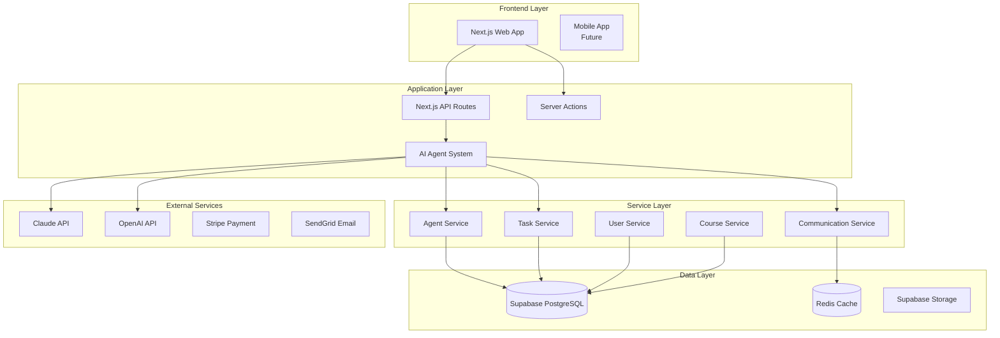
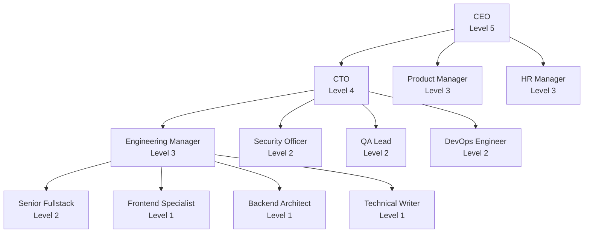
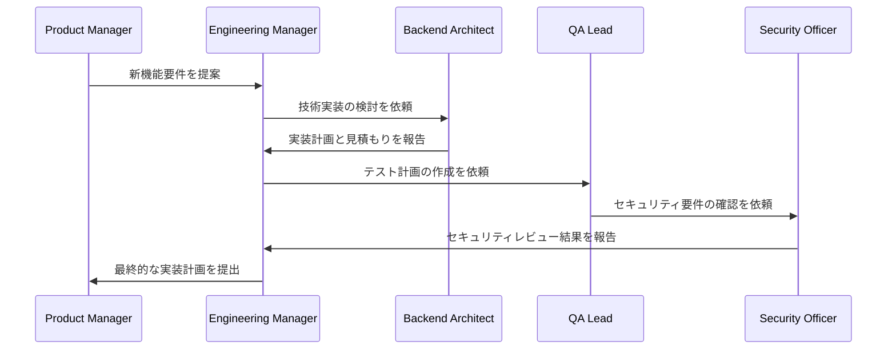
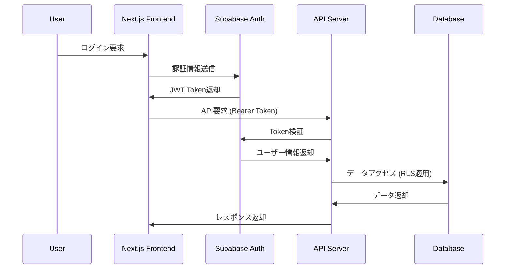

# System Architecture - wadoyuniko AI Platform

## 概要

wadoyuniko AI Platformは、12のAIエージェントが協調して動作する次世代の教育プラットフォームです。  
本文書では、システム全体のアーキテクチャ設計と技術的な実装方針について説明します。

## システム全体構成



## 技術スタック詳細

### フロントエンド
- **Next.js 15** - App Router、Server Components、Client Components
- **React 19** - Concurrent Features、Suspense
- **TypeScript** - 厳密型チェック、型安全性
- **Tailwind CSS** - ユーティリティファーストCSS
- **shadcn/ui** - Radix UI ベースのコンポーネントライブラリ
- **Zustand** - 軽量状態管理
- **React Hook Form + Zod** - フォーム管理とバリデーション

### バックエンド
- **Next.js API Routes** - RESTful API
- **Server Actions** - フォーム処理、サーバー操作
- **Supabase** - BaaS (Backend as a Service)
  - PostgreSQL データベース
  - リアルタイム機能
  - 認証システム
  - ストレージ
- **Redis** - セッション管理、キャッシュ

### AIシステム
- **Claude API** (Anthropic)
  - claude-3-5-sonnet-20241022
  - claude-3-opus-20240229
- **OpenAI API**
  - GPT-4 Turbo
  - o1-preview (高度な推論)

## アーキテクチャ設計原則

### 1. マイクロサービス指向
各サービスは独立性を保ち、明確な責任範囲を持つ：

- **AgentService**: エージェント管理とライフサイクル
- **CommunicationService**: エージェント間通信
- **TaskService**: タスク管理とワークフロー
- **UserService**: ユーザー管理と認証
- **CourseService**: 教育コンテンツ管理

### 2. イベント駆動アーキテクチャ
システム間の疎結合を実現：

```typescript
// イベント例
interface TaskCreatedEvent {
  type: 'TASK_CREATED'
  payload: {
    taskId: string
    assignedTo: AgentRole
    priority: TaskPriority
  }
  timestamp: Date
}

interface MessageSentEvent {
  type: 'MESSAGE_SENT'
  payload: {
    from: AgentRole
    to: AgentRole[]
    channel: string
    content: string
  }
  timestamp: Date
}
```

### 3. Type-First Development
TypeScriptを活用した型駆動開発：

```typescript
// 型定義による契約
interface Agent {
  id: string
  role: AgentRole
  level: AgentLevel
  responsibilities: string[]
  authorities: string[]
  currentTasks: Task[]
}

// 型安全なAPI呼び出し
const agent: Agent = await agentService.getAgent('ceo')
```

### 4. 関心の分離
レイヤーごとの明確な責任分担：

- **Presentation Layer**: UI/UXとユーザーインタラクション
- **Business Logic Layer**: ドメインロジックとビジネスルール
- **Data Access Layer**: データストレージとの接続
- **Integration Layer**: 外部サービスとの連携

## AI エージェントシステム詳細

### 組織構造



### エージェント通信プロトコル

#### 1. チャンネル型通信
```typescript
interface CommunicationChannel {
  id: string
  name: string
  participants: AgentRole[]
  isPrivate: boolean
  messageHistory: Message[]
}

// 例: 技術チャンネル
const techChannel: CommunicationChannel = {
  id: 'technical-architecture',
  participants: ['cto', 'engineering-manager', 'backend-architect'],
  isPrivate: false
}
```

#### 2. 直接通信
```typescript
// CEO → CTO への緊急連絡
await communicationService.sendDirectMessage(
  'ceo', 
  'cto', 
  'P0インシデントの対応をお願いします', 
  'P0'
)
```

#### 3. ブロードキャスト通信
```typescript
// 全エージェントへの一斉通知
await communicationService.broadcastMessage(
  'ceo',
  '緊急メンテナンスのため30分後にシステム停止します',
  'P1'
)
```

### タスクワークフロー



## データモデル設計

### コアエンティティ

```sql
-- エージェントテーブル
CREATE TABLE agents (
  id UUID PRIMARY KEY DEFAULT gen_random_uuid(),
  role VARCHAR(50) UNIQUE NOT NULL,
  name VARCHAR(100) NOT NULL,
  level INTEGER NOT NULL CHECK (level BETWEEN 1 AND 5),
  is_active BOOLEAN DEFAULT true,
  responsibilities TEXT[] NOT NULL,
  authorities TEXT[] NOT NULL,
  skills TEXT[] NOT NULL,
  reporting_to VARCHAR(50) REFERENCES agents(role),
  created_at TIMESTAMP WITH TIME ZONE DEFAULT NOW(),
  updated_at TIMESTAMP WITH TIME ZONE DEFAULT NOW()
);

-- タスクテーブル  
CREATE TABLE tasks (
  id UUID PRIMARY KEY DEFAULT gen_random_uuid(),
  title VARCHAR(200) NOT NULL,
  description TEXT,
  assigned_to VARCHAR(50) NOT NULL REFERENCES agents(role),
  created_by VARCHAR(50) NOT NULL REFERENCES agents(role),
  priority task_priority NOT NULL DEFAULT 'P3',
  status task_status NOT NULL DEFAULT 'pending',
  estimated_hours DECIMAL(5,2),
  actual_hours DECIMAL(5,2),
  due_date TIMESTAMP WITH TIME ZONE,
  dependencies UUID[] DEFAULT '{}',
  tags TEXT[] DEFAULT '{}',
  created_at TIMESTAMP WITH TIME ZONE DEFAULT NOW(),
  updated_at TIMESTAMP WITH TIME ZONE DEFAULT NOW()
);

-- メッセージテーブル
CREATE TABLE messages (
  id UUID PRIMARY KEY DEFAULT gen_random_uuid(),
  from_agent VARCHAR(50) NOT NULL REFERENCES agents(role),
  channel_id VARCHAR(100) NOT NULL,
  content TEXT NOT NULL,
  priority message_priority NOT NULL DEFAULT 'P3',
  task_id UUID REFERENCES tasks(id),
  created_at TIMESTAMP WITH TIME ZONE DEFAULT NOW()
);
```

### カスタム型定義
```sql
-- 列挙型の定義
CREATE TYPE task_priority AS ENUM ('P0', 'P1', 'P2', 'P3');
CREATE TYPE task_status AS ENUM ('pending', 'in_progress', 'completed', 'blocked');
CREATE TYPE message_priority AS ENUM ('P0', 'P1', 'P2', 'P3');
```

## セキュリティアーキテクチャ

### 認証・認可フロー



### Row Level Security (RLS)
```sql
-- ユーザーは自分のデータのみアクセス可能
CREATE POLICY "Users can only access their own data" ON users
  FOR ALL USING (auth.uid() = id);

-- エージェントは割り当てられたタスクのみ参照可能  
CREATE POLICY "Agents can access assigned tasks" ON tasks
  FOR SELECT USING (
    assigned_to = get_current_agent_role() OR
    created_by = get_current_agent_role()
  );
```

### データ暗号化
- **保存時暗号化**: Supabase標準のAES-256
- **転送時暗号化**: TLS 1.3
- **機密データ**: 追加のアプリケーションレベル暗号化

## パフォーマンス設計

### キャッシュ戦略

```typescript
// Redis キャッシュ例
class AgentService {
  async getAgent(role: AgentRole): Promise<Agent> {
    // L1: メモリキャッシュ
    const cached = this.memoryCache.get(`agent:${role}`)
    if (cached) return cached
    
    // L2: Redis キャッシュ
    const redisData = await redis.get(`agent:${role}`)
    if (redisData) {
      const agent = JSON.parse(redisData)
      this.memoryCache.set(`agent:${role}`, agent, 300) // 5分
      return agent
    }
    
    // L3: データベース
    const agent = await this.database.getAgent(role)
    await redis.setex(`agent:${role}`, 3600, JSON.stringify(agent)) // 1時間
    this.memoryCache.set(`agent:${role}`, agent, 300)
    return agent
  }
}
```

### データベース最適化
```sql
-- 頻繁にアクセスされるクエリのインデックス
CREATE INDEX idx_tasks_assigned_to ON tasks(assigned_to);
CREATE INDEX idx_tasks_status_priority ON tasks(status, priority);
CREATE INDEX idx_messages_channel_created_at ON messages(channel_id, created_at DESC);

-- パーティショニング (大量データ対応)
CREATE TABLE messages_2025_01 PARTITION OF messages 
FOR VALUES FROM ('2025-01-01') TO ('2025-02-01');
```

### リアルタイム機能
```typescript
// Supabase Realtime
const subscription = supabase
  .channel('task-updates')
  .on('postgres_changes', {
    event: 'UPDATE',
    schema: 'public',
    table: 'tasks',
    filter: `assigned_to=eq.${currentAgent}`
  }, (payload) => {
    // リアルタイムでタスク更新を受信
    updateTaskInUI(payload.new)
  })
  .subscribe()
```

## 監視とロギング

### メトリクス収集
```typescript
// OpenTelemetry 統合
import { trace, metrics } from '@opentelemetry/api'

class AgentService {
  private meter = metrics.getMeter('agent-service')
  private taskCounter = this.meter.createCounter('tasks_created_total')
  
  async createTask(task: TaskInput): Promise<Task> {
    const span = trace.getActiveTracer().startSpan('createTask')
    
    try {
      const result = await this.database.insertTask(task)
      this.taskCounter.add(1, { assignedTo: task.assignedTo })
      span.setStatus({ code: SpanStatusCode.OK })
      return result
    } catch (error) {
      span.recordException(error)
      span.setStatus({ code: SpanStatusCode.ERROR })
      throw error
    } finally {
      span.end()
    }
  }
}
```

### ログレベル
- **ERROR**: システムエラー、例外
- **WARN**: 警告、パフォーマンス問題
- **INFO**: 重要なビジネスイベント
- **DEBUG**: 詳細なトレース情報

## 運用とデプロイ

### CI/CD パイプライン
```yaml
# .github/workflows/deploy.yml
name: Deploy
on:
  push:
    branches: [main]

jobs:
  test:
    runs-on: ubuntu-latest
    steps:
      - uses: actions/checkout@v4
      - name: Run tests
        run: |
          npm ci
          npm run test:coverage
          npm run type-check
          npm run lint
  
  security:
    needs: test
    runs-on: ubuntu-latest  
    steps:
      - name: Security audit
        run: npm audit --audit-level=high
      
  deploy:
    needs: [test, security]
    runs-on: ubuntu-latest
    steps:
      - name: Deploy to Vercel
        uses: amondnet/vercel-action@v25
```

### 環境分離
- **Development**: ローカル開発環境
- **Staging**: プロダクション類似環境でのテスト
- **Production**: 本番環境

## 災害復旧

### バックアップ戦略
- **データベース**: 毎時スナップショット、7日間保持
- **ファイル**: 複数リージョンでの冗長化
- **設定**: Git によるバージョン管理

### 復旧手順
1. **RTO (Recovery Time Objective)**: 4時間
2. **RPO (Recovery Point Objective)**: 1時間
3. **自動フェイルオーバー**: 地理的に分散したインスタンス

## 今後の拡張計画

### フェーズ2: スケーラビリティ強化
- マイクロサービス化
- Kubernetes導入
- API Gateway実装

### フェーズ3: AI機能拡張  
- 自然言語処理強化
- 予測分析機能
- 自動化レベル向上

### フェーズ4: 国際化
- 多言語対応
- 地域別コンプライアンス
- グローバル配信网络

---

*最終更新: 2025-01-11*  
*作成者: Backend Architect & CTO*  
*レビュー: Engineering Manager*