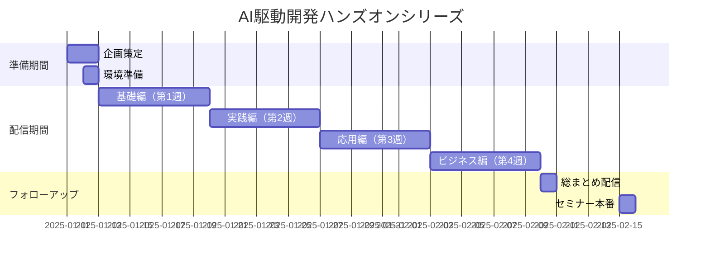

# AI駆動開発ハンズオン企画案

## 🎯 企画コンセプト

### ミッション
「プログラミング初心者でも、AIを活用することで実用的なアプリを開発し、収益化まで実現できることを実証する」

### ターゲット
- プログラミング初心者〜中級者
- AI活用に興味がある開発者
- 副業・独立を目指すエンジニア
- ノーコード・ローコード開発者

## 🚀 メインプロジェクト：AIパーソナルアシスタント開発

### プロジェクト概要
**13回の配信を通じて、段階的に機能を追加しながら完成させる統合型AIアシスタント**

### 最終成果物
```
📱 AIパーソナルアシスタント「YUNICO」
├── 💬 チャット機能（マルチモーダル対応）
├── 📝 タスク管理・自動化
├── 📊 データ分析・可視化
├── 🔄 外部サービス連携
├── 💰 課金システム
└── 🎨 カスタマイズ可能なUI
```

## 📋 各配信の開発内容

### Phase 1：基礎構築（第1週）

#### 配信1：プロジェクト立ち上げ
**開発内容**
```javascript
// Google AI Studio Buildで作成
- シンプルなチャットボットUI
- Gemini APIとの連携
- 基本的な会話機能
```
**成果物**：動作する最小限のチャットボット

#### 配信2：CLI自動化
**開発内容**
```bash
# Gemini CLIスクリプト
- ファイル操作の自動化
- コード生成スクリプト
- プロジェクト構造の自動生成
```
**成果物**：開発効率化ツールセット

#### 配信3：ノーコード実装
**開発内容**
```yaml
# Difyワークフロー
- 複雑な対話フロー設計
- 外部API連携
- データ処理パイプライン
```
**成果物**：高度な対話システム

### Phase 2：機能拡張（第2週）

#### 配信4：自動化システム
**開発内容**
```json
// n8nワークフロー
{
  "nodes": [
    "Webhook受信",
    "AI処理",
    "データ保存",
    "通知送信"
  ]
}
```
**成果物**：タスク自動実行システム

#### 配信5：本格的Web開発
**開発内容**
```typescript
// Next.js + TypeScript
interface AIAssistant {
  chat: ChatFunction;
  tasks: TaskManager;
  analytics: DataAnalyzer;
}
```
**成果物**：モダンなWebアプリケーション

#### 配信6：高度な機能実装
**開発内容**
```python
# 複雑な処理実装
- マルチファイル処理
- バッチ処理
- 並列処理
```
**成果物**：スケーラブルなバックエンド

### Phase 3：統合開発（第3週）

#### 配信7-9：フルスタック実装
**開発内容**
```
📁 yunico-assistant/
├── 📂 frontend/
│   ├── components/
│   ├── pages/
│   └── styles/
├── 📂 backend/
│   ├── api/
│   ├── services/
│   └── database/
└── 📂 infrastructure/
    ├── docker/
    └── ci-cd/
```
**成果物**：本番環境で動作する統合アプリ

### Phase 4：ビジネス化（第4週）

#### 配信10：収益化実装
**開発内容**
- Stripeによる課金システム
- フリーミアムモデル実装
- 使用量制限・クォータ管理

#### 配信11-12：実案件対応
**開発内容**
- カスタマイズ版の開発
- クライアント要件実装
- エンタープライズ機能

## 🎨 ハンズオン形式

### 1. インタラクティブ開発
```
視聴者 → コメント → AI相談 → 実装 → 動作確認
```

### 2. ペアプログラミング形式
- AIと対話しながらコーディング
- エラー解決をリアルタイム実演
- ベストプラクティスの解説

### 3. 段階的難易度設定
```
初級（1-3回）：コピペで動く
中級（4-6回）：部分的な改造
上級（7-9回）：独自機能追加
実践（10-13回）：ゼロから構築
```

## 📚 提供リソース

### GitHub リポジトリ
```
wadoyuniko/ai-handson-series/
├── episodes/
│   ├── ep01-google-ai-studio/
│   ├── ep02-gemini-cli/
│   └── ...
├── resources/
│   ├── templates/
│   ├── prompts/
│   └── datasets/
└── final-project/
```

### 学習教材
1. **事前準備ガイド**
   - 環境構築手順書
   - トラブルシューティング集
   
2. **配信後フォロー**
   - 完全版ソースコード
   - 解説記事
   - 追加課題

3. **コミュニティサポート**
   - LINEオープンチャット
   - Discord（検討中）
   - 週次Q&Aセッション

## 🏆 参加者特典

### 完走特典
- 修了証明書発行
- ポートフォリオ用実績認定
- セミナー割引クーポン

### アクティブ参加特典
- コメント投稿者から抽選でプレゼント
- 優秀作品の紹介
- 1対1メンタリング権

## 📈 KPI設定

### 技術習得度
- 各回の理解度テスト実施
- 実装課題の提出率
- コード品質の向上度

### エンゲージメント
- リアルタイム視聴率
- コメント参加率
- 課題提出率

### ビジネス成果
- アプリ完成率
- 収益化達成者数
- 就職・案件獲得数

## 🔄 改善サイクル

### 配信ごとの振り返り
1. アンケート収集
2. 難易度調整
3. コンテンツ最適化

### 週次レビュー
- 進捗確認
- カリキュラム調整
- サポート体制強化

## 💡 差別化ポイント

### 1. 実践重視
- 理論より実装
- 動くものを作る
- 即戦力スキル習得

### 2. AI活用最前線
- 最新ツール使用
- プロンプトエンジニアリング
- AIとの協働開発

### 3. ビジネス直結
- 収益化まで実装
- ポートフォリオ構築
- 案件獲得サポート

## 🎯 最終ゴール

### 参加者の到達点
1. **技術面**
   - AI駆動開発の完全習得
   - フルスタック開発能力
   - 自走できる問題解決力

2. **ビジネス面**
   - 収益化可能なアプリ保有
   - 案件受注スキル
   - 月10万円の副収入基盤

3. **キャリア面**
   - AI開発者としての実績
   - コミュニティでの人脈
   - 次のステップへの道筋

## 📅 タイムライン



## 🚦 リスク管理

### 技術的リスク
- バックアップ環境準備
- 代替ツールリスト作成
- トラブル対応マニュアル

### 運営リスク
- 配信トラブル対策
- モデレーター配置
- 録画バックアップ

### 参加者リスク
- 難易度ギャップ対策
- 個別サポート体制
- 補講コンテンツ準備