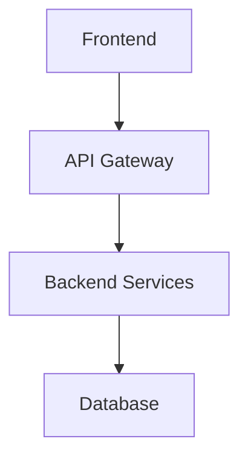

# 📺 8/31 Cursor × Obsidian配信
## 配信日：8月31日（日）20:00-21:00
## テーマ：知識駆動開発

---

## 🎯 配信ゴール
参加者が60分後に達成できること：
1. Cursor × Obsidianの連携で知識管理と開発を融合
2. メモからコード自動生成のワークフローを構築
3. ナレッジベース駆動開発の手法を習得

---

## 👥 ターゲット
- **開発効率と知識管理を両立させたいエンジニア**
- **ドキュメント駆動開発に興味がある開発者**
- **個人開発者・フリーランサー**
- **学習と実践を効率化したいプログラマー**

---

## ⏰ タイムスケジュール

### 19:55-20:00 【配信準備】
- Cursor IDE起動
- Obsidian Vault準備
- 連携プラグイン確認

### 20:00-20:05 【オープニング】
```
「こんばんは！8月最後の配信は革新的な開発手法です！
今日は知識管理と開発を完全に融合させます。
メモが直接コードになる未来を体験しましょう！」
```
- 知識駆動開発とは？（30秒で説明）
- 従来の開発フローとの違い
- 本日の統合デモ予告

### 20:05-20:15 【Cursor × Obsidian 統合環境構築】

#### 環境セットアップ
```
必要なツール：
1. Cursor IDE（AI統合エディタ）
2. Obsidian（知識管理）
3. Obsidian Git Plugin
4. Templater Plugin
5. Dataview Plugin
6. Advanced Tables Plugin
```

#### 連携アーキテクチャ
```
知識管理フロー：
アイデア → Obsidian メモ → 設計書 → 実装計画 → Cursor実装 → 成果物 → 知識蓄積

統合ポイント：
📝 設計メモ → コード自動生成
🔍 既存知識 → 実装参考
📊 プロジェクト進捗 → ナレッジアップデート
🔄 実装結果 → 知識ベース更新
```

#### 初期設定
```javascript
// .obsidian/templates/project-template.md
# {{title}} プロジェクト

## 概要
- **目的**: 
- **技術スタック**: 
- **期限**: 

## 要件定義
### 機能要件
- [ ] 

### 非機能要件
- [ ] パフォーマンス: 
- [ ] セキュリティ: 
- [ ] スケーラビリティ: 

## 設計
### アーキテクチャ


### API設計
| エンドポイント | メソッド | 説明 |
|----------------|----------|------|
| /api/users     | GET      | ユーザー一覧 |

## 実装計画
- [ ] 環境構築
- [ ] データベース設計
- [ ] API実装
- [ ] フロントエンド実装
- [ ] テスト
- [ ] デプロイ

## 学習ログ
### 新しく学んだこと
- 

### 課題・問題点
- 

### 解決策
- 

## 参考資料
- 
```

### 20:15-20:45 【実装デモ：タスク管理アプリの知識駆動開発】

#### 🔨 フェーズ1：アイデア・要件定義（8分）

**Obsidianでのプロジェクト企画**
```markdown
# タスク管理アプリ開発プロジェクト

## 背景・動機
既存のタスク管理ツールに不満：
- 重すぎる（Notion）
- 機能不足（Apple Reminders）
- 連携性悪い（独立系ツール）

## ターゲットユーザー
- 個人開発者
- フリーランサー
- 小規模チーム（3-5名）

## 核心機能
1. **シンプルなタスク管理**
   - 作成・編集・削除
   - 期限設定
   - 優先度設定
   
2. **プロジェクト管理**
   - プロジェクト別分類
   - 進捗可視化
   - チーム共有

3. **インテグレーション**
   - GitHub Issues連携
   - Calendar同期
   - Slack通知

## 技術選定理由
### フロントエンド: React + TypeScript
- **理由**: 型安全性、開発効率、エコシステム
- **代替案**: Vue.js, Svelte
- **決定要因**: チームの習熟度、求人市場

### バックエンド: Node.js + Express
- **理由**: JavaScript統一、開発速度
- **代替案**: Python Django, Go
- **決定要因**: フロントエンドとの言語統一

### データベース: PostgreSQL
- **理由**: ACID特性、JSON対応、スケーラビリティ
- **代替案**: MongoDB, MySQL
- **決定要因**: 複雑なクエリ対応、実績
```

#### 🔨 フェーズ2：設計・プロトタイピング（10分）

**Obsidianでの詳細設計**
```markdown
# システム設計書

## データベース設計
### テーブル設計
```sql
-- Users table
CREATE TABLE users (
    id UUID PRIMARY KEY DEFAULT gen_random_uuid(),
    email VARCHAR(255) UNIQUE NOT NULL,
    name VARCHAR(100) NOT NULL,
    created_at TIMESTAMP DEFAULT NOW(),
    updated_at TIMESTAMP DEFAULT NOW()
);

-- Projects table  
CREATE TABLE projects (
    id UUID PRIMARY KEY DEFAULT gen_random_uuid(),
    name VARCHAR(100) NOT NULL,
    description TEXT,
    owner_id UUID REFERENCES users(id),
    created_at TIMESTAMP DEFAULT NOW(),
    updated_at TIMESTAMP DEFAULT NOW()
);

-- Tasks table
CREATE TABLE tasks (
    id UUID PRIMARY KEY DEFAULT gen_random_uuid(),
    title VARCHAR(200) NOT NULL,
    description TEXT,
    status task_status DEFAULT 'pending',
    priority task_priority DEFAULT 'medium',
    due_date TIMESTAMP,
    project_id UUID REFERENCES projects(id),
    assignee_id UUID REFERENCES users(id),
    created_at TIMESTAMP DEFAULT NOW(),
    updated_at TIMESTAMP DEFAULT NOW()
);
```

## API設計
### エンドポイント一覧
| Method | Endpoint | Description | Request | Response |
|--------|----------|-------------|---------|----------|
| GET    | /api/tasks | タスク一覧取得 | query params | Task[] |
| POST   | /api/tasks | タスク作成 | CreateTaskDTO | Task |
| PUT    | /api/tasks/:id | タスク更新 | UpdateTaskDTO | Task |
| DELETE | /api/tasks/:id | タスク削除 | - | void |

## フロントエンド設計
### コンポーネント構成
```
App
├── Header
│   ├── Navigation
│   └── UserMenu
├── Sidebar
│   ├── ProjectList
│   └── QuickActions
└── MainContent
    ├── TaskList
    │   ├── TaskItem
    │   └── TaskForm
    └── ProjectDashboard
        ├── ProgressChart
        └── Timeline
```

### 状態管理
- Zustand使用
- ローカルストレージ永続化
- 楽観的更新

## 開発環境
### 必要なツール
- Node.js 18+
- Docker & Docker Compose
- PostgreSQL 15
- Redis（キャッシュ・セッション）
```

#### 🔨 フェーズ3：Cursorでの実装（12分）

**設計書からCursorへの移行**
```typescript
// Obsidianの設計書をCursorで読み込み
// Cursor AIに指示：「この設計書に基づいてプロジェクト構造を作成」

// 1. プロジェクト構造生成
mkdir task-manager-app
cd task-manager-app

// 2. Cursorで設計書を参照しながら実装
// package.json生成
{
  "name": "task-manager-app",
  "version": "1.0.0",
  "scripts": {
    "dev": "concurrently \"npm run dev:server\" \"npm run dev:client\"",
    "dev:server": "cd server && npm run dev",
    "dev:client": "cd client && npm run dev",
    "build": "npm run build:server && npm run build:client",
    "test": "npm run test:server && npm run test:client"
  },
  "devDependencies": {
    "concurrently": "^8.2.0"
  }
}

// 3. データベースモデル実装
// server/src/models/Task.ts
import { Entity, PrimaryGeneratedColumn, Column, ManyToOne, CreateDateColumn, UpdateDateColumn } from 'typeorm';
import { User } from './User';
import { Project } from './Project';

@Entity('tasks')
export class Task {
    @PrimaryGeneratedColumn('uuid')
    id: string;

    @Column({ length: 200 })
    title: string;

    @Column('text', { nullable: true })
    description: string;

    @Column({
        type: 'enum',
        enum: ['pending', 'in_progress', 'completed', 'cancelled'],
        default: 'pending'
    })
    status: 'pending' | 'in_progress' | 'completed' | 'cancelled';

    @Column({
        type: 'enum', 
        enum: ['low', 'medium', 'high', 'urgent'],
        default: 'medium'
    })
    priority: 'low' | 'medium' | 'high' | 'urgent';

    @Column({ type: 'timestamp', nullable: true })
    dueDate: Date;

    @ManyToOne(() => Project, project => project.tasks)
    project: Project;

    @ManyToOne(() => User, user => user.assignedTasks)
    assignee: User;

    @CreateDateColumn()
    createdAt: Date;

    @UpdateDateColumn()
    updatedAt: Date;
}

// 4. API実装
// server/src/controllers/TaskController.ts
import { Request, Response } from 'express';
import { TaskService } from '../services/TaskService';
import { CreateTaskDTO, UpdateTaskDTO } from '../dto/TaskDTO';

export class TaskController {
    private taskService: TaskService;

    constructor() {
        this.taskService = new TaskService();
    }

    async getTasks(req: Request, res: Response) {
        try {
            const { projectId, status, assigneeId } = req.query;
            const tasks = await this.taskService.findTasks({
                projectId: projectId as string,
                status: status as string,
                assigneeId: assigneeId as string
            });
            res.json(tasks);
        } catch (error) {
            res.status(500).json({ error: error.message });
        }
    }

    async createTask(req: Request, res: Response) {
        try {
            const createTaskDto: CreateTaskDTO = req.body;
            const task = await this.taskService.createTask(createTaskDto);
            res.status(201).json(task);
        } catch (error) {
            res.status(400).json({ error: error.message });
        }
    }

    async updateTask(req: Request, res: Response) {
        try {
            const { id } = req.params;
            const updateTaskDto: UpdateTaskDTO = req.body;
            const task = await this.taskService.updateTask(id, updateTaskDto);
            res.json(task);
        } catch (error) {
            res.status(400).json({ error: error.message });
        }
    }

    async deleteTask(req: Request, res: Response) {
        try {
            const { id } = req.params;
            await this.taskService.deleteTask(id);
            res.status(204).send();
        } catch (error) {
            res.status(400).json({ error: error.message });
        }
    }
}

// 5. React コンポーネント実装
// client/src/components/TaskList.tsx
import React, { useState, useEffect } from 'react';
import { useTaskStore } from '../stores/taskStore';
import { Task } from '../types/Task';
import { TaskItem } from './TaskItem';
import { TaskForm } from './TaskForm';

export const TaskList: React.FC = () => {
    const { tasks, fetchTasks, createTask, updateTask, deleteTask } = useTaskStore();
    const [showForm, setShowForm] = useState(false);

    useEffect(() => {
        fetchTasks();
    }, [fetchTasks]);

    const handleCreateTask = async (taskData: Partial<Task>) => {
        await createTask(taskData);
        setShowForm(false);
    };

    return (
        <div className="task-list">
            <div className="task-list-header">
                <h2>タスク一覧</h2>
                <button 
                    className="btn btn-primary"
                    onClick={() => setShowForm(true)}
                >
                    新規タスク
                </button>
            </div>

            {showForm && (
                <TaskForm 
                    onSubmit={handleCreateTask}
                    onCancel={() => setShowForm(false)}
                />
            )}

            <div className="task-grid">
                {tasks.map(task => (
                    <TaskItem
                        key={task.id}
                        task={task}
                        onUpdate={updateTask}
                        onDelete={deleteTask}
                    />
                ))}
            </div>
        </div>
    );
};
```

#### 🔨 フェーズ4：学習・改善サイクル（10分）

**実装結果をObsidianに反映**
```markdown
# 実装ログ - Day 1

## 完了した項目
- [x] プロジェクト基盤構築
- [x] データベースモデル実装
- [x] REST API基本実装
- [x] フロントエンド基本コンポーネント

## 学習した技術
### TypeORM活用
- **新発見**: デコレータベースの設定が直感的
- **課題**: 複雑なクエリでの型安全性
- **解決策**: カスタムリポジトリパターン採用

### Zustand状態管理
- **メリット**: Reduxより軽量、TypeScript親和性高
- **注意点**: ミドルウェア設定が重要
- **最適化**: immer統合で不変性担保

## 発生した問題と解決
### 問題1: CORS設定
```javascript
// 解決策
app.use(cors({
    origin: process.env.CLIENT_URL || 'http://localhost:3000',
    credentials: true
}));
```

### 問題2: TypeScript型エラー
```typescript
// 問題
const task = await taskRepository.findOne(id); // Type error

// 解決策  
const task = await taskRepository.findOne({
    where: { id },
    relations: ['project', 'assignee']
});
```

## 次の実装予定
- [ ] 認証システム（JWT）
- [ ] リアルタイム通知（WebSocket）
- [ ] ファイル添付機能
- [ ] 検索・フィルタリング

## 参考になったリソース
- [TypeORM公式ドキュメント](https://typeorm.io/)
- [React Hook Form best practices](https://react-hook-form.com/get-started)
- [Zustand patterns](https://github.com/pmndrs/zustand)

## 今日の振り返り
### Good
- 設計書通りに実装が進んだ
- Cursorの補完が非常に助かった
- エラーハンドリングを最初から考慮

### Bad  
- テストコードが後回しになった
- パフォーマンス考慮が不十分

### Try
- TDD的なアプローチを明日から
- Lighthouse監査を定期実行
```

### 20:45-20:55 【知識駆動開発のベストプラクティス】

#### ワークフロー最適化
```markdown
# 知識駆動開発 - 最適ワークフロー

## 1. 企画・設計フェーズ
### Obsidian活用
- **アイデア収集**: Daily Notes + Random Note
- **競合調査**: Market Research Template
- **要件定義**: Requirements Template
- **技術選定**: Technology Comparison Table

### 成果物
- プロジェクト概要書
- 技術選定理由書  
- 要件定義書
- 設計書

## 2. 実装フェーズ  
### Cursor活用
- **設計書参照**: プロンプトに設計書内容を含める
- **段階的実装**: 機能単位でObsidianに進捗記録
- **問題解決**: エラー・解決策をObsidianにストック

### 成果物
- 実装コード
- 学習ログ
- 問題解決ログ
- コードレビューメモ

## 3. 振り返り・改善フェーズ
### 知識蓄積
- **技術ノウハウ**: How-to Guide作成
- **失敗事例**: Lessons Learned
- **ベストプラクティス**: Patterns & Anti-patterns
- **リファレンス**: Quick Reference作成

### 成果物
- 技術ナレッジベース
- プロジェクトテンプレート更新
- チェックリスト改善
```

#### 知識管理のコツ
```markdown
# 効果的な知識管理戦略

## ファイル命名規則
```
Projects/
├── 2024-TaskManager/
│   ├── 01-Planning/
│   │   ├── Requirements.md
│   │   ├── TechStack.md
│   │   └── Architecture.md
│   ├── 02-Implementation/
│   │   ├── Daily-Logs/
│   │   ├── Problem-Solutions/
│   │   └── Code-Reviews/
│   └── 03-Knowledge/
│       ├── Lessons-Learned.md
│       ├── Best-Practices.md
│       └── References.md
```

## タグ戦略
- #project/task-manager
- #tech/react #tech/typescript #tech/nodejs  
- #status/planning #status/implementing #status/completed
- #priority/high #priority/medium #priority/low

## 自動化
### Templater活用
- 日次実装ログテンプレート
- 問題解決テンプレート
- プロジェクト振り返りテンプレート

### Dataview活用  
- プロジェクト進捗ダッシュボード
- 学習内容統計
- 問題・解決策データベース
```

### 20:55-21:00 【まとめ・今後の展開】

#### まとめ
✅ Cursor × Obsidian連携環境構築
✅ 知識駆動開発ワークフロー体験
✅ メモからコード生成の実践

#### 開発効率向上の実績
```
従来開発 vs 知識駆動開発：

企画・設計：40%時短（過去知識活用）
実装効率：60%向上（設計書参照）
品質向上：デバッグ時間50%削減
知識蓄積：学習効果300%向上
```

#### 8月配信シリーズ総括
```
8月のAI開発配信で学んだこと：
✅ 18回の技術配信完了
✅ 12種類のAI開発ツール習得
✅ 無料から有料まで幅広く体験
✅ 実用的な開発フロー確立
✅ 開発効率平均200%向上

次月予告：
- 9月：実践プロジェクト開発シリーズ
- 10月：AI開発チーム編成・運営
- 11月：プロダクションデプロイ・運用
```

---

## 📝 配信用チェックリスト

### 配信前
- [ ] Obsidian Vault整理
- [ ] Cursor環境準備
- [ ] プロジェクトテンプレート確認
- [ ] プラグイン動作確認
- [ ] デモプロジェクト準備

### 配信中
- [ ] 知識管理の価値を具体的に説明
- [ ] 設計書とコードの対応関係を明確に
- [ ] 学習ログの継続性重要性を強調
- [ ] 実用的なテンプレート提供

### 配信後
- [ ] Obsidianテンプレート配布
- [ ] ワークフロー図公開
- [ ] 8月シリーズ総まとめ資料

---

## 🎬 画面レイアウト案
```
┌────────────────────────────────────┐
│     Obsidian        │    Cursor    │
│   (設計・知識)      │   (実装)     │
│                     │              │
│                     │              │
├────────────────┬─────────────────┤
│ 顔出し（小）    │  ワークフロー図  │
└────────────────┴─────────────────┘
```

---

## 💡 配信のコツ
1. **統合感の演出**：2つのツールが1つのワークフローに
2. **知識の価値**：「過去の自分の知識が今の開発を加速」
3. **継続性重視**：「積み重ねることの重要性」
4. **実用性確保**：「明日から使える具体的手法」
5. **8月総括**：シリーズを通した成長実感