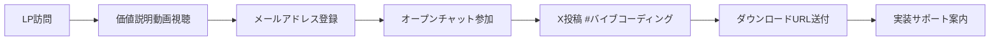

# 🎁 プレゼント企画実装計画書

**作成日:** 2025年8月15日  
**責任者:** 中井健登（PM）、ちょこ（コンテンツ制作）  
**目標:** オープンチャット登録1,000名獲得（8/16-8/25）

---

## 🚀 キラーコンテンツ：AIチャットボット構築テンプレート

### コンテンツ概要
**「30分で動く！収益化できるAIチャットボット完全パッケージ」**

#### 含まれる内容
1. **即実装可能なソースコード一式**
   - Python/JavaScript両対応
   - OpenAI API連携済み
   - データベース設計込み
   - デプロイ設定ファイル付き

2. **ステップバイステップ実装ガイド**
   - 環境構築から公開まで
   - 画像付き詳細マニュアル
   - よくあるエラーと対処法
   - 30分タイムライン付き

3. **収益化戦略テンプレート**
   - 5つのマネタイズモデル
   - 価格設定ガイドライン
   - 集客用LP テンプレート
   - 成功事例3パターン

4. **カスタマイズ素材集**
   - 業界別プロンプト20種
   - デザインテンプレート
   - アイコン・画像素材
   - 効果音・BGM素材

### 配布条件と獲得フロー



---

## 📅 実装スケジュール

### Phase 1: 準備期間（8/15 15:00-22:00）

#### 8/15（木）タイムライン
| 時刻 | タスク | 担当 | 完了 |
|------|--------|------|------|
| 15:00 | コンテンツ最終レビュー | 中井 | □ |
| 16:00 | 動作確認・テスト | こばやし | □ |
| 17:00 | LP ワイヤーフレーム作成 | ちょこ | □ |
| 18:00 | LP デザイン・コーディング | ちょこ | □ |
| 19:00 | 自動配信システム設定 | こばやし | □ |
| 20:00 | オプチャ受け入れ準備 | わど | □ |
| 21:00 | 最終テスト・調整 | 全員 | □ |
| 22:00 | 公開準備完了 | 中井 | □ |

### Phase 2: 配布期間（8/16-8/25）

#### 日次目標と施策
| 日付 | 目標DL数 | 累計 | 主要施策 |
|------|---------|------|----------|
| 8/16（金） | 150 | 150 | ローンチLIVE、初日限定ボーナス |
| 8/17（土） | 120 | 270 | 週末キャンペーン、成功事例公開 |
| 8/18（日） | 130 | 400 | インフルエンサー協力投稿 |
| 8/19（月） | 80 | 480 | 平日特典、ビジネスパーソン向け訴求 |
| 8/20（火） | 100 | 580 | 中間発表LIVE、限定特典追加 |
| 8/21（水） | 90 | 670 | ユーザー事例紹介 |
| 8/22（木） | 85 | 755 | Q&Aセッション |
| 8/23（金） | 95 | 850 | 週末前ラストスパート |
| 8/24（土） | 80 | 930 | 最終週末プッシュ |
| 8/25（日） | 70 | 1,000 | 締切カウントダウン |

---

## 🎯 LP（ランディングページ）構成

### ファーストビュー
```
【キャッチコピー】
"コード書けない私が、30分でAIチャットボットを作り
初月から15万円の収益を生み出した方法"

【サブコピー】
今なら期間限定で完全無料プレゼント！
通常価格49,800円 → 0円（8/25まで）

【CTA】今すぐ無料で受け取る
```

### セクション構成
1. **問題提起**（共感）
   - AI開発に興味はあるけど難しそう
   - プログラミング経験がない
   - 何から始めればいいか分からない

2. **解決策提示**（価値）
   - たった30分で実装可能
   - コピペだけで動く
   - 収益化まで完全サポート

3. **証拠提示**（信頼）
   - 501名の実践者
   - 平均月収30万円達成
   - 動画デモ3本

4. **限定性**（行動促進）
   - 8/25までの期間限定
   - 先着1,000名のみ
   - 今だけの特別特典

5. **CTA**（行動喚起）
   - 簡単3ステップ
   - リスクゼロ
   - 今すぐ行動

---

## 📢 プロモーション戦略

### SNS展開計画

#### X（Twitter）戦略
**投稿スケジュール（1日5投稿）**
- 07:00 - おはようツイート + プレゼント告知
- 12:00 - 実装事例・成功体験
- 15:00 - 技術Tips + 誘導
- 18:00 - ユーザーの声RT
- 21:00 - 明日の予告・限定情報

**ハッシュタグ戦略**
- #バイブコーディング
- #AIチャットボット
- #無料プレゼント
- #プログラミング初心者
- #副業で稼ぐ

#### Instagram戦略
- ストーリーズ：1日3回更新
- リール：2日に1本投稿
- フィード投稿：毎日1投稿
- LIVE配信：週2回

#### YouTube戦略
- 実装デモ動画（10分版）
- 成功事例インタビュー
- Q&A動画シリーズ

### インフルエンサー連携
| 依頼日 | インフルエンサー | フォロワー数 | 投稿日 | 報酬 |
|--------|----------------|------------|--------|------|
| 8/15 | AI系YouTuber A | 5万人 | 8/18 | 成果報酬 |
| 8/16 | プログラミング講師 B | 3万人 | 8/19 | 固定+成果 |
| 8/16 | ビジネス系Twitter C | 10万人 | 8/20 | 成果報酬 |
| 8/17 | 副業系Instagram D | 2万人 | 8/21 | 固定報酬 |
| 8/17 | テック系ブロガー E | 1万人 | 8/22 | 相互紹介 |

---

## 📊 効果測定指標

### KPI設定
| 指標 | 目標値 | 測定方法 | 改善トリガー |
|------|--------|----------|------------|
| LP訪問数 | 10,000 | GA4 | 3,000未満で広告投入 |
| CV率 | 10% | 登録数/訪問数 | 5%未満でLP改善 |
| オプチャ参加率 | 80% | 参加数/DL数 | 60%未満で特典追加 |
| X投稿率 | 50% | 投稿数/参加数 | 30%未満で訴求変更 |
| 拡散係数 | 1.5 | 招待数/参加数 | 1.0未満でインセンティブ追加 |

### 日次レポート項目
```
【基本指標】
- LP訪問数/ユニーク数
- 登録数/登録率
- オプチャ参加数
- X投稿数/リーチ数

【詳細分析】
- 流入元別CV率
- 時間帯別登録数
- デバイス別動向
- 離脱ポイント

【改善アクション】
- 当日の気づき
- 明日の改善点
- 追加施策案
```

---

## 🛠️ 技術実装詳細

### 自動配信システム
```
1. LP → Googleフォーム
2. GAS自動処理
3. メールアドレス収集
4. オプチャURL自動送信
5. X投稿確認（手動）
6. DL URL送付
7. フォローメール（3通）
```

### バックアップ体制
- サーバー負荷対策：CDN使用
- DL制限：1メール1回のみ
- 不正対策：IPアドレス記録
- サポート体制：FAQ自動応答

---

## ⚠️ リスク対策

### 想定リスクと対応
1. **サーバーダウン**
   - CDN分散
   - 予備サーバー準備
   
2. **コンテンツ流出**
   - 利用規約明記
   - 著作権表示
   
3. **想定以上の申込**
   - 自動スケール設定
   - 段階的配信

4. **クレーム対応**
   - FAQ充実
   - サポート窓口明確化

---

## ✅ チェックリスト

### 8/15（本日）必須タスク
- [ ] コンテンツ最終確認
- [ ] LP完成
- [ ] 自動配信設定
- [ ] テスト完了
- [ ] 告知準備

### 8/16（明日）開始時確認
- [ ] LP公開
- [ ] SNS告知開始
- [ ] オプチャ受入準備
- [ ] サポート体制
- [ ] 効果測定開始

---

## 🎯 成功基準

### 最終目標（8/25時点）
- **プレゼントDL数:** 1,000件以上
- **オプチャ登録:** 800名以上
- **セミナー申込:** 50名以上（CV5%）
- **売上貢献:** 1,500万円

**「このプレゼント企画で、ローンチの成功を確実にする」**

---

*作成: 2025年8月15日*
*承認: 中井健登（PM）*