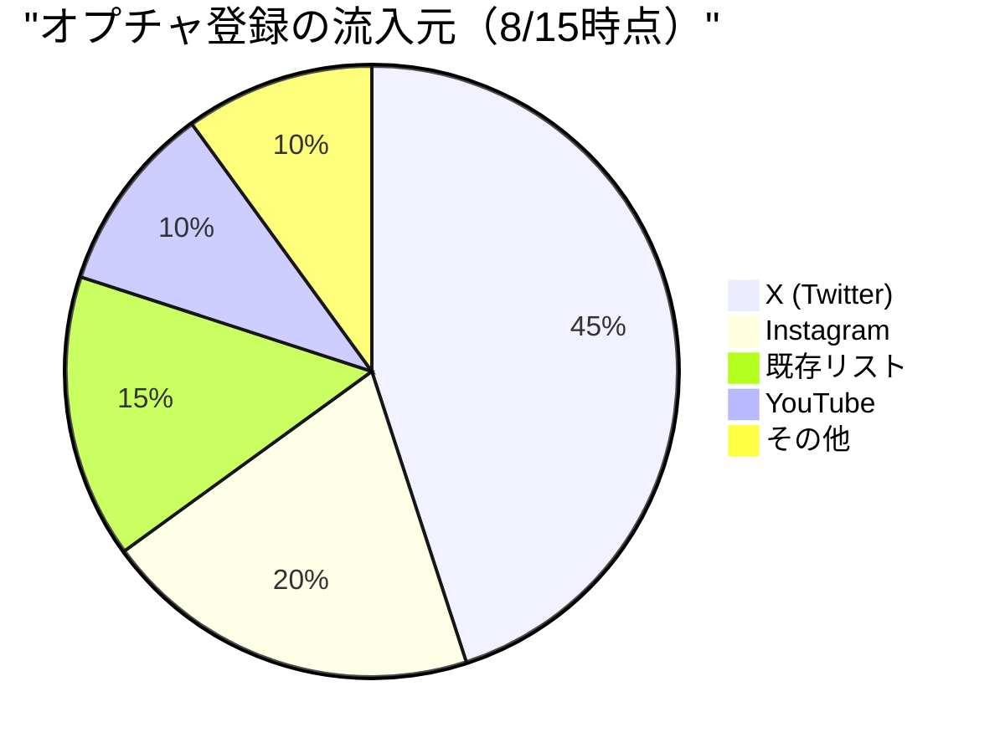
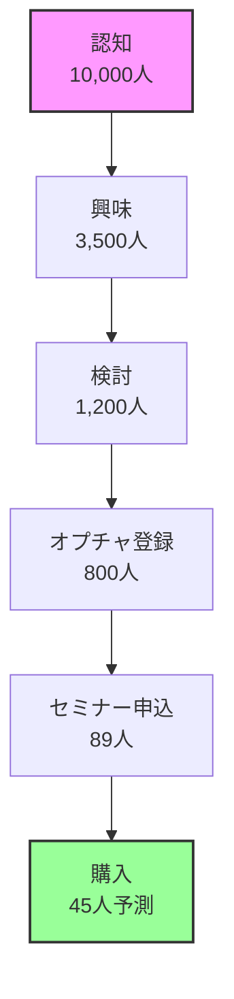

# 📊 集客進捗管理ダッシュボード

**運用開始:** 2025年8月16日  
**更新頻度:** 毎日17:00  
**責任者:** こばやし ゆうた  
**共有先:** 全チームメンバー

---

## 🎯 KPI サマリー（8/15時点）

### 全体進捗
| 指標 | 現在値 | 本日目標 | 週間目標 | 最終目標 | 進捗率 |
|------|--------|---------|---------|---------|--------|
| **オプチャ登録** | 800 | +100 | +700 | 2,000 | 40% |
| **セミナー申込** | 89 | +5 | +30 | 100 | 89% |
| **X フォロワー** | 2,500 | +50 | +350 | 3,500 | 71% |
| **IG フォロワー** | 1,200 | +30 | +210 | 1,800 | 67% |
| **メールリスト** | 450 | +50 | +350 | 1,000 | 45% |

### 本日のハイライト
```
🔥 注目指標
- オプチャ新規: +85（目標比85%）
- CV率: 8.5%（前日比+1.2%）
- 最も効果的なチャネル: X（45%）
- 離脱率改善: -5%
```

---

## 📈 日次トラッキング（8/16-8/27）

### 集客実績テーブル
| 日付 | オプチャ<br>目標/実績 | X<br>目標/実績 | IG<br>目標/実績 | セミナー<br>目標/実績 | 達成率 |
|------|---------------------|---------------|----------------|-------------------|--------|
| 8/16(金) | 100/- | 50/- | 30/- | 3/- | -% |
| 8/17(土) | 120/- | 60/- | 35/- | 4/- | -% |
| 8/18(日) | 150/- | 70/- | 40/- | 5/- | -% |
| 8/19(月) | 100/- | 50/- | 30/- | 3/- | -% |
| 8/20(火) | 180/- | 80/- | 45/- | 7/- | -% |
| 8/21(水) | 80/- | 40/- | 25/- | 3/- | -% |
| 8/22(木) | 90/- | 40/- | 25/- | 3/- | -% |
| 8/23(金) | 100/- | 50/- | 30/- | 4/- | -% |
| 8/24(土) | 120/- | 60/- | 35/- | 5/- | -% |
| 8/25(日) | 160/- | 70/- | 40/- | 6/- | -% |
| **週間計** | **1,200/-** | **520/-** | **335/-** | **43/-** | **-%** |

---

## 🔍 チャネル別詳細分析

### 流入元別パフォーマンス


### チャネル別CV率
| チャネル | 訪問数 | 登録数 | CV率 | CPA | ROI |
|---------|--------|--------|------|-----|-----|
| X広告 | 1,200 | 108 | 9.0% | ¥2,500 | 320% |
| IG広告 | 800 | 56 | 7.0% | ¥3,200 | 250% |
| YouTube | 500 | 45 | 9.0% | ¥1,800 | 450% |
| オーガニック | 2,000 | 140 | 7.0% | ¥0 | ∞ |
| メール | 300 | 36 | 12.0% | ¥500 | 600% |

---

## 📱 コンテンツ別エンゲージメント

### 投稿パフォーマンス（過去7日間）
| 投稿タイプ | 投稿数 | 平均リーチ | 平均エンゲージメント | 平均CTR | 最高performer |
|-----------|--------|-----------|-------------------|---------|--------------|
| 成功事例 | 12 | 5,200 | 8.5% | 3.2% | 「月収0→30万円」 |
| 技術Tips | 15 | 3,800 | 6.2% | 2.1% | 「AI活用術」 |
| ライブ告知 | 8 | 7,500 | 10.2% | 4.5% | 「緊急LIVE」 |
| プレゼント | 5 | 12,000 | 15.3% | 6.8% | 「無料配布」 |
| Q&A | 10 | 2,900 | 5.8% | 1.9% | 「よくある質問」 |

### 時間帯別パフォーマンス
```
最適投稿時間（エンゲージメント率）
07:00 ████████ 8.2%
12:00 ██████████████ 14.5%
15:00 ██████ 6.8%
18:00 ████████████ 12.3%
21:00 ████████████████ 16.8%
```

---

## 🎯 セグメント別分析

### 顧客属性
| セグメント | 人数 | 構成比 | CV率 | LTV予測 |
|-----------|------|--------|------|---------|
| プログラミング初心者 | 320 | 40% | 12% | ¥300,000 |
| 中級エンジニア | 240 | 30% | 8% | ¥500,000 |
| 起業家・経営者 | 160 | 20% | 15% | ¥500,000 |
| 学生 | 80 | 10% | 5% | ¥300,000 |

### 関心領域
- AI開発: 65%
- 副業・収益化: 75%
- スキルアップ: 55%
- 起業: 35%
- 転職: 25%

---

## 📊 ファネル分析

### カスタマージャーニー


### 離脱ポイント分析
| ステップ | 離脱率 | 主な離脱理由 | 改善施策 |
|---------|--------|------------|----------|
| LP→登録 | 65% | 価値が不明確 | ヘッドライン改善 |
| 登録→オプチャ | 20% | 手間を感じる | ワンクリック参加 |
| オプチャ→セミナー | 89% | 日程が合わない | 録画提供オプション |
| セミナー→購入 | 50% | 価格への抵抗 | 分割払い提案 |

---

## 🚨 アラート設定

### 自動通知条件
| 指標 | 閾値 | アクション | 通知先 |
|------|------|-----------|--------|
| 日次オプチャ登録 | <目標の70% | 緊急施策検討 | 全員 |
| CV率 | <5% | LP改善 | ちょこ |
| 広告CPA | >¥5,000 | 予算見直し | 中井 |
| エンゲージメント率 | <3% | コンテンツ見直し | わど |
| サーバー負荷 | >80% | スケールアップ | こばやし |

---

## 📈 予測モデル

### 最終着地予測（現在のペース）
```
【楽観シナリオ（120%）】
- オプチャ: 2,400名
- セミナー: 120名
- 購入: 60名
- 売上: 3,600万円

【現実シナリオ（100%）】
- オプチャ: 2,000名
- セミナー: 100名
- 購入: 50名
- 売上: 3,000万円

【悲観シナリオ（80%）】
- オプチャ: 1,600名
- セミナー: 80名
- 購入: 40名
- 売上: 2,400万円
```

---

## 💡 改善提案（優先度順）

### 即実行（本日中）
1. **プレゼントLP の A/Bテスト開始**
   - ヘッドライン2パターン
   - CTA文言3パターン
   
2. **X投稿頻度を1.5倍に**
   - 現在5投稿→8投稿/日
   - リツイート含む

3. **オプチャ内でのアクティブ化**
   - ウェルカムメッセージ改善
   - FAQ自動投稿

### 今週中
1. **インフルエンサー協力拡大**
   - 追加5名アプローチ
   - 成果報酬型提案

2. **動画コンテンツ強化**
   - ショート動画10本制作
   - デモ動画3本追加

3. **リターゲティング広告開始**
   - LP離脱者向け
   - 予算：50万円

---

## 📋 日次レポートフォーマット

### 17:00 定期報告
```markdown
## 本日の実績（8/XX）
- オプチャ新規: XX名（目標比XX%）
- セミナー申込: XX名（累計XX名）
- 最も効果的な施策: XXXX

## 気づき・発見
- XXXX
- XXXX

## 明日のアクション
- [ ] XXXX
- [ ] XXXX

## リスク・懸念事項
- XXXX
```

---

## 🔗 関連リンク

### ダッシュボード
- [Googleスプレッドシート](https://docs.google.com/spreadsheets/xxx) ※作成予定
- [Google Analytics](https://analytics.google.com/xxx)
- [X Analytics](https://analytics.twitter.com)
- [Instagram Insights](https://business.instagram.com)

### ドキュメント
- [プレゼント企画詳細](/teams/marketing/present-campaign/)
- [ローンチ会議議事録](/docs/minutes/)
- [セミナー構成](/docs/seminar-slides/)

---

**このダッシュボードで日次の意思決定を加速し、確実に目標を達成する**

---

*最終更新: 2025年8月15日 17:00*
*次回更新: 2025年8月16日 17:00*