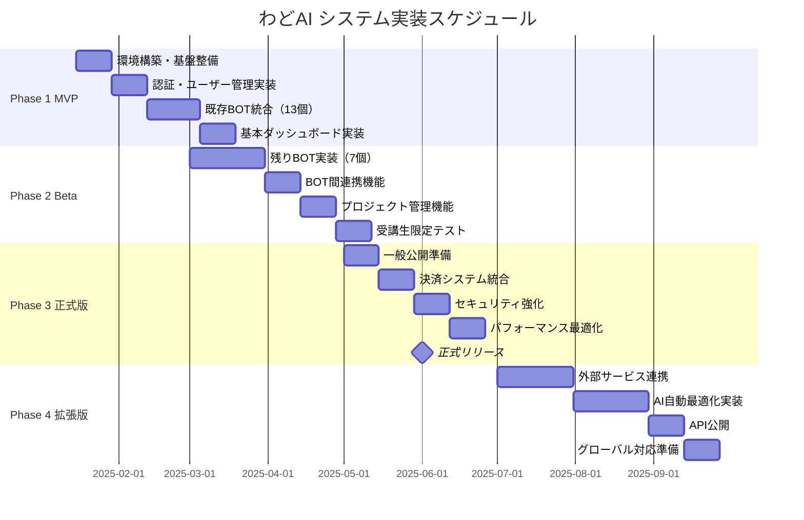

# わどAI システム 実装計画書

## 1. 実装フェーズ概要

### 全体スケジュール（2025年1月〜9月）



---

## 2. Phase 1: MVP実装（2025年1月15日〜2月28日）

### 2.1 スプリント計画

#### Sprint 1: 基盤構築（1/15 - 1/28）
| タスク | 担当 | 工数 | 優先度 |
|--------|------|------|--------|
| 開発環境セットアップ | 全員 | 2日 | P0 |
| CI/CDパイプライン構築 | DevOps | 3日 | P0 |
| データベース設計・構築 | Backend | 3日 | P0 |
| 認証システム実装 | Backend | 5日 | P0 |
| 基本UIコンポーネント作成 | Frontend | 5日 | P0 |

#### Sprint 2: BOT統合 Part 1（1/29 - 2/11）
| タスク | 担当 | 工数 | 優先度 |
|--------|------|------|--------|
| BOT基底クラス実装 | Backend | 3日 | P0 |
| SNS系BOT統合（5個） | Backend | 7日 | P0 |
| BOT実行UI実装 | Frontend | 5日 | P0 |
| エラーハンドリング | Full Stack | 3日 | P1 |

#### Sprint 3: BOT統合 Part 2（2/12 - 2/28）
| タスク | 担当 | 工数 | 優先度 |
|--------|------|------|--------|
| コンテンツ系BOT統合（6個） | Backend | 7日 | P0 |
| セミナー系BOT統合（2個） | Backend | 3日 | P0 |
| ダッシュボード実装 | Frontend | 5日 | P0 |
| 統合テスト | QA | 3日 | P0 |
| バグ修正・調整 | 全員 | 2日 | P0 |

### 2.2 成果物

- [ ] ユーザー認証機能
- [ ] 13個のBOT統合完了
- [ ] 基本ダッシュボード
- [ ] プロジェクト作成・管理機能（基本版）
- [ ] ドキュメント（インストール、API仕様）

---

## 3. Phase 2: Beta版実装（2025年3月1日〜4月30日）

### 3.1 実装内容

#### 新規BOT実装（7個）
```javascript
const newBots = [
  { name: "最新AIツール相談BOT", priority: "P1", effort: "5日" },
  { name: "FANZA収益化BOT", priority: "P2", effort: "5日" },
  { name: "クライアントワークBOT", priority: "P1", effort: "4日" },
  { name: "TIPS執筆BOT", priority: "P1", effort: "4日" },
  { name: "わど億超えマインドBOT", priority: "P2", effort: "3日" },
  { name: "AI漫画制作BOT", priority: "P2", effort: "5日" },
  { name: "インスタストーリーズBOT", priority: "P1", effort: "4日" }
];
```

#### BOT間連携機能
```yaml
workflows:
  - name: "完全ローンチフロー"
    steps:
      1: SNS競合分析BOT
      2: SNSジャンル設定BOT
      3: SNSプロフィール設定BOT
      4: 商品設計BOT
      5: セミナースライドBOT
      6: セミナー台本BOT
      7: XポストBOT（プリローンチ）
      8: LINE投稿作成BOT
      9: 特典作成BOT
      10: 図解作成BOT
```

### 3.2 ベータテスト計画

| フェーズ | 対象 | 期間 | 目的 |
|----------|------|------|------|
| クローズドベータ | 開発チーム | 1週間 | 基本機能検証 |
| 限定ベータ | 選抜受講生20名 | 2週間 | ユーザビリティ検証 |
| オープンベータ | 全受講生 | 2週間 | 負荷テスト、最終調整 |

---

## 4. Phase 3: 正式版実装（2025年5月1日〜6月30日）

### 4.1 リリース準備タスク

#### セキュリティ強化
- [ ] ペネトレーションテスト実施
- [ ] セキュリティ監査
- [ ] WAF導入
- [ ] 2要素認証実装

#### パフォーマンス最適化
- [ ] ロードテスト（目標: 1000同時接続）
- [ ] データベースチューニング
- [ ] CDN設定最適化
- [ ] フロントエンド最適化

#### 決済システム
- [ ] Stripe統合
- [ ] サブスクリプション管理
- [ ] 請求書発行機能
- [ ] 返金処理フロー

### 4.2 マーケティング準備

```markdown
## ローンチキャンペーン
- プレスリリース作成
- デモ動画制作（各BOT紹介）
- 早期割引キャンペーン設計
- アフィリエイトプログラム準備
- 成功事例コンテンツ作成
```

---

## 5. Phase 4: 拡張版実装（2025年7月1日〜9月30日）

### 5.1 外部連携実装

| サービス | 連携内容 | 優先度 | 工数 |
|----------|----------|--------|------|
| Canva API | デザイン自動生成 | P1 | 10日 |
| X(Twitter) API | 自動投稿 | P1 | 5日 |
| LINE Messaging API | 配信自動化 | P1 | 7日 |
| Notion API | ドキュメント連携 | P2 | 5日 |
| Discord API | コミュニティ連携 | P2 | 5日 |

### 5.2 AI自動最適化

```python
# 最適化対象
optimization_targets = {
    "prompt_tuning": {
        "method": "Few-shot learning",
        "data_source": "User feedback",
        "frequency": "Weekly"
    },
    "workflow_optimization": {
        "method": "Process mining",
        "data_source": "Execution logs",
        "frequency": "Monthly"
    },
    "resource_allocation": {
        "method": "Predictive scaling",
        "data_source": "Usage patterns",
        "frequency": "Daily"
    }
}
```

---

## 6. チーム編成と役割分担

### 6.1 開発チーム構成

| 役割 | 人数 | 責任範囲 |
|------|------|----------|
| プロジェクトマネージャー | 1名 | 全体進捗管理、ステークホルダー調整 |
| テックリード | 1名 | 技術選定、アーキテクチャ決定 |
| フロントエンド開発 | 2名 | UI/UX実装、レスポンシブ対応 |
| バックエンド開発 | 2名 | API実装、BOT統合 |
| AI/MLエンジニア | 1名 | プロンプト最適化、AI連携 |
| DevOpsエンジニア | 1名 | インフラ構築、CI/CD |
| QAエンジニア | 1名 | テスト計画、品質保証 |
| UIデザイナー | 1名 | デザインシステム、UI設計 |

### 6.2 コミュニケーション計画

```yaml
meetings:
  daily_standup:
    time: "10:00 JST"
    duration: "15min"
    platform: "Zoom"
  
  sprint_planning:
    frequency: "Bi-weekly"
    duration: "2hours"
    participants: "All team"
  
  sprint_review:
    frequency: "Bi-weekly"
    duration: "1hour"
    participants: "Team + Stakeholders"
  
  technical_discussion:
    frequency: "Weekly"
    duration: "1hour"
    participants: "Engineers"

tools:
  project_management: "Jira/Linear"
  communication: "Slack"
  documentation: "Notion"
  code_repository: "GitHub"
  design: "Figma"
```

---

## 7. リスク管理

### 7.1 技術的リスクと対策

| リスク | 発生確率 | 影響度 | 対策 |
|--------|----------|--------|------|
| AI API制限 | 中 | 高 | 複数プロバイダー契約、キャッシング強化 |
| スケーラビリティ問題 | 低 | 高 | 早期負荷テスト、段階的リリース |
| 外部API変更 | 中 | 中 | アダプターパターン採用、バージョン管理 |
| セキュリティ脆弱性 | 低 | 高 | 定期監査、自動脆弱性スキャン |

### 7.2 ビジネスリスクと対策

| リスク | 発生確率 | 影響度 | 対策 |
|--------|----------|--------|------|
| 開発遅延 | 中 | 中 | バッファ期間確保、MVP優先 |
| 予算超過 | 低 | 中 | 段階的開発、定期レビュー |
| ユーザー離脱 | 中 | 高 | UXテスト強化、フィードバック収集 |
| 競合出現 | 高 | 中 | 差別化機能強化、迅速な機能追加 |

---

## 8. 品質保証計画

### 8.1 テスト戦略

```javascript
const testStrategy = {
  unitTest: {
    coverage: "80%",
    framework: "Jest",
    execution: "Pre-commit"
  },
  integrationTest: {
    coverage: "60%",
    framework: "Supertest",
    execution: "Pre-merge"
  },
  e2eTest: {
    coverage: "Critical paths",
    framework: "Cypress",
    execution: "Nightly"
  },
  performanceTest: {
    tool: "K6",
    target: "1000 concurrent users",
    execution: "Weekly"
  }
};
```

### 8.2 品質メトリクス

| メトリクス | 目標値 | 測定方法 |
|------------|--------|----------|
| コードカバレッジ | 80% | Jest coverage |
| バグ密度 | < 5/KLOC | Jira統計 |
| 平均修正時間 | < 2日 | Jira統計 |
| ユーザー満足度 | > 4.0/5.0 | アンケート |

---

## 9. リリース計画

### 9.1 リリース戦略

```yaml
release_strategy:
  approach: "Feature Toggle + Canary Release"
  
  stages:
    - name: "Internal Alpha"
      users: "Development team"
      duration: "1 week"
      rollback: "Immediate"
    
    - name: "Closed Beta"
      users: "5% of users"
      duration: "2 weeks"
      rollback: "< 1 hour"
    
    - name: "Open Beta"
      users: "25% of users"
      duration: "2 weeks"
      rollback: "< 30 minutes"
    
    - name: "General Availability"
      users: "100% of users"
      duration: "Permanent"
      rollback: "Blue-Green deployment"
```

### 9.2 運用移行計画

- [ ] 運用ドキュメント作成
- [ ] 監視ダッシュボード構築
- [ ] アラート設定
- [ ] バックアップ・リストア手順確立
- [ ] インシデント対応フロー策定
- [ ] SLA定義

---

## 10. 成功基準

### 10.1 MVP成功基準
- 13個のBOT統合完了
- 基本機能の動作確認
- 開発チームによる承認

### 10.2 Beta版成功基準
- 全20BOT実装完了
- 受講生50名以上の利用
- 重大バグゼロ

### 10.3 正式版成功基準
- 月間アクティブユーザー500名
- システム稼働率99.5%以上
- NPS 50以上

### 10.4 拡張版成功基準
- 外部連携5サービス以上
- API利用者10社以上
- 月間収益500万円達成

---

*作成日: 2025年1月12日*
*バージョン: 1.0*
*次回レビュー: 2025年1月31日*
*承認者: わど、中井健登*