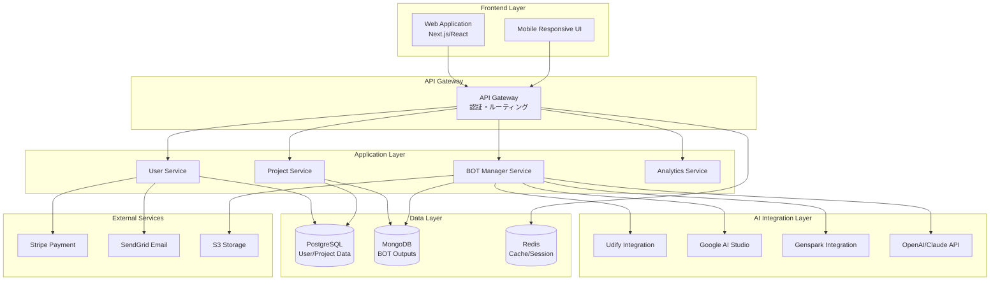
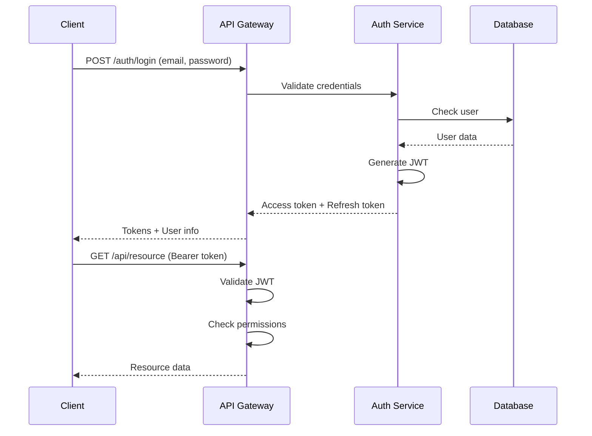

# わどAI システム アーキテクチャ設計書

## 1. システム全体構成

### 1.1 アーキテクチャ概要



### 1.2 技術スタック

| レイヤー | 技術選定 | 選定理由 |
|----------|----------|----------|
| Frontend | Next.js 14 + TypeScript | SSR/SSG対応、型安全性 |
| UI Framework | Tailwind CSS + shadcn/ui | 高速開発、一貫性 |
| Backend | Node.js + Express | JavaScript統一、エコシステム |
| Database | PostgreSQL + MongoDB | 構造化/非構造化データ対応 |
| Cache | Redis | 高速アクセス、セッション管理 |
| AI Integration | REST API + WebSocket | リアルタイム通信対応 |
| Infrastructure | AWS/Vercel | スケーラビリティ、管理容易性 |

---

## 2. コンポーネント設計

### 2.1 フロントエンド設計

#### コンポーネント構造
```
src/
├── components/
│   ├── common/          # 共通コンポーネント
│   │   ├── Header.tsx
│   │   ├── Footer.tsx
│   │   └── Navigation.tsx
│   ├── bot/            # BOT関連
│   │   ├── BotCard.tsx
│   │   ├── BotChat.tsx
│   │   └── BotWorkflow.tsx
│   ├── dashboard/      # ダッシュボード
│   │   ├── Overview.tsx
│   │   ├── ProjectList.tsx
│   │   └── Analytics.tsx
│   └── auth/          # 認証関連
│       ├── LoginForm.tsx
│       └── RegisterForm.tsx
├── pages/             # ページコンポーネント
├── hooks/             # カスタムフック
├── services/          # APIクライアント
├── store/            # 状態管理（Zustand）
└── utils/            # ユーティリティ
```

#### 主要画面設計

1. **ダッシュボード**
   - プロジェクト一覧
   - 利用状況グラフ
   - クイックアクセスBOT

2. **BOTワークフロー**
   - ステップバイステップUI
   - プログレスバー表示
   - 中間保存機能

3. **プロジェクト管理**
   - プロジェクト作成/編集
   - BOT実行履歴
   - 成果物管理

### 2.2 バックエンド設計

#### API設計（RESTful）

```yaml
# 認証API
POST   /api/auth/register     # ユーザー登録
POST   /api/auth/login        # ログイン
POST   /api/auth/refresh      # トークン更新
POST   /api/auth/logout       # ログアウト

# ユーザーAPI
GET    /api/users/me          # 自分の情報取得
PUT    /api/users/me          # プロフィール更新
GET    /api/users/me/usage    # 利用状況取得

# プロジェクトAPI
GET    /api/projects          # プロジェクト一覧
POST   /api/projects          # プロジェクト作成
GET    /api/projects/:id      # プロジェクト詳細
PUT    /api/projects/:id      # プロジェクト更新
DELETE /api/projects/:id      # プロジェクト削除

# BOT API
GET    /api/bots              # BOT一覧
GET    /api/bots/:type        # BOT詳細
POST   /api/bots/:type/execute # BOT実行
GET    /api/bots/:type/status/:jobId # 実行状況

# 履歴API
GET    /api/history           # 実行履歴一覧
GET    /api/history/:id       # 履歴詳細
```

#### サービスレイヤー設計

```typescript
// BOT Manager Service
interface BotManagerService {
  listBots(): Promise<Bot[]>;
  executeBot(type: string, input: any): Promise<JobId>;
  getStatus(jobId: string): Promise<JobStatus>;
  getResult(jobId: string): Promise<BotResult>;
}

// Project Service
interface ProjectService {
  createProject(data: ProjectInput): Promise<Project>;
  updateProject(id: string, data: ProjectUpdate): Promise<Project>;
  deleteProject(id: string): Promise<void>;
  getProjects(userId: string): Promise<Project[]>;
}

// Analytics Service
interface AnalyticsService {
  trackUsage(event: UsageEvent): Promise<void>;
  getUsageStats(userId: string): Promise<UsageStats>;
  generateReport(period: DateRange): Promise<Report>;
}
```

### 2.3 データベース設計

#### PostgreSQL スキーマ

```sql
-- ユーザーテーブル
CREATE TABLE users (
    id UUID PRIMARY KEY DEFAULT gen_random_uuid(),
    email VARCHAR(255) UNIQUE NOT NULL,
    password_hash VARCHAR(255) NOT NULL,
    name VARCHAR(255),
    plan VARCHAR(50) DEFAULT 'free',
    created_at TIMESTAMP DEFAULT NOW(),
    updated_at TIMESTAMP DEFAULT NOW()
);

-- プロジェクトテーブル
CREATE TABLE projects (
    id UUID PRIMARY KEY DEFAULT gen_random_uuid(),
    user_id UUID REFERENCES users(id),
    name VARCHAR(255) NOT NULL,
    description TEXT,
    status VARCHAR(50) DEFAULT 'active',
    created_at TIMESTAMP DEFAULT NOW(),
    updated_at TIMESTAMP DEFAULT NOW()
);

-- BOT実行履歴
CREATE TABLE bot_executions (
    id UUID PRIMARY KEY DEFAULT gen_random_uuid(),
    project_id UUID REFERENCES projects(id),
    bot_type VARCHAR(100) NOT NULL,
    input_data JSONB,
    output_data JSONB,
    status VARCHAR(50),
    started_at TIMESTAMP,
    completed_at TIMESTAMP,
    created_at TIMESTAMP DEFAULT NOW()
);
```

#### MongoDB スキーマ

```javascript
// BOT出力コレクション
{
  _id: ObjectId,
  executionId: "uuid",
  botType: "sns_profile",
  output: {
    // BOT固有の出力データ
  },
  metadata: {
    tokens: 1500,
    processingTime: 3.2,
    version: "1.0"
  },
  createdAt: ISODate()
}

// テンプレートコレクション
{
  _id: ObjectId,
  botType: "seminar_slide",
  name: "3日間ローンチテンプレート",
  template: {
    // テンプレートデータ
  },
  tags: ["launch", "seminar"],
  popularity: 85,
  createdAt: ISODate()
}
```

---

## 3. AI統合設計

### 3.1 BOT実装パターン

#### 基本BOTクラス

```typescript
abstract class BaseBot {
  protected name: string;
  protected version: string;
  protected apiClient: AIClient;

  abstract async validate(input: any): Promise<ValidationResult>;
  abstract async execute(input: any): Promise<BotOutput>;
  abstract async postProcess(output: any): Promise<any>;

  async run(input: any): Promise<BotResult> {
    // 1. 入力検証
    const validation = await this.validate(input);
    if (!validation.isValid) {
      throw new ValidationError(validation.errors);
    }

    // 2. 実行
    const output = await this.execute(input);

    // 3. 後処理
    const processed = await this.postProcess(output);

    // 4. 保存
    await this.saveResult(processed);

    return processed;
  }
}
```

#### BOT実装例（SNS競合分析BOT）

```typescript
class CompetitorAnalysisBot extends BaseBot {
  constructor() {
    super();
    this.name = 'SNS競合分析BOT';
    this.version = '1.0';
  }

  async validate(input: CompetitorAnalysisInput): Promise<ValidationResult> {
    // 入力検証ロジック
    return {
      isValid: true,
      errors: []
    };
  }

  async execute(input: CompetitorAnalysisInput): Promise<AnalysisOutput> {
    // 1. データ収集
    const competitors = await this.collectCompetitorData(input.genre);
    
    // 2. AI分析
    const analysis = await this.apiClient.analyze({
      prompt: this.buildPrompt(competitors),
      model: 'gpt-4',
      temperature: 0.7
    });

    // 3. 結果整形
    return this.formatAnalysis(analysis);
  }

  async postProcess(output: AnalysisOutput): Promise<any> {
    // グラフ生成、レポート作成など
    return {
      ...output,
      visualizations: await this.generateCharts(output)
    };
  }
}
```

### 3.2 プロンプトエンジニアリング

#### プロンプトテンプレート管理

```yaml
# prompts/sns_profile.yaml
name: SNSプロフィール最適化
version: 1.2
model: claude-3-opus
temperature: 0.8
system_prompt: |
  あなたはSNSマーケティングの専門家です。
  ユーザーのビジネスに最適なSNSプロフィールを設計してください。

user_prompt_template: |
  以下の情報を基に、魅力的なSNSプロフィールを作成してください：
  
  ビジネス分野: {business_field}
  ターゲット層: {target_audience}
  競合分析結果: {competitor_analysis}
  
  以下の形式で出力してください：
  1. プロフィール名
  2. 自己紹介文（150文字以内）
  3. ハッシュタグ（5個）
  4. プロフィール画像の提案
```

---

## 4. セキュリティ設計

### 4.1 認証・認可

#### JWT認証フロー



### 4.2 データ保護

- **通信**: TLS 1.3による暗号化
- **保存**: AES-256によるデータベース暗号化
- **パスワード**: bcryptによるハッシュ化
- **APIキー**: 環境変数による管理、Vault使用

### 4.3 セキュリティ対策

| 脅威 | 対策 |
|------|------|
| SQLインジェクション | パラメータ化クエリ使用 |
| XSS | 入力値サニタイゼーション |
| CSRF | CSRFトークン実装 |
| DDoS | Rate limiting、CloudFlare |
| 不正アクセス | IP制限、2要素認証 |

---

## 5. インフラストラクチャ設計

### 5.1 デプロイメント構成

```yaml
# docker-compose.yml
version: '3.8'
services:
  frontend:
    build: ./frontend
    ports:
      - "3000:3000"
    environment:
      - NEXT_PUBLIC_API_URL=${API_URL}
  
  backend:
    build: ./backend
    ports:
      - "5000:5000"
    depends_on:
      - postgres
      - redis
      - mongodb
    environment:
      - DATABASE_URL=${DATABASE_URL}
      - REDIS_URL=${REDIS_URL}
      - MONGODB_URL=${MONGODB_URL}
  
  postgres:
    image: postgres:15
    volumes:
      - postgres_data:/var/lib/postgresql/data
    environment:
      - POSTGRES_DB=${DB_NAME}
      - POSTGRES_USER=${DB_USER}
      - POSTGRES_PASSWORD=${DB_PASSWORD}
  
  mongodb:
    image: mongo:6
    volumes:
      - mongo_data:/data/db
  
  redis:
    image: redis:7-alpine
    volumes:
      - redis_data:/data

volumes:
  postgres_data:
  mongo_data:
  redis_data:
```

### 5.2 スケーリング戦略

1. **水平スケーリング**
   - Kubernetesによるコンテナオーケストレーション
   - Auto Scaling Group設定

2. **垂直スケーリング**
   - インスタンスタイプの最適化
   - リソース使用率モニタリング

3. **キャッシング戦略**
   - CDN（CloudFront）による静的コンテンツ配信
   - Redis によるAPIレスポンスキャッシュ

---

## 6. 監視・運用設計

### 6.1 モニタリング

```yaml
# 監視項目
metrics:
  - name: API Response Time
    threshold: 3000ms
    alert: PagerDuty
  
  - name: Error Rate
    threshold: 1%
    alert: Slack
  
  - name: CPU Usage
    threshold: 80%
    alert: Email
  
  - name: Memory Usage
    threshold: 90%
    alert: Email
  
  - name: Database Connection
    threshold: 100
    alert: PagerDuty
```

### 6.2 ログ管理

- **アプリケーションログ**: CloudWatch Logs
- **アクセスログ**: S3 + Athena
- **エラーログ**: Sentry
- **監査ログ**: 専用DBテーブル

### 6.3 バックアップ・リカバリ

| 対象 | 頻度 | 保持期間 | RPO | RTO |
|------|------|----------|-----|-----|
| Database | 日次 | 30日 | 24時間 | 4時間 |
| ユーザーデータ | リアルタイム | 90日 | 1分 | 30分 |
| システム設定 | 週次 | 365日 | 7日 | 2時間 |

---

## 7. 性能設計

### 7.1 パフォーマンス目標

| メトリクス | 目標値 |
|------------|--------|
| ページロード時間 | < 2秒 |
| API レスポンス | < 500ms (p95) |
| BOT実行時間 | < 30秒 |
| 同時接続数 | 1,000 |
| スループット | 100 req/sec |

### 7.2 最適化手法

1. **フロントエンド最適化**
   - コード分割とLazy Loading
   - 画像最適化（WebP、AVIF）
   - Service Workerによるキャッシング

2. **バックエンド最適化**
   - データベースインデックス最適化
   - N+1問題の解消
   - 非同期処理の活用

3. **AI処理最適化**
   - バッチ処理による効率化
   - プロンプトキャッシング
   - モデル選択の最適化

---

*作成日: 2025年1月12日*
*バージョン: 1.0*
*次回レビュー: 2025年2月1日*