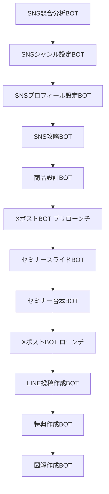

# わどAI システム 機能整理書

## 📊 システム概要

わどAIシステムは、オンラインビジネスのローンチから収益化までを包括的にサポートするAI BOT統合プラットフォームです。SNS戦略、コンテンツ作成、ローンチ実行、収益化まで、すべてのプロセスをAIがサポートします。

## 🎯 システムの目的

1. **効率化**: ローンチプロセスの自動化により、準備期間を大幅短縮
2. **標準化**: わどメソッドの体系化により、再現性の高い成功パターンを提供
3. **スケーラビリティ**: 複数のローンチを同時並行で実行可能
4. **教育**: わどAI受講生の学習・実践をサポート

---

## 🤖 BOT機能カテゴリー

### 1. SNS戦略カテゴリー（完了: 5個）

#### 📱 SNSプロフィール設定BOT
- **機能**: SNSアカウントの最適なプロフィール設計
- **URL**: https://udify.app/chat/8Bm0kHApk8lpHw9q
- **用途**: 壁打ち相談、プロフィール最適化

#### 🔍 SNS競合分析BOT
- **機能**: 競合アカウントの詳細分析と成功要因の抽出
- **URL**: https://udify.app/chat/2y9mDub8aHvB7soF
- **用途**: 市場調査、差別化戦略立案

#### 🎯 SNSジャンル設定BOT
- **機能**: 最適な発信ジャンルの選定サポート
- **URL**: https://udify.app/chat/TTYkjm75PrikPZGs
- **用途**: ポジショニング戦略

#### 💡 SNS攻略BOT
- **機能**: プラットフォーム別の攻略法提供
- **データ**: SNSジャンル選定、プラットフォーム、運用基礎
- **用途**: 実践的な運用戦略

#### 🛍️ 商品設計BOT
- **機能**: 価格設定と商品戦略の立案サポート
- **用途**: 壁打ち相談、商品開発

### 2. コンテンツ作成カテゴリー（完了: 6個）

#### ✍️ XポストBOT（プリローンチ）
- **機能**: ローンチ前のポジショニング投稿作成
- **URL**: https://udify.app/chat/B9iPwpUDWVDyXINH
- **用途**: 事前盛り上げ、期待値醸成

#### 🚀 XポストBOT（ローンチ投稿）
- **機能**: ローンチ時の販売投稿作成
- **用途**: セールス投稿、CTR向上

#### 📧 LINE投稿作成BOT
- **機能**: ローンチ時のLINE/メルマガ配信作成
- **用途**: ステップ配信、教育シナリオ

#### 🎨 図解作成BOT
- **機能**: 図解・サムネイル画像の作成指示
- **URL**: STEP1: https://udify.app/chat/rElFpayWiQRv1Mhs
- **URL**: STEP2: Google AI Studio連携
- **用途**: ビジュアルコンテンツ作成

#### 🎁 特典作成BOT
- **機能**: 豪華特典パッケージの企画・作成
- **URL**: STEP1: https://udify.app/chat/5ozkYXwKVDvW7toP
- **URL**: STEP2: Google AI Studio連携
- **用途**: 購入特典、限定ボーナス

### 3. セミナー関連カテゴリー（完了: 2個）

#### 📊 セミナースライドBOT
- **機能**: セミナースライドの自動生成
- **URL**: https://udify.app/chat/fstZhjwqVH2Xtwbp
- **用途**: プレゼン資料作成

#### 📝 セミナー台本BOT
- **機能**: セミナー進行台本の作成
- **用途**: スピーチ原稿、進行管理

### 4. 収益化カテゴリー（編集中: 7個）

#### 🤖 最新AIツール相談BOT
- **データ**: AIツールの使い分けセミナー
- **状態**: 編集中

#### 💰 FANZA収益化BOT
- **データ**: 画像生成ノウハウ6章、Liveセミナー
- **状態**: 編集中

#### 💼 クライアントワークBOT
- **データ**: ココナラ動画教材
- **状態**: 編集中

#### 📚 TIPS執筆BOT
- **データ**: コンテンツ販売動画教材
- **状態**: 編集中

#### 🧠 わど億超えマインドBOT
- **データ**: オリエンテーション、億超えTIPS
- **状態**: 編集中

#### 🎭 AI漫画制作BOT
- **データ**: わどみちぽLiveセミナー
- **状態**: 編集中

#### 📸 インスタストーリーズBOT
- **機能**: Instagram特化のストーリーズ作成
- **状態**: 編集中

---

## 📈 開発状況サマリー

### 完了済み BOT
- **合計**: 13個
- **カテゴリー内訳**:
  - SNS戦略: 5個
  - コンテンツ作成: 6個
  - セミナー関連: 2個

### 開発中 BOT
- **合計**: 7個
- **すべて収益化カテゴリー**

### 進捗率
- **完了率**: 65%（13/20）
- **優先開発項目**: 図解作成BOT、特典作成BOT（PR時の売りやすさ）

---

## 🔄 BOT間の連携フロー

---

## 💡 統合システムの特徴

### 1. ステップバイステップ方式
- 各BOTが前段階の出力を活用
- 一貫性のあるローンチ戦略を実現

### 2. マルチプラットフォーム対応
- Udify（チャットベース）
- Google AI Studio（高度な生成）
- Genspark（スライド作成）

### 3. データ駆動型
- 過去の成功事例をベースに学習
- わどメソッドの体系化

### 4. カスタマイズ性
- ユーザーの業界・商品に合わせた調整
- 段階的な改善が可能

---

## 🎯 今後の展開

### Phase 1: 基盤整備（現在）
- 既存BOTの完成度向上
- UI/UXの統一

### Phase 2: 統合プラットフォーム化
- シングルサインオン実装
- BOT間のデータ連携強化

### Phase 3: AI学習強化
- ユーザーフィードバックの反映
- 成功パターンの自動学習

### Phase 4: 完全自動化
- ワンクリックローンチ
- AIによる成果予測・最適化

---

*作成日: 2025年1月12日*
*バージョン: 1.0*